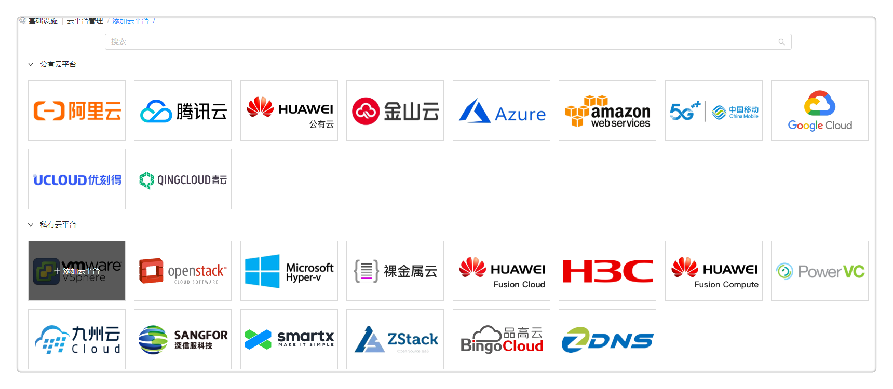
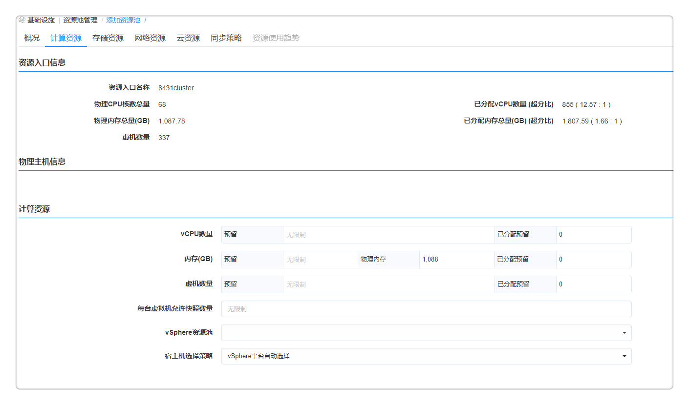
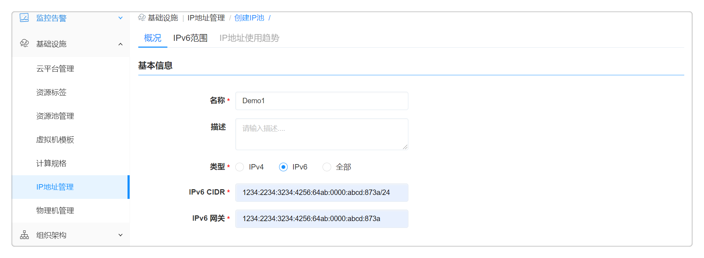
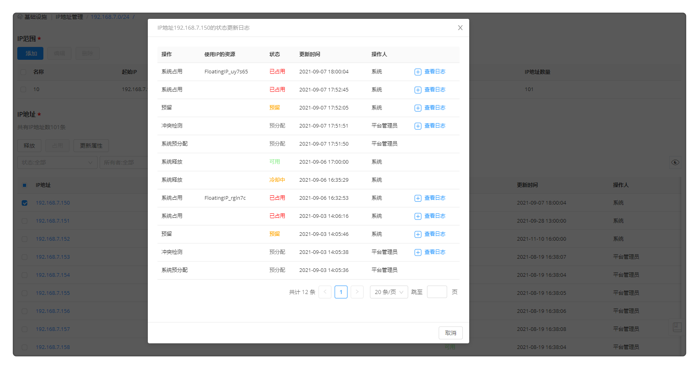
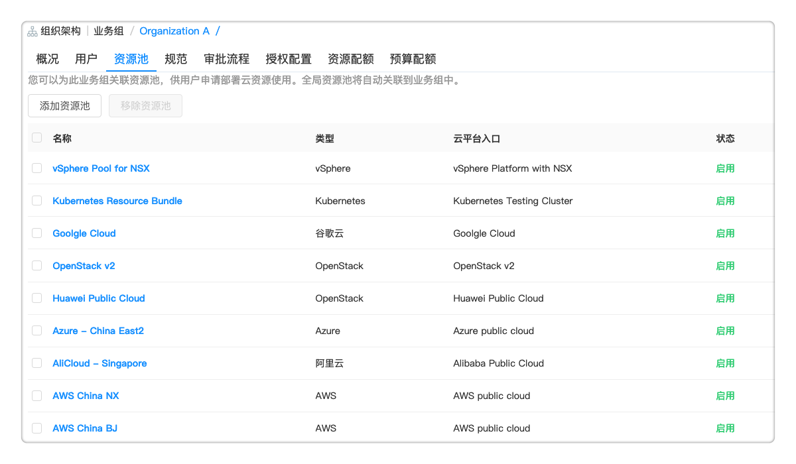
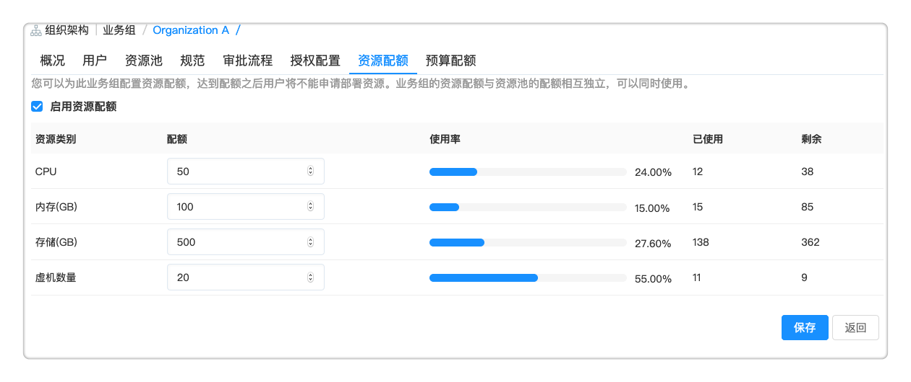

**快速上手**

欢迎阅读SmartCMP云管理平台的快速上手文档，了解如何快速管理您的多云环境，部署云资源，并进行生命周期管理。

# SmartCMP简介

SmartCMP是业内领先的云管理平台，提供各行业企业客户一站式的多云管理能力，包括多云统一管理、面向业务部门的自服务、服务编排和自动化、完善的人员/组织和权限控制管理、策略驱动资源分配、云资源的成本分析和优化、全面的监控告警与自动化运维等云管理服务。通过一套平台，您可以完成云管理的方方面面，持续提升IT敏捷性和效率。

  + 多云统一管理：您可以通过SmartCMP平台统一管理包括阿里云、腾讯云、AWS、Azure、金山云、华为云等公有云，VMware，OpenStack等私有云，Kubernetes容器云，并支持快速导入并管理存量虚拟机。

  + 面向业务部门的自服务：业务部门的用户，在不需要学习专业云知识的情况下，以服务的形式进行各种云资源的申请。平台会根据策略进行资源的选择，分配，创建等过程。

  + 跨云服务编排和自动化：平台采用创新的可视化蓝图编辑框架，将应用系统复杂的资源依赖关系和架构描述通过图形化的方式进行设计，从而实现强大的云服务编排能力和基础设施即代码（IaC）的能力。云服务蓝图一次设计多次部署，极大加速业务系统的上线速度。

  + 人员、组织和权限控制：用户可以通过策略驱动访问权限，细粒度的角色和权限管理，资源配额，费用配额等，实现控制资源与服务的访问、申请以及规范。

  + 成本分析和优化：云资源动态计费、账单同步及分摊，定位闲置资源及时调整分配策略。

  + 多云统一的监控告警：监控不同云平台的云资源和软件运行状况，并进行统一的展现和告警。用户可以基于监控告警去自定义告警触发后操作，支持多种告警通知方式，包括系统通知、钉钉、短信、微信、邮件等。

# SmartCMP支持自动化部署的云资源类型

由于各个云平台的差异，SmartCMP云管平台对于各个云平台所支持的资源类型有所不同。下表列出了目前SmartCMP对于各个云平台能够支持的云资源部署类型（Y表示支持，空白表示暂不支持）。

<table>
   <tr>
      <td rowspan="2" p align="center" style="font-weight:bold" >分类</td>
      <td rowspan="2" p align="center" style="font-weight:bold"  >云资源类型</td>
      <td colspan="9" p align="center" style="font-weight:bold" >公有云</td>
      <td colspan="2" p align="center" style="font-weight:bold" >私有云</td>
   </tr>
   <tr>
      <td p align="center" style="font-weight:bold" >阿里云 </td>
      <td p align="center" style="font-weight:bold" >Azure</td>
      <td p align="center" style="font-weight:bold" >AWS</td>
      <td p align="center" style="font-weight:bold" >华为云</td>
      <td p align="center" style="font-weight:bold" >腾讯云</td>
      <td p align="center" style="font-weight:bold" >金山云</td>
      <td p align="center" style="font-weight:bold" >青云</td>
      <td p align="center" style="font-weight:bold" >GCP</td>
      <td p align="center" style="font-weight:bold" >UCloud</td>
      <td p align="center" style="font-weight:bold" >vSphere+NSX</td>
      <td p align="center" style="font-weight:bold" >OpenStack</td>
   </tr>
   <tr>
      <td rowspan="2" p align="center" >计算</td> 
      <td p align="center" >虚拟机</td>
      <td p align="center">Y</td>
      <td p align="center">Y</td>
      <td p align="center">Y</td>
      <td p align="center">Y</td>
      <td p align="center">Y</td>
      <td p align="center">Y</td>
      <td p align="center">Y</td>
      <td p align="center">Y</td>
      <td p align="center">Y</td>
      <td p align="center">Y</td>
      <td p align="center">Y</td>
   </tr>
   <tr>
      <td p align="center" >弹性伸缩组</td>
      <td p align="center">Y</td>
      <td></td>
      <td></td>
      <td></td>
      <td></td>
      <td></td>
      <td></td>
      <td></td>
      <td></td>
      <td></td>
      <td></td>
   </tr>
   <tr>
      <td p align="center" rowspan="3">存储</td>
      <td p align="center" >磁盘</td>
      <td p align="center">Y</td>
      <td p align="center">Y</td>
      <td p align="center">Y</td>
      <td p align="center">Y</td>
      <td p align="center">Y</td>
      <td p align="center">Y</td>
      <td p align="center">Y</td>
      <td></td>
      <td></td>
      <td p align="center">Y</td>
      <td p align="center">Y</td>
   </tr>
   <tr>
      <td p align="center" >对象存储</td>
      <td p align="center">Y</td>
      <td p align="center">Y</td>
      <td p align="center">Y</td>
      <td></td>
      <td p align="center">Y</td>
      <td></td>
      <td></td>
      <td></td>
      <td></td>
      <td></td>
      <td></td>
   </tr>
   <tr>
      <td p align="center" >文件共享存储NAS</td>
      <td p align="center">Y</td>
      <td></td>
      <td></td>
      <td></td>
      <td></td>
      <td></td>
      <td></td>
      <td></td>
      <td></td>
      <td></td>
      <td></td>
   </tr>
   <tr>
      <td p align="center" rowspan="10">网络</td>
      <td p align="center" >公网IP</td>
      <td p align="center">Y</td>
      <td p align="center">Y</td>
      <td p align="center">Y</td>
      <td></td>
      <td></td>
      <td></td>
      <td></td>
      <td></td>
      <td></td>
      <td></td>
      <td></td>
   </tr>
   <tr>
      <td p align="center" >弹性公网IP或浮动IP</td>
      <td p align="center">Y</td>
      <td></td>
      <td p align="center">Y</td>
      <td p align="center">Y</td>
      <td p align="center">Y</td>
      <td p align="center">Y</td>
      <td></td>
      <td></td>
      <td></td>
      <td></td>
      <td p align="center">Y</td>
   </tr>
   <tr>
      <td p align="center" >安全组</td>
      <td p align="center">Y</td>
      <td p align="center">Y</td>
      <td p align="center">Y</td>
      <td p align="center">Y</td>
      <td p align="center">Y</td>
      <td p align="center">Y</td>
      <td p align="center">Y</td>
      <td p align="center">Y</td>
      <td p align="center">Y</td>
      <td p align="center">Y</td>
      <td p align="center">Y</td>
   </tr>
   <tr>
      <td p align="center" >防火墙</td>
      <td></td>
      <td></td>
      <td></td>
      <td></td>
      <td></td>
      <td></td>
      <td></td>
      <td></td>
      <td></td>
      <td p align="center">Y</td>
      <td p align="center">Y</td>
   </tr>
   <tr>
      <td p align="center" >虚拟网络VPC </td>
      <td p align="center">Y</td>
      <td p align="center">Y</td>
      <td></td>
      <td></td>
      <td p align="center">Y</td>
      <td p align="center">Y</td>
      <td></td>
      <td></td>
      <td></td>
      <td p align="center">Y</td>
      <td p align="center">Y</td>
   </tr>
   <tr>
      <td p align="center" >虚拟交换机或者子网</td>
      <td p align="center">Y</td>
      <td p align="center">Y</td>
      <td></td>
      <td></td>
      <td p align="center">Y</td>
      <td p align="center">Y</td>
      <td></td>
      <td></td>
      <td></td>
      <td></td>
      <td></td>
   </tr>
   <tr>
      <td p align="center" >负载均衡器</td>
      <td p align="center">Y</td>
      <td p align="center">Y</td>
      <td></td>
      <td p align="center">Y</td>
      <td></td>
      <td></td>
      <td></td>
      <td></td>
      <td></td>
      <td p align="center">Y</td>
      <td p align="center">Y</td>
   </tr>
   <tr>
      <td p align="center" >路由器</td>
      <td></td>
      <td></td>
      <td></td>
      <td></td>
      <td></td>
      <td></td>
      <td></td>
      <td></td>
      <td></td>
      <td p align="center">Y</td>
      <td p align="center">Y</td>
   </tr>
   <tr>
      <td p align="center" >Edge Network</td>
      <td></td>
      <td></td>
      <td></td>
      <td></td>
      <td></td>
      <td></td>
      <td></td>
      <td></td>
      <td></td>
      <td p align="center">Y</td>
      <td></td>
   </tr>
   <tr>
      <td p align="center" >域名DNS</td>
      <td></td>
      <td></td>
      <td></td>
      <td></td>
      <td></td>
      <td></td>
      <td></td>
      <td></td>
      <td></td>
      <td></td>
      <td p align="center">Y</td>
   </tr>
   <tr>
      <td rowspan="2" p align="center" >数据库</td>
      <td p align="center" >关系型数据库RDS</td>
      <td p align="center">Y</td>
      <td p align="center">Y</td>
      <td p align="center">Y</td>
      <td></td>
      <td></td>
      <td></td>
      <td p align="center">Y</td>
      <td></td>
      <td></td>
      <td></td>
      <td></td>
   </tr>
   <tr>
      <td p align="center" >Redis</td>
      <td p align="center">Y</td>
      <td p align="center">Y</td>
      <td></td>
      <td></td>
      <td></td>
      <td></td>
      <td p align="center">Y</td>
      <td></td>
      <td></td>
      <td></td>
      <td></td>
   </tr>
   <tr>
      <td p align="center" >容器</td>
      <td p align="center" >Kubernetes群集</td>
      <td p align="center">Y</td>
      <td p align="center">Y</td>
      <td></td>
      <td></td>
      <td></td>
      <td></td>
      <td></td>
      <td></td>
      <td></td>
      <td></td>
      <td></td>
   </tr>
</table>

# SmartCMP快速配置和使用步骤

通过如下一些简单的步骤，您可以快速开始管理和部署云资源：

  1. [登录平台](#登录平台)，查看主页。
  
  2. 导入或者创建部署云资源：

   + 导入云主机:当您在主流公有云，私有云（例如阿里云，腾讯云，AWS, Azure, vSphere等）上已部署云资源，并需要导入至SmartCMP进行纳管，您可以进行以下操作：
      1. [配置云平台入口](#配置云平台入口)，管理云账号。
      2. [创建资源池](#创建资源池)，导入云主机。
     
    + 导入存量机器：当您有物理机需要管理，或者在SmartCMP暂未支持的云平台上已部署云资源，并需要导入至SmartCMP进行纳管，您可以进行以下操作：
      1. [创建Hostpool资源池](#导入存量机器)，导入存量机器。
   
   + 您也可以通过SmartCMP创建部署云资源：
      1. [配置云平台入口](#配置云平台入口)，管理云账号。
      2. [创建资源池](#创建资源池)，指定资源使用和配额。
      3. [配置虚拟机模板](#配置虚拟机模板)，管理各个云平台的模板或镜像（可选）。
      4. [配置计算规格](#配置计算规格)，管理各个云平台的规格或实例类型（可选）。
      5. [添加IP池](#添加IP池)，定义可用的IP地址范围（可选）。
      6. [定义业务组](#定义业务组)，关联用户、资源池，配置审批流程、部署规范等。
      7. [申请部署云资源](#申请部署云资源)。 
  
 >「Note」 1. 若您需要连接并管理隔离网络环境的云平台，您可以在配置云平台入口时关联云网关。2. 若您需要对隔离网络环境中云资源进行操作，包括需要远程访问云主机，转发云管平台管理隔离数据中心的云资源的请求，获取云资源的监控数据（云资源需要能够访问公网）等，您可以在创建资源池时关联云网关。

  3. 当您已经导入或者通过SmartCMP部署了云资源，可以进行以下云资源管理的操作：
   + [自助运维](#自助运维)，管理云资源，查看监控信息，进行自助运维操作。
   + [配置堡垒机](#配置堡垒机)（可选）。

 >「Note」 若您需要通过云网关连接云主机，可直接关联云网关与资源池，对隔离网络环境中的云资源进行运维操作，并从已安装监控代理的云资源获取监控数据；若需要通过公网IP连接云主机，安装平台的监控代理，或进行运维操作，请针对平台的IP地址139.224.11.192设置一定的访问权限，包括允许SSH或WinRM，以及访问监控端口（Linux机器默认为9100，Windows机器9182）。

## 登录平台{#登录平台}

您可以免费注册，注册成功后登录SmartCMP云管平台。

+ 浏览器输入平台的域名地址。
+ 可使用手机号或邮箱进行登录。

登录平台之后，主页将展示您拥有的云资源信息和工单处理情况，从其他页面可以点击右上角的主页按钮返回到此页面。如果需要修改您的用户头像，可以点击页面导航栏右上角的用户图标，进入编辑资料。

左侧是各级菜单，您可以参考以下步骤快速配置平台，管理和部署您的云资源。如果需要熟悉平台页面，请参考[页面导航](https://cloudchef.github.io/doc/AdminDoc/02首页/) 

## 配置云平台入口

云平台入口定义了您需要管理的公有云、私有云、容器等云基础设施的接入方式。不同云基础设施账号的形式及获取方式各有不同，您可以通过填写对应的访问信息完成云平台基础设施的接入。

### 添加vSphere云平台

为了管理vSphere虚拟化平台内的资源，您需要将vCenter连入到平台。请提供vCenter地址、管理员用户名和密码等信息来进行访问。如果您需要连接vCenter，并想要创建或查看云资源信息，请安装配置云网关，具体操作步骤请参考[云网关管理](https://cloudchef.github.io/doc/AdminDoc/03基础设施管理/云平台网关.html)。

　1.进入 基础设施 - 云平台管理 ，选择 vSphere ，点击添加。
  

　2.输入所需参数(请根据自己的真实环境输入相关参数，示例只给出参考)。

|参数名称 |描述 |示例|
|:------:|:------:|:-----:|
|云名称|vSphere云平台名称|vSphere数据中心A|
|用户名|vCenter管理员用户名|administrator@vsphere.local|
|密码| vCenter管理员密码 |******** |                        
|地址|vCenter IP地址 |192.168.xx.xx|
|端口|API端口|443|
|数据中心|数据中心所在地|上海|
|关联VMware NSX云平台|NSX云平台（需先添加VMware平台）|选择对应的NSX云平台名称|
|云网关|已安装的云网关|选择对应的云网关名称|
  

　3.点击验证，验证连接vSphere虚拟化平台。

　4.验证成功后点击保存，vSphere虚拟化平台连接成功。

### 添加阿里云平台

当接入云平台时，为了保障云主机的安全性，公有云（包括阿里云、腾讯云、AWS）在API调用时均需要验证访问者的身份，以确保访问者具有相关权限。公有云的验证方式通过Access Key来实现。Access Key由Access Key ID和Access Key Secret构成平台接入公有云云平台的访问密钥ID和访问密钥。

以阿里公有云为例，您可以根据下面的步骤来添加一个阿里云平台:

1. 在左边导航选择 基础设施 - 云平台管理 ，在左边选择阿里云
  

2. 点击添加按钮，填入以下信息：云名称、访问密钥ID、访问密钥。

  阿里云访问密钥AccessKey获取方式：

   - 获取Access Key Secret的方法:登录您的阿里云管理控制台，点击页面右上角个人信息，展开面板，选择里面的 Accesskey 。

  

   - 您也可以直接登录访问 <https://ak-console.aliyun.com>，进入AccessKey管理界面，查看您的AccessKey列表，如果当前列表为空，您也可以创建一个，新建AccessKey时阿里云会向账号联系人手机发送验证码，验证通过后可以创建AccessKey；

  

   - 获取Access Key ID:阿里云账号ID是阿里云分配给每个用户的唯一识别码，不可更改，用户要查看自己的阿里云账号ID，请在登录状态下访问阿里云账号"安全设置"，地址:<https://account.console.aliyun.com/secure>；在打开的"安全设置"页面中，查找自己的账号ID。

  

3. 您可以启用云平台监控。云平台监控是指通过云平台API获取云资源的监控数据，支持阿里云的ECS（请在虚拟机模板中选择监控方式）、SLB、OSS、Redis、RDS等监控。

  >「Note」 启用云平台监控后，平台会频繁调用阿里云API，可能会触发阿里云的API限流机制，并需要为超出免费次数限制的API调用支付额外的费用。
  
  

4. 费用配置：平台通过公有云API实时获取申请服务和变配资源时的预估价格。您可以针对公有云平台资源设定折扣系数、云平台货币单位，并选择是否启用账单同步策略。

    + 云平台货币单位：可选人民币、欧元、印尼盾、日元、英镑、沙特里亚尔或美元。
    + 汇率：如果公有云的货币单位和系统货币不一样，请配置云平台货币单位和汇率从而得到准确的预估费用。
    + 打折系数：即SmartCMP作为云资源转售平台进行二次计费，帮助运营商和IDC向用户售卖云资源与服务，运营商和IDC实际转售的是公有云厂商的资源，通过自定义折扣系数，实现资源的灵活计价。
    + 启用账单同步策略：勾选后可通过设置的定时策略，同步云平台费用信息。

5. 点击验证，验证连接成功后点击保存，阿里云平台已保存。

### 添加其他云平台　

如果需要添加其他云平台，请参考[云平台管理](https://cloudchef.github.io/doc/AdminDoc/03基础设施管理/云平台管理.html)

## 创建资源池

通过资源池，您可以指定私有云的主机或群集、或公有云的区域和可用区为资源入口，分配不同的基础设施资源（包括计算、存储、网络等等）给不同的组织或环境进行使用，并可以设定配额。资源池可分配给一个、多个或全部业务组，从而指定不同的组织和用户使用该云平台中的基础设施资源。

在后续的服务配置过程中，可以选择不同的资源池分配策略，手工进行指定，或由平台自动根据资源池的使用情况和指定的资源进行分配。

当您需要对隔离网络环境中的云资源进行运维操作，可以选择安装部署云网关，并在创建资源池时关联云网关。具体操作步骤可以参考[云网关管理](https://cloudchef.github.io/doc/AdminDoc/03基础设施管理/云平台网关.html)。

### 创建vSphere资源池 

在左边导航选择 基础设施 下的二级菜单 资源池管理。点击添加按钮，选择 vSphere ，会出现创建资源池界面。按照表单逐步填写相关信息，保存即可。

1.  概况标签页：

  + 名称：自定义资源池名称，请说明环境或者类型

  + 资源标签（选填）：您可以为所管理的资源池设置资源标签，注明资源池的不同用途和属性，从而让用户在申请服务的时候进行筛选和指定，快速筛选匹配资源池。如果需要了解如何创建和配置资源标签，请您参考[资源标签](https://cloudchef.github.io/doc/AdminDoc/03基础设施管理/资源标签.html)。

  + 优先级：用于帮助指定资源池选择策略，当有多个资源池满足部署条件时，平台将优先选择优先级高的。数值越小，优先级越高。

  + 启用：默认勾选；如果禁用，将不允许新的云资源部署到该资源池。

  + 云平台资源信息：选择云平台入口（选择已创建的vSphere云平台），资源入口，文件夹（选填）。
      - 资源入口：选择vCenter中的某个集群或主机（包含集群和不在集群中的物理主机）
      - 文件夹 （选填）：选择vCenter中的虚拟机和模板文件夹，从而指定通过这个资源池部署的虚拟机的存放位置。

  

2.  计算资源标签页：

  + 资源入口信息：可查看您所选择作为资源入口的群集和主机信息。

  + 物理主机信息：vCenter中宿主机的详细信息。

  + 计算资源：
      * 资源配额（选填）：可设置本资源池最大允许部署的vCPU、内存及虚机数量以及每台虚机允许快照数量，留空为无限制。
      * vSphere资源池（选填）：指定vCenter中的资源池，从而将平台资源池与vCenter资源池进行映射，直接使用vCenter资源池中的配置进行配额管理。
      * 宿主机选择策略：
        - vSphere平台自动选择：平台将部署指令发送到vCenter，按照vCenter自身的资源选择逻辑进行部署。
        - 优先选择剩余物理内存最大的主机：静虚拟机部署到选择剩余物理内存最大的宿主机。

  + 存储：选择当前资源池使用的存储池以及存储配额
      - 预留空间：选择预留给当前资源池的存储空间
      - 优先级：存储使用的优先级，数值小的会优先使用

 

3.  网络资源标签页：

  选择vCenter中的虚拟交换机或分布式虚拟机交换机，并进行设置：  

  * 别名：可给网络添加描述，在服务配置和申请时，将显示描述信息，方便选择；
  * IP分配方式：包括手工指定、IP池或DHCP。若IP分配方式选择IP池，则需要选择分配的IP池，请首先在 IP地址管理 中进行IP池和IP地址分配的设置；若IP分配方式选择手工指定，则在服务目录中请求服务，填写网络参数时，需要输入IP地址，网关和CIDR；若IP分配方式选择DHCP,则自动获得服务器分配的IP地址和子网掩码。

 

4. 云资源标签页：展示该资源池中部署的云资源，包括导入和纳管的。点击导入按钮，可将vCenter中已有的虚拟机导入到平台进行纳管。

5. 同步策略标签页：您也可以在资源池中设置同步策略，定时同步vCenter中新增的资源。

 * 点击添加，进入同步策略配置界面
 * 选择同步对象类型
 * 输入同步策略名称
 * 指定导入资源所属的业务组、项目以及所有者
 * 过滤方式：通过"标签"和"基于名字的正则表达式"筛选出云平台新增的资源
 * 状态：启用表示策略生效，禁用表示暂不生效
 * 执行时间：使用Cron表达式设置同步策略的执行时间

6. 点击保存，保存后在资源池列表出现添加成功的vSphere资源池。

### 创建阿里云资源池

1.  进入 基础设施 - 资源池管理 ，点击添加，选择阿里云，填写下列信息：

2.  概况标签页：

  + 名称：自定义资源池名称，请说明环境或者类型

  + 资源标签（选填）：您可以为所管理的资源池设置资源标签，注明资源池的不同用途和属性，从而让用户在申请服务的时候进行筛选和指定，快速筛选匹配资源池。如果需要了解如何创建和配置资源标签，请您参考[资源标签](https://cloudchef.github.io/doc/AdminDoc/03基础设施管理/资源标签.html)。

  + 优先级：用于帮助指定资源池选择策略，当有多个资源池满足部署条件时，平台将优先选择优先级高的。数值越小，优先级越高。

  + 启用：默认勾选；如果禁用，将不允许新的云资源部署到该资源池。

  + 云平台资源信息：
      * 选择云平台入口（选择已创建的阿里云云平台）。
      * 选择区域，可用区（选择区域后出现对应的可用区，可多选）。
      * 资源组，选填，可选择阿里云中的资源组，从而将用户在本资源池中申请部署的资源在阿里云上分配到指定的资源组。
      * 网络类型，推荐选择专有网络，选择需要使用的VPC（若列表中下拉为空，请在阿里云控制台上创建VPC）。

  

3.  计算资源标签页：设置本资源池最大允许部署的vCPU、内存及虚机数量，留空为无限制。

 

4.  网络资源标签页：指定用户可以选择使用的安全组和虚拟交换机。若列表显示为空，请在阿里云控制台上创建。

  + 安全策略组：
     

  + 虚拟交换机：若选择专有网络，需要选择虚拟交换机
     

5. 云资源标签页：展示该资源池中部署的云资源，包括导入和纳管的。点击导入按钮，可将阿里云中已有的虚拟机导入到平台进行纳管。

6. 同步策略标签页：您也可以在资源池中设置同步策略，定时同步阿里云中新增的资源。

      * 点击添加，进入同步策略配置界面
      * 选择同步对象类型
      * 输入同步策略名称
      * 指定导入资源所属的业务组、项目以及所有者
      * 过滤方式：通过"标签"和"基于名字的正则表达式"筛选出云平台新增的资源
      * 状态：启用表示策略生效，禁用表示暂不生效
      * 执行时间：使用Cron表达式设置同步策略的执行时间

7. 点击保存，阿里云资源池创建成功。

### 创建Hostpool资源池，导入存量机器{#导入存量机器}

如果您有其他云平台存量资源需要管理，可以添加Hostpool资源池，对存量机器进行批量导入。详细步骤请参考[Hostpool资源池](https://cloudchef.github.io/doc/AdminDoc/03基础设施管理/资源池管理.html#添加HostPool资源池)。

### 创建其他资源池

如果需要创建其他资源池，请参考[资源池管理](https://cloudchef.github.io/doc/AdminDoc/03基础设施管理/资源池管理.html)

## 配置虚拟机模板（可选）{#配置虚拟机模板}

虚拟机模板是平台对操作系统的抽象和标准化。平台提供了内置的通用操作系统，您无需额外配置，可直接申请部署云资源，平台将会根据您选择的资源环境，读取云平台中的可用镜像。

您也可以创建新的操作系统，或为各个操作系统指定特定的虚拟机模板或操作系统镜像，供您和用户在部署虚拟机的时候进行选择，或由平台根据您的配置自动进行选择。详细步骤请参考[添加虚拟机模板](https://cloudchef.github.io/doc/AdminDoc/03基础设施管理/虚拟机模板.html#添加虚拟机模板)。

## 配置计算规格（可选）{#配置计算规格}

计算规格定义了虚拟机的CPU和内存的配置规范（如：2核CPU，4G内存）。平台提供了内置的计算规格，您无需额外配置，可直接申请部署云资源，平台将会根据您选择的资源环境，读取云平台的可用规格。

您也可以创建新的计算规格，或为各个云平台指定特定的实例规格，供您和用户在部署虚拟机的时候进行选择，或由平台根据您的配置自动进行选择。详细步骤请参考[添加计算规格](https://cloudchef.github.io/doc/AdminDoc/03基础设施管理/计算规格.html#添加计算规格)

>「Note」不同类型云平台的计算规格的配置方式有所不同，区别如下：
  -   私有云平台例如vSphere只需定义计算规格，不需要配置云平台规格
  -   OpenStack需要定义计算规格和云平台规格
  -   Azure、AWS、阿里云等公有云平台需要定义计算规格和云平台规格（针对每个公有云区域需要定义一个云平台规格）

## 添加IP池{#添加IP池}

您可以配置IP池，管理IP地址段，并可在IP池中查看IP地址使用情况，可占用以及释放被占用的IP地址。

 >「Note」IP池支持私有云、以及Azure内网IP地址的分配。

以vSphere虚机部署时为云主机统一分配IPv6地址为例，说明IPv6的IP池创建、配置和使用步骤。

1. IP池支持IPv6、IPv4的网关和路由的配置, 提供灵活的选项开关，来确认当前IP池是IPv4, IPv6或是两个都支持。

2. 创建IPv6的IP池。点击 基础设施 - IP地址管理 ，显示IP池列表，点击添加按钮，填写IP池的名称vSphere-VM-IPv6、描述、类型选择IPv6、IPv6CIDR和网关。
       

  + 对于支持IPv6的IP池, 如下图所示，每一个IPv6的IP范围不能超过10位, 也就是最多1024个IPv6地址数量。对于支持IPv6的IP池, 有独立的IPv6的Ip范围的tab页。
  

3. IP池与vSphere资源池进行关联。如下图所示，在网络资源那选择创建完成的IPv6的IP池。
    

4. 管理IP地址，在IP地址列表界面，点击IP池名称，对IP地址进行管理，可查看IP用量趋势，手动释放；支持IP地址冲突检测；冷却期设置，IP释放后保留一段时间，冷却期过后再重新放入IP池中进行分配；支持IP地址使用情况的详细日志信息查询

您可以参考如下操作步骤管理IP地址：

1. 选择IP范围标签页，可看见IP池中所有管理的IP地址的详情：IP地址、使用IP的资源、状态（可用、已占用、不可用、冷却中、预留、预分配）、更新时间、操作人。支持对已占用、冷却中的IP地址进行释放操作，对可用的IP地址进行占用。
2. 点击 IP地址 将显示该IP的状态更新和冲突检测的操作日志。
    

    >「Note」IP管理支持IP池冷却期并支持自定义设置冷却期的时长，IP地址被释放后，IP地址会进入冷却期，在冷却期结束之后IP地址才会被重新分配。管理员可在 系统配置 - 系统参数 设置默认IP地址冷却时间。

## 定义业务组{#定义业务组}

业务组是平台内的逻辑组织结构，支持创建多级业务组。业务组是一个逻辑概念，有需要把用户、服务、资源使用以及流程、规范等联系在一起的实体都可以用业务组来对应，比如子公司，不同层级的部门等。

可参考下列步骤来配置业务组：

1.  点击左侧导航栏 组织架构 - 业务组 ，点击业务组名称进入编辑页面，或创建一个新的。
2.  概况标签页：
    + 填写名称、上级业务组、简称、描述并上传图标。
    + 主色调：选择某一颜色作为该业务组的主色调，该业务组发布的服务在服务目录中将显示设置的主色调颜色。若未设置，将由系统随机选择。
    + 租期策略：

      - 服务部署租用时间，最大值最小值任意留空则对应区间无限制。服务租用时间到期后云主机将被自动关机。
      - 服务部署保留时间，最大值最小值任意留空则对应区间无限制。保留时间到期后，服务部署将被卸除，放入回收站。
      - 最大可延期次数：允许用户延长租用到期时间的次数。
      - 服务到期后允许启动：勾选表示在服务部署到期之后，允许用户在延长租期之前启动该服务继续使用。
      

3.  用户标签页:
    + 关联用户，点击 关联用户 ，勾选列表中的用户，点击确定，关联该用户到业务组。关联成功后，将在用户页面显示已关联用户。
    + 移除用户：若该业务组中已有用户，在列表中选择某用户，点击 移除用户 ，取消该用户和业务组的关联，该用户将不能查看、使用该业务组的资源。
    + 关联角色：选择列表界面中的某用户，点击 关联角色 ，勾选 业务组管理员 ，点击提交，给该用户业务组管理员的角色。
    

4.  资源池标签页:将资源池与业务组进行关联，使得业务组内的用户可以申请这些资源。
    + 添加资源池：关联该资源池和业务组的关系。
    + 移除资源池：移除该资源池和业务组的关系。若有未卸除部署在该资源池上，将不能移除.
      

5. 规范标签页：配置命名及申请规范。
    + 命名规范：配置服务部署、云主机和云资源的命名规范，点击下拉列表选择已添加的命名规范模板，留空表示使用系统设置中的缺省模板。
    + 申请规范：配置业务组在服务目录申请资源的规范，申请云主机CPU和内存最大值，留空表示无限制。

6. 审批流程标签页：为业务组申请资源和服务关联审批流程，留空为不关联流程。

7. 授权配置标签页：配置授权配置模板，指定用户对服务部署和云资源可以进行的操作。点击下拉列表选择已添加的授权配置模板，留空表示使用系统设置中的缺省模板。

8. 资源配额标签页：支持设置业务组的资源配额以满足控制部门级别资源配额的需求。业务组的资源配额与资源池的资源配额互相独立，是两个层面的资源配额管控。能够设置以下资源的额度：CPU、内存、存储、虚机数量。

    + 默认不启用：资源配额界面禁止输入，同时不计算已使用的资源数量。
    + 选择启用：上述资源可以设置配额，都是非必填项，只能输入大于等于零的整数，留空表示无限制。支持查看已使用配额（如果某个配额是无限制，剩余也一直是无限制，使用率一直是0%）。当新服务部署占用资源，或者运维操作修改配置变更资源使用情况，或者更改业务组，相应的资源使用情况会产生变更。
    
    >「Note」如果之前一段时间业务组没有启用配额，但业务组有资源占用，则该业务组在启用配额之后，将会显示已经使用的资源。子业务组的配额独立，即不受父业务组的限制，可以单独配置。

9. 预算配额标签页：管理员可以为此业务组配置该业务组和每个用户的每个月/每年的预算，留空为无限制。个人预算不能大于业务组总预算。当业务组预算达到阈值，业务组成员不能申请新的资源。您可以设置到达预算之后对于云资源的控制策略，以及预算阈值告警。

  预算配额的设置步骤：
    + 选择计时单位年或月：选择按月表示在每月1号清零已有，恢复初始值；选择按年表示在下一年的起始日清零已有，恢复初始值。
    + 业务组配额管理：填写总预算，设定百分比，当业务组整体费用超过配置的总预算百分比，触发后续通知，系统将自动发送通知给业务组管理员。
    + 个人预算：设置个人预算，设定百分比，个人预算使用到达阈值时，触发后续通知，将发送通知给用户。个人预算设置后保存业务组，可在用户标签页查看每个用户预算的额度和使用情况，并可为每个用户单独设置额度。
    + 预算策略：
      + 选择“预算用完后不能申请新的资源”，当业务组预算使用完时，业务组关联的所有用户将不能申请新的需要付费的资源。
      + 选择“预算用完后付费资源将自动关机” ：当个人预算使用完时，属于个人的云资源将关机，或者当业务组预算使用完时，属于业务组的云资源将关机。
      
    >「Note」当业务组下有多个额度不同的用户时，其中一个用户欠费，不影响其他用户申请资源，属于欠费用户的云主机停机，不影响其他用户的云主机状态。

## 申请部署云资源{#申请部署云资源}

在将基础设施和组织架构配置完成之后，您可以通过以下方式申请部署云资源：

+ 云资源快速申请：您可以在云主机和云资源页面快速申请和创建。

+ 使用内置服务：或通过服务目录，选择平台内置的服务，进行申请，部署云资源。

+ 配置服务：您也可以根据您企业的需求，创建新的服务。通过服务对应的蓝图，您可以利用平台强大的基础设施即代码的功能，自动化部署虚拟机、中间件、数据库或是复杂的多层应用架构。具体步骤请参考蓝图设计[蓝图设计](https://cloudchef.github.io/doc/AdminDoc/05服务建模/蓝图设计.html)和[服务建模](https://cloudchef.github.io/doc/AdminDoc/05服务建模/)。

## 管理云资源{#自助运维}

申请云资源部署之后，平台将根据您制定的配置，或是根据设定的策略，自动化部署您申请服务包含的所有云资源，例如一台虚拟机，一个数据库，或是一个多层次架构的应用环境。您可在配置的服务租期内，使用该服务部署的所有资源，自助进行运维或变更操作。

服务申请后，可在 我的部署 - 服务部署 查看该部署的进行状态。

 + 若有审批流程，可在 服务请求 - 我的请求 中，查看请求的详细信息和当前审批流程走向

 + 若无审批流程，可点击服务部署名称进入部署详情页面，可查看该部署的基本信息，服务部署拓扑，以及操作历史

  
### 查看服务部署，自助运维

服务成功部署后，可在 服务部署 页面查看服务部署的状态、详情、监控等。您可通过统一页面，看到申请的所有服务部署和云资源，包括，云主机、存储、网络、软件等，查看运行状态，并进行允许的各种变更运维操作。

1.  在左侧菜单选择 我的部署 - 服务部署 后，您可以看到您有管理权限的来自所有云平台、所有区域的所有部署实例。一个服务部署包含了您申请的一个服务中的所有云资源，包括云主机，以及中间件、数据库等软件。

2.  在服务部署列表中，您可以选中一个或者多个服务部署快速进行一些运维操作，包括停止服务部署、安装软件、延长过期时间、卸除服务部署、删除管理信息、更改所有者、更改项目、更改业务组和伸缩）

  点击服务部署名称，可查看该服务部署的详细信息。服务部署详情信息界面包括基本信息、服务部署拓扑、操作历史和监控（对云主机和应用组件的监控）以及顶部的运维操作

  + 概况标签页：包括服务部署的名称、业务组、项目、蓝图、资源池、云平台，以及费用、状态、时间等相关信息。还包括该服务部署的输入参数列表以及输出结果信息。服务部署失败后，某些场景可线下修复，修复成功后支持更改服务部署状态，将"异常"更改为"正常"

  + 部署拓扑标签页：包括服务部署的蓝图、详情和流程信息。鼠标悬停至服务拓扑图中，将显示该节点的关键配置信息和监控信息（如果启用了监控）

  + 监控标签页：显示对该部署中的云主机和组件应用的监控信息（如果启用了监控）

  + 操作历史标签页：显示该服务部署的操作历史记录

### 查看云主机和云资源，进行自助运维

* 在[云主机](https://cloudchef.github.io/doc/AdminDoc/14我的部署/云主机.html)中可以查看和编辑您有管理权限的云主机。在主机详情页中，如果启用了监控，您可以在 监控 标签页中查看虚拟机的监控指标信息。

* 在[云资源](https://cloudchef.github.io/doc/AdminDoc/14我的部署/云资源.html)中可以查看和编辑您有管理权限的云资源，包括存储、网络和软件等资源。如果启用了监控，在云资源详情页中，如SLB，RDS等，您可以在监控标签页中查看监控指标信息。
 

## 部署堡垒机（可选）{#配置堡垒机}

SmartCMP云管理平台提供了堡垒机功能，支持您通过堡垒机访问虚拟机，并可选择SSH/RDP/VNC等多种远程协议，为您提供统一的运维入口、构建安全、高效的运维通道。

堡垒机拥有以下主要特点：
 + 权限管理：整合堡垒机和平台的访问控制，支持对不同角色实行不同的授权配置，管控运维操作范围；
 + 管理协议：支持SSH、RDP、VNC等多种远程访问协议；
 + 运维操作：支持对主机进行批量改密和下发密钥，提高安全防护；
 + 会话管理和录像回放：拥有会话管理功能，并支持对所有的运维操作进行录像，全程审计。

当您需要使用堡垒机时，可以参考[部署堡垒机](https://cloudchef.github.io/doc/AdminDoc/12安全审计/#堡垒机.html)。

至此，您已经可以通过平台成功申请部署云资源，并进行管理和运维操作。如需了解平台其他更丰富的功能和使用方法，请阅读平台使用手册的其他章节。
