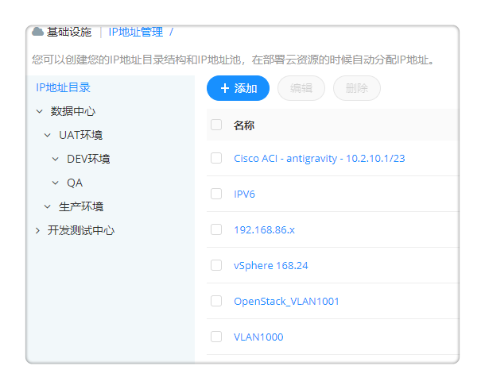
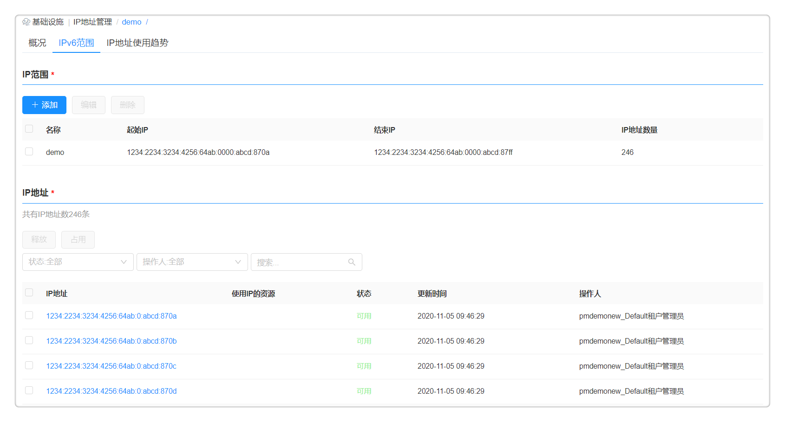

**IP地址管理**

# 功能描述

　　可以一键添加多种异构云平台如的IP池，配置和管理IP地址段，并在配置界面中以树形结构展示，在资源部署时为各云平台的云主机统一分配IP地址，为资源部署带来顺畅的网络服务。

+ 支持可视化查看 IP 用量趋势，并手动释放；
+ 自动检测IP地址冲突；
+ 还可以能查询IP地址使用情况的详细日志信息。
+ 提供IPv4、IPv6的全生命周期管理，创建IP池、与资源池关联、IP冲突检查、资源部署时自动化分配IP等等。
+ 下文将介绍如何创建并使用IP池，目前IP池支持vSphere云平台、OpenStack和Azure内网IP地址。

# IP树形结构

　　IP树展示：IP地址管理增加目录结构，目录包含多级，每级目录包含名称、描述、网段。
  + 您可以创建， 更新和删除IP池目录，拥有对IP池目录的创建、更新、删除、查看权限，
  + 其他人只对IP池目录可以查看， 拥有对IP池目录查看权限。
  + 添加IP树的具体步骤：点击「基础设施」-「IP地址管理」，点击在添加文件夹页面，输入名称、描述、CIDR、网关。点击提交，即可创建IP树形结构。点击二次编辑名称、描述、网关等相关信息，点击即可删除IP信息。
  + 如下图所示，创建适用于数据中心的IP地址目录管理，数据中心存在开发测试、生产、UAT等多个环境，以此为分组，统一且规范地管理所有IP池。

# 创建和管理IP池

　　管理员可在云管理平台中配置IP池，管理IP地址段，并可在IP池中查看IP地址使用情况，可占用以及释放被占用的IP地址。平台可创建支持IPv4，IPv6或者两者都支持的IP池。IPv4的应用范围虽广，但网络地址资源有限。IPv6地址不仅可以解决网络地址资源有限的问题，还可以解决多种接入设备连入互联网障碍的问题。目前IPv6类型仅支持vSphere云平台以及虚拟机的内网IP地址分配。

　　以vSphere虚机部署时为云主机统一分配IPv6地址为例，说明IPv6的IP池创建、配置和使用步骤。

1. IP池支持IPv6、IPv4的网关和路由的配置, 提供灵活的选项开关，来确认当前IP池是IPv4, IPv6或是两个都支持。

2. 创建IPv6的IP池。点击 基础设施 - IP地址管理 ，显示IP池列表，点击添加按钮，填写IP池的名称vSphere-VM-IPv6、描述、类型选择IPv6、IPv6CIDR和网关。 
       

  + 对于支持IPv6的IP池, 如下图所示，每一个IPv6的IP范围不能超过10位, 也就是最多1024个IPv6地址数量。对于支持IPv6的IP池, 有独立的IPv6的Ip范围的tab页。
    
  
3. IP池与vSphere资源池进行关联。如下图所示，在网络资源那选择创建完成的IPv6的IP池。
    

4. 管理IP地址，在IP地址列表界面，点击IP池名称，对IP地址进行管理，可查看IP用量趋势，手动释放；支持IP地址冲突检测；支持IP地址使用情况的详细日志信息查询

　　您可以参考如下操作步骤管理IP地址：

1. 选择IP范围标签页，可看见IP池中所有管理的IP地址的详情：IP地址、使用IP的资源、状态（可用、已占用、不可用、冷却中、预留、预分配）、更新时间、操作人。支持对已占用、冷却中的IP地址进行释放操作，对可用的IP地址进行占用。
2. 点击 IP地址 将显示该IP的状态更新和冲突检测的操作日志。
    
    
    

