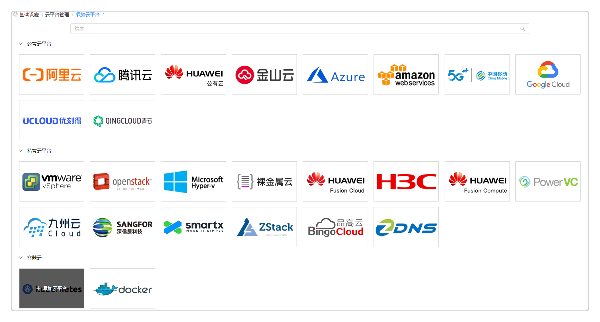
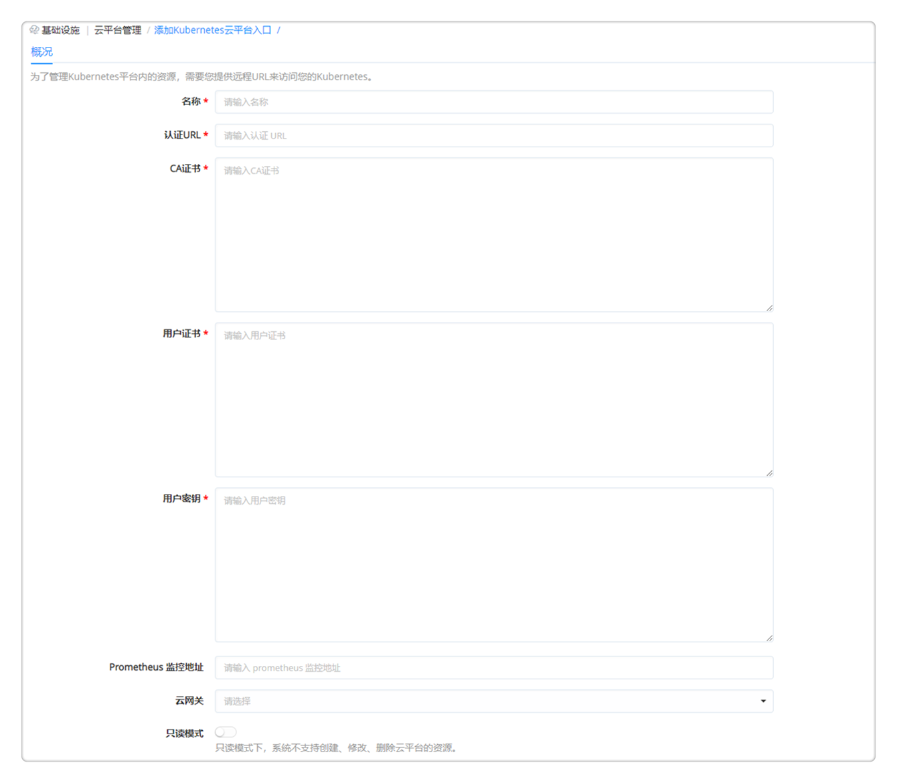

**云平台管理**

　　云平台入口定义了您需要管理的公有云、私有云、容器等云基础设施的接入方式。不同云基础设施账号的形式及获取方式各有不同，您可以通过填写对应的访问信息完成云平台基础设施的接入。

# 添加云平台

　　当接入云平台时，为了保障云主机的安全性，公有云（包括阿里云、腾讯云、AWS）在API调用时均需要验证访问者的身份，以确保访问者具有相关权限。公有云的验证方式通过Access Key来实现。Access Key由云平台颁发给云主机的所有者，它由Access Key ID和Access Key Secret构成对应SmartCMP接入公有云云平台的访问密钥ID和访问密钥。

## 添加vSphere云平台 {#添加vSphere云平台}

　　为了管理vSphere虚拟化平台内的资源，您需要将vCenter连入到平台。请提供vCenter地址、管理员用户名和密码等信息来进行访问。

　1.进入 基础设施 - 云平台管理 ，选择 vSphere ，点击添加。
  

　2.输入所需参数(请根据自己的真实环境输入相关参数，示例只给出参考)。

|参数名称 |描述 |示例|
|:------:|:------:|:-----:|
|云名称|vSphere云平台名称|vSphere数据中心A|
|用户名|vCenter管理员用户名|administrator@vsphere.local|
|密码| vCenter管理员密码 |******** |                        
|地址|vCenter IP地址 |192.168.xx.xx|
|端口|API端口|443|
|数据中心|数据中心所在地|上海|
|关联VMware NSX云平台|NSX云平台（需先添加VMware平台）|选择对应的NSX云平台名称|

  

　3.点击验证，验证连接vSphere虚拟化平台。

　4.验证成功后点击保存，vSphere虚拟化平台连接成功。

## 添加VMware NSX平台 {#添加VMwareNSX平台}

　　为了管理VMware NSX平台内的资源，需要用户提供远程URL来访问VMware NSX。

1.  在左边导航选择 基础设施 - 云平台管理 ，在左边选择 VMwareNSX 类型

2.  点击添加按钮 ，填入下列信息:名称、地址、用户名及密码

参数名称 |  描述 |                       示例|
    :------:|:------:|:-----:
  名称|     VMware NSX云平台名称        | VMwareNSX
  地址|    请输入VMware NSX地址 | 192.168.84.201
  用户名|  VMware NSX平台管理员用户名  | 云平台管理账户
  密码 |   VMware NSX云平台管理员密码    |云平台管理账户密码                

3. 点击验证，验证连接成功后，点击提交， VMware NSX平台入口已保存

>「Note」  VMware NSX的使用必须在添加了vSphere云平台的基础上，添加成功vSphere云平台和VMware NSX平台后，需要在vSphere云平台中将NSX相关联。

## 添加OpenStack云平台 {#添加OpenStack云平台}

　　为了管理OpenStack云平台内的资源，需要用户提供API访问地址、管理员用户名和密码等信息来访问OpenStack。

1.  在左边导航选择 基础设施 - 云平台管理 ，在左边选择 OpenStack 类型

2.  点击添加按钮，填入下列信息并点击验证。验证连接成功后，点击提交，OpenStack云平台入口已保存。

参数名称 |  描述 |                       示例|
    :------:|:------:|:-----:
  云名称|     OpenStack云平台名称        | OpenStack
  认证URL|    OpenStack keystone认证URL  | http://xxx.xxx.xxx.x:5000/v2.00
  API版本|    选择API版本:版本2 版本3   | 版本2
  租户名称| 一个项目，团队或组织，指定一个相应的租户才可以申请OpenStack服务   | 指定的租户名称
  用户名|  OpenStack云平台管理员用户名  | 云平台管理账户
  密码 |   OpenStack云平台管理员密码    |云平台管理账户密码                
  区域|       区域名称                    |RegionOne
  数据中心 |  数据中心所在地              |上海

## 添加华为云平台 {#添加华为云平台}

　　为了管理华为云平台内的资源，需要用户提供API访问地址、管理员用户名和密码等信息来访问华为云。

1.  在左边导航选择 基础设施 - 云平台管理 ，在左边选择 OpenStack 类型

2.  点击添加按钮，填入下列信息并点击验证。验证连接成功后，点击保存，华为云平台入口已保存。

参数名称 |  描述 |  示例|
    :------:|:------:|:-----:
  云名称|     华为云平台名称        | Huawei
  认证URL|    华为云认证URL  | https://iam.cn-east-2.myhuaweicloud.com/v3
  版本|    选择云平台版本 | 华为云
  API版本|    选择API版本:版本2 版本3   | 版本3
  项目名称|    请输入项目名称   |请输入项目名称
  项目域|    通过项目域访问项目 | 请输入项目域
  用户名|     华为云平台管理员用户名   |云平台管理账户
  密码 |      华为云平台管理员密码     |云平台管理账户密码  
  用户域|       如不填写，默认使用项目域   |请输入用户域
  区域|       区域名称     |cn-north-1

  

## 添加阿里云平台 {#添加阿里云平台}

　　当接入云平台时，为了保障云主机的安全性，公有云（包括阿里云、腾讯云、AWS）在API调用时均需要验证访问者的身份，以确保访问者具有相关权限。公有云的验证方式通过Access Key来实现。Access Key由Access Key ID和Access Key Secret构成平台接入公有云云平台的访问密钥ID和访问密钥。

　　以阿里公有云为例，您可以根据下面的步骤来添加一个阿里云平台:

1. 在左边导航选择 基础设施 - 云平台管理 ，在左边选择阿里云
  

2. 点击添加按钮，填入以下信息：云名称、访问密钥ID、访问密钥。

  阿里云访问密钥AccessKey获取方式

   - 获取Access Key Secret的方法:登录您的阿里云管理控制台，点击页面右上角个人信息，展开面板，选择里面的"accesskeys"。

  

   - 您也可以直接登录访问 <https://ak-console.aliyun.com>，进入AccessKeys管理界面，查看您的AccessKey列表，如果当前列表为空，您也可以创建一个，新建AccessKey时阿里云会向账号联系人手机发送验证码，验证通过后可以创建AccessKey；

  

   - 获取Access Key ID:阿里云账号ID是阿里云分配给每个用户的唯一识别码，不可更改，用户要查看自己的阿里云账号ID，请在登录状态下访问阿里云账号"安全设置"，地址:<https://account.console.aliyun.com/secure>； 在打开的"安全设置"页面中，查找自己的账号ID

  

3. 您可以启用云平台监控。云平台监控是指通过云平台API获取云资源的监控数据，支持阿里云的ECS（请在虚拟机模板中选择监控方式）、SLB、OSS、Redis、RDS等监控。

  >「Note」 启用云平台监控后，平台会频繁调用阿里云API，可能会触发阿里云的API限流机制，并需要为超出免费次数限制的API调用支付额外的费用。
  

4. 点击验证，验证连接成功后点击保存，阿里云平台已保存。

## 添加阿里专有云平台 {#添加阿里专有云平台}

　　您可以根据下面的步骤来添加一个阿里专有云平台（Apsara）:

1.  在左边导航选择 基础设施 - 云平台管理 ，在左边选择 阿里专有云 类型

2.  点击添加按钮，填入下列信息:云名称、访问密钥ID、访问密钥。
  >「Note」  阿里云访问密钥及访问密钥ID获取方式请参考[添加阿里云平台](#添加阿里云平台)

3. 点击验证，验证连接成功后，点击提交， 阿里专有云平台入口已保存

## 添加AWS平台 {#添加AWS平台}

　　为了管理AWS云平台内的资源，需要您提供API密钥来访问您的AWS。您可以根据下面的步骤来添加一个AWS平台:

1.  在左边导航选择 基础设施 - 云平台管理 ，在左边选择 AWS 类型

2.  点击添加按钮，填入下列信息:云名称、访问密钥ID及访问密钥
    + 亚马逊AWS访问密钥（即Access Key）是AWS用户在通过API访问云资源时的确认用户身份的凭证，SmartCMP正是通过API来管理AWS云资源，因此用户首先需要获取AWS访问密钥（Access Key）才可以将资源纳入到平台中进行管理，访问密钥（Access Key）由亚马逊AWS颁发给云主机的所有者，它由访问秘钥ID（Access Key  ID）和私有访问秘钥（Secret Access Key）构成。
    + 登录AWS管理控制台 使用AWS主账号（或者是拥有AdministratorAccess管理策略权限的子账号）登录管理控制台，点击"安全&身份"中的"管理用户访问和加密密钥（Identity& Access Management）"，进入IAM控制面板； 查看用户列表，进入IAM控制面板后，点击"用户"，查看所有用户列表；
    + 查看用户安全证书， 要将云资源导入到平台，要确保访问密钥（Access Key）有足够的资源权限，因此请选定一个有相应权限的用户，点击用户名，进入该用户详情页面后，点击"安全证书"页签；创建访问密钥 请点击"创建访问密钥"，将打开密钥信息窗口。需要注意的是，在AWS控制台中，用户仅有一次查看访问密钥的机会，因此请务必在打创建访问密钥成功后，将密钥信息妥善保存； 访问秘钥ID即导入云主机时用到的Access Key ID，私有访问秘钥即Secret Access Key（默认不显示，点击"显示"链接）；

    

3. 点击验证，验证连接成功后，点击提交， AWS平台入口已保存

## 添加Azure云平台 {#添加Azure云平台}

　　为了管理Azure云平台内的资源，需要您提供访问信息来访问您的Azure。您可以根据下面的步骤来添加一个Azure云平台:

1. 在左边导航选择 基础设施 - 云平台管理 ，在左边选择 Azure 类型
2. 点击添加按钮，填入下列信息:云名称、客户机ID、访问密钥、访问域及访问ID

    获取微软Azure的API访问凭证需要通过多个步骤，访问凭证由订阅（Subscription）ID、客户机ID和访问密钥构成。具体步骤如下:
    + 获取微软Azure的访问域:
      在Azure控制台中进入Azure Active Directory，再点击二级菜单"属性"；在Active Directory属性页面，我们可以看到"目录ID"，该目录ID即为Azure的访问域；
      

    + 获取订阅ID:
      您在购买Azure产品之前，必须先创建一个订阅，而后需要在这个订阅下购买云资源，云资源不能跨订阅访问。因此，当您存在多个订阅时，请您确保输入的订阅ID是您需要导入的云资源所属订阅，否则可能会出现无法列出云资源的情况。 登录Azure控制台，在左侧菜单选择"成本管理+计费"（菜单顺序是可自定义调整的），在"Overview"中，找到您要导入的云资源所属订阅，获取"订阅ID"。如果您有多个订阅，都希望通过平台来管理，那么请创建多个云账户分批导入；
      

    + 获取客户机ID和访问密钥:
      在[Azure Active Directory]中，点击二级菜单"[应用注册]"，将会列出现有的所有应用程序，在应用程序（客户端）ID处即可找到 客户机ID 点击该应用程序进入详情页面，先点击左侧"[证书和密码]"按钮，再找到右侧的"新增客户端密码"，添加客户端密码，添加成功后，可查看到访问密钥。
      

3.  勾选是否启用云平台监控。云平台监控是指通过云平台API获取云资源的监控数据,启用后会频繁调用云平台API,可能会触发云平台的API限流机制,并需要为超出免费次数限制的API调用支付额外的费用。

4.  点击验证，验证连接成功后，点击提交，Azure云平台入口已保存

## 添加谷歌云平台

　　为了管理谷歌云平台内的资源，需要您提供谷歌云访问密钥ID和访问密钥来访问您的谷歌云。您可以根据下面的步骤来添加一个谷歌云平台:

1.  在左边导航选择 基础设施 - 云平台管理 ，在左边选择 谷歌云 类型

2.  点击添加按钮，填入下列信息:云名称、项目名称、访问密钥ID、访问密钥、客户端邮箱及客户端ID

    + 您可以登录谷歌云控制台，在“IAM和管理”菜单的“设置”中查看项目信息，在“服务账号”中查看访问密钥和邮箱，在“API和服务”菜单的“OAuth访问屏幕”中查看客户端ID。

3. 点击验证，验证连接成功后，点击提交， 谷歌云平台入口已保存

## 添加腾讯云平台 {#添加腾讯云平台}

　　为了管理腾讯云平台内的资源，需要您提供腾讯云访问密钥ID和访问密钥来访问您的腾讯云。您可以根据下面的步骤来添加一个腾讯云平台:

1.  在左边导航选择 基础设施 - 云平台管理 ，在左边选择 腾讯云 类型

2.  点击添加按钮，填入下列信息:云名称、访问密钥ID、访问密钥及区域（如：华东地区）

    + 类似阿里云AccessKey，腾讯云为API服务提供了一套API密钥验证机制，API密钥由腾讯云颁发给云主机的所有者，它由Secret ID 和 Secret Key组成。对应SmartCMP接入腾讯云平台的访问密钥ID和访问密钥。
    + 获取方式: 登录您的腾讯云控制台，点击左上角"云产品"，在弹出的界面中点击"访问密钥"， 进入"访问密钥"管理界面，您将看到您的API密钥列表，API密钥由APPID、SecretId及SecretKey组成，如果该列表为空，请点击"新建密钥"创建一个。

    

      >「Note」  腾讯云账号ID是腾讯云分配给每个用户的唯一识别码，用户要查看自己的腾讯云账号ID，请在登录状态下访问"账户信息"。

  

3. 点击验证，验证连接成功后，点击提交， 腾讯云平台入口已保存

## 添加UCloud云平台
　　为了管理Ucloud平台内的资源，需要您提供Ucloud访问密钥ID和访问密钥来访问您的Ucloud。获取方式类似[阿里云](https://cloudchef.github.io/doc/AdminDoc/03基础设施管理/云平台管理.html#添加阿里云平台)，基于通用组件实现Ucloud的计算、网络和存储节点的接入。

## 添加青云云平台 {#添加青云云平台}

　　支持青云公有和私有两种类型的云平台对接。为了管理青云云平台内的资源，需要您提供访问密钥ID、访问密钥来访问您的青云。您可以根据下面的步骤来添加一个青云平台:

1.  在左边导航选择 基础设施 - 云平台管理 ，在左边选择 青云 类型

2.  点击添加按钮，填入下列信息:云名称、访问密钥ID、访问密钥、类型（私有或公有）及API URL（若选择私有，需要提供青云私有云API URL）
    + 类似阿里云Access Key，青云公有云为API服务提供了一套API密钥验证机制，通过这个密钥，用户可以将青云中的云资源导入到平台。API密钥由青云颁发给云主机的所有者，它由qy_access_key_id和qy_secret_access_key组成。
    + 登录您的青云QingCloud控制台，点击左侧菜单中的"API密钥"，进入API密钥管理页面，或者您也可以直接登录访问[https://console.qingcloud.com/access_keys/](https://console.qingcloud.com/access_keys/)；点击创建按钮，弹出"新建API密钥"窗口，输入名称，如:云服务，点击"提交"按钮；在弹出的"下载密钥"窗口，点击下载按钮，将密钥文件:access_key.csv下载到本地。请注意，API密钥的下载链接只会出现一次，如果您创建时没有下载，请重新创建一个新的API密钥； 使用记事本打开文件:access_key.csv，可以看到API密钥信息，qy_access_key_id和 qy_secret_access_key

3. 点击验证，验证连接成功后，点击提交， 青云平台入口已保存

##  添加金山云平台 {#添加金山云平台}

　　为了管理金山云平台内的资源，需要您提供金山云访问密钥ID和访问密钥来访问您的金山云。您可以根据下面的步骤来添加一个金山云平台:

1.  在左边导航选择 基础设施 - 云平台管理 ，在左边选择 金山云 类型
2.  点击添加按钮，填入下列信息:云名称、访问密钥ID及访问密钥
    >「Note」  访问密钥及访问密钥ID获取方式请参考[添加阿里云平台](#添加阿里云平台)

3. 点击验证，验证连接成功后，点击提交， 金山云平台入口已保存。

## 添加Kubernetes平台 {#添加Kubernetes平台}

　　为了管理Kubernetes平台内的的资源，需要您提供远程URL和证书信息来访问您的Kubernetes。
您可以根据下面的步骤来添加一个Kubernetes平台:

1.  在左边导航选择 基础设施 - 云平台管理 ，在左边选择 Kubernetes 类型
  

2.  点击添加按钮，在概况标签页填入下列信息:
  + 名称:输入Kubernetes的云平台名称

  + 认证URL:输入云平台的URL信息

  + CA证书:在Master主机的配置文件:/root/.kube/config中找到certificate-authority的值并进行Base64解码

  + 用户证书:在Master主机的配置文件:/root/.kube/config中找到client-certificate的值并进行Base64解码

  + 用户密钥：在Master主机的配置文件:/root/.kube/config中找到client-key的值并进行Base64解码

  + Prometheus
   监控地址:若Kubernetes中已安装Prometheus，则可输入Prometheus监控地址，通过SmartCMP平台查看Kubernetes的监控数据

  

3.  点击验证，验证连接成功后，点击保存，Kubernetes云平台入口保存

  
# 查看云平台资源使用情况

　　成功添加云平台后，可以通过系统查看云平台的总体资源使用情况。在左边导航选择 基础设施 - 云平台管理 ，根据选择的云平台查看资源使用情况。

## 查看vSphere云平台资源使用情况 {#查看vsphere云平台资源使用情况}

　　在添加vSphere云平台成功之后，点击云平台名称或选中云平台后点击编辑，会进入云平台概况标签页，点击 资源信息 ，会显示当前vSphere云平台的整体资源情况:

 + 数据总览:显示该云平台下资源概况，如物理主机数量，群集数量，数据存储数量、标准交换机数量和虚机总数

 + 数据中心概况:显示该数据中心下的群集、主机、虚拟机个数以及CPU、内存、存储等的已用量和总量百分比

 + 群集和主机概况:显示群集名称，及该群集下的云主机名称、所属数据中心，CPU总数，CPU、内存、存储的已用量和总量百分比

 + 数据存储概况:显示数据存储名称、所属数据中心、及存储的已用量、总量和申请总量的百分比

 + vSphere资源池概况:vSphere资源池名称、所属群集、CPU已用量和总量的百分比，内存的已用量和总量的百分比

## 查看其他云平台资源使用情况

　　在添加云平台成功之后，点击云平台名称或选中云平台后点击编辑，会进入云平台概况标签页，点击 资源信息 ，会显示当前云平台的整体资源情况:包括可用区名称、资源池总数、已部署虚机、CPU、内存、存储等。

# 删除云平台

　　在左边导航选择 基础设施 ，选择二级菜单 云平台管理 。在左侧管理菜单选择需要修改的云平台类型，然后选中云平台，点击删除然后确认即可。若仍存在关联到这个云平的资源池、虚拟机模板或计算规格，则不能删除。
