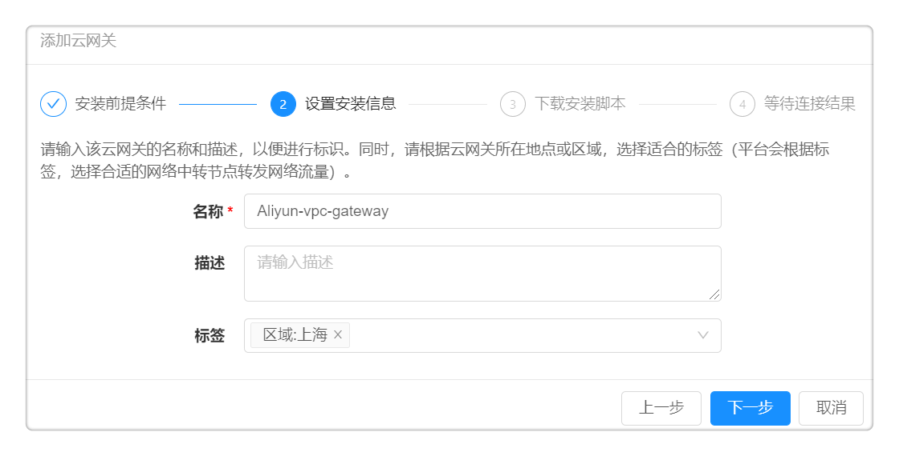

**云网关管理**
# 功能描述

越来越多的企业采用混合云的架构，企业底层的基础架构和网络环境较为复杂，SmartCMP云管理平台（以下简称“云管平台”）提供的云网关功能，可以帮助您连接并管理多个数据中心，多个VPC，隔离的虚拟网络环境，混合云环境（私有云+公有云）等，并且避免将所有需要管理的云资源的端口进行开通或暴露到公网。

# 典型应用场景

当云管平台与隔离的区域网络不通时，您可以选择部署云网关，如下图所示：

  +  数据中心1和2都处于隔离的网络环境中，与云管平台网络不通。
  +  在公有云上构建了一个隔离的网络环境（Virtual Private Cloud），并且VPC中云资源未分配公网IP，也未绑定弹性公网IP，则云管平台默认无法和VPC内部的云资源通信。

您只需要在公有云和网络隔离的数据中心分别部署一个云网关，就能借助云网关访问并管理隔离区域的云资源。

# 云网关的作用
云网关安装完成之后，可以发挥以下功能：

 + 连接云网关与云平台，云网关能够负责转发管理云平台的请求。例如：云管平台通过云网关能够连接隔离网络环境的云平台，并能够创建或查看云资源信息。
 + 连接云网关与资源池，能够实现以下功能：
     + 转发云管平台管理隔离数据中心的云资源的请求。例如：云管平台可以通过云网关将 “安装监控代理“、“执行脚本“、“安装软件“等请求发送给相应的云资源，无需直接连接隔离网络下每一个云资源。
     + 帮助监控代理获取隔离数据中心云资源的监控数据。例如：云管平台可以通过云网关从已安装监控代理的云资源获取监控数据，无需直接连接隔离网络下每一个云资源。
     + 帮助云管平台远程访问云主机，并能够查看相关的活动记录。例如：云管平台可以通过云网关查看过往远程访问云主机的会话信息，了解每个历史会话的详细信息。

# 云网关的安装方法

## 安装前提

如果您需要为网络隔离的数据中心、VPC或远程站点部署一个云网关，请选择一台主机安装云网关代理，主机的选择需要遵循以下原则：
 + 该主机和其它您需要管理的内网主机在同一个网络内，能够互相连接;
 + 该主机需为Linux操作系统，建议使用CentOS或RHEL 7.x版本;
 + 该主机不需要配置公网IP，但需要能够访问公网;
 + 该主机建议至少配置2核CPU和4GB内存，并且为云网关安装目录（默认为/usr/local/src）预留至少10GB空闲磁盘空间。

## 安装步骤

您可以通过以下安装步骤完成云网关的部署
 
  + 在左侧菜单选择 基础设施 – 云网关管理，您可以查看并管理所有您已创建的云网关。
  
  + 点击添加按钮，进入编辑页面：
     + 名称和描述：自定义云网关的名称和描述，以便进行标识。

     + 标签：请根据云网关所在地点或区域选择合适的标签，平台会根据标签，选择合适的网络中转节点转发网络流量。
  
   + 点击下一步，进入安装脚本页面，复制脚本信息。
      
   + 选择一台符合安装条件的云主机，执行脚本信息，安装云网关的代理。

# 云网关的使用
  
当您成功安装云网关之后，您可以在 我的部署 - 云资源 - 网络 列表中，查看已安装的云网关名称、IP地址和创建时间等信息。

当您连接云网关与云平台，云网关能够负责转发管理云平台的请求。具体步骤可参照下文：

  + 点击 基础设施 - 云平台管理 ，点击需要关联的云平台（例如vSphere), 在概况标签页选择已部署成功的云网关，点击保存按钮，云网关与云平台关联成功。

当您连接云网关与资源池，就能够对隔离网络环境中云资源进行一系列运维操作，包括能够远程访问云主机，获取云资源的监控数据，对云资源进行“安装监控代理“、“执行脚本“、“安装软件“等操作。具体步骤可参照下文：

 + 点击 基础设施 - 资源池管理 ，点击需要关联的资源池, 在概况标签页选择已部署成功的云网关，点击保存按钮，云网关与资源池关联成功。

