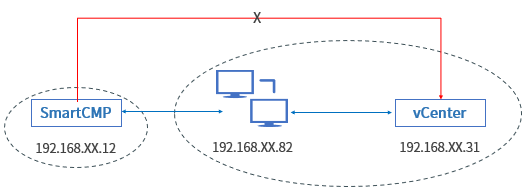
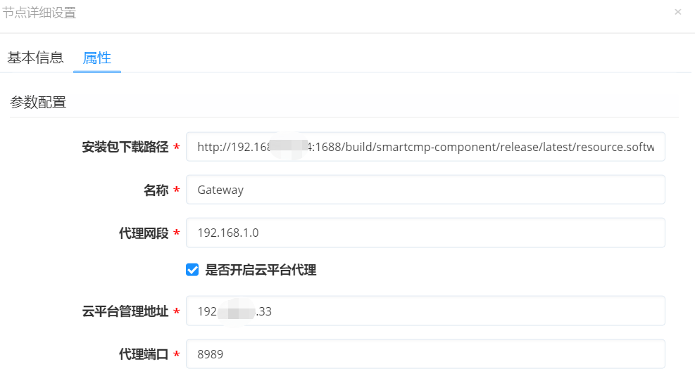

**云平台网关**
# 功能描述

+ 越来越多的企业采用混合云的架构，企业底层的基础架构和网络环境较为复杂，云平台采用的分布式架构可适应多种场景，可以集中管理多个数据中心，多个VPC，隔离的虚拟网络环境，混合云环境（私有云+公有云）等。

+ 通过开通云平台与主节点之间的有限通信端口， 云平台就可以借助云网关统一管理和监控各VPC、数据中心或者远程站点的资源。

# 典型应用场景

+ 云平台与隔离的数据中心网络不通。如下图所示：云平台部署在主数据中心，与主数据中心的网络是打通的，但云平台与隔离的中心区域1和区域2网络不通。

    + 首先，我们需要在两个隔离的数据中心区域1和2，分别安装带有CloudGateway的虚拟机。
    + 云平台网关拥有两个网卡，其中一个网络使主数据中心与网关的网络保持连通，另一个网络链接网关与隔离的数据中心。
    + 在两个隔离的数据中心成功部署CloudGateway之后，在云平台接入的入口，加入CloudGateway的代理网关，实现云平台与隔离数据中心连通并管理其资源。

# 云网关发挥的作用
+ 云网关安装完成之后，发挥的具体作用：
    + 转发平台管理隔离数据中心得云资源的请求。例如：云平台可以通过CloudGateway将“安装自动化代理“、“安装监控代理“、“执行脚本“、“安装软件“等请求发送给相应的云资源，无需直接连接隔离网络下每一个云资源。
    + 帮助云平台获取隔离数据中心云资源的监控数据。例如：云平台可以通过CloudGateway从已安装监控代理的云资源获取监控数据，无需直接连接隔离网络下每一个云资源。
    + 负责转发云平台云平台管理的请求。通过CloudGateway将云资源生命周期的管理请求和资源状态信息获取请求代理到云平台，无需直接连接云平台。

# 云网关的安装方法

## 多种安装方式
+ 云平台提供多种安装方式，供软件架构师按需选择：
    + 在蓝图设计中将CloudGateway软件组件添加到一台云主机中，申请服务卡片，云主机部署完成后，会自动完成CloudGateway的安装配置；
    + 在申请服务卡片时动态添加CloudGateway组件到一台云主机节点中，云主机部署完成后，会自动完成CloudGateway的安装配置；
    + 导入一台已有的云主机，安装好自动化代理后，再安装CloudGateway软件组件；
    + 已部署好的一台云主机，安装好自动化代理后，通过在云主机的运维操作界面，再安装CloudGateway软件组件。

## 安装的注意事项

+ 软件架构师在安装CloudGateway云网关组件的注意事项：
    + 操作系统要求，CentOS7.x/RHEL7.x，系统配置要求，CPU 4核，内存 16GB， 磁盘 100GB （如果需要监控的云主机数量大于500，可适当增配）。
    + 安装CloudGateway的云主机需要开通SSH服务访问权限，并且提供一个拥有sudo权限的SSH访问用户。
    + 安装CloudGateway的云主机需要安装自动化代理，安装过程依赖自动化代理执行安装脚本。

## 具体的配置步骤

+ 以第一种安装方法为例（“在蓝图设计中将CloudGateway软件组件添加到一台云主机中，申请服务卡片，云主机部署完成后，会自动完成CloudGateway的安装配置”）详细地介绍配置步骤：

    + 首先，云平台在组件库内置了CloudGateway组件，该组件提供Nginx, Consul, Prometheus等功能，每一个CloudGateway组件只能反代一个云平台的地址，监听所在云平台API端口。以vCenter举例：假设有以下IP，云平台: 192.168.XX.12;CloudGateway: 192.168.XX.82;vCenter: 192.168.XX.31;云平台端Java Client会将VC的URL:192.168.XX.31重写为CloudGateway的IP 192.168.XX.82，发送到CloudGateway之后，Nginx监听443端口，再转发到VC的地址上。

      

    + 蓝图设计师，可以在蓝图的可视化编辑器中，将CloudGateway、虚拟、网络进行统一编排，如下图所示：两个network组件分别代表，其中一个为管理网络，保证CloudGateway与云平台之间的连通，另一个为代理网络，保证CloudGateway与隔离数据中心的连通。
    
       

    + 在服务配置中，设置云平台网关的相关参数，包括：下载路径（CloudGateway的Ansible安装包的下载路径）、云平台管理地址（隔离数据中心云平台的地址，192.XX.XX.33）、代理网段和端口（云平台与CloudGateway能连通的网络的网段192.XX.XX.1和端口8989）、是否开启云平台代理（是否使CloudGateway拥有此项功能，即将云资源生命周期的管理请求和资源状态信息获取请求代理到云平台，无需直接连接云平台。）

       

    + 配置完成之后发布到服务目录并自助申请，云主机部署完成之后，会自动完成CloudGateway的安装配置。
    
    + 安装成功之后该组件会出现在云资源软件列表中和「基础设施」-「云平台网关」的菜单列表中（只有租户管理员和IaaS管理员有权限查看），可查看列表可获取 CloudGateway名称、IP地址和创建时间等信息。同时，在服务部署里面，可以查看已部署成功的云平台网关信息，进行刷新状态、停止、安装软件、删除等变更运维操作。

    + 当在隔离网络的数据中心安装完成了云平台网关，管理员需要在「基础设施」-「云平台管理」-隔离数据中心的云平台(例如，上文提到的隔离数据中心云平台的地址，192.XX.XX.33）处，关联CloudGateway，输入网关信息（默认留空，此信息与服务配置处配置的网关信息相匹配，如：网关端口8989相一致）。

