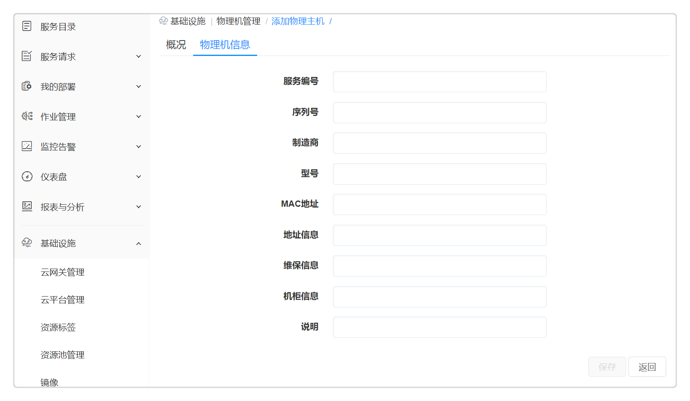

**物理主机管理**

您可以在左边导航选择 基础设施 ，选择二级菜单 物理机管理，可以添加物理主机信息，对在云平台和暂时不在云平台上的物理机进行管理。

# 添加/编辑物理主机

进入点击 基础设施 - 物理机管理 ，点击添加按钮，选择平台（目前支持OpenStack、vSphere、物理服务器、PowerVC），输入物理主机相关信息：

-   概况：物理机名、IP地址、云平台、平台类型，点击保存，物理主机添加成功

-   物理机信息：填写物理机的相关信息，如制造商、型号、MAC地址等，全部均选填

对OpenStack和vSphere，如果所填的IP地址和实际云平台中的某台主机IP地址匹配，则会自动抓取物理主机资源信息，在下次编辑物理主机时在基本信息标签页可见。

SmartCMP会每天自动同步vSphere和OpenStack云平台下的所有物理主机信息到列表

# 查看物理主机信息

物理主机添加成功后，可在物理主机列表界面查看所有已添加的物理主机信息，点击名字可进入基本信息页面，通过输入的信息获取到该物理主机的资源信息、存储信息以及网络信息等。

# 删除物理主机信息

在物理主机列表页面，选择某物理主机，点击菜单栏中的删除，确认后将删除该物理主机信息。
