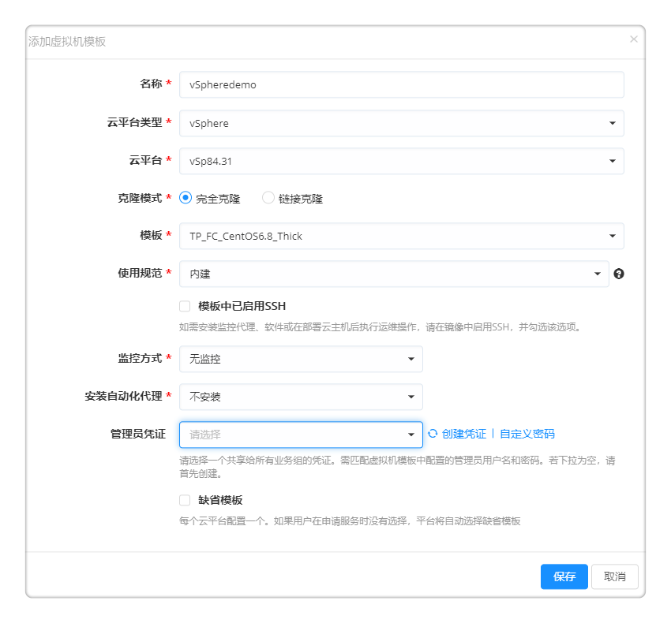

**虚拟机模板**

　　虚拟机模板是平台对操作系统的抽象和标准化。平台提供了内置的通用操作系统，您无需额外配置，可直接申请部署云资源，平台将会根据您选择的资源环境，读取云平台中的可用镜像。

　　您也可以创建新的操作系统，或为各个操作系统指定特定的虚拟机模板或操作系统镜像，供您和用户在部署虚拟机的时候进行选择，或由平台根据您的配置自动进行选择。详细步骤请参考下文。

# 添加虚拟机模板

## 添加Linux虚拟机模板

　　您可根据以下步骤添加Linux虚拟机模板：

1.  选择 基础设施 - 虚拟机模板 ，进入虚拟机模板列表界面。该页面默认有2个Linux虚拟机模板，分别为Redhat7和CentOS 7，您也可以点击添加按钮创建新的操作系统。
  * 允许在申请时选择云平台中所有的镜像：
      - 默认勾选，允许用户在申请部署云主机时，根据资源环境选择云平台上的所有可用镜像；
      - 取消勾选，可配置特定的镜像供用户在申请部署时选择。
  * 镜像过滤：默认勾选，允许用户在申请部署云主机时,请您输入关键词，来过滤您在申请服务时选择的镜像名称。

2. 点击保存，能创建生成一个新的操作系统。
    

3.  下面介绍如何配置特定的虚拟机模板。点击 CentOS 7，进入虚拟机模板基本信息标签页，该页面显示操作系统名称、描述、以及系统类型（Linux或Windows）

4.  取消勾选 允许在申请时选择云平台中所有的镜像 ，点击虚拟机模板标签页，进入虚拟机模板列表界面
 

### 添加一个私有云虚拟机模板

　　以vSphere为例介绍添加私有云模板的步骤。

1.  点击添加，输入模板名称：CentOS 7.3 on vSphere，选择之前配置的vSphere云平台并做如下配置：

  - 克隆模式：选择 完全克隆 或 链接克隆

 >「Note」完全克隆是和原始虚拟机完全独立的一个拷贝，它不和原始虚拟机共享任何资源，可以脱离原始虚拟机独立使用；链接克隆需要和原始虚拟机共享同一虚拟磁盘文件，不能脱离原始虚拟机独立运行。但采用共享磁盘文件却大大缩短了创建克隆虚拟机的时间，同时还节省了宝贵的物理磁盘空间。

  - 完全克隆：  
      + 模板：选择一个vCenter中已经配置的Linux CentOS模板

  - 链接克隆：
      + 虚拟机：选择一个vCenter中的Linux CentOS 7的虚拟机。
      + 快照模式：默认"指定一个快照"，可选择"申请时候选择"和"总是使用最新"这两种快照模式。选择"申请时候选择"将允许用户在服务申请的时候手工指定一个虚拟机快照。
      + 快照：若快照模式选择"指定一个快照"，将选择一个快照。

  - 使用规范：指vCenter中的虚拟机自定义规范。
      + 无 表示不使用虚拟机自定义规范
      + 内建 表示平台使用虚拟机模板中内建的自定义规范
      + 自定义规范，表示根据模板的配置，平台创建一个新的虚拟机自定义规范，部署虚拟机

  - 模板中已启用SSH：勾选该选项，表示模板中已经启用和配置SSH，可以选择通过SSH的方式安装监控代理；默认SSH端口为22，如果模板中修改了SSH的端口，可输入模板中修改的SSH端口号
      + 用户名、密码：使用具有SSH权限的用户及其密码

  - 监控方式：
      + 无监控：若不安装监控代理，则平台的监控功能不可用。
      + SSH安装监控代理：选择SSH安装的话，会通过SSH的方式访问虚拟机并安装监控代理；设置监控端口，默认是9100。
      + 云平台监控：从vCenter上直接读取虚机的监控数据，不需要安装监控代理。

  - 管理员用户：输入模板中配置的管理员用户名。

  - 管理员密码：输入模板中配置的管理员密码。

  - 缺省模板：每个云平台配置一个缺省模板，如果用户在申请服务时没有选择，平台将自动选择缺省模板。

2.  点击提交，提示虚拟机模板已创建。点击保存，提示虚拟机模板已更新。

### 添加一个公有云虚拟机模板

　　以阿里云为例介绍添加公有云模板的步骤。

1.  点击添加，输入模板名称，例如CentOS 7.3 on Aliyun，选择之前配置的阿里云云平台并做如下配置：

  - 选择区域，需要为每个区域关联至少一个镜像。
  - 选择镜像来源。
      + 自定义镜像：基于用户系统快照生成，包括初始系统环境、应用环境和相关软件配置。
      + 公共镜像：有阿里云官方或第三方合作商家提供的系统基础镜像，仅包括初始系统环境。
      + 镜像市场：镜像市场提供经严格审核的优质镜像，预装操作系统、应用环境和各类软件，无需配置即可一键部署云服务器。

  - 镜像中已启用SSH：勾选该选项，表示模板中已经启用和配置SSH，可以选择通过SSH的方式安装监控代理；默认SSH端口为22，如果模板中修改了SSH的端口，可输入模板中修改的SSH端口号

  - 监控方式：
      + 无监控：若不安装监控代理，则平台的监控功能不可用。
      + SSH安装监控代理：选择SSH安装的话，会通过SSH的方式访问虚拟机并安装监控代理；设置监控端口，默认是9100。
      + 云平台监控：通过云平台API直接读取虚机的监控数据，不需要安装监控代理。请首先在云平台入口的配置中启用。

  - 输入需要设置的用户名及密码。

  - 缺省模板：每个云平台配置一个缺省模板，如果用户在申请服务时没有选择，平台将自动选择缺省模板。

2.  点击提交，提示虚拟机模板已创建。点击保存，提示虚拟机模板已更新。

　　此时CentOS7的Linux操作系统，关联了2个虚拟机模板。在[配置服务](https://cloudchef.github.io/doc/AdminDoc/05服务建模/服务配置.html)的时候，平台会自动选择与该服务相对应的虚拟机模板，无需重复设置。

## 添加Windows虚拟机模板 {#添加Windows虚拟机模板}

　　您可根据以下步骤添加Windows虚拟机模板：

您可根据以下步骤添加Windows虚拟机模板：

1.  选择 基础设施 - 虚拟机模板 ，进入虚拟机模板列表界面。该页面默认有1个Windows虚拟机模板Windows 2012 R2，您也可以点击添加按钮创建新的操作系统。
  * 允许在申请时选择云平台中所有的镜像：
      - 默认勾选，允许用户在申请部署云主机时，根据资源环境选择云平台上的所有可用镜像；
      - 取消勾选，可配置特定的镜像供用户在申请部署时选择。
  * 镜像过滤：默认勾选，允许用户在申请部署云主机时,请您输入关键词，来过滤您在申请服务时选择的镜像名称。

2. 点击保存，能创建生成一个新的操作系统。
  

3.  下面以Windows Server 2012 R2为例介绍如何配置特定的虚拟机模板。点击 Windows 2012 R2 ，进入虚拟机模板基本信息标签页，该页面显示操作系统名称、描述、以及系统类型（LInux或Windows)

4.  取消勾选 允许在申请时选择云平台中所有的镜像 ，点击虚拟机模板标签页，进入虚拟机模板列表界面

  
### 添加一个私有云虚拟机模板

　　以vSphere为例介绍添加私有云模板的步骤。

1.  点击添加，输入模板名称：Windows 2012 R2 onvSphere，选择2.1节配置的vSphere云平台并做如下配置：

  - 克隆模式：选择 完全克隆 或 链接克隆

 >「Note」完全克隆是和原始虚拟机完全独立的一个拷贝，它不和原始虚拟机共享任何资源，可以脱离原始虚拟机独立使用；链接克隆需要和原始虚拟机共享同一虚拟磁盘文件，不能脱离原始虚拟机独立运行。但采用共享磁盘文件却大大缩短了创建克隆虚拟机的时间，同时还节省了宝贵的物理磁盘空间。

  - 完全克隆：  
      + 模板：选择一个Windows 2012模板

  - 链接克隆：
      + 虚拟机：选择一个Windows 2012的虚拟机。
      + 快照模式：默认"指定一个快照"，可选择"申请时候选择"和"总是使用最新"这两种快照模式。选择"申请时候选择"将在服务申请的时候选择虚拟机快照。
      + 快照：若快照模式选择"指定一个快照"，将选择一个快照。

  - 使用规范：选择 内建 （按需求选择无、内建或自定义规范，规范有助于防止在部署相同设置的虚机时产生冲突）

  - 模板中已启用WinRM：勾选该选项，表示模板中已经启用和配置WinRM，可以选择通过WinRM的方式安装监控代理

  - 监控方式：
      + 无监控：若不安装监控代理，则平台的监控功能不可用。
      + WinRM安装监控代理：会通过WinRM的方式访问虚拟机并安装监控代理；设置监控端口，默认是9182。
      + 预安装监控代理：预安装是指模板中已经安装了监控代理。
      + 云平台监控：从VCenter上直接读取虚机的监控数据，不需要安装监控代理。

  - Windows用户名：输入需要设置的Windows管理员用户名

  - Windows密码：输入需要设置的Windows管理员密码

  - 可勾选为缺省模板。每个云平台配置一个缺省模板，如果用户在申请服务时没有选择，平台将自动选择缺省模板。

2.  点击提交，提示虚拟机模板已创建。点击保存，提示虚拟机模板已更新。

### 添加一个公有云虚拟机模板

　　以阿里云为例介绍添加公有云模板的步骤。

1.  点击添加，输入模板名称：Windows 2012 on Aliyun，选择2.1节配置的阿里云云平台并做如下配置：

  - 选择区域名称及镜像来源。
      + 自定义镜像：基于用户系统快照生成，包括初始系统环境、应用环境和相关软件配置。
      + 公共镜像：有阿里云官方或第三方合作商家提供的系统基础镜像，仅包括初始系统环境。
      + 镜像市场：镜像市场提供经严格审核的优质镜像，预装操作系统、应用环境和各类软件，无需配置即可一键部署云服务器。

  - 镜像中已启用WinRM：勾选该选项，表示模板中已经启用和配置WinRM，可以选择通过WinRM的方式安装监控代理。

  - 监控方式：
      + 无监控：若不安装监控代理，则平台的监控功能不可用。
      + WinRM安装监控代理：会通过WinRM的方式访问虚拟机并安装监控代理；设置监控端口，默认是9182。
      + 云平台监控：通过云平台API直接读取虚机的监控数据，不需要安装监控代理。请首先在云平台入口的配置中启用。

  - 输入需要设置的用户名及密码。

  - 可勾选为缺省模板。每个云平台配置一个缺省模板，如果用户在申请服务时没有选择，平台将自动选择缺省模板。

2.  点击提交，提示虚拟机模板已创建。点击保存，提示虚拟机模板已更新。

　　此时Windows 2012操作系统已关联了2个虚拟机模板。在[配置服务](https://cloudchef.github.io/doc/AdminDoc/05服务建模/服务配置.html)的时候，平台会自动选择与该服务相对应的虚拟机模板，无需重复设置。

# 查看当前虚拟机模板

　　您可以根据下面的步骤来查看虚拟机模板：

1.  在左边导航选择 基础设施 ，选择二级菜单 虚拟机模板 ，则显示当前的虚拟机模板列表。可在列表中查看描述信息以及该虚拟机模板对应的操作系统类型

2.  点击虚拟机模板的名称可进入概况标签页，可查看操作系统名称、描述、系统类型

3.  点击虚拟机模板标签页，进入虚拟机模板管理界面。可新增、编辑和删除虚拟机模板