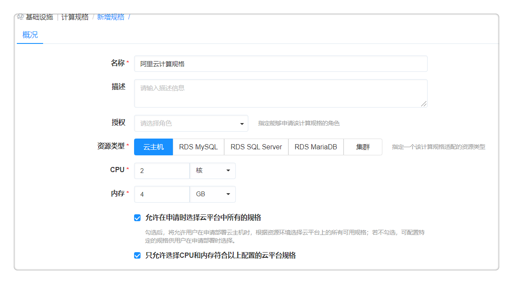
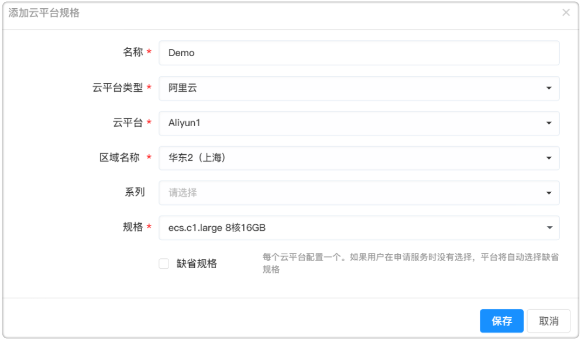

**计算规格**

　　计算规格定义了虚拟机的CPU和内存的配置规范（如：2核CPU，4G内存）并能够设置云平台规格，在配置服务时根据云平台自动选择。平台定义了抽象的计算规格，并能够关联云平台规格（如OpenStack平台的规格，或公有云平台的实例类型），在配置和申请服务时指定，或根据您的配置自动选择。

　　进入菜单 基础设施 - 计算规格 ，可管理计算规格。在服务配置节点详细设置处可对计算节点做规格的配置。

>「Note」不同类型云平台的计算规格的配置方式有所不同，区别如下：
  -   私有云平台例如vSphere只需定义计算规格，不需要配置云平台规格
  -   OpenStack需要定义计算规格和云平台规格
  -   Azure、AWS、阿里云等公有云平台需要定义计算规格和云平台规格（针对每个公有云区域需要定义一个云平台规格）

# 添加计算规格

　　以下以配置阿里云云平台的计算规格为例：

1. 进入菜单 基础设施 - 计算规格 可管理计算规格。平台默认四种计算规格微型（1 vCPU，1GB内存）、小型（2 vCPU，4GB内存）、中型（4 vCPU，8GB内存）、大型（8 vCPU，16GB内存）。

2. 您也可以根据需要自定义计算规格类型：

  - 规格名称：阿里云计算规格
  - 资源类型：云主机
  - 授权：指定能够申请该计算规格的角色
  - CPU：指定vCPU数量
  - 内存：指定内存大小
  - 若勾选 允许在申请时选择公有云平台中所有的规格，则只需为每个区域关联一个公有云云平台实例类型，无需指定具体某个实例类型。
  - 若勾选 只允许选择CPU和内存符合以上配置的云平台规格，则用户在申请部署云资源时候，将能够选择所有的、或指定Family下所有的符合该计算规格CPU和内存配置大小的实例类型（例如所有2 vCPU，4GB 内存的实例类型）。

  

3.  点击保存，进入云平台规格的关联页面，输入如下云规格信息：

  - 云平台类型：阿里云
  - 区域名称：云平台对应的区域，例如：华东2（上海）
  - 系列：可指定某个系列，即Family
  - 规格：指定某个具体的规格或实例类型。如果计算规格勾选了 允许在申请时选择公有云平台中所有的规格，此处不需要进行选择。
  - 可勾选缺省规格，每个云平台可配置一个缺省规格，如果用户在申请服务时没有选择，平台将自动选择缺省规格。

4.  点击保存，就可以添加一个新的阿里云平台规格。

# 查看计算规格

　　进入计算规格页面，可以看到规格列表，表格中会列出当前已有的所有的计算规格。

　　在列表中，显示规格名称、资源类型、CPU、CPU单位、内存、内存单位、创建者、创建时间。

# 编辑计算规格

　　在列表中，点击规格名称，可对点击的计算规格进行编辑。

# 删除计算规格

　　在列表中也可以选中一个计算规格，点击删除按钮将选中的计算规格删除。如果该计算规格正在使用中将会提示不可删除。

