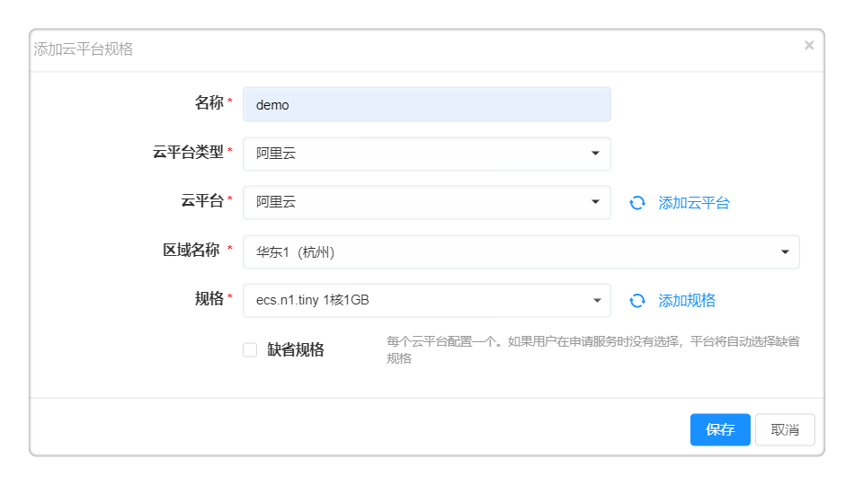

**计算规格**

计算规格定义了虚拟机的CPU和内存的配置规范（如：2核CPU，4G内存）。平台提供了内置的计算规格，您无需额外配置，可直接申请部署云资源，平台将会根据您选择的资源环境，读取云平台的可用规格。

您也可以创建新的计算规格，或为各个云平台指定特定的实例规格，供您和用户在部署虚拟机的时候进行选择，或由平台根据您的配置自动进行选择。详细步骤请参考下文。

进入菜单 基础设施 - 计算规格 ，可管理计算规格。在服务配置节点详细设置处可对计算节点做规格的配置。

>「Note」不同类型云平台的计算规格的配置方式有所不同，区别如下：
  -   私有云平台例如vSphere只需定义计算规格，不需要配置云平台规格
  -   OpenStack需要定义计算规格和云平台规格
  -   Azure、AWS、阿里云等公有云平台需要定义计算规格和云平台规格（针对每个公有云区域需要定义一个云平台规格）

# 添加计算规格

以下以新增阿里云云平台的计算规格为例：

1. 进入菜单 基础设施 - 计算规格 可管理计算规格。平台默认四种计算规格微型（1 vCPU，1GB内存）、小型（2 vCPU，4GB内存）、中型（4 vCPU，8GB内存）、大型（8 vCPU，16GB内存）。

2. 您也可以根据需要自定义计算规格类型：

  - 规格名称：阿里云计算规格
  - 资源类型：云主机
  - 授权：指定能够申请该计算规格的角色
  - CPU：指定vCPU数量
  - 内存：指定内存大小
  - 允许在申请时选择云平台中所有的规格：
     - 默认勾选，允许在申请服务时选择云平台中所有的可用规格。
     - 若不勾选，需要为每个区域关联一个云平台实例规格，供您在申请部署时选择。
  - 只允许选择CPU和内存符合以上配置的云平台规格：若勾选，只允许选择CPU和内存符合以上配置的云平台规格，则用户在申请部署云资源时候，将能够选择所有的符合该计算规格CPU和内存配置大小的实例类型（例如所有2 vCPU，4GB 内存的实例类型）。

  
   
3. 当您需要配置特定的规格供用户在申请部署时选择，请取消勾选 允许在申请时选择云平台中所有的规格 ，点击保存，进入云平台规格的标签页，请输入如下规格信息：

  - 云平台类型：阿里云
  - 区域名称：云平台对应的区域，例如：华东2（上海）
  - 规格：指定某个具体的规格或实例类型

4.  点击保存，就可以添加一个新的阿里云平台规格。

# 查看计算规格

进入计算规格页面，可以看到规格列表，表格中会列出当前已有的所有的计算规格。

在列表中，显示规格名称、资源类型、CPU、CPU单位、内存、内存单位、创建者、创建时间。

# 编辑计算规格

在列表中，点击规格名称，可对点击的计算规格进行编辑。

# 删除计算规格

在列表中也可以选中一个计算规格，点击删除按钮将选中的计算规格删除。如果该计算规格正在使用中将会提示不可删除。

