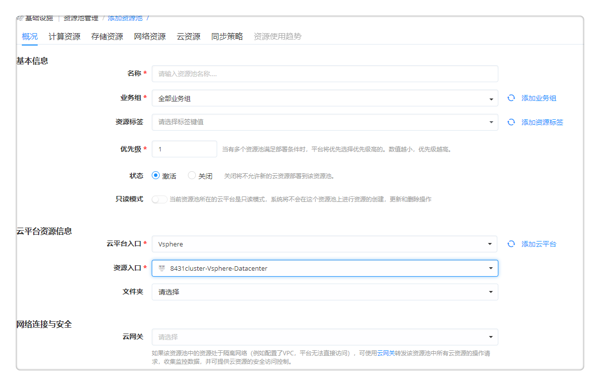
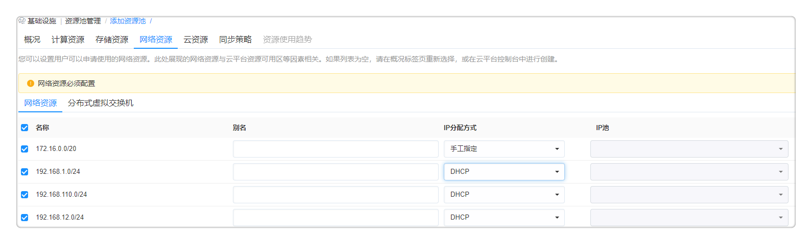
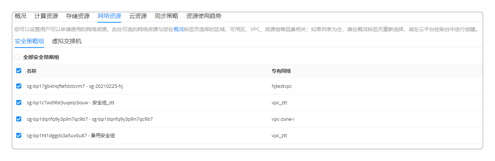
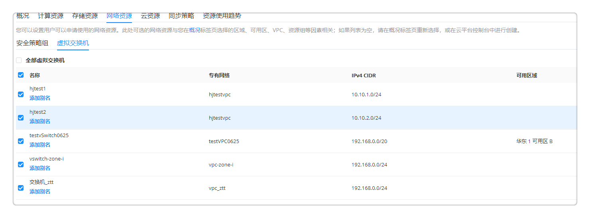
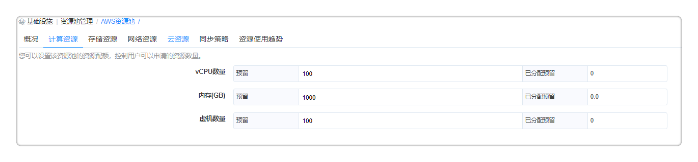
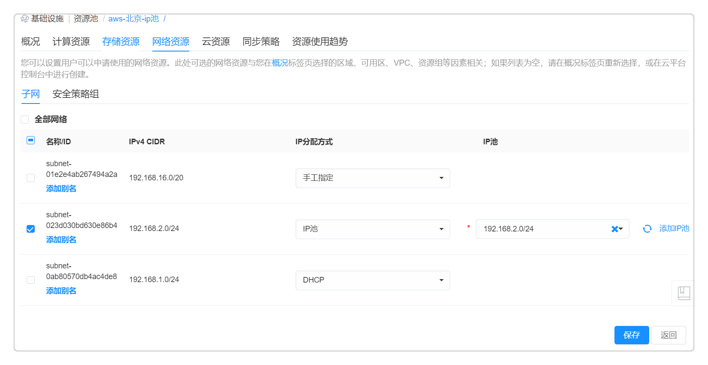
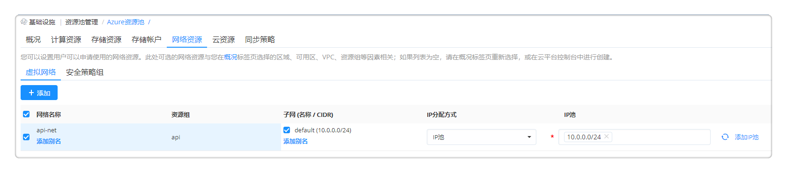
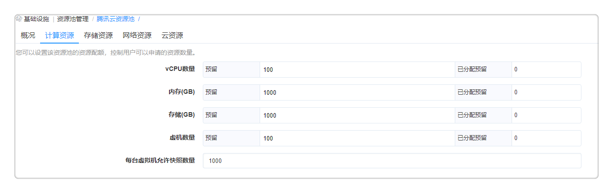
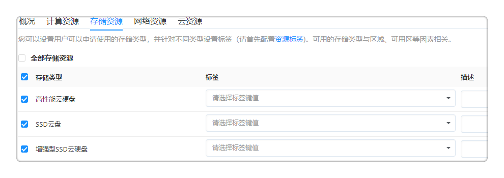
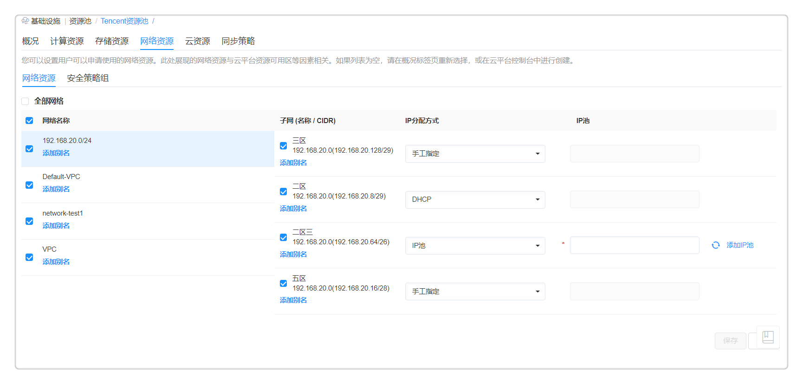

**资源池管理**

通过资源池，您可以指定私有云的主机或群集、或公有云的区域和可用区为资源入口，分配不同的基础设施资源（包括计算、存储、网络等等）给不同的组织或环境进行使用，并可以设定配额。资源池可分配给一个、多个或全部业务组，从而指定不同的组织和用户使用该云平台中的基础设施资源。

在后续的服务配置过程中，可以选择不同的资源池分配策略，手工进行指定，或由平台自动根据资源池的使用情况和指定的资源进行分配。

# 创建资源池

## 创建vSphere资源池 {#创建vSphere资源池}

在左边导航选择 基础设施 下的二级菜单 资源池管理。点击添加按钮，选择 vSphere ，会出现创建资源池界面。按照表单逐步填写相关信息，保存即可。

1.  概况标签页：

  + 名称：自定义资源池名称，请说明环境或者类型。

  + 业务组：为资源池关联一个或多个业务组，使得业务组内的用户可以申请资源池内的资源，您也可以在此解除资源池和业务组的绑定，如果业务组在该资源池中存在云资源，则无法解除绑定，请先删除业务组中的相关云资源。

  + 资源标签（选填）：您可以为所管理的资源池设置资源标签，注明资源池的不同用途和属性，从而让用户在申请服务的时候进行筛选和指定，快速筛选匹配资源池。如果需要了解如何创建和配置资源标签，请您参考[资源标签](https://cloudchef.github.io/doc/AdminDoc/03基础设施管理/资源标签.html)。

  + 优先级：用于帮助指定资源池选择策略，当有多个资源池满足部署条件时，平台将优先选择优先级高的。数值越小，优先级越高。

  + 状态：选择激活或者关闭该资源池。关闭将不允许新的云资源部署到该资源池。

  + 只读模式：显示该资源池所属云平台的模式。若所属云平台为只读模式，系统将不会在这个资源池上进行资源的创建，更新和删除操作。请在云平台详情页修改该云平台模式。

  + 云平台资源信息：选择云平台入口（选择已创建的vSphere云平台），资源入口，文件夹（选填）。
      - 资源入口：选择vCenter中的某个集群或主机（包含集群和不在集群中的物理主机）
      - 文件夹 （选填）：选择vCenter中的虚拟机和模板文件夹，从而指定通过这个资源池部署的虚拟机的存放位置。

  + 扩展属性表单（自定义）：支持为资源池配置扩展属性表单，具体请参考[扩展属性](https://cloudchef.github.io/doc/AdminDoc/09系统管理/#扩展属性)章节。配置后，在资源池的概况标签页可以填写表单所需的扩展属性项，自定义的属性可在资源池列表进行展示并作为检索条件进行搜索。

  

2.  计算资源标签页：

  + 资源入口信息：可查看您所选择作为资源入口的群集和主机信息。

  + 物理主机信息：vCenter中宿主机的详细信息。

  + 计算资源：
      * 资源配额（选填）：可设置本资源池最大允许部署的vCPU、内存及虚机数量以及每台虚机允许快照数量，留空为无限制。
      * vSphere资源池（选填）：指定vCenter中的资源池，从而将平台资源池与vCenter资源池进行映射，直接使用vCenter资源池中的配置进行配额管理。
      * 宿主机选择策略：
        - vSphere平台自动选择：平台将部署指令发送到vCenter，按照vCenter自身的资源选择逻辑进行部署。
        - 优先选择剩余物理内存最大的主机：静虚拟机部署到选择剩余物理内存最大的宿主机。
 

3.  存储资源标签页：设置用户可以申请使用的存储类型，并针对不同类型设置标签
      - 预留空间：选择预留给当前资源池的存储空间
      - 优先级：存储使用的优先级，数值小的会优先使用
  

4.  网络资源标签页：

  选择vCenter中的虚拟交换机或分布式虚拟机交换机，并进行设置：  

  * 别名：可给网络添加描述，在服务配置和申请时，将显示描述信息，方便选择；
  * IP分配方式：包括手工指定、IP池或DHCP。若IP分配方式选择IP池，则需要选择分配的IP池，请首先在 IP地址管理 中进行IP池和IP地址分配的设置；若IP分配方式选择手工指定，则在服务目录中请求服务，填写网络参数时，需要输入IP地址，网关和掩码；若IP分配方式选择DHCP,则自动获得服务器分配的IP地址和子网掩码。
  

5.  云资源标签页：展示该资源池中部署的云资源，包括导入和纳管的。点击导入按钮，可将已有的云资源导入到平台进行纳管。云资源导入详细步骤请参考：[云资源导入](https://cloudchef.github.io/doc/AdminDoc/14我的资源/云资源.html#云资源快速导入)。

6.  同步策略标签页：在资源池中设置同步策略，可定时同步vSphere中新增的资源。您可以在此界面添加、编辑、删除资源同步策略，并能够人工执行同步策略的操作。点击同步策略的名称，您可以查看该条策略的执行历史，并能取消执行正在同步和排队等待同步的策略。请参照以下步骤添加同步策略
    * 点击添加，进入同步策略配置界面
      * 同步配置：
        * 名称：输入同步策略名称。
        * 类别：选择同步对象的类别，包括IaaS、PaaS、CaaS、软件、代理等。
        * 类别：选择同步对象类型，包括Instance、Load Balancer、Target Group等。
      * 过滤方式：您可以选择匹配条件来指定策略对哪些资源进行同步，不满足任意一个条件的资源将不会在同步范围中
        * 键值标签：选择或输入键值标签。
        * 资源名称：使用正则表达式输入需要同步的资源名称。
        * 资源属性：您可以输入一个或多个资源属性过滤条件，每个资源属性由一组键值对组成。如输入多个过滤条件，则同时满足这些条件的资源才能被同步至平台进行管理。
      * 组织信息配置：
       * 业务组：指定导入资源所属的业务组。
       * 项目：指定导入资源所属的项目。
       * 所有者：指定导入资源所属的所有者。
      * 执行配置：
       * 启用定时：选择是否定时同步该条策略，启用后，系统将根据设置的定时策略，同步云平台资源
         * 重复周期：选择同步策略的重复周期，可选“每天”，“每周”或“每月”。
         * 执行时间：设置同步策略的执行时间，目前平台支持整点执行同步策略。

7.  点击保存，保存后在资源池列表出现添加成功的vSphere资源池。

## 创建vSphere with NSX资源池 {#创建vSphereWithNsx资源池}

添加vSphere with NSX资源池的前提是需要在vSphere云平台中关联VMware NSX。

在左边导航选择 基础设施 下的二级菜单 资源池管理。点击添加按钮，选择 vSphere ，会出现创建资源池界面。按照表单逐步填写相关信息，保存即可。

1.  概况标签页：

  + 名称：自定义资源池名称，请说明环境或者类型。

  + 业务组：为资源池关联一个或多个业务组，使得业务组内的用户可以申请资源池内的资源，您也可以在此解除资源池和业务组的绑定，如果业务组在该资源池中存在云资源，则无法解除绑定，请先删除业务组中的相关云资源。

  + 资源标签（选填）：您可以为所管理的资源池设置资源标签，注明资源池的不同用途和属性，从而让用户在申请服务的时候进行筛选和指定，快速筛选匹配资源池。如果需要了解如何创建和配置资源标签，请您参考[资源标签](https://cloudchef.github.io/doc/AdminDoc/03基础设施管理/资源标签.html)。

  + 优先级：用于帮助指定资源池选择策略，当有多个资源池满足部署条件时，平台将优先选择优先级高的。数值越小，优先级越高。

  + 状态：选择激活或者关闭该资源池。关闭将不允许新的云资源部署到该资源池。

  + 只读模式：显示该资源池所属云平台的模式。若所属云平台为只读模式，系统将不会在这个资源池上进行资源的创建，更新和删除操作。请在云平台详情页修改该云平台模式。

  + 云平台资源信息：选择云平台入口（选择已创建的vSphere云平台），资源入口，文件夹（选填）。
      - 资源入口：选择vCenter中的某个集群或主机（包含集群和不在集群中的物理主机）
      - 文件夹 （选填）：选择vCenter中的虚拟机和模板文件夹，从而指定通过这个资源池部署的虚拟机的存放位置。

  + VMware NSX传输区域：用于配置NSX逻辑交换机，若不选择，在网络资源标签页页面将不显示 NXS逻辑交换机 标签页

  + 扩展属性表单（自定义）：支持为资源池配置扩展属性表单，具体请参考[扩展属性](https://cloudchef.github.io/doc/AdminDoc/09系统管理/#扩展属性)章节。配置后，在资源池的概况标签页可以填写表单所需的扩展属性项，自定义的属性可在资源池列表进行展示并作为检索条件进行搜索。

2.  计算资源标签页：同上节的[vSphere资源池配置](#创建vsphere资源池)

3.  存储资源标签页：同上节的[vSphere资源池配置](#创建vsphere资源池)

4.  网络资源标签页：

  选择vCenter中的分布式虚拟机交换机或逻辑交换机，并进行设置：  
  * 别名：可给网络添加描述，在服务配置和申请时，将显示描述信息，方便选择；
  * IP分配方式：包括手工指定、IP池或DHCP。若IP分配方式选择IP池，则需要选择分配的IP池，请首先在 IP地址管理 中进行IP池和IP地址分配的设置；若IP分配方式选择手工指定，则在服务目录中请求服务，填写网络参数时，需要输入IP地址，网关和CIDR；若IP分配方式选择DHCP,则自动获得服务器分配的IP地址和子网掩码。
  * 安全策略组：选择应用于该资源池的安全策略组
  >「Note」网络资源和NSX逻辑交换机至少配置一种

5.  云资源标签页：展示该资源池中部署的云资源，包括导入和纳管的。点击导入按钮，可将已有的云资源导入到平台进行纳管。云资源导入详细步骤请参考：[云资源导入](https://cloudchef.github.io/doc/AdminDoc/14我的资源/云资源.html#云资源快速导入)。

6.  同步策略标签页：在资源池中设置同步策略，可定时同步vSphere中新增的资源。您可以在此界面添加、编辑、删除资源同步策略，并能够人工执行同步策略的操作。点击同步策略的名称，您可以查看该条策略的执行历史，并能取消执行正在同步和排队等待同步的策略。请参照以下步骤添加同步策略
    * 点击添加，进入同步策略配置界面
      * 同步配置：
        * 名称：输入同步策略名称。
        * 类别：选择同步对象的类别，包括IaaS、PaaS、CaaS、软件、代理等。
        * 类别：选择同步对象类型，包括Instance、Load Balancer、Target Group等。
      * 过滤方式：您可以选择匹配条件来指定策略对哪些资源进行同步，不满足任意一个条件的资源将不会在同步范围中
        * 键值标签：选择或输入键值标签。
        * 资源名称：使用正则表达式输入需要同步的资源名称。
        * 资源属性：您可以输入一个或多个资源属性过滤条件，每个资源属性由一组键值对组成。如输入多个过滤条件，则同时满足这些条件的资源才能被同步至平台进行管理。
      * 组织信息配置：
       * 业务组：指定导入资源所属的业务组。
       * 项目：指定导入资源所属的项目。
       * 所有者：指定导入资源所属的所有者。
      * 执行配置：
       * 启用定时：选择是否定时同步该条策略，启用后，系统将根据设置的定时策略，同步云平台资源
         * 重复周期：选择同步策略的重复周期，可选“每天”，“每周”或“每月”。
         * 执行时间：设置同步策略的执行时间，目前平台支持整点执行同步策略。

7.  点击保存，保存后在资源池列表出现添加成功的vSphere NSX资源池。

## 创建OpenStack资源池 {#添加openStack资源池}

在左边导航选择 基础设施 下的二级菜单 资源池管理。点击添加按钮，选择 OpenStack ，会出现创建资源池界面。按照表单逐步填写相关信息，保存即可。

1. 概况标签页：

  + 名称：自定义资源池名称，请说明环境或者类型。
  + 业务组：为资源池关联一个或多个业务组，使得业务组内的用户可以申请资源池内的资源，您也可以在此解除资源池和业务组的绑定，如果业务组在该资源池中存在云资源，则无法解除绑定，请先删除业务组中的相关云资源。
  + 资源标签（选填）：您可以为所管理的资源池设置资源标签，注明资源池的不同用途和属性，从而让用户在申请服务的时候进行筛选和指定，快速筛选匹配资源池。如果需要了解如何创建和配置资源标签，请您参考[资源标签](https://cloudchef.github.io/doc/AdminDoc/03基础设施管理/资源标签.html)。
  + 优先级：用于帮助指定资源池选择策略，当有多个资源池满足部署条件时，平台将优先选择优先级高的。数值越小，优先级越高。
  + 状态：选择激活或者关闭该资源池。关闭将不允许新的云资源部署到该资源池。
  + 只读模式：显示该资源池所属云平台的模式。若所属云平台为只读模式，系统将不会在这个资源池上进行资源的创建，更新和删除操作。请在云平台详情页修改该云平台模式。
  + 云平台资源信息：选择云平台入口（选择已创建的OpenStack云平台），可用区及DNS域。
      * 可用区：选择云平台入口后出现对应的可用区，可多选。
      * DNS域：根据 系统管理 - 系统配置 中添加的DNS域，可选择为资源池添加一个或多个DNS域。
  >「Note」 DNS域需要都是用户DNS域名的子域名
  + 扩展属性表单（自定义）：支持为资源池配置扩展属性表单，具体请参考[扩展属性](https://cloudchef.github.io/doc/AdminDoc/09系统管理/#扩展属性)章节。配置后，在资源池的概况标签页可以填写表单所需的扩展属性项，自定义的属性可在资源池列表进行展示并作为检索条件进行搜索。

2. 计算资源标签页：设置本资源池最大允许部署的vCPU、内存、存储、虚机数量、浮动IP数量及每台虚拟机允许快照数量，留空为无限制。针对每个磁盘类型, 都可以配置一个存储标签。
    >「Note」支持openStack的浮动IP单独部署，部署完成后可在 我的资源 - 云资源 - 网络资源标签页- FloatingIP 中查看。若部署时候创建的FloatingIP数量超过资源池规定的FloatingIP数量时，会部署失败。

3. 存储资源标签页：设置用户可以申请使用的存储类型，并针对不同类型设置标签
      - 预留空间：选择预留给当前资源池的存储空间
      - 优先级：存储使用的优先级，数值小的会优先使用

4. 网络资源标签页：指定用户可以选择使用的网络资源和安全策略组。若列表显示为空，请在OpenStack控制台上创建。
  -   虚拟网络标签页：
      * 别名：可给网络添加描述，在服务配置和申请时，将显示描述信息，方便选择；
      * IP分配方式：包括手工指定、IP池或DHCP。若IP分配方式选择IP池，则需要选择分配的IP池，请首先在 IP地址管理 中进行IP池和IP地址分配的设置；若IP分配方式选择手工指定，则在服务目录中请求服务，填写网络参数时，需要输入IP地址，网关和CIDR；若IP分配方式选择DHCP,则自动获得服务器分配的IP地址和子网掩码。

  -   安全策略组标签页：可选择一个或多个安全策略组，网络资源和安全策略组必须配置

  -   防火墙标签页：可查看当前云平台下的防火墙名称、描述、策略、关联路由、状态（运行中、非激活），可选择一个或多个防火墙

5. 在路由标签页可指定路由（选填）（若需要配置防火墙，则需要在此选择路由）

6.  云资源标签页：展示该资源池中部署的云资源，包括导入和纳管的。点击导入按钮，可将已有的云资源导入到平台进行纳管。云资源导入详细步骤请参考：[云资源导入](https://cloudchef.github.io/doc/AdminDoc/14我的资源/云资源.html#云资源快速导入)。

7. 同步策略标签页：在资源池中设置同步策略，可定时同步OpenStack中新增的资源。您可以在此界面添加、编辑、删除资源同步策略，并能够人工执行同步策略的操作。点击同步策略的名称，您可以查看该条策略的执行历史，并能取消执行正在同步和排队等待同步的策略。请参照以下步骤添加同步策略
        * 名称：输入同步策略名称。
        * 类别：选择同步对象的类别，包括IaaS、PaaS、CaaS、软件、代理等。
        * 类别：选择同步对象类型，包括Instance、Load Balancer、Target Group等。
      * 过滤方式：您可以选择匹配条件来指定策略对哪些资源进行同步，不满足任意一个条件的资源将不会在同步范围中
        * 键值标签：选择或输入键值标签。
        * 资源名称：使用正则表达式输入需要同步的资源名称。
        * 资源属性：您可以输入一个或多个资源属性过滤条件，每个资源属性由一组键值对组成。如输入多个过滤条件，则同时满足这些条件的资源才能被同步至平台进行管理。
      * 组织信息配置：
       * 业务组：指定导入资源所属的业务组。
       * 项目：指定导入资源所属的项目。
       * 所有者：指定导入资源所属的所有者。
      * 执行配置：
       * 启用定时：选择是否定时同步该条策略，启用后，系统将根据设置的定时策略，同步云平台资源
         * 重复周期：选择同步策略的重复周期，可选“每天”，“每周”或“每月”。
         * 执行时间：设置同步策略的执行时间，目前平台支持整点执行同步策略。

8. 点击保存，OpenStack资源池创建成功。

## 创建华为云资源池 

在左边导航选择 基础设施 下的二级菜单 资源池管理。点击添加按钮，选择 Huawei Cloud ，会出现创建资源池界面。按照表单逐步填写相关信息，保存即可。

1.  概况标签页：

  + 名称：自定义资源池名称，请说明环境或者类型。
  + 业务组：为资源池关联一个或多个业务组，使得业务组内的用户可以申请资源池内的资源，您也可以在此解除资源池和业务组的绑定，如果业务组在该资源池中存在云资源，则无法解除绑定，请先删除业务组中的相关云资源。
  + 资源标签（选填）：您可以为所管理的资源池设置资源标签，注明资源池的不同用途和属性，从而让用户在申请服务的时候进行筛选和指定，快速筛选匹配资源池。如果需要了解如何创建和配置资源标签，请您参考[资源标签](https://cloudchef.github.io/doc/AdminDoc/03基础设施管理/资源标签.html)。
  + 优先级：用于帮助指定资源池选择策略，当有多个资源池满足部署条件时，平台将优先选择优先级高的。数值越小，优先级越高。
  + 状态：选择激活或者关闭该资源池。关闭将不允许新的云资源部署到该资源池。
  + 只读模式：显示该资源池所属云平台的模式。若所属云平台为只读模式，系统将不会在这个资源池上进行资源的创建，更新和删除操作。请在云平台详情页修改该云平台模式。
  + 云平台资源信息：
    * 选择云平台入口（选择已创建的华为云云平台）。
    * 选择区域，可用区（选择区域后出现对应的可用区，可多选）。
        >「Note」支持在华为云资源池选择全部区域。该资源池可关联该平台全部区域、全部可用区、全部存储资源和全部网络资源。
  + 云网关：云网关可连接和转发隔离网络环境下的云资源操作请求与监控数据
  + 扩展属性表单（自定义）：支持为资源池配置扩展属性表单，具体请参考[扩展属性](https://cloudchef.github.io/doc/AdminDoc/09系统管理/#扩展属性)章节。配置后，在资源池的概况标签页可以填写表单所需的扩展属性项，自定义的属性可在资源池列表进行展示并作为检索条件进行搜索。

2. 计算资源标签页：设置本资源池最大允许部署的vCPU、内存、存储、虚机数量及每台虚拟机允许快照数量，留空为无限制。

3.  存储资源标签页：设置用户可以申请使用的存储类型，并针对不同类型设置标签。支持一键勾选全部存储资源，若在概况标签页“区域”选择“全部区域”、或某个区域选择“全部可用区”，则“存储资源”强制选择“全部存储资源”。

4.  网络资源标签页：指定用户可以选择使用的网络资源和安全策略组。若列表显示为空，请在华为云控制台上创建。支持一键勾选全部网络资源，若在概况标签页“区域”选择“全部区域”、或某个区域选择“全部可用区”，则“网络资源”强制选择“全部网络”和“全部安全策略组”。
  -   网络资源标签页：
      * 别名：可给网络添加描述，在服务配置和申请时，将显示描述信息，方便选择；
      * IP分配方式：包括手工指定、IP池或DHCP。若IP分配方式选择IP池，则需要选择分配的IP池，请首先在 IP地址管理 中进行IP池和IP地址分配的设置；若IP分配方式选择手工指定，则在服务目录中请求服务，填写网络参数时，需要输入IP地址，网关和CIDR；若IP分配方式选择DHCP,则自动获得服务器分配的IP地址和子网掩码。

  -   安全策略组标签页：可选择一个或多个安全策略组，网络资源和安全策略组必须配置

5.  云资源标签页：展示该资源池中部署的云资源，包括导入和纳管的。点击导入按钮，可将已有的云资源导入到平台进行纳管。云资源导入详细步骤请参考：[云资源导入](https://cloudchef.github.io/doc/AdminDoc/14我的资源/云资源.html#云资源快速导入)。

6.  同步策略标签页：在资源池中设置同步策略，可定时同步华为云中新增的资源。您可以在此界面添加、编辑、删除资源同步策略，并能够人工执行同步策略的操作。点击同步策略的名称，您可以查看该条策略的执行历史，并能取消执行正在同步和排队等待同步的策略。请参照以下步骤添加同步策略

    * 点击添加，进入同步策略配置界面
      * 同步配置：
        * 名称：输入同步策略名称。
        * 类别：选择同步对象的类别，包括IaaS、PaaS、CaaS、软件、代理等。
        * 类别：选择同步对象类型，包括Instance、Load Balancer、Target Group等。
      * 过滤方式：您可以选择匹配条件来指定策略对哪些资源进行同步，不满足任意一个条件的资源将不会在同步范围中
        * 键值标签：选择或输入键值标签。
        * 资源名称：使用正则表达式输入需要同步的资源名称。
        * 资源属性：您可以输入一个或多个资源属性过滤条件，每个资源属性由一组键值对组成。如输入多个过滤条件，则同时满足这些条件的资源才能被同步至平台进行管理。
      * 组织信息配置：
       * 业务组：指定导入资源所属的业务组。
       * 项目：指定导入资源所属的项目。
       * 所有者：指定导入资源所属的所有者。
      * 执行配置：
       * 启用定时：选择是否定时同步该条策略，启用后，系统将根据设置的定时策略，同步云平台资源
         * 重复周期：选择同步策略的重复周期，可选“每天”，“每周”或“每月”。
         * 执行时间：设置同步策略的执行时间，目前平台支持整点执行同步策略。

7.  点击保存，华为云资源池创建成功。

## 创建Kubernetes资源池 {#添加Kubernetes资源池}

1.  进入 基础设施 - 资源池管理 ，点击添加，选择Kubernetes，填写下列信息：

2.  概况标签页：

  + 名称：自定义资源池名称，请说明环境或者类型。

  + 业务组：为资源池关联一个或多个业务组，使得业务组内的用户可以申请资源池内的资源，您也可以在此解除资源池和业务组的绑定，如果业务组在该资源池中存在云资源，则无法解除绑定，请先删除业务组中的相关云资源。

  + 资源标签（选填）：您可以为所管理的资源池设置资源标签，注明资源池的不同用途和属性，从而让用户在申请服务的时候进行筛选和指定，快速筛选匹配资源池。如果需要了解如何创建和配置资源标签，请您参考[资源标签](https://cloudchef.github.io/doc/AdminDoc/03基础设施管理/资源标签.html)。

  + 优先级：用于帮助指定资源池选择策略，当有多个资源池满足部署条件时，平台将优先选择优先级高的。数值越小，优先级越高。

  + 状态：选择激活或者关闭该资源池。关闭将不允许新的云资源部署到该资源池。

  + 只读模式：显示该资源池所属云平台的模式。若所属云平台为只读模式，系统将不会在这个资源池上进行资源的创建，更新和删除操作。请在云平台详情页修改该云平台模式。

  + 云平台资源信息：
      * 选择云平台入口（选择已创建的Kubernetes云平台）。
      * 命名空间

  + 扩展属性表单（自定义）：支持为资源池配置扩展属性表单，具体请参考[扩展属性](https://cloudchef.github.io/doc/AdminDoc/09系统管理/#扩展属性)章节。配置后，在资源池的概况标签页可以填写表单所需的扩展属性项，自定义的属性可在资源池列表进行展示并作为检索条件进行搜索。

  

3.  计算资源标签页：设置本资源池最大允许部署的POD数量、CPU和内存数量，留空为无限制。
 
4.  点击保存，Kubernetes资源池创建成功。

## 创建阿里云资源池 {#添加阿里云资源池}

1.  进入 基础设施 - 资源池管理 ，点击添加，选择阿里云，填写下列信息：

2.  概况标签页：

  + 名称：自定义资源池名称，请说明环境或者类型。

  + 业务组：为资源池关联一个或多个业务组，使得业务组内的用户可以申请资源池内的资源，您也可以在此解除资源池和业务组的绑定，如果业务组在该资源池中存在云资源，则无法解除绑定，请先删除业务组中的相关云资源。

  + 资源标签（选填）：您可以为所管理的资源池设置资源标签，注明资源池的不同用途和属性，从而让用户在申请服务的时候进行筛选和指定，快速筛选匹配资源池。如果需要了解如何创建和配置资源标签，请您参考[资源标签](https://cloudchef.github.io/doc/AdminDoc/03基础设施管理/资源标签.html)。

  + 优先级：用于帮助指定资源池选择策略，当有多个资源池满足部署条件时，平台将优先选择优先级高的。数值越小，优先级越高。

  + 状态：选择激活或者关闭该资源池。关闭将不允许新的云资源部署到该资源池。

  + 只读模式：显示该资源池所属云平台的模式。若所属云平台为只读模式，系统将不会在这个资源池上进行资源的创建，更新和删除操作。请在云平台详情页修改该云平台模式。

  + 云平台资源信息：
      * 选择云平台入口（选择已创建的阿里云云平台）。
      * 选择区域，可用区（选择区域后出现对应的可用区，可多选）。
        >「Note」支持在阿里云资源池选择全部区域。该资源池可关联该平台全部区域、全部可用区、全部专有网络、全部存储资源和全部网络资源。
      * 资源组，选填，可选择阿里云中的资源组，从而将用户在本资源池中申请部署的资源在阿里云上分配到指定的资源组。
      * 网络类型，推荐选择专有网络，选择需要使用的VPC（若列表中下拉为空，请在阿里云控制台上创建VPC）。支持选择一个或多个VPC或一键勾选全部专有网络，若在“区域”选择“全部区域”，则“专有网络”强制选择“全部专有网络”
  
  + 扩展属性表单（自定义）：支持为资源池配置扩展属性表单，具体请参考[扩展属性](https://cloudchef.github.io/doc/AdminDoc/09系统管理/#扩展属性)章节。配置后，在资源池的概况标签页可以填写表单所需的扩展属性项，自定义的属性可在资源池列表进行展示并作为检索条件进行搜索。

  

3.  计算资源标签页：设置本资源池最大允许部署的vCPU、内存及虚机数量，留空为无限制。

 

4.  存储资源标签页：设置用户可以申请使用的存储类型，并针对不同类型设置标签。支持一键勾选全部存储资源，若在概况标签页“区域”选择“全部区域”、或某个区域选择“全部可用区”，则“存储资源”强制选择“全部存储资源”。
 

5.  网络资源标签页：指定用户可以选择使用的安全组和虚拟交换机。若列表显示为空，请在阿里云控制台上创建。支持一键勾选全部网络资源，若在概况标签页“区域”选择“全部区域”、或“专有网络”选择“全部专有网络”，则“网络资源”强制选择“全部安全策略组”和“全部虚拟交换机”。

  + 安全策略组：
     

  + 虚拟交换机：若选择专有网络，需要选择虚拟交换机。可给虚拟交换机添加别名，在服务配置、申请和审批时，将显示别名，方便选择。
     

6.  云资源标签页：展示该资源池中部署的云资源，包括导入和纳管的。点击导入按钮，可将已有的云资源导入到平台进行纳管。云资源导入详细步骤请参考：[云资源导入](https://cloudchef.github.io/doc/AdminDoc/14我的资源/云资源.html#云资源快速导入)。

7.  同步策略标签页：在资源池中设置同步策略，可定时同步阿里云中新增的资源。您可以在此界面添加、编辑、删除资源同步策略，并能够人工执行同步策略的操作。点击同步策略的名称，您可以查看该条策略的执行历史，并能取消执行正在同步和排队等待同步的策略。请参照以下步骤添加同步策略

    * 点击添加，进入同步策略配置界面
      * 同步配置：
        * 名称：输入同步策略名称。
        * 类别：选择同步对象的类别，包括IaaS、PaaS、CaaS、软件、代理等。
        * 类别：选择同步对象类型，包括Instance、Load Balancer、Target Group等。
      * 过滤方式：您可以选择匹配条件来指定策略对哪些资源进行同步，不满足任意一个条件的资源将不会在同步范围中
        * 键值标签：选择或输入键值标签。
        * 资源名称：使用正则表达式输入需要同步的资源名称。
        * 资源属性：您可以输入一个或多个资源属性过滤条件，每个资源属性由一组键值对组成。如输入多个过滤条件，则同时满足这些条件的资源才能被同步至平台进行管理。
      * 组织信息配置：
       * 业务组：指定导入资源所属的业务组。
       * 项目：指定导入资源所属的项目。
       * 所有者：指定导入资源所属的所有者。
      * 执行配置：
       * 启用定时：选择是否定时同步该条策略，启用后，系统将根据设置的定时策略，同步云平台资源
         * 重复周期：选择同步策略的重复周期，可选“每天”，“每周”或“每月”。
         * 执行时间：设置同步策略的执行时间，目前平台支持整点执行同步策略。

8. 点击保存，阿里云资源池创建成功。

## 创建AWS资源池 {#添加AWS资源池}

1.  进入 基础设施 - 资源池管理 ，点击添加，选择AWS，填写下列信息：

2.  概况标签页：

  + 名称：自定义资源池名称，请说明环境或者类型。

  + 业务组：为资源池关联一个或多个业务组，使得业务组内的用户可以申请资源池内的资源，您也可以在此解除资源池和业务组的绑定，如果业务组在该资源池中存在云资源，则无法解除绑定，请先删除业务组中的相关云资源。

  + 资源标签（选填）：您可以为所管理的资源池设置资源标签，注明资源池的不同用途和属性，从而让用户在申请服务的时候进行筛选和指定，快速筛选匹配资源池。如果需要了解如何创建和配置资源标签，请您参考[资源标签](https://cloudchef.github.io/doc/AdminDoc/03基础设施管理/资源标签.html)。

  + 优先级：用于帮助指定资源池选择策略，当有多个资源池满足部署条件时，平台将优先选择优先级高的。数值越小，优先级越高。

  + 状态：选择激活或者关闭该资源池。关闭将不允许新的云资源部署到该资源池。

  + 只读模式：显示该资源池所属云平台的模式。若所属云平台为只读模式，系统将不会在这个资源池上进行资源的创建，更新和删除操作。请在云平台详情页修改该云平台模式。

  + 云平台资源信息：
      * 选择云平台入口（选择已创建的AWS云平台）。
      * 选择区域，可用区（选择区域后出现对应的可用区，可多选）。
        >「Note」支持在AWS资源池选择全部区域。该资源池可关联该平台全部区域、全部可用区、全部专有网络、全部存储资源和全部网络资源。
      * VPC网络：选择需要使用的专有网络（若列表中下拉为空，请在AWS控制台上创建VPC）。支持选择一个或多个VPC或一键勾选全部专有网络，若在“区域”选择“全部区域”，则“VPC网络”强制选择“全部专有网络”

  + 扩展属性表单（自定义）：支持为资源池配置扩展属性表单，具体请参考[扩展属性](https://cloudchef.github.io/doc/AdminDoc/09系统管理/#扩展属性)章节。配置后，在资源池的概况标签页可以填写表单所需的扩展属性项，自定义的属性可在资源池列表进行展示并作为检索条件进行搜索。

    

3.  计算资源标签页：设置本资源池最大允许部署的vCPU、内存及虚机数量，留空为无限制。
  

4.  存储资源标签页：设置用户可以申请使用的存储类型，并针对不同类型设置标签。支持一键勾选全部存储资源，若在概况标签页“区域”选择“全部区域”、或某个区域选择“全部可用区”，则“存储资源”强制选择“全部存储资源”。
  

5.  网络资源标签页：指定用户可以选择使用的子网和安全策略组。若列表显示为空，请在AWS控制台上创建。可给子网添加别名，在服务配置、申请和审批时，将显示别名，方便选择。支持一键勾选全部网络资源，若在概况标签页“区域”选择“全部区域”、或某个区域选择“全部可用区”、或“VPC网络”选择“全部专有网络”，则“网络资源”强制选择“全部子网”和“全部安全策略组”。

   * 别名：可给网络添加描述，在服务配置和申请时，将显示描述信息，方便选择；
   * IP分配方式：包括手工指定、IP池或DHCP。若IP分配方式选择IP池，则需要选择分配的IP池，请首先在 IP地址管理 中进行IP池和IP地址分配的设置；若IP分配方式选择手工指定，则在服务目录中请求服务，填写网络参数时，需要输入IP地址，网关和掩码；若IP分配方式选择DHCP,则自动获得服务器分配的IP地址和子网掩码。
  

6.  云资源标签页：展示该资源池中部署的云资源，包括导入和纳管的。点击导入按钮，可将已有的云资源导入到平台进行纳管。云资源导入详细步骤请参考：[云资源导入](https://cloudchef.github.io/doc/AdminDoc/14我的资源/云资源.html#云资源快速导入)。

7.  同步策略标签页：在资源池中设置同步策略，可定时同步AWS中新增的资源。您可以在此界面添加、编辑、删除资源同步策略，并能够人工执行同步策略的操作。点击同步策略的名称，您可以查看该条策略的执行历史，并能取消执行正在同步和排队等待同步的策略。请参照以下步骤添加同步策略

    * 点击添加，进入同步策略配置界面
      * 同步配置：
        * 名称：输入同步策略名称。
        * 类别：选择同步对象的类别，包括IaaS、PaaS、CaaS、软件、代理等。
        * 类别：选择同步对象类型，包括Instance、Load Balancer、Target Group等。
      * 过滤方式：您可以选择匹配条件来指定策略对哪些资源进行同步，不满足任意一个条件的资源将不会在同步范围中
        * 键值标签：选择或输入键值标签。
        * 资源名称：使用正则表达式输入需要同步的资源名称。
        * 资源属性：您可以输入一个或多个资源属性过滤条件，每个资源属性由一组键值对组成。如输入多个过滤条件，则同时满足这些条件的资源才能被同步至平台进行管理。
      * 组织信息配置：
       * 业务组：指定导入资源所属的业务组。
       * 项目：指定导入资源所属的项目。
       * 所有者：指定导入资源所属的所有者。
      * 执行配置：
       * 启用定时：选择是否定时同步该条策略，启用后，系统将根据设置的定时策略，同步云平台资源
         * 重复周期：选择同步策略的重复周期，可选“每天”，“每周”或“每月”。
         * 执行时间：设置同步策略的执行时间，目前平台支持整点执行同步策略。

8.  点击保存，AWS资源池创建成功。

## 创建Azure资源池 {#添加Azure资源池}

1.  进入 基础设施 - 资源池管理 ，点击添加，选择Azure，填写下列信息：

2.  概况标签页：

  + 名称：自定义资源池名称，请说明环境或者类型。

  + 业务组：为资源池关联一个或多个业务组，使得业务组内的用户可以申请资源池内的资源，您也可以在此解除资源池和业务组的绑定，如果业务组在该资源池中存在云资源，则无法解除绑定，请先删除业务组中的相关云资源。

  + 资源标签（选填）：您可以为所管理的资源池设置资源标签，注明资源池的不同用途和属性，从而让用户在申请服务的时候进行筛选和指定，快速筛选匹配资源池。如果需要了解如何创建和配置资源标签，请您参考[资源标签](https://cloudchef.github.io/doc/AdminDoc/03基础设施管理/资源标签.html)。

  + 优先级：用于帮助指定资源池选择策略，当有多个资源池满足部署条件时，平台将优先选择优先级高的。数值越小，优先级越高。

  + 状态：选择激活或者关闭该资源池。关闭将不允许新的云资源部署到该资源池。

  + 只读模式：显示该资源池所属云平台的模式。若所属云平台为只读模式，系统将不会在这个资源池上进行资源的创建，更新和删除操作。请在云平台详情页修改该云平台模式。

  + 云平台资源信息：
      * 选择云平台入口（选择已创建的Azure云平台）。
      * 选择区域。
      * 订阅ID: 创建和使用Azure服务产生的ID
      * 资源组，选填，可选择Azure中的资源组，从而将用户在本资源池中申请部署的资源在Azure上分配到指定的资源组。

  + 扩展属性表单（自定义）：支持为资源池配置扩展属性表单，具体请参考[扩展属性](https://cloudchef.github.io/doc/AdminDoc/09系统管理/#扩展属性)章节。配置后，在资源池的概况标签页可以填写表单所需的扩展属性项，自定义的属性可在资源池列表进行展示并作为检索条件进行搜索。

  

3.  计算资源标签页：设置本资源池最大允许部署的vCPU、内存及虚机数量，留空为无限制。
  

4.  存储资源标签页：设置用户可以申请使用的存储类型，并针对不同类型设置标签
  

5.  网络资源标签页：指定用户可以选择使用的虚拟网络和安全策略组。若列表显示为空，请在Azure控制台上创建。

  + 虚拟网络：选择子网及IP分配方式：包括手工指定、IP池或DHCP。若IP分配方式选择IP池，则需要选择分配的IP池，请首先在 IP地址管理 中进行IP池和IP地址分配的设置；若IP分配方式选择手工指定，则在服务目录中请求服务，填写网络参数时，需要输入IP地址，网关和CIDR；若IP分配方式选择DHCP,则自动获得服务器分配的IP地址和子网掩码。

      支持给虚拟网络添加别名，在服务配置、申请和审批时，将显示别名，方便选择。
      

  + 安全策略组：
      

6.  存储账户标签页：添加Azure存储账户。

7.  云资源标签页：展示该资源池中部署的云资源，包括导入和纳管的。点击导入按钮，可将已有的云资源导入到平台进行纳管。云资源导入详细步骤请参考：[云资源导入](https://cloudchef.github.io/doc/AdminDoc/14我的资源/云资源.html#云资源快速导入)。

8.  同步策略标签页：在资源池中设置同步策略，可定时同步Azure中新增的资源。您可以在此界面添加、编辑、删除资源同步策略，并能够人工执行同步策略的操作。点击同步策略的名称，您可以查看该条策略的执行历史，并能取消执行正在同步和排队等待同步的策略。请参照以下步骤添加同步策略

    * 点击添加，进入同步策略配置界面
      * 同步配置：
        * 名称：输入同步策略名称。
        * 类别：选择同步对象的类别，包括IaaS、PaaS、CaaS、软件、代理等。
        * 类别：选择同步对象类型，包括Instance、Load Balancer、Target Group等。
      * 过滤方式：您可以选择匹配条件来指定策略对哪些资源进行同步，不满足任意一个条件的资源将不会在同步范围中
        * 键值标签：选择或输入键值标签。
        * 资源名称：使用正则表达式输入需要同步的资源名称。
        * 资源属性：您可以输入一个或多个资源属性过滤条件，每个资源属性由一组键值对组成。如输入多个过滤条件，则同时满足这些条件的资源才能被同步至平台进行管理。
      * 组织信息配置：
       * 业务组：指定导入资源所属的业务组。
       * 项目：指定导入资源所属的项目。
       * 所有者：指定导入资源所属的所有者。
      * 执行配置：
       * 启用定时：选择是否定时同步该条策略，启用后，系统将根据设置的定时策略，同步云平台资源
         * 重复周期：选择同步策略的重复周期，可选“每天”，“每周”或“每月”。
         * 执行时间：设置同步策略的执行时间，目前平台支持整点执行同步策略。

9.  点击保存，Azure资源池创建成功.

## 创建谷歌云资源池

1.  进入 基础设施 - 资源池管理 ，点击添加，选择谷歌云，填写下列信息：

2.  概况标签页：

  + 名称：自定义资源池名称，请说明环境或者类型。

  + 业务组：为资源池关联一个或多个业务组，使得业务组内的用户可以申请资源池内的资源，您也可以在此解除资源池和业务组的绑定，如果业务组在该资源池中存在云资源，则无法解除绑定，请先删除业务组中的相关云资源。

  + 资源标签（选填）：您可以为所管理的资源池设置资源标签，注明资源池的不同用途和属性，从而让用户在申请服务的时候进行筛选和指定，快速筛选匹配资源池。如果需要了解如何创建和配置资源标签，请您参考[资源标签](https://cloudchef.github.io/doc/AdminDoc/03基础设施管理/资源标签.html)。

  + 优先级：用于帮助指定资源池选择策略，当有多个资源池满足部署条件时，平台将优先选择优先级高的。数值越小，优先级越高。

  + 状态：选择激活或者关闭该资源池。关闭将不允许新的云资源部署到该资源池。

  + 只读模式：显示该资源池所属云平台的模式。若所属云平台为只读模式，系统将不会在这个资源池上进行资源的创建，更新和删除操作。请在云平台详情页修改该云平台模式。

  + 云平台资源信息：选择云平台入口（选择已创建的谷歌云云平台）。

  + 扩展属性表单（自定义）：支持为资源池配置扩展属性表单，具体请参考[扩展属性](https://cloudchef.github.io/doc/AdminDoc/09系统管理/#扩展属性)章节。配置后，在资源池的概况标签页可以填写表单所需的扩展属性项，自定义的属性可在资源池列表进行展示并作为检索条件进行搜索。

3.  计算资源标签页：设置本资源池最大允许部署的vCPU、内存及虚机数量，留空为无限制。

4.  存储资源标签页：设置用户可以申请使用的存储类型，并针对不同类型设置标签

5.  网络资源标签页：指定用户可以选择使用的安全组和虚拟交换机。若列表显示为空，请在谷歌云控制台上创建。

6.  云资源标签页：展示该资源池中部署的云资源，包括导入和纳管的。点击导入按钮，可将已有的云资源导入到平台进行纳管。云资源导入详细步骤请参考：[云资源导入](https://cloudchef.github.io/doc/AdminDoc/14我的资源/云资源.html#云资源快速导入)。

7.  同步策略标签页：在资源池中设置同步策略，可定时同步谷歌云中新增的资源。您可以在此界面添加、编辑、删除资源同步策略，并能够人工执行同步策略的操作。点击同步策略的名称，您可以查看该条策略的执行历史，并能取消执行正在同步和排队等待同步的策略。请参照以下步骤添加同步策略
    * 点击添加，进入同步策略配置界面
      * 同步配置：
        * 名称：输入同步策略名称。
        * 类别：选择同步对象的类别，包括IaaS、PaaS、CaaS、软件、代理等。
        * 类别：选择同步对象类型，包括Instance、Load Balancer、Target Group等。
      * 过滤方式：您可以选择匹配条件来指定策略对哪些资源进行同步，不满足任意一个条件的资源将不会在同步范围中
        * 键值标签：选择或输入键值标签。
        * 资源名称：使用正则表达式输入需要同步的资源名称。
        * 资源属性：您可以输入一个或多个资源属性过滤条件，每个资源属性由一组键值对组成。如输入多个过滤条件，则同时满足这些条件的资源才能被同步至平台进行管理。
      * 组织信息配置：
       * 业务组：指定导入资源所属的业务组。
       * 项目：指定导入资源所属的项目。
       * 所有者：指定导入资源所属的所有者。
      * 执行配置：
       * 启用定时：选择是否定时同步该条策略，启用后，系统将根据设置的定时策略，同步云平台资源
         * 重复周期：选择同步策略的重复周期，可选“每天”，“每周”或“每月”。
         * 执行时间：设置同步策略的执行时间，目前平台支持整点执行同步策略。

8. 点击保存，谷歌云资源池创建成功。

## 创建腾讯云资源池 {#添加腾讯云资源池}

1.  进入 基础设施 - 资源池管理 ，点击添加，选择腾讯云，填写下列信息：

2.  概况标签页：

  + 名称：自定义资源池名称，请说明环境或者类型。

  + 业务组：为资源池关联一个或多个业务组，使得业务组内的用户可以申请资源池内的资源，您也可以在此解除资源池和业务组的绑定，如果业务组在该资源池中存在云资源，则无法解除绑定，请先删除业务组中的相关云资源。

  + 资源标签（选填）：您可以为所管理的资源池设置资源标签，注明资源池的不同用途和属性，从而让用户在申请服务的时候进行筛选和指定，快速筛选匹配资源池。如果需要了解如何创建和配置资源标签，请您参考[资源标签](https://cloudchef.github.io/doc/AdminDoc/03基础设施管理/资源标签.html)。

  + 优先级：用于帮助指定资源池选择策略，当有多个资源池满足部署条件时，平台将优先选择优先级高的。数值越小，优先级越高。

  + 状态：选择激活或者关闭该资源池。关闭将不允许新的云资源部署到该资源池。

  + 只读模式：显示该资源池所属云平台的模式。若所属云平台为只读模式，系统将不会在这个资源池上进行资源的创建，更新和删除操作。请在云平台详情页修改该云平台模式。

  + 云平台资源信息：
      * 选择云平台入口（选择已创建的腾讯云云平台）。
      * 选择区域，可用区（选择区域后出现对应的可用区，可多选）。
        >「Note」支持在腾讯云资源池选择全部区域。该资源池可关联该平台全部区域、全部可用区、全部存储资源和全部网络资源。
  
  + 扩展属性表单（自定义）：支持为资源池配置扩展属性表单，具体请参考[扩展属性](https://cloudchef.github.io/doc/AdminDoc/09系统管理/#扩展属性)章节。配置后，在资源池的概况标签页可以填写表单所需的扩展属性项，自定义的属性可在资源池列表进行展示并作为检索条件进行搜索。

  

3.  计算资源标签页：设置本资源池最大允许部署的vCPU、内存及虚机数量，留空为无限制。
  

4.  存储资源标签页：设置用户可以申请使用的存储类型，并针对不同类型设置标签。支持一键勾选全部存储资源，若在概况标签页“区域”选择“全部区域”、或某个区域选择“全部可用区”，则“存储资源”强制选择“全部存储资源”。
  

5.  网络资源标签页：指定用户可以选择使用的虚拟网络。若列表显示为空，请在腾讯云控制台上创建。支持一键勾选全部网络资源，若在概况标签页“区域”选择“全部区域”、或某个区域选择“全部可用区”，则“网络资源”强制选择“全部网络”和“全部安全策略组”。

  + IP分配方式：包括手工指定、IP池或DHCP。若IP分配方式选择IP池，则需要选择分配的IP池，请首先在 IP地址管理 中进行IP池和IP地址分配的设置；若IP分配方式选择手工指定，则在服务目录中请求服务，填写网络参数时，需要输入IP地址，网关和CIDR；若IP分配方式选择DHCP,则自动获得服务器分配的IP地址和子网掩码。
  + 支持给网络资源添加别名，在服务配置、申请和审批时，将显示别名，方便选择。
  

6.  云资源标签页：展示该资源池中部署的云资源，包括导入和纳管的。点击导入按钮，可将已有的云资源导入到平台进行纳管。云资源导入详细步骤请参考：[云资源导入](https://cloudchef.github.io/doc/AdminDoc/14我的资源/云资源.html#云资源快速导入)。

7.  同步策略标签页：在资源池中设置同步策略，可定时同步腾讯云中新增的资源。您可以在此界面添加、编辑、删除资源同步策略，并能够人工执行同步策略的操作。点击同步策略的名称，您可以查看该条策略的执行历史，并能取消执行正在同步和排队等待同步的策略。请参照以下步骤添加同步策略

    * 点击添加，进入同步策略配置界面
      * 同步配置：
        * 名称：输入同步策略名称。
        * 类别：选择同步对象的类别，包括IaaS、PaaS、CaaS、软件、代理等。
        * 类别：选择同步对象类型，包括Instance、Load Balancer、Target Group等。
      * 过滤方式：您可以选择匹配条件来指定策略对哪些资源进行同步，不满足任意一个条件的资源将不会在同步范围中
        * 键值标签：选择或输入键值标签。
        * 资源名称：使用正则表达式输入需要同步的资源名称。
        * 资源属性：您可以输入一个或多个资源属性过滤条件，每个资源属性由一组键值对组成。如输入多个过滤条件，则同时满足这些条件的资源才能被同步至平台进行管理。
      * 组织信息配置：
       * 业务组：指定导入资源所属的业务组。
       * 项目：指定导入资源所属的项目。
       * 所有者：指定导入资源所属的所有者。
      * 执行配置：
       * 启用定时：选择是否定时同步该条策略，启用后，系统将根据设置的定时策略，同步云平台资源
         * 重复周期：选择同步策略的重复周期，可选“每天”，“每周”或“每月”。
         * 执行时间：设置同步策略的执行时间，目前平台支持整点执行同步策略。

8. 点击保存，腾讯云资源池创建成功。

## 创建UCloud资源池

1.  进入 基础设施 - 资源池管理 ，点击添加，选择UCloud，填写下列信息：

2.  概况标签页：

  + 名称：自定义资源池名称，请说明环境或者类型。

  + 业务组：为资源池关联一个或多个业务组，使得业务组内的用户可以申请资源池内的资源，您也可以在此解除资源池和业务组的绑定，如果业务组在该资源池中存在云资源，则无法解除绑定，请先删除业务组中的相关云资源。

  + 资源标签（选填）：您可以为所管理的资源池设置资源标签，注明资源池的不同用途和属性，从而让用户在申请服务的时候进行筛选和指定，快速筛选匹配资源池。如果需要了解如何创建和配置资源标签，请您参考[资源标签](https://cloudchef.github.io/doc/AdminDoc/03基础设施管理/资源标签.html)。

  + 优先级：用于帮助指定资源池选择策略，当有多个资源池满足部署条件时，平台将优先选择优先级高的。数值越小，优先级越高。

  + 状态：选择激活或者关闭该资源池。关闭将不允许新的云资源部署到该资源池。

  + 只读模式：显示该资源池所属云平台的模式。若所属云平台为只读模式，系统将不会在这个资源池上进行资源的创建，更新和删除操作。请在云平台详情页修改该云平台模式。

  + 云平台资源信息：选择云平台入口（选择已创建的UCloud云平台）。

  + 扩展属性表单（自定义）：支持为资源池配置扩展属性表单，具体请参考[扩展属性](https://cloudchef.github.io/doc/AdminDoc/09系统管理/#扩展属性)章节。配置后，在资源池的概况标签页可以填写表单所需的扩展属性项，自定义的属性可在资源池列表进行展示并作为检索条件进行搜索。

3.  计算资源标签页：设置本资源池最大允许部署的vCPU、内存及虚机数量，留空为无限制。

4.  存储资源标签页：设置用户可以申请使用的存储类型，并针对不同类型设置标签

5.  网络资源标签页：指定用户可以选择使用的安全组和虚拟交换机。若列表显示为空，请在UCloud控制台上创建。

6.  云资源标签页：展示该资源池中部署的云资源，包括导入和纳管的。点击导入按钮，可将已有的云资源导入到平台进行纳管。云资源导入详细步骤请参考：[云资源导入](https://cloudchef.github.io/doc/AdminDoc/14我的资源/云资源.html#云资源快速导入)。

7.  同步策略标签页：在资源池中设置同步策略，可定时同步UCloud中新增的资源。您可以在此界面添加、编辑、删除资源同步策略，并能够人工执行同步策略的操作。点击同步策略的名称，您可以查看该条策略的执行历史，并能取消执行正在同步和排队等待同步的策略。请参照以下步骤添加同步策略

    * 点击添加，进入同步策略配置界面
      * 同步配置：
        * 名称：输入同步策略名称。
        * 类别：选择同步对象的类别，包括IaaS、PaaS、CaaS、软件、代理等。
        * 类别：选择同步对象类型，包括Instance、Load Balancer、Target Group等。
      * 过滤方式：您可以选择匹配条件来指定策略对哪些资源进行同步，不满足任意一个条件的资源将不会在同步范围中
        * 键值标签：选择或输入键值标签。
        * 资源名称：使用正则表达式输入需要同步的资源名称。
        * 资源属性：您可以输入一个或多个资源属性过滤条件，每个资源属性由一组键值对组成。如输入多个过滤条件，则同时满足这些条件的资源才能被同步至平台进行管理。
      * 组织信息配置：
       * 业务组：指定导入资源所属的业务组。
       * 项目：指定导入资源所属的项目。
       * 所有者：指定导入资源所属的所有者。
      * 执行配置：
       * 启用定时：选择是否定时同步该条策略，启用后，系统将根据设置的定时策略，同步云平台资源
         * 重复周期：选择同步策略的重复周期，可选“每天”，“每周”或“每月”。
         * 执行时间：设置同步策略的执行时间，目前平台支持整点执行同步策略。

8. 点击保存，UCloud资源池创建成功。

## 创建青云资源池 {#添加青云资源池}

1.  进入 基础设施 - 资源池管理 ，点击添加，选择青云，填写下列信息：

2.  概况标签页：

  + 名称：自定义资源池名称，请说明环境或者类型。

  + 业务组：为资源池关联一个或多个业务组，使得业务组内的用户可以申请资源池内的资源，您也可以在此解除资源池和业务组的绑定，如果业务组在该资源池中存在云资源，则无法解除绑定，请先删除业务组中的相关云资源。

  + 资源标签（选填）：您可以为所管理的资源池设置资源标签，注明资源池的不同用途和属性，从而让用户在申请服务的时候进行筛选和指定，快速筛选匹配资源池。如果需要了解如何创建和配置资源标签，请您参考[资源标签](https://cloudchef.github.io/doc/AdminDoc/03基础设施管理/资源标签.html)。

  + 优先级：用于帮助指定资源池选择策略，当有多个资源池满足部署条件时，平台将优先选择优先级高的。数值越小，优先级越高。

  + 状态：选择激活或者关闭该资源池。关闭将不允许新的云资源部署到该资源池。

  + 只读模式：显示该资源池所属云平台的模式。若所属云平台为只读模式，系统将不会在这个资源池上进行资源的创建，更新和删除操作。请在云平台详情页修改该云平台模式。

  + 云平台资源信息：
      * 选择云平台入口（选择已创建的青云云平台）。
      * 选择区域，可用区（选择区域后出现对应的可用区，可多选）。
      * 网络类型，推荐选择专有网络，选择需要使用的VPC（若列表中下拉为空，请在青云控制台上创建VPC）。

  + 扩展属性表单（自定义）：支持为资源池配置扩展属性表单，具体请参考[扩展属性](https://cloudchef.github.io/doc/AdminDoc/09系统管理/#扩展属性)章节。配置后，在资源池的概况标签页可以填写表单所需的扩展属性项，自定义的属性可在资源池列表进行展示并作为检索条件进行搜索。

3.  计算资源标签页：设置本资源池最大允许部署的vCPU、内存及虚机数量，留空为无限制。

4.  存储资源标签页：设置用户可以申请使用的存储类型，并针对不同类型设置标签

5.  网络资源标签页：指定用户可以选择使用的虚拟网络和安全策略组。若列表显示为空，请在青云控制台上创建。

  + 虚拟网络：选择子网及IP分配方式：包括手工指定、IP池或DHCP。若IP分配方式选择IP池，则需要选择分配的IP池，请首先在 IP地址管理 中进行IP池和IP地址分配的设置；若IP分配方式选择手工指定，则在服务目录中请求服务，填写网络参数时，需要输入IP地址，网关和CIDR；若IP分配方式选择DHCP,则自动获得服务器分配的IP地址和子网掩码。

  + 安全策略组：选择安全策略组。

6.  云资源标签页：展示该资源池中部署的云资源，包括导入和纳管的。点击导入按钮，可将已有的云资源导入到平台进行纳管。云资源导入详细步骤请参考：[云资源导入](https://cloudchef.github.io/doc/AdminDoc/14我的资源/云资源.html#云资源快速导入)。

7. 同步策略标签页：在资源池中设置同步策略，可定时同步青云中新增的资源。您可以在此界面添加、编辑、删除资源同步策略，并能够人工执行同步策略的操作。点击同步策略的名称，您可以查看该条策略的执行历史，并能取消执行正在同步和排队等待同步的策略。请参照以下步骤添加同步策略

    * 点击添加，进入同步策略配置界面
      * 同步配置：
        * 名称：输入同步策略名称。
        * 类别：选择同步对象的类别，包括IaaS、PaaS、CaaS、软件、代理等。
        * 类别：选择同步对象类型，包括Instance、Load Balancer、Target Group等。
      * 过滤方式：您可以选择匹配条件来指定策略对哪些资源进行同步，不满足任意一个条件的资源将不会在同步范围中
        * 键值标签：选择或输入键值标签。
        * 资源名称：使用正则表达式输入需要同步的资源名称。
        * 资源属性：您可以输入一个或多个资源属性过滤条件，每个资源属性由一组键值对组成。如输入多个过滤条件，则同时满足这些条件的资源才能被同步至平台进行管理。
      * 组织信息配置：
       * 业务组：指定导入资源所属的业务组。
       * 项目：指定导入资源所属的项目。
       * 所有者：指定导入资源所属的所有者。
      * 执行配置：
       * 启用定时：选择是否定时同步该条策略，启用后，系统将根据设置的定时策略，同步云平台资源
         * 重复周期：选择同步策略的重复周期，可选“每天”，“每周”或“每月”。
         * 执行时间：设置同步策略的执行时间，目前平台支持整点执行同步策略。

8. 点击保存，青云资源池创建成功。

## 创建金山云资源池

1.  进入 基础设施 - 资源池管理 ，点击添加，选择金山云，填写下列信息：

2.  概况标签页：

  + 名称：自定义资源池名称，请说明环境或者类型。

  + 业务组：为资源池关联一个或多个业务组，使得业务组内的用户可以申请资源池内的资源，您也可以在此解除资源池和业务组的绑定，如果业务组在该资源池中存在云资源，则无法解除绑定，请先删除业务组中的相关云资源。

  + 资源标签（选填）：您可以为所管理的资源池设置资源标签，注明资源池的不同用途和属性，从而让用户在申请服务的时候进行筛选和指定，快速筛选匹配资源池。如果需要了解如何创建和配置资源标签，请您参考[资源标签](https://cloudchef.github.io/doc/AdminDoc/03基础设施管理/资源标签.html)。

  + 优先级：用于帮助指定资源池选择策略，当有多个资源池满足部署条件时，平台将优先选择优先级高的。数值越小，优先级越高。

  + 状态：选择激活或者关闭该资源池。关闭将不允许新的云资源部署到该资源池。

  + 只读模式：显示该资源池所属云平台的模式。若所属云平台为只读模式，系统将不会在这个资源池上进行资源的创建，更新和删除操作。请在云平台详情页修改该云平台模式。

  + 云平台资源信息：
      * 选择云平台入口（选择已创建的金山云云平台）。
      * 选择区域，可用区（选择区域后出现对应的可用区，可多选）。
        >「Note」支持在金山云资源池选择全部区域。该资源池可关联该平台全部区域、全部可用区、全部存储资源和全部网络资源。

  + 扩展属性表单（自定义）：支持为资源池配置扩展属性表单，具体请参考[扩展属性](https://cloudchef.github.io/doc/AdminDoc/09系统管理/#扩展属性)章节。配置后，在资源池的概况标签页可以填写表单所需的扩展属性项，自定义的属性可在资源池列表进行展示并作为检索条件进行搜索。

3.  计算资源标签页：设置本资源池最大允许部署的vCPU、内存及虚机数量，留空为无限制。

4.  存储资源标签页：设置用户可以申请使用的存储类型，并针对不同类型设置标签。支持一键勾选全部存储资源，若在概况标签页“区域”选择“全部区域”、或某个区域选择“全部可用区”，则“存储资源”强制选择“全部存储资源”。

5.  网络资源标签页：指定用户可以选择使用的虚拟网络和安全策略组。若列表显示为空，请在金山云控制台上创建。支持一键勾选全部网络资源，若在概况标签页“区域”选择“全部区域”、或某个区域选择“全部可用区”，则“网络资源”强制选择“全部网络”和“全部安全策略组”。

  + 网络：选择子网及IP分配方式：包括手工指定、IP池或DHCP。若IP分配方式选择IP池，则需要选择分配的IP池，请首先在 IP地址管理 中进行IP池和IP地址分配的设置；若IP分配方式选择手工指定，则在服务目录中请求服务，填写网络参数时，需要输入IP地址，网关和CIDR；若IP分配方式选择DHCP,则自动获得服务器分配的IP地址和子网掩码。
  + 安全策略组：选择安全策略组。

6.  云资源标签页：展示该资源池中部署的云资源，包括导入和纳管的。点击导入按钮，可将已有的云资源导入到平台进行纳管。云资源导入详细步骤请参考：[云资源导入](https://cloudchef.github.io/doc/AdminDoc/14我的资源/云资源.html#云资源快速导入)。

7. 同步策略标签页：在资源池中设置同步策略，可定时同步金山云中新增的资源。您可以在此界面添加、编辑、删除资源同步策略，并能够人工执行同步策略的操作。点击同步策略的名称，您可以查看该条策略的执行历史，并能取消执行正在同步和排队等待同步的策略。请参照以下步骤添加同步策略
    * 点击添加，进入同步策略配置界面
      * 同步配置：
        * 名称：输入同步策略名称。
        * 类别：选择同步对象的类别，包括IaaS、PaaS、CaaS、软件、代理等。
        * 类别：选择同步对象类型，包括Instance、Load Balancer、Target Group等。
      * 过滤方式：您可以选择匹配条件来指定策略对哪些资源进行同步，不满足任意一个条件的资源将不会在同步范围中
        * 键值标签：选择或输入键值标签。
        * 资源名称：使用正则表达式输入需要同步的资源名称。
        * 资源属性：您可以输入一个或多个资源属性过滤条件，每个资源属性由一组键值对组成。如输入多个过滤条件，则同时满足这些条件的资源才能被同步至平台进行管理。
      * 组织信息配置：
       * 业务组：指定导入资源所属的业务组。
       * 项目：指定导入资源所属的项目。
       * 所有者：指定导入资源所属的所有者。
      * 执行配置：
       * 启用定时：选择是否定时同步该条策略，启用后，系统将根据设置的定时策略，同步云平台资源
         * 重复周期：选择同步策略的重复周期，可选“每天”，“每周”或“每月”。
         * 执行时间：设置同步策略的执行时间，目前平台支持整点执行同步策略。

8. 点击保存，金山云资源池创建成功。

## 创建HostPool资源池 {#添加HostPool资源池}

通过HostPool资源池，您可以管理没有云平台的存量操作系统，如：Linux和Windows。你可以根据下面的步骤来添加HostPool资源池：

1.  进入 基础设施 - 资源池管理 ，点击添加，选择HostPool，填写下列信息：

2.  概况标签页：

  + 名称：自定义资源池名称，请说明环境或者类型。

  + 业务组：为资源池关联一个或多个业务组，使得业务组内的用户可以申请资源池内的资源，您也可以在此解除资源池和业务组的绑定，如果业务组在该资源池中存在云资源，则无法解除绑定，请先删除业务组中的相关云资源。

  + 资源标签（选填）：您可以为所管理的资源池设置资源标签，注明资源池的不同用途和属性，从而让用户在申请服务的时候进行筛选和指定，快速筛选匹配资源池。如果需要了解如何创建和配置资源标签，请您参考[资源标签](https://cloudchef.github.io/doc/AdminDoc/03基础设施管理/资源标签.html)。

  + 优先级：用于帮助指定资源池选择策略，当有多个资源池满足部署条件时，平台将优先选择优先级高的。数值越小，优先级越高。

  + 状态：选择激活或者关闭该资源池。关闭将不允许新的云资源部署到该资源池。

  + 只读模式：显示该资源池所属云平台的模式。若所属云平台为只读模式，系统将不会在这个资源池上进行资源的创建，更新和删除操作。请在云平台详情页修改该云平台模式。

  + 扩展属性表单（自定义）：支持为资源池配置扩展属性表单，具体请参考[扩展属性](https://cloudchef.github.io/doc/AdminDoc/09系统管理/#扩展属性)章节。配置后，在资源池的概况标签页可以填写表单所需的扩展属性项，自定义的属性可在资源池列表进行展示并作为检索条件进行搜索。

  

3.  导入任务标签页中：
  + 单台导入：您可以导入单台云主机
     + 组织信息
       - 业务组: 您可以选择资源所属的业务组，如无法选择，可选择添加业务组
       - 所有者：您可以指定资源所属的人员
     + 部署信息
       - 名称：自定义资源名称，或者您可以点击 组织架构 － 命名规范 创建命名规则，则在此可以根据业务组上的规则自动生成
       - 数量：您可以一次创建多个应用栈
       - 键值标签：键值标签由一个键值对组成。例如，您可以定义一个键为“环境”且值为“UAT”的标签。可为所有的节点设置相同的标签，也可以取消勾选，为每个节点设置不同的标签
       - 执行时间：您可以指定在未来的某个时间，进行应用栈的创建
       - 付费方式：可选包年包月或者按需
       - 租用到期时间：您可以指定应用栈的使用期限。到期之后，所有的服务将被停机
       - 保留时间（日）：您可以指定使用期限到期之后，应用栈的保留时间。到期之后，所有的服务将被卸除。您可以输入3，留空为无限期
     + 申请参数
       - 资源池:指定导入资源的Hostpool
       - IP地址：请输入云主机的IP地址，以供访问
       - IPMI配置信息：勾选则您需要配置接入智能平台管理的接口，您可以通过IPMI实现对物理设备的开关机操作。
       - IPMI访问配置：请输入IPMI本地地址，用户，密码，主机IP以及端口信息等。
     + 系统配置
       - 协议：您可以选择安全协议，例如SSH(安全外壳协议)
       - 端口：填写端口号 
       - 验证方式：您可以选择“凭证”或者“密码”
       - 凭证：当验证方式选择“凭证”，请选择可以SSH登录云主机的用户凭证。若下拉为空，请首先创建。
       - 用户名，密码：当验证方式选择“密码”，请输入可以通过SSH登录云主机的用户名和用户密码。
 
  
  + 批量导入：您可以通过上传csv文件进行批量导入云主机
      - 指定导入资源所属的业务组、项目以及所有者。
      - 标签（选填）：您可以为所导入的存量机器设置资源标签，注明资源池的不同用途和属性，从而让用户在申请服务的时候进行筛选和指定，快速筛选匹配资源池。如果需要了解如何创建和配置资源标签，请您参考[资源标签](https://cloudchef.github.io/doc/AdminDoc/03基础设施/资源标签.html)。
      - 上传文件：包含所要导入的存量机器信息的CSV文件。您可以下载样本范例的CSV文件，参照模板填写信息后上传。
  
 

## 添加深信服资源池 {#添加深信服资源池}

1.  进入 基础设施 - 资源池管理 ，点击添加，选择深信服SCP，填写下列信息：

2.  概况标签页：

  + 名称：自定义资源池名称，请说明环境或者类型。

  + 业务组：为资源池关联一个或多个业务组，使得业务组内的用户可以申请资源池内的资源，您也可以在此解除资源池和业务组的绑定，如果业务组在该资源池中存在云资源，则无法解除绑定，请先删除业务组中的相关云资源。

  + 资源标签（选填）：您可以为所管理的资源池设置资源标签， 注明资源池的不同用途和属性，从而让用户在申请服务的时候进行筛选和指定，快速筛选匹配资源池。如果需要了解如何创建和配置资源标签，请您参考[资源标签](https://cloudchef.github.io/doc/AdminDoc/03基础设施管理/资源标签.html)。

  + 优先级：用于帮助指定资源池选择策略，当有多个资源池满足部署条件时，平台将优先选择优先级高的。数值越小，优先级越高。

  + 状态：选择激活或者关闭该资源池。关闭将不允许新的云资源部署到该资源池。
 
  + 只读模式：显示该资源池所属云平台的模式。若所属云平台为只读模式，系统将不会在这个资源池上进行资源的创建，更新和删除操作。请在云平台详情页修改该云平台模式。

  + 云平台资源信息：
      * 选择云平台入口（选择已创建的深信服云平台）
      * 选择区域
        >「Note」支持在深信服云资源池选择全部区域。该资源池可关联该平台全部区域、全部存储资源和全部网络资源。
  
  + 网络连接与安全
     + 云网关（选填）：云网关可连接和转发隔离网络环境下的云资源操作请求与监控数据。

  + 扩展属性表单（自定义）：支持为资源池配置扩展属性表单，具体请参考[扩展属性](https://cloudchef.github.io/doc/AdminDoc/09系统管理/#扩展属性)章节。配置后，在资源池的概况标签页可以填写表单所需的扩展属性项，自定义的属性可在资源池列表进行展示并作为检索条件进行搜索。

3.  计算资源标签页：设置本资源池最大允许部署的vCPU、内存、存储及、虚机数量及每台虚拟机允许快照数量，留空为无限制。

4.  存储资源标签页：设置用户可以申请使用的存储类型，并针对不同类型设置标签。支持一键勾选全部存储资源，若在概况标签页“区域”选择“全部区域”，则“存储资源”强制选择“全部存储资源”。

5.  网络资源标签页：指定用户可以选择使用的虚拟网络。若列表显示为空，请在深信服云控制台上创建。支持一键勾选全部网络资源，若在概况标签页“区域”选择“全部区域”、或某个区域选择“全部可用区”，则“网络资源”强制选择“全部网络。

  + 网络：选择子网及IP分配方式：包括手工指定、IP池或DHCP。若IP分配方式选择IP池，则需要选择分配的IP池，请首先在 IP地址管理 中进行IP池和IP地址分配的设置；若IP分配方式选择手工指定，则在服务目录中请求服务，填写网络参数时，需要输入IP地址，网关和CIDR；若IP分配方式选择DHCP,则自动获得服务器分配的IP地址和子网掩码。

6.  云资源标签页：展示该资源池中部署的云资源，包括导入和纳管的。点击导入按钮，可将已有的云资源导入到平台进行纳管。云资源导入详细步骤请参考：[云资源导入](https://cloudchef.github.io/doc/AdminDoc/14我的资源/云资源.html#云资源快速导入)。

7. 同步策略标签页：在资源池中设置同步策略，可定时同步深信服云中新增的资源。您可以在此界面添加、编辑、删除资源同步策略，并能够人工执行同步策略的操作。点击同步策略的名称，您可以查看该条策略的执行历史，并能取消执行正在同步和排队等待同步的策略。请参照以下步骤添加同步策略

    * 点击添加，进入同步策略配置界面
      * 同步配置：
        * 名称：输入同步策略名称。
        * 类别：选择同步对象的类别，包括IaaS、PaaS、CaaS、软件、代理等。
        * 类别：选择同步对象类型，包括Instance、Load Balancer、Target Group等。
      * 过滤方式：您可以选择匹配条件来指定策略对哪些资源进行同步，不满足任意一个条件的资源将不会在同步范围中
        * 键值标签：选择或输入键值标签。
        * 资源名称：使用正则表达式输入需要同步的资源名称。
        * 资源属性：您可以输入一个或多个资源属性过滤条件，每个资源属性由一组键值对组成。如输入多个过滤条件，则同时满足这些条件的资源才能被同步至平台进行管理。
      * 组织信息配置：
       * 业务组：指定导入资源所属的业务组。
       * 项目：指定导入资源所属的项目。
       * 所有者：指定导入资源所属的所有者。
      * 执行配置：
       * 启用定时：选择是否定时同步该条策略，启用后，系统将根据设置的定时策略，同步云平台资源
         * 重复周期：选择同步策略的重复周期，可选“每天”，“每周”或“每月”。
         * 执行时间：设置同步策略的执行时间，目前平台支持整点执行同步策略。

8. 点击保存，深信服云资源池创建成功。

# 资源池选择策略

服务配置中，配置云主机节点的云资源配置，需要注意资源池选择策略，平台主要提供以下几种策略：
 + 手工指定：手工指定资源池，若资源池选择策略选择“手工指定”，支持使用资源标签，缩小选择范围。在下拉框中选择资源池，可选择勾选 申请时可见 和 申请时可修改 。

 + 自动选择剩余虚拟机数量最多的：平台自动按照策略选择当前可选择的资源池中剩余虚拟机数量最多的。

 + 自动选择费用最低的：平台支持设置资源计费规则，按照策略选择当前可选择的资源池，费用最低 花费最少的。

 + 平均分配：应用栈部署时， 资源是平均分配到不同的资源池（平均分配的前提是选择的资源池有足够的资源）。

>「Note」资源标签来源于管理员在 系统管理 - 资源标签 中配置完成，具体配置参考，请参考：[资源标签](https://cloudchef.github.io/doc/AdminDoc/03基础设施管理/资源标签.html) 根据标签选择匹配该标签的资源池，实现将应用部署到特定的资源池。

# 修改/删除资源池配置

在资源池配置中，您可以点击 基础设施 - 资源池管理 ，进入资源池管理界面，对已配置生成的资源池进行修改或者删除的操作：

 - 编辑资源池：点击资源池名称或选中某一资源池点击编辑，则出现资源池编辑界面，修改操作可参考创建资源池步骤，修改完成后，点击保存即可。

 - 删除资源池：点击资源池名称或选中某一资源池，确认删除即可。

 >「Note」如果资源池中存在资源部署，则不能删除。