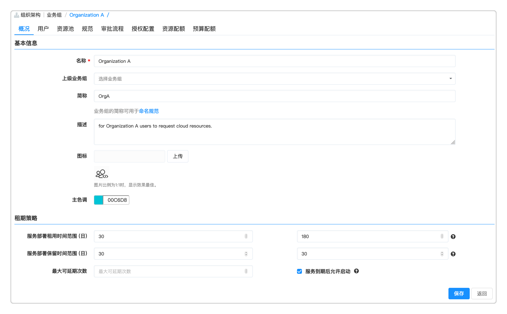
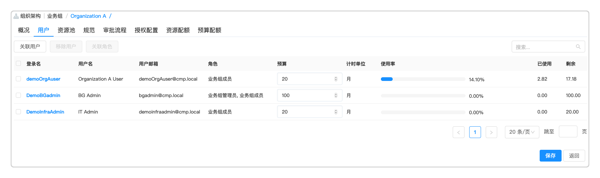
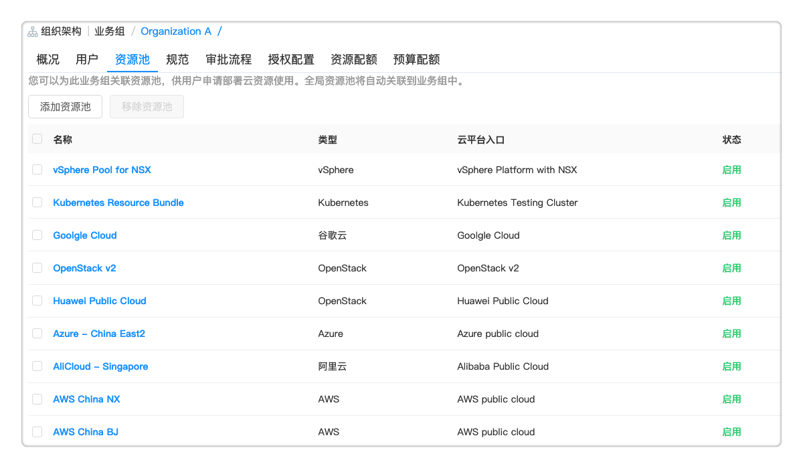
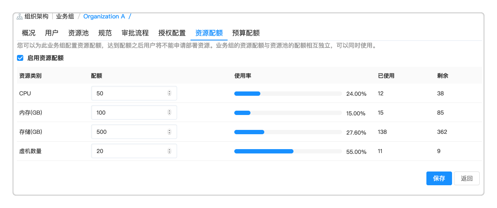
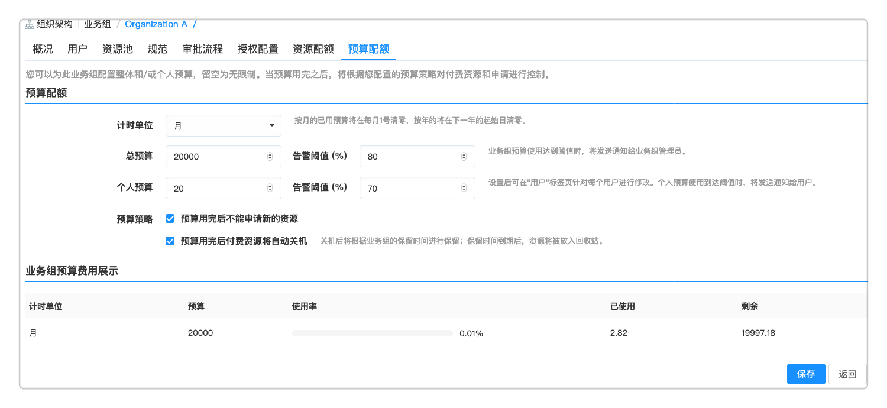

**业务组**

　　业务组是平台内的逻辑组织结构，支持创建多级业务组。业务组是一个逻辑概念，有需要把用户、服务、资源使用以及流程、规范等联系在一起的实体都可以用业务组来对应，比如子公司，不同层级的部门等。

# 添加业务组

1.  点击左侧导航栏 组织架构 - 业务组 ，点击业务组名称进入编辑页面，或创建一个新的。
2.  概况标签页：
  + 填写名称、上级业务组、简称、描述并上传图标。
  + 主色调：选择某一颜色作为该业务组的主色调，该业务组发布的服务在服务目录中将显示设置的主色调颜色。若未设置，将由系统随机选择。
  + 租期策略：

      - 服务部署租用时间：最大值最小值任意留空则对应区间无限制。服务租用时间到期后云主机将被自动关机。
      - 服务部署保留时间：最大值最小值任意留空则对应区间无限制。保留时间到期后，服务部署将被卸除，放入回收站。
      - 最大可延期次数：允许用户延长租用到期时间的次数。
      - 服务到期后允许启动：勾选表示在服务部署到期之后，允许用户在延长租期之前启动该服务继续使用。
      

3.  用户标签页:
  + 关联用户：点击关联用户，勾选列表中的用户，点击确定，关联该用户到业务组。关联成功后，将在用户页面显示已关联用户。
  + 移除用户：若该业务组中已有用户，在列表中选择某用户，点击移除用户，取消该用户和业务组的关联，该用户将不能查看、使用该业务组的资源。
  + 关联角色：选择列表界面中的某用户，点击关联角色，勾选业务组管理员，点击提交，给该用户业务组管理员的角色。
  

4.  资源池标签页:将资源池与业务组进行关联，使得业务组内的用户可以申请这些资源。
  + 添加资源池：关联该资源池和业务组的关系。
  + 移除资源池：移除该资源池和业务组的关系。若有未卸除部署在该资源池上，将不能移除.
     

5. 规范标签页：配置命名及申请规范。
  + 命名规范：配置服务部署、云主机和云资源的命名规范，点击下拉列表选择已添加的命名规范模板，留空表示使用系统设置中的缺省模板。
  + 申请规范：配置业务组在服务目录申请资源的规范，申请云主机CPU和内存最大值，留空表示无限制。

6. 审批流程标签页：为业务组申请资源和服务关联审批流程，留空为不关联流程。

7. 授权配置标签页：配置授权配置模板，指定用户对服务部署和云资源可以进行的操作。点击下拉列表选择已添加的授权配置模板，留空表示使用系统设置中的缺省模板。

8. 资源配额标签页：支持设置业务组的资源配额以满足控制部门级别资源配额的需求。业务组的资源配额与资源池的资源配额互相独立，是两个层面的资源配额管控。能够设置以下资源的额度：CPU、内存、存储、虚机数量。

  + 默认不启用：资源配额界面禁止输入，同时不计算已使用的资源数量。
  + 选择启用：上述资源可以设置配额，都是非必填项，只能输入大于等于零的整数，留空表示无限制。支持查看已使用配额（如果某个配额是无限制，剩余也一直是无限制，使用率一直是0%）。当新服务部署占用资源，或者运维操作修改配置变更资源使用情况，或者更改业务组，相应的资源使用情况会产生变更。
   
   >「Note」如果之前一段时间业务组没有启用配额，但业务组有资源占用，则该业务组在启用配额之后，将会显示已经使用的资源。子业务组的配额独立，即不受父业务组的限制，可以单独配置。

9. 预算配额标签页：管理员可以为此业务组配置该业务组和每个用户的每个月/每年的预算，留空为无限制。个人预算不能大于业务组总预算。当业务组预算达到阈值，业务组成员不能申请新的资源。您可以设置到达预算之后对于云资源的控制策略，以及预算阈值告警。
  + 预算配额的设置步骤：
    + 选择计时单位年或月：选择按月表示在每月1号清零已有，恢复初始值；选择按年表示在下一年的起始日清零已有，恢复初始值。
    + 业务组配额管理：填写总预算，设定百分比，当业务组整体费用超过配置的总预算百分比，触发后续通知，系统将自动发送通知给业务组管理员。
    + 个人预算：设置个人预算，设定百分比，个人预算使用到达阈值时，触发后续通知，将发送通知给用户。个人预算设置后保存业务组，可在用户标签页查看每个用户预算的额度和使用情况，并可为每个用户单独设置额度。
    + 预算策略：
        - 选择“预算用完后不能申请新的资源”，当业务组预算使用完时，业务组关联的所有用户将不能申请新的需要付费的资源。
        - 选择“预算用完后付费资源将自动关机” ：当个人预算使用完时，属于个人的云资源将关机，或者当业务组预算使用完时，属于业务组的云资源将关机。
    
    >「Note」当业务组下有多个额度不同的用户时，其中一个用户欠费，不影响其他用户申请资源，属于欠费用户的云主机停机，不影响其他用户的云主机状态。

# 查看当前业务组

　　在左边导航选择 组织架构 - 业务组 ，可查看当前所有业务组。显示该业务组的名称、上级业务组、创建者以及创建时间等，可添加、编辑和删除业务组。

# 修改业务组配置

　　在左边导航选择 组织架构 - 业务组 ，选择一个业务组，点击编辑按钮，输入需要修改的内容点击保存。

## 添加级连业务组

　　选中一个业务组，点击添加按钮，您可以选择一个上级业务组，从而使得您的当前业务组加入到上级业务组中，实现一个级连的机构。(能且只能添加一个上级业务组)级连业务组可以实现组织机构的层级关系，您可以通过级连业务组对应到任意公司的任意组织结构。

　　级连业务组拥有如下的特点：

  + 子业务组所关联的用户，不一定非得是父业务组的关联用户。

  + 平台管理员进入 系统管理 - 系统配置 - 业务组 配置时，存在选项“将用户加入到子业务组时，同时加入到到父业务组中”
   
    - 勾选此选项，则当您在子业务组中添加用户时，该用户会自动添加到父业务组中；

    - 不勾选此选项，则当该用户不存在父业务组中时，子业务组也可以直接关联该用户，且不会自动添加到父业务组中

  +   父业务组管理员将自动成为名下所有子业务组的管理员（这项规则与系统配置项无关）

  +   每级业务组所关联的资源池相互独立

  +   每级业务组所关联的服务目录相互独立

  +   每级业务组所关联的部署和虚机相互独立

## 删除业务组

　　您可以根据下面的步骤来删除业务组：

  1.  在左边导航选择 组织架构 - 业务组 ，选择一个业务组，点击删除按钮。

  2.  点击确定按钮，确认删除操作。

  >「Note」  删除业务组会删除与该业务组绑定的脚本库、命名后缀、资源池等，并将所有用户从该业务组中移除。删除业务组前请确保该业务组下的所有服务部署已经卸除成功，并移除业务组下所有资源池、删除所有发布与未发布的服务。
