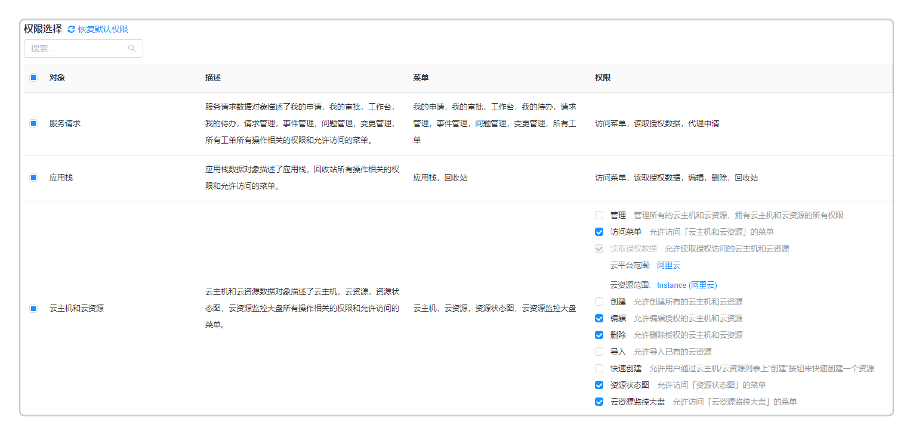

**角色**

SmartCMP混合云应用管理平台支持多种角色的权限设置，系统已有基础角色包括：

+ 平台：

   - 平台管理员：拥有平台的管理和配置权限

   - 普通成员：可以登录平台，如需申请资源和服务，需将用户加入到业务组中

   - 基础设施管理员：拥有所有基础设施资源的配置权限 

   - 软件架构师：设计软件和应用的架构，可以管理和配置组件和蓝图
   
   - 请求管理员：处理所有用户请求，可以执行分配关闭等操作
   
   - 问题管理员：处理所有用户问题，可以执行分配关闭等操作
   
   - 事件管理员：处理所有用户事件，可以执行分配关闭等操作
   
   - 变更管理员：处理所有用户变更，可以执行分配关闭等操作
   
   - ITIL处理员：可以创建和管理自己发起的流程，并查看所有ITIL资源
   
   - 知识库管理员：可以创建和管理知识库
   
   - 排班管理员：负责配置和管理排班

   - 配置管理员：拥有CMDB的配置权限，可以创建和管理关系类型，并默认拥有组件库，蓝图设计，关系类型等菜单的使用权限
   
   - 安全策略管理员：负责安全运维的权限策略管理，并默认拥有授权配置，合规检查，合规性策略，用户轨迹，命令记录，访问配置菜单的使用权限
   
   - 安全审计管理员：负责安全运维结果的审计管理，并默认拥有合规检查，违规记录，用户轨迹，命令记录，操作记录菜单的使用权限

+ 业务组：

   - 业务组管理员：管理业务组内的所有用户和资源

   - 业务组成员：可以申请服务，创建部署云资源

+ 项目：

   - 项目管理员：管理项目成员

   - 项目成员：可以查看项目中的云资源

平台管理员可以在 组织架构 - 角色 页面内添加、删除、编辑角色权限。角色管理完成后，平台管理员可以在 组织架构 - 用户 页面内管理用户，并根据需要为用户分配相应的角色。

在左侧菜单栏中点击 组织架构 - 角色 。角色列表界面，可以查看当前所有角色的信息，显示角色的名称、描述等。可添加、编辑、删除角色，并管理权限。支持筛选内置或非内置角色查看角色列表。

# 编辑角色

平台支持角色权限的自定义，有权限的用户可以编辑系统内置角色和自定义创建的角色的权限。

在角色列表界面中，选中一个平台内置角色或自定义创建的角色，点击列表上面的编辑，即可打开编辑自定义角色界面。

+ 编辑角色的名称、描述和级别。

+ 选择角色的权限：通过复选框的勾选，您可以自定义当前角色的权限；您也可以选择该角色允许读取访问的云平台和云资源范围，目前范围选择只支持单选或全选，并取两者的交集关系。例如，当您选择“云平台范围”为“阿里云”，选择“云资源范围”为“Instance",则该角色只能读取访问阿里云的Instance资源；针对系统内置的角色，平台支持点击“恢复默认权限”，恢复至初始权限配置。

+ 点击保存，完成对角色的编辑。

# 创建自定义角色

在左侧菜单栏中点击 组织架构 - 角色 ，点击添加，进入创建角色界面中。输入角色名称、描述信息，选择相应的角色权限范围，给相应的实体对象赋予不同的权限。点击保存生成新的角色，点击返回放弃创建角色。

在 组织架构 - 用户 - 角色标签页 可以为用户关联已创建的自定义角色。

# 删除自定义角色

在角色列表界面中，选中一个自定义角色，点击列表上面的删除，弹出提示窗口，点击是即可删除该自定义角色。

系统默认的角色不能删除。

 >「Note」假如该角色仍然被其他用户所关联，则不允许删除。
