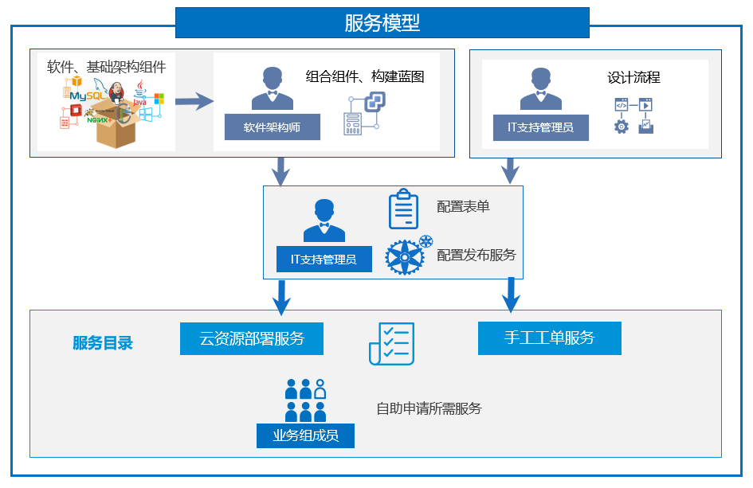

**服务模型**

　　在SmartCMP中，一切服务基于蓝图建模来定义标准的服务框架与组件，SmartCMP提供丰富的开箱即用的软件组件，以可视化的形式编排蓝图，提供自定义表单，为任意服务定义参数和字段，灵活的为各项服务配置资源满足用户多样的需求；同时提供内置的流程设计器，让用户能够以可视化拖拉拽的方式设计服务流程和审批流程，帮助用户准确和快速的完成流程策略设计。
管理员将服务分组通过服务目录发布企业或组织需要的IT产品和服务，提供给用户自助申请。服务建模为各项服务配置资源、参数、自动化的工作流程和审批策略，实现自动化部署。

　　下图描述了如何组合组件、构建蓝图、服务配置、服务分组和发布的全过程。软件架构师组合软件组件和基础架构组件构建云服务的蓝图，管理员为服务配置资源和参数，IT支持管理员定义流程并指定服务团队，将服务分组并发布到服务目录。业务组成员在服务目录中根据实际需求进行自助申请。

>「Note」服务申请的具体操作，请您参考：[云服务管理](https://cloudchef.github.io/doc/AdminDoc/06云服务管理/)

