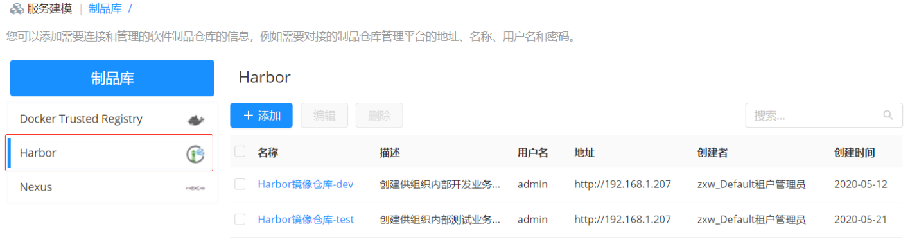
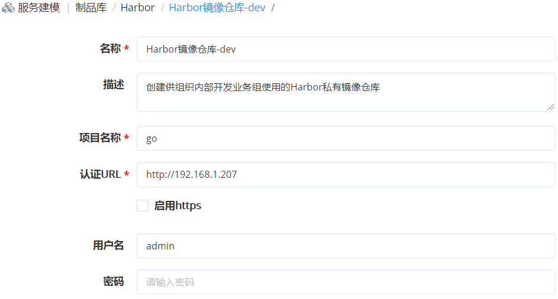
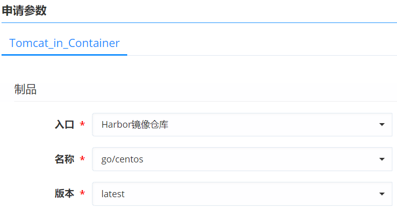
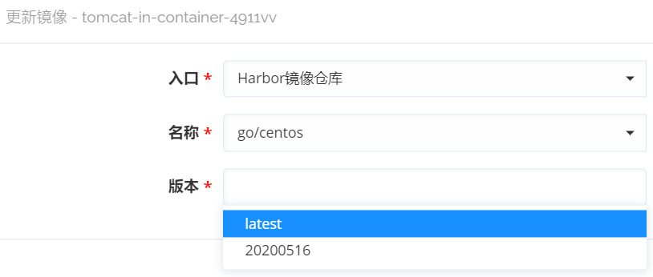

**制品库**

# 功能描述
+ 云平台通过接入主流的制品仓库对云组件进行存放管理和版本控制，云组件关联制品仓库并自定义应用的部署方式和相关参数。
+ 制品仓库管理是对软件研发过程中生成的产物的管理， 制品一般作为最终交付物完成发布和交付。
所有的制品包，依赖组件均能够纳入制品库中统一管理。
+ 集成VMware Harbor容器镜像仓库，帮助用户迅速搭建一个可部署于组织内部使用的私有镜像源,帮助企业跨 Kubernetes 和 Docker 等云原生计算平台持续，安全地管理镜像。
+ 可快速在云管理平台上实现对多个环境的下的镜像仓库和镜像制品进行数据的统一录入和自动化存储，提供给持续集成系统和发布系统使用。
+ 构建供组织内部使用的Harbor镜像仓库，更加安全，保障业务的连续性。统一的镜像和仓库管理服务，保证应用在开发、测试和正式环境中的一致性。

# 配置步骤
+ 云平台支持通过组件库功能实现自定义应用软件，将制品仓库与软件组件关联，制品仓库对软件组件进行存放关联和版本控制管理。
+ 以集成Harbor，提供统一的镜像和仓库管理服务为例，介绍详细步骤：
    + 在左边导航选择「服务建模」-「制品库」在制品库入口，快速在平台上实现对多个私有镜像库的统一录入，创建多个制品库供不同的环境使用。
    
    
    + 为云组件关联Harbor制品仓库，制品仓库自动化存储云组件，并进行版本管理。 具体的操作步骤如下：在软件组件列表点击软件名称，进入组件视图。在「制品」视图，您可以选择 端点、仓库（Nexus）、组、名称、版本。点击保存按钮，即可将组件与包管理平台进行关联。
    + 在服务申请界面，用户还可自行选择或使用管理员配置的Harbor镜像部署容器，生成应用环境。
    
    + 提供自助运维能力， 在开发测试经过新一轮的迭代之后，构建的新镜像保存到Harbor中。此时用户能够通过云平台的自助运维功能，从镜像仓库获取最新的镜像，更新应用环境。 
   

