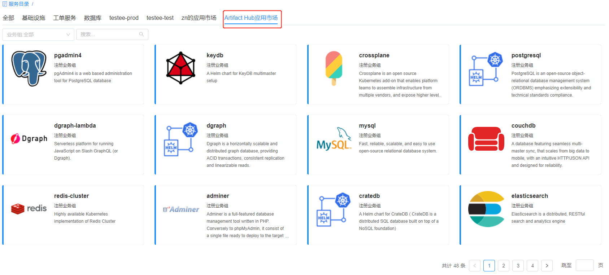

**应用市场管理**

管理员可在此添加需要连接和管理的应用市场的信息，并自定义配置应用市场，通过发布的应用市场为普通用户提供在线服务申请。Artifact Hub（工件中心）是一个基于web的应用程序，支持查找、安装和发布CNCF项目的包和配置。这包括 Helm 图表和插件、Falco 配置、开放策略代理 （OPA） 策略、OLM 运算符、Tinkerbell 操作、kubectl 插件、Tekton 任务和管道、KEDA 缩放器、CoreDNS 插件、Keptn 集成和容器映像。

# 配置应用市场服务
管理员可在 服务设计 - 应用市场管理 配置Artifact Hub应用市场，则普通用户能够在服务目录申请应用市场中已发布的制品应用服务。

在 服务设计 - 应用市场管理 中，点击添加Artifact Hub，
 - 名称：请自定义应用服务的名称，名称将会在服务目录中展示；
 - 业务组：请为该应用服务指定单个或者多个业务组；
 - 发布者：请选择该应用服务的发布者，范围包括在Artifact Hub应用市场发布应用的所有发布者；
 - 类别：请选择发布的市场应用类型。

点击保存按钮，则生成应用市场服务的菜单。

# 申请应用市场服务
在管理员配置并发布应用市场服务至服务目录后，普通用户可直接申请应用市场的相关服务。点击服务目录，如下图所示，

点击某个服务卡片，进入申请界面，

1. 填写组织信息：
    + 业务组：选择部署所属业务组。
    + 项目：选择应用栈所属的项目。
    + 所有者：选择应用栈的所有者。如果您想为所选业务组和项目组的其他成员申请资源，请先在 组织架构 - 角色 中选定您已关联的某个角色，在服务请求类型中勾选代理申请的权限，则您在此处可选择其他用户为该应用栈的所有者。目前平台管理员、业务组管理员、项目管理员、ITIL处理员默认拥有代理申请的权限。
2. 填写部署信息：   
    + 名称：请自定义服务部署的名称。
    + 数量：输入数字，您可以一次创建多个应用栈。
    >「Note」 您可以在 系统管理 - 界面配置 里控制服务申请页面显示需申请时填写的字段。具体操作步骤，请参考：[界面配置](https://cloudchef.github.io/doc/AdminDoc/09系统管理/#界面配置)
    + 执行时间：设定未来的某个时间，在这个时间点进行应用栈的创建。
    + 租期模式：您可以选择“包年包月”或者“按需”的租期方式。
      + 购买时长：当您选择“包年包月”的付费方式后，可选择购买时长，范围从“1个月”至“3年”。
      + 租用到期日期:当您选择“按需”的付费方式后,可以指定应用栈的使用期限。到期之后，所有的服务将被停止,最长到期日期无限制。
    + 保留时间（日）：应用栈到期后，仍有一段保留时间，保留时间到后，部署会被卸除。可设置保留时间范围。

3. 填写相关申请参数，例如：资源池、下载方式、应用市场、仓库名、制品、版本等等信息。

    + 资源池：选择申请应用市场服务所需的具体资源环境，请先至 组织架构 - 资源池管理 配置资源池。

    + 下载方式：
      + 应用市场：
         + 应用市场：选择在 服务设计 - 应用市场管理 已添加的应用市场。
         + 仓库名：请选择应用市场中的具体仓库，例如：Bitnami。
         + 制品：请选择仓库中具体的制品类型，例如：Redis。
         + 版本：请选择制品版本。
      + 全路径：
         + Chart包配置：请手动输入Chart包的下载地址

4. 点击保存，确认无误后点击提交，等待部署完成应用市场服务。

>「Note」您也可以点击 加入请求单 按钮，将当前申请加入请求单，对同一审批流程的多个请求批量提交管理。详情请参考[通过请求单批量申请](https://cloudchef.github.io/doc/AdminDoc/06云服务管理/服务目录.html#通过请求单批量申请)。