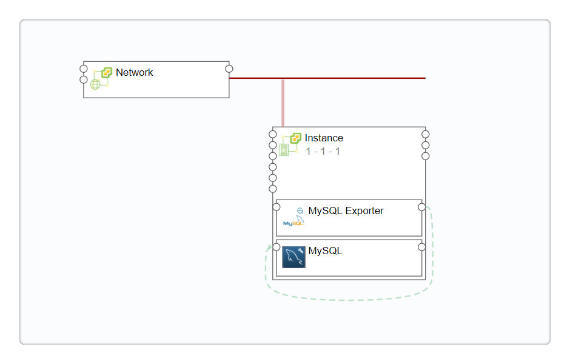
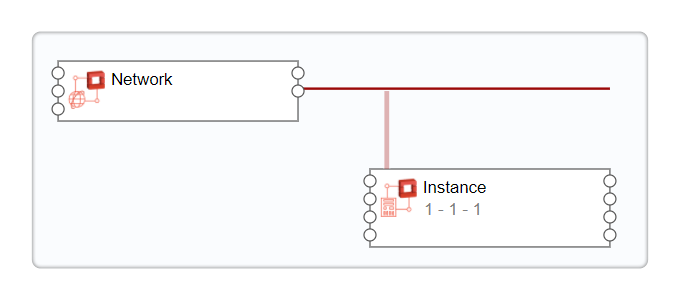
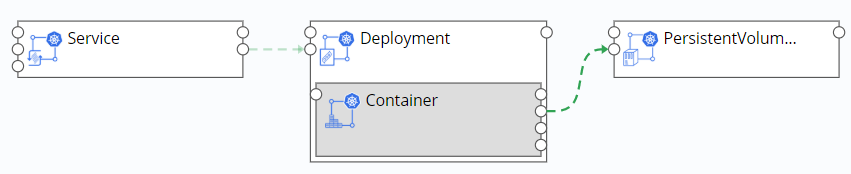
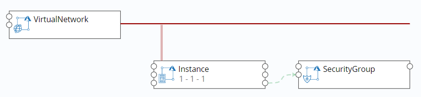

**服务配置**

SmartCMP云管平台从组件的定义，到应用的可视化拓扑建模，并将服务配置标准化，再到基于蓝图和配置的自动化部署，最终生成一个符合TOSCA规范的云资源蓝图服务。支持管理员将设计好的蓝图发布为服务，在服务配置处配置基本信息、构成蓝图的组件详细参数、输入与输出、可以将服务与企业内部的流程（例如：审批流程）集成之后发布到服务目录。服务项主要功能有：

 + 服务与一个、多个或全部蓝图关联，服务与全部云组件关联，服务与业务组关联，选定服务类型（云应用部署服务、云资源部署服务、手工工单服务、执行任务服务等等）

 + 服务与服务策略关系，如服务时间、租期、服务流程等

 + 服务访问权限设置，配置部署操作许可，指定操作权限

 + 服务与流程集成，如审批流程、云应用栈部署流程等等

具体操作步骤如下：

在左边导航选择 服务建模 - 服务配置 ，出现服务配置列表，列表中显示服务名称、描述、服务流程、蓝图设计、业务组、状态、创建者、创建时间等，可对服务配置做如下操作：添加、编辑、复制、取消发布、发布、 删除等。

>「Note」服务发布完成之后，可以通过服务目录进行服务申请，具体操作方法参考：[服务目录申请](https://cloudchef.github.io/doc/AdminDoc/06云服务管理/#服务目录申请)

# 添加服务配置

您可以根据下面步骤添加服务配置：

1. 在左边导航栏选择 服务建模 - 服务配置 ，点击添加：

    + 服务名称、服务描述（选填）：自定义服务名称并作服务的相关描述；

    + 业务组：选择服务关联的业务组，业务组关联的用户都可以申请该服务，可选择一个或者多个业务组；

    + 服务类型：选择云资源部署、云应用部署、通用工单、问题工单、事件工单、变更工单、请求工单或者任务执行申请；
        - 选择云应用部署服务时，增选蓝图设计选项，可选择关联一个、多个、或全部蓝图；
        - 选择云资源部署服务时，增选组件选项，可选择关联一个、多个或全部组件；
        - 选择通用工单时，增选流程选项，系统内置标准手工工单，标准事件管理流程和自动化服务流程，可选择关联一个流程；
        - 选择问题工单时，增选流程选项，可选择关联标准问题工单流程；
        - 选择事件工单时，增选流程选项，可选择关联标准事件管理流程；
        - 选择变更工单时，增选流程选项，可选择关联标准变更工单流程；
        - 选择请求工单时，增选流程选项，可选择关联一个流程；
        - 选择任务执行申请时，增选标准任务执行流程选项。

2. 点击保存，配置生成新的服务。

3. 在概况标签页填入下列信息

    + 名称、服务项描述：自定义服务项名称，并对申请服务进行简要描述；

    + 图标：服务项logo选择，发布后将在服务目录处显示；

    + 业务组： 选择服务发布到的业务组，可选择特定某个业务组，或共享给所有业务组，选择该选项时，有些设置无法在服务配置时指定，将在用户申请服务时，指定某个业务组后，根据选中业务组上的资源而决定；

    + 授权：指定在与指定业务组关联的用户中能够申请该服务的角色；

    + 服务等级协议：选择配置好的服务等级协议，详情可参考[服务等级协议](https://cloudchef.github.io/doc/AdminDoc/05服务建模/服务等级协议.html)。

    + 服务分组：为申请的服务指定一个分组，方便在服务目录中展现；

    + 顺序：指定申请的服务在服务目录中的排列顺序，数值小的排列靠前；

    + 状态(只读)服务项状态：

        - 已发布：将服务项发布到服务目录；

        - 未发布：服务项未发布状态；

        - 已过期：服务项已过期。

    + 付费方式：

        - 包年包月：以购买时长为付费基准，可选时长以月、年为单位；

        - 按需：以使用资源量为付费基准。

    + 租用时间（日）：应用栈的使用时间，应用栈租用时间到期后，部署里的所有云主机会停机。可设置租用时间范围，在 组织架构 - 业务组 的概况标签页设置，勾选允许修改和仅审批时可修改。

    + 保留时间（日）：应用栈到期后，仍有一段保留时间，保留时间到后，部署会被卸除。可设置保留时间范围，在 组织架构 - 业务组 的概况标签页设置，勾选允许修改和仅审批时可修改。

4. 蓝图配置标签页：当您在添加新的服务配置中，选择云应用部署服务时关联多个蓝图，您可以在该标签页查看与此服务配置关联的蓝图信息（名称，描述），并可添加或删除蓝图。
  
5. 组件配置标签页：
   + 当您在添加新的服务配置中，选择云资源部署服务时关联多个组件，您可以在该标签页查看与此服务配置关联的云组件信息（名称，云平台类型，描述，版本），并可添加或删除组件，这些组件必须是可以单独部署的组件（例如RDS、Redis、Storage、EIP等）或者是能够自动部署生成简单蓝图的组件（例如Instance等）。
  
   + 当您在添加新的服务配置中，选择云资源部署服务时关联一个组件，可在该标签页看到该组件拓扑，并可以对该组件进行参数设置。
 
   + 当您在添加新的服务配置中，选择云应用部署服务时关联一个蓝图，可在该标签页看到配置服务中的蓝图拓扑和所有组件，并可以对蓝图中的组件进行参数设置。配置列表中有三种类型的组件，分别为：计算组件、软件组件、网络组件：
  
       + 计算组件：一般指服务器或计算节点，如Instance、WindowsInstance、InstanceD等；支持对组件资源环境标签和通用云组件部分属性参数（如操作系统、虚拟机模板、网络、安全组等）配置必填项，在用户申请服务时控制该属性参数是否必填。

       + 软件组件：一般是放在服务器或者计算节点上的应用，如：Apache、MySQL、Tomcat等；

       + 网络组件：一般指服务器的网络配置，如：network。
  
6. 输入与输出标签页：可添加输入输出参数，应用栈部署成功后，可在详情页面进行查看相关输出数据：

    + 输入：点击添加，填写名称（必填）、描述、默认值等输入信息。

    + 输出：点击添加，填写名称（必填）、描述、表达式（必填）等输出信息。表达式可选择已有，也可根据需求自行输入。

7. 审批配置标签页
    + 审批流程： 可选审批流程（内置的默认审批流程或自定义的审批流程，例如：业务组管理员审批），如不选择，将使用业务组中配置的审批流程；

    + 流程图、流程步骤：查看已选择的审批流程图和流程步骤；
  
8.  表单配置标签页：选择服务对应的表单类型、可在表单预览中查看详细信息。在服务请求与服务管理页面支持展示表单参数列和通过搜索表单参数筛选服务列表。
  
9.  流程配置标签页

    + 流程信息：可选一个服务流程（内置的标准云应用栈部署流程或自定义的服务流程）；

    + 流程图、流程步骤：查看已选择的审批流程图和流程步骤。

10. 服务条款配置标签页：您可以配置需要用户在申请服务时首确认的服务条款、隐私政策等。
  
   + 名称：请自定条款名称。

   + 顺序：请输入具体数值，服务条款按照数字从小到大排列。
  
   + 链接：请输入条款的具体地址链接。
  
11. 申请字段配置标签页：您可以定义用户在申请服务时需要填写的字段，包括业务组、项目、所有者、名称、描述、数量、执行时间、键值标签及云资源标签等字段。
   + 启用申请字段配置：
     + 如不勾选，则默认申请字段的配置与系统配置保持一致，您可以选择 系统管理 - 界面配置 ，点击服务申请标签页，查看已设置的服务申请字段。有部分申请字段并未在 界面配置 中设置，则默认为显示状态，并且所有字段的状态（”是否显示“和”是否必填”）不能修改。
     + 如勾选，则您可以自行配置申请服务时显示的字段，并可以修改以下字段包括项目、描述、执行时间、云资源标签的状态（”是否显示“和”是否必填”），业务组、所有者、名称、数量、键值标签等字段只能修改“是否显示”的状态。启用申请字段配置后，此处配置的字段将覆盖系统配置，即当前服务申请页面字段与此处配置保持一致。
     
  >「Note」如果您在服务配置中启用了“申请字段配置”，则申请界面优先使用“申请字段配置”中的配置，即使在系统管理配置中配置相关字段也无影响，并且不会影响之前服务配置中的设置，只对新的服务配置中的默认配置生效。当您自定义所有申请字段都不显示时，则用户在申请该服务时，申请页面不会出现 组织信息 这部分内容的填写区域。
  
12. JavaScript扩展脚本标签页：您可以定制客户端脚本JavaScript，自定义服务申请界面上需要额外展现的内容。用户在服务目录中点击服务、加载申请页面的时候，脚本将在客户端Web浏览器中运行，展现定制内容。

## 云资源配置策略
服务配置中，配置云主机节点的云资源配置，需要注意资源池部署策略，平台主要提供以下几种策略：

   + 手工指定：手工指定资源池，若资源池选择策略选择“手工指定”，支持使用资源环境标签，缩小选择范围，将出现“资源池”选择项，在下拉框中选择资源池，指定资源池，可勾选允许修改选项。

   + 自动选择剩余虚拟机数量最多的：平台自动按照策略在当前可选择的资源池中，选择部署虚拟机数量最多的。

   + 自动选择剩余容量最大的：平台自动按照策略选择当前可选择的资源池，资源使用量最小，剩余容量最大的。

   + 自动选择费用最低的：平台支持设置资源计费规则，按照策略选择当前可选择的资源池，费用最低 花费最少的。

   + 平均分配：应用栈部署时，资源是平均分配到不同的资源池，（平均分配的前提是选择的资源池有足够的资源。）

    >「Note」资源环境标签来源于管理员在 基础设施 - 资源标签 中配置完成，具体配置参考，请参考：[资源标签](https://cloudchef.github.io/doc/AdminDoc/03基础设施管理/资源标签.html) 根据标签选择匹配该标签的资源池，实现将应用部署到特定的资源池。
　

接下来为您介绍云资源蓝图服务配置和手工工单服务配置的具体步骤：

>「Note」服务配置的服务描述支持Markdown语法书写规则，从而在服务申请时候展示不同服务描述的展示格式

# 配置云资源蓝图服务
## 配置vSphere单节点服务 {#配置vSphere单节点服务}

1. 在左侧导航点击 服务建模 - 服务配置 ，点击左上角的添加进入新建服务配置界面，依次填写服务名称，服务描述（选填），选择业务组，服务类型选择云应用部署，选择[vSphere单节点服务蓝图](https://cloudchef.github.io/doc/AdminDoc/05服务建模/蓝图设计.html#创建vSphere单节点服务蓝图)，点击保存。

2.  概况、输入与输出标签页配置请参照[添加服务配置](#添加服务配置)

3.  在组件配置标签页中：可以看到vSphere服务拓扑图以及所有组件：Instance、Network。

 + Instance：点击Instance名称，进入节点详细设置，共有概况、云资源配置、用户、磁盘、文件系统、条件执行等标签页：

     + 概况标签页：

         - 基本信息: 展示Instance的类型、名称等基本信息

         - 集群节点数量：选择部署的集群内云主机数量，针对添加软件、磁盘等操作，集群内所有云主机将进行同步操作。如需在此设置集群节点数量, 请先在 模型设计 - 蓝图设计 中，选择该服务配置的对应蓝图，并在编辑页面点击Instance组件，在功能界面勾选“集群”，开启集群功能, 也可设置该集群内最小和最大云主机数。
         >「Note」勾选允许修改。如果勾选允许修改，则用户在请求服务时，可以进行修改参数集群节点数量。

     + 云资源配置标签页：

         - 云资源配置：
             + OS主机名（Hostname）：没有定义时默认继承业务组命名规则，可勾选允许修改和仅审批时可修改：
                 1. 如果勾选一项 允许修改 ，则用户在请求服务时，可修改参数，在服务审批阶段也可修改参数；

                 2. 如果勾选两项 允许修改 和 仅审批时可修改 ，用户在服务请求中，不可修改参数，只在服务审批阶段允许修改参数；

             + 云主机名称：没有定义时默认继承业务组命名规则，可勾选允许修改和仅审批时可修改；

             + 注释：选填，可勾选允许修改和仅审批时可修改；

             + AD域（Windows服务）：AD域	勾选后，填写AD域名和用户姓名、密码。该应用栈部署后的虚机将加进AD域里。

         - 资源池配置：
             + 部署策略：选择资源池部署策略（手工指定、自动选择、平均分配）
               >「Note」资源池选择策略请参考[资源池选择策略](https://cloudchef.github.io/doc/AdminDoc/03基础设施/资源池管理.html#资源池选择策略) 
             + 选择已有的资源环境标签，可快速定位所需资源池。
             + 若部署策略选择手工指定，可通过下拉框指定特定资源池。勾选允许修改及仅审批时可改，将允许用户在申请时修改资源池。

         - 操作系统设置：

             + 操作系统名称: 选择Linux/Windows操作系统,可勾选允许修改和仅审批时可修改

             + 虚拟机模板:选择该操作系统下的vSphere虚拟机模板,可勾选允许修改和仅审批时可修改。 
                - 勾选 允许用户申请时修改虚拟机模板的用户名和密码 ，则用户在服务申请时可以选择管理员凭证或自定义输入管理员用户名及密码。

         - 计算规格配置：
             + 计算规格模式：计算规格模式定义了云主机CPU和内存的配置方式：

                 - 选择“自定义”允许直接输入数字；

                 - 选择“固定规格”将按照管理员配置的计算规格进行选择。

             + vCPU数量：若计算规格模式选择自定义，则手动输入vCPU数量，可勾选允许修改和仅审批时可修改；

             + 内存（GB）：若计算规格模式选择自定义，则手动输入内存大小，可勾选允许修改和仅审批时可修改；

             + 计算规格：若计算规格模式选择固定规格，选择规格，可在 系统管理 - 计算规格 中配置相关的计算规格，并可勾选允许修改和仅审批可修改；

         - 系统盘配置：
             + 文件夹: 虚机会部署在选中的vCenter文件夹里，支持申请时改变,需要在 资源池 — 云平台资源信息 中选择文件夹；

     + 用户标签页（Linux服务）：可以添加Linux用户和用户组，一个用户可以有多个用户组，一个用户组可以有多个用户，虚拟机部署成功后，将会有对应的用户和组被创建，用户可以选择是否设置为sudoer。注意：只有安装了代理（部署时安装），才出现用户标签页面。

     + 存储标签页：您可配置用户申请服务时默认的系统盘与数据盘，设置是否允许用户修改。
         - 存储策略：配置用户申请使用存储资源的方式。基于类型选择：直接选择存储类型；基于标签选择：选择标签，系统将自动匹配符合条件的存储进行分配。

         - 系统盘：配置默认系统盘
             + 根据存储策略选择存储或者标签。
               - 若存储策略选择 基于类型选择 ，可从下拉框直接选择存储
               - 若存储策略选择 基于标签选择 ，可从下拉框选择已有的存储标签，系统将自动匹配符合条件的存储（需先在资源标签内配置配置存储标签并在资源池管理中与存储资源进行关联）
             + 置备模式:（选择完全克隆的虚拟机模板才会出现该选项，即选择虚拟机虚拟磁盘的磁盘格式）支持三种置备模式：精简置备、厚置备延迟置零、厚置备置零。
             >「Note」
              1. 厚置备延迟置零格式，以默认的厚格式创建虚拟磁盘。创建虚拟磁盘时分配虚拟磁盘所需的空间。创建时不会擦除物理设备上保留的数据，但是从虚拟机首次执行写入操作时会按需要将其置零。
              2. 厚置备置零，是一种厚虚拟磁盘类型，支持诸如 Fault Tolerance 等群集功能。在创建时为虚拟磁盘分配所需的空间。与常规格式相反，创建虚拟磁盘后，会将物理设备上保留的数据置零。创建这种格式的磁盘所需的时间可能会比创建其他类型的磁盘所需的时间更长。
              3. 精简置备格式，可节省存储空间。最初，精简置备的磁盘只使用该磁盘最初所需要的数据存储空间。如果以后精简磁盘需要更多空间，则它可以增长到为其分配的最大容量。

         - 数据盘：添加申请服务时默认的数据盘，选择允许用户申请和审批时修改的参数并勾选是否允许申请时添加数据盘。数据盘选择方式同系统盘，可根据存储策略基于类型或标签选择。

     + 文件系统标签页：配置默认的文件系统，您可选择勾选是否启用LVM。
       - 若启用LVM，平台将按照您的配置自动创建LVM逻辑卷管理，您也可以允许用户在申请服务时按需进行创建。
         + 卷组：选择一个或多个在存储标签页上添加的数据盘，组成卷组。可为每个卷组添加描述，若用户在申请时候创建文件系统，则在选择卷组时可以了解其用途。  
         + 文件系统：填写挂载点（Linux系统）或盘符（Windows系统）、配置文件系统大小（GB）、选择文件格式，选择允许用户申请和审批时修改的参数并勾选是否允许申请时添加新文件系统。
           文件系统来源可选择磁盘或卷组，磁盘的大小将根据文件系统大小动态调整：
            - 卷组：可选择已创建并关联磁盘节点的卷组。若文件系统的大小超过卷组中磁盘的大小，那么部署时其中一个磁盘将被扩展以符合配置的文件系统的大小。
            - 磁盘：可选择存储标签页上已添加的且未关联至卷组的磁盘节点。若文件系统的大小超过指定磁盘的大小，那么部署时该磁盘将被扩展以符合配置的文件系统的大小。
       - 若不启用LVM，您仅可配置默认的文件系统。填写挂载点（Linux系统）或盘符（Windows系统）、配置文件系统大小（GB）、选择文件格式，在文件系统来源下拉选择存储标签页中已创建的数据盘，选择允许用户申请和审批时修改的参数。若勾选允许申请时添加新文件系统，用户在申请时可以基于磁盘创建新的文件系统。
     
     + GPU标签页：为虚拟机配置GPU设备
       + 类型：vDGA,Virtual Dedicated Graphics Acceleration(vDGA)，是 VMware Horizon View 提供的专有硬件图形加速功能。
       + GPU设备：可选择后台查询的所有可用GPU设备。
       >「Note」允许修改和仅审批时可改：这里存在两种情况：如果勾选一项允许修改，则用户在请求服务时，可修改参数，在服务审批阶段也可修改参数；如果勾选两项允许修改和仅审批时可修改，用户在服务请求中，不可修改参数，只在服务审批阶段允许修改参数；

     + 条件执行标签页：您可以为该组件设置各个生命周期的操作，增加前序或者后续执行的脚本。
         + 操作：可选择执行操作的具体行为，提供创建，停止，启动或者删除的选项。
         + 条件：可选择在操作前或者操作后执行脚本。
         + 脚本：可选择执行的脚本，您可以在 作业管理 - 脚本库 创建相关脚本并制定执行该脚本的云资源类型。
         + 在目标云资源中执行：若不勾选，将从云网关上执行脚本。

 + Network组件：点击network名称，进入节点详细设置，共有概况、属性两个标签页：

     + 概况页面：可查看Network组件类型、类别、名称；

     + 属性页面：可选择网络标签以及管理网络，网络标签支持勾选 允许修改 和 仅审批时可修改。
     
     +  条件执行标签页：您可以为该组件设置各个生命周期的操作，增加前序或者后续执行的脚本。
         + 操作：可选择执行操作的具体行为，提供创建，停止，启动或者删除的选项。
         + 条件：可选择在操作前或者操作后执行脚本。
         + 脚本：可选择执行的脚本，您可以在 作业管理 - 脚本库 创建相关脚本并制定执行该脚本的云资源类型。
         + 在目标云资源中执行：若不勾选，将从云网关上执行脚本。
4.  点击保存，返回组件列表界面。点击验证，验证成功后，保存并发布该服务，vSphere虚拟机服务配置并发布成功。

## 配置VMware NSX服务 {#配置VMwareNSX服务}
配置带NSX云平台的vSphere服务，配置服务前操作：

1.  确保该业务组已添加vSphere云平台和VMware NSX云平台，并在vSphere云平台处添加与VMware NSX云平台的关联关系

2.  在vSphere资源池中，关联VMware NSX的传输区域（将影响 NSX逻辑交换机 的显示）

3.  关联成功后，在 资源池 - vSphere资源池 - 网络资源 中看到NSX逻辑交换机、NSX逻辑路由器、安全策略组三个额外标签页

 + NSX逻辑交换机标签页，选择交换机并分配资源池（网络资源与NSX逻辑交换机至少配置一种）

 + NSX逻辑路由器标签页，选择DLR加入该资源池

 + 安全策略组标签页，勾选已有的安全策略组

4.  点击保存，VMware NSX资源池配置成功

配置VMware NSX虚拟机服务：

1. 在左侧导航点击 服务建模 - 服务配置 ，点击左上角的添加进入新建服务配置界面，依次填写服务名称，服务描述（选填），选择业务组，服务类型选择云应用部署，选择[VMwareNSX服务蓝图](https://cloudchef.github.io/doc/AdminDoc/05服务建模/蓝图设计.html#创建VMwareNSX服务蓝图)，点击保存。

2.   基本信息、输入与输出配置请参照[添加服务配置](#添加服务配置)。

3.   点击组件配置标签页，可看到VMware NSX蓝图拓扑图和所有组件：Lswitch、Instance、SecurityGroup、DLR。

 + Instance：配置同上节vSphere服务。
 + Lswitch：点击Lswitch名称，进入节点详细设置页面，共有基本信息、属性两个标签页：
       - 基本信息标签页：查看Lswitch的基本信息，如类型、类别和名称。
       - 属性标签页： 属性（不勾选使用已有网络）：
         + IP分配方式：支持IP池和手工指定，若选择IP池，需指定IP池。
         + 复制模式：选择单播。支持单播、多播和混合三种方式。
         + 管理网络：勾选是否管理网络。
         + 属性：勾选使用已有网络  。
         + 网络标签：从已有的网络中选择，勾选 允许修改 和 仅审批时可修改 。（需要在vSphere with NSX资源池中，选择NSX逻辑交换机）
         + IP分配方式：支持IP池、DHCP、手工指定三种方式。
         + 管理网络：勾选是否管理网络。

 + DLR：点击DLR名称，进入节点详细设置页面：共有基本信息、属性两个标签页
       - 基本信息标签页：查看DLR的基本信息，如类型、类别和名称。
       - 属性标签页：选择一个已有的逻辑路由器（DLR）（在资源池中选择NSX逻辑路由器）；可增加接口配置。

 + SecurityGroup：点击SecurityGroup名称，进入节点详细设置页面：共有基本信息、属性两个标签页
       - 基本信息标签页：查看SecurityGroup的基本信息，如类型、类别和名称。
       - 属性标签页：
         - 名称：新建安全组，填写安全组的名称，勾选 允许修改 和 仅审批时可修改 。
         - 描述：填写安全组相关描述信息（选填）。
         - 属性：勾选使用已有安全组。
         - 安全组：从已有的安全组中选择一个，需要在资源池 安全策略组 中选择一个或多个安全策略用于该资源池。

4.  点击保存，返回组件列表界面。点击验证，验证成功后，保存并发布该服务，VMware NSX服务配置并发布成功

## 配置vSphere MySQL带监控服务 {#配置vSphereMySQL带监控服务}

1.  在左侧导航点击 服务建模 - 服务配置 ，点击左上角的添加进入新建服务配置界面，依次填写服务名称，服务描述（选填），选择业务组，服务类型选择云应用部署，选择[vSphereMySQL带监控服务](https://cloudchef.github.io/doc/AdminDoc/05服务建模/蓝图设计.html#创建vSphereMySQL带监控服务蓝图)，点击保存。

2.  概况、输入与输出配置请参照[添加服务配置](#添加服务配置)。

3.  组件配置标签页：可以看到vSphere服务拓扑图以及服所有组件：Instance、Network。

 + Instance：配置同vSphere服务。

 + Network：配置同vSphere服务。

 + MySQL：点击MySQL名称，进入节点详细设置，共有基本信息、属性、关系等标签页：
       - 基本信息标签页：展示MySQL的类型、类别和名称等基本信息。
       - 属性标签页：展示MySQL主键相关信息，来源于 服务建模 - 组件库 中的配置。
       - 关系标签页：展示Instance与MySQLExporter之间的关系。

 + MySQLExporter：点击MySQLExporter名称，进入节点详细设置，共有基本信息、属性、关系等标签页：
       - 基本信息标签页：展示MySQLExporter的类型、类别和名称等基本信息。
       - 属性标签页：展示MySQLExporter主键相关信息，来源于 服务建模。
       - 组件库 中的配置，若未填写package_url，需填写地址。
       - 关系标签页：展示Instance与MySQLExporter之间的关系。

4.  点击保存，返回组件列表界面。点击验证，验证成功后，保存并发布该服务，vSphere MySQL带监控服务配置并发布成功。

## 配置OpenStack单节点服务 {#配置OpenStack单节点服务}

1. 在左侧导航点击 服务建模 - 服务配置 ，点击左上角的添加进入新建服务配置界面，依次填写服务名称，服务描述（选填），选择业务组，服务类型选择云应用部署，选择[OpenStack单节点服务蓝图](https://cloudchef.github.io/doc/AdminDoc/05服务建模/蓝图设计.html#创建OpenStack单节点服务蓝图)，点击保存。

2.  概况、输入与输出配置请参照[添加服务配置](#添加服务配置)。

3.  组件配置标签页：可以看到OpenStack单节点服务拓扑图以及服所有组件：Instance、Network。
	

 + Instance：点击Instance名称，进入节点详细设置，共有概况、云资源配置、网络资源、用户、存储、文件系统、安全策略组等标签页：
       - 概况标签页：
         + 基本信息	展示Instance的类型、类别和名称等基本信息。
         + 集群节点数量：选择部署的集群内云主机数量，针对添加软件、磁盘等操作，集群内所有云主机将进行同步操作。如需在此设置集群节点数量, 请先在 模型设计 - 蓝图设计 中，选择该服务配置的对应蓝图，并在编辑页面点击Instance组件，在功能界面勾选“集群”，开启集群功能, 也可设置该集群内最小和最大云主机数。
         >「Note」勾选允许修改。如果勾选允许修改，则用户在请求服务时，可以进行修改参数集群节点数量。
       - 云资源配置标签页：
         + OS主机名：没有定义时默认继承业务组命名规则，勾选 允许修改 和 仅审批时可修改 。
         + 云主机名称：没有定义时默认继承业务组命名规则，勾选 允许修改 和 仅审批时可修改 。
         + 资源池选择策略：
             1. 自动选择：平台自动按照策略选择资源池。
             2. 基于资源标签选择：若该服务所使用的蓝图中已有资源便签，默认继承该资源标签，根据标签去选择业务组中匹配该标签的资源池（前提是资源池已设置资源环境标签），实现将资源部署到特定的资源池中。也可在服务配置选择其他资源环境标签；勾选 允许修改 和 仅审批时可修改。
             3.	手工指定：可选择为该服务手工指定资源池，若 资源池选择策略选择“手工指定”后，将出现资源池选择项，指定资源池，允许资源池申请时改变。
             >「Note」若该服务共享给全部业务组，则资源池无法指定，默认强制勾选 允许修改 和 仅审批时可修改 ；若该服务指定给某一业务组，则选择该业务组下的资源池。
         + 操作系统名称：选择Linux操作系统。
         + 虚拟机模板：选择Linux操作系统下的OpenStack虚拟机模板。
           - 勾选 允许用户申请时修改虚拟机模板的用户名和密码 ，则用户在服务申请时可以选择管理员凭证或自定义输入管理员用户名及密码。
         + 卷类型：若选择从云硬盘启动或从云硬盘快照启动的虚拟机模板，则会出现该选项，选择OpenStack云平台上已存在的卷类型，也可选择"未设置卷类型"。
         + 卷大小：若选择从云硬盘启动或从云硬盘快照启动的虚拟机模板，则会出现该选项，卷大小需大于等于镜像要求的磁盘大小，选填：
         + 主机集合：虚机会部署到选择的主机中。
         + 虚拟机规格：选择部署的虚拟机CPU和内存规格，支持勾选 允许修改 和 仅审批时可修改 。
       -  网络资源标签页可配置DNS：DNS名称、DNS域、DNS类型（仅支持A类型）、DNS服务器（勾选 允许修改 和 仅审批时可修改 。
       -  用户标签页（Linux服务）：可以添加Linux用户和用户组，一个用户可以有多个用户组，一个用户组可以有多个用户，虚拟机部署成功后，将会有对应的用户和组被创建，用户可以选择是否设置为sudoer。注意：只有安装了代理（部署时安装），才出现用户标签页面。
       - 存储标签页：您可配置用户申请服务时默认的系统盘与数据盘，设置是否允许用户修改。
         + 存储策略：配置用户申请使用存储资源的方式。基于类型选择：直接选择存储类型；基于标签选择：选择标签，系统将自动匹配符合条件的存储进行分配。
         + 数据盘：添加申请服务时默认的数据盘，选择允许用户申请和审批时修改的参数并勾选是否允许申请时添加数据盘。
            - 根据存储策略选择存储或者标签。
               + 若存储策略选择 基于类型选择 ，可从下拉框直接选择卷类型
               + 若存储策略选择 基于标签选择 ，可从下拉框选择已有的存储标签，系统将自动匹配符合条件的存储（需先在资源标签内配置配置存储标签并在资源池管理中与存储资源进行关联）
       - 文件系统标签页：配置默认的文件系统，您可选择勾选是否启用LVM。
         + 若启用LVM，平台将按照您的配置自动创建LVM逻辑卷管理，您也可以允许用户在申请服务时按需进行创建。
           - 卷组：选择一个或多个在存储标签页上添加的数据盘，组成卷组。可为每个卷组添加描述，若用户在申请时候创建文件系统，则在选择卷组时可以了解其用途。  
           - 文件系统：填写挂载点（Linux系统）或盘符（Windows系统）、配置文件系统大小（GB）、选择文件格式，选择允许用户申请和审批时修改的参数并勾选是否允许申请时添加新文件系统。
           文件系统来源可选择磁盘或卷组，磁盘的大小将根据文件系统大小动态调整：
             + 卷组：可选择已创建并关联磁盘节点的卷组。若文件系统的大小超过卷组中磁盘的大小，那么部署时其中一个磁盘将被扩展以符合配置的文件系统的大小。
             + 磁盘：可选择存储标签页上已添加的且未关联至卷组的磁盘节点。若文件系统的大小超过指定磁盘的大小，那么部署时该磁盘将被扩展以符合配置的文件系统的大小。
         + 若不启用LVM，您仅可配置默认的文件系统。填写挂载点（Linux系统）或盘符（Windows系统）、配置文件系统大小（GB）、选择文件格式，在文件系统来源下拉选择存储标签页中已创建的数据盘，选择允许用户申请和审批时修改的参数。若勾选允许申请时添加新文件系统，用户在申请时可以基于磁盘创建新的文件系统。
       - 安全策略组标签页：可选择虚拟机的安全策略组。
       - 条件执行标签页：您可以为该组件设置各个生命周期的操作，增加前序或者后续执行的脚本。
         + 操作：可选择执行操作的具体行为，提供创建，停止，启动或者删除的选项。
         + 条件：可选择在操作前或者操作后执行脚本。
         + 脚本：可选择执行的脚本，您可以在 作业管理 - 脚本库 创建相关脚本并制定执行该脚本的云资源类型。
         + 在目标云资源中执行：若不勾选，将从云网关上执行脚本。

 + Network：点击network名称，进入节点详细设置，共有基本信息、属性、条件执行三个标签页：
       - 基本信息标签页：可查看Network组件类型和名称。
       - 属性标签页：可选择网络、子网、IP分配方式。系统默认使用已有的网络资源，如果您想在此配置创建新的网络资源，请在 模型设计 - 蓝图设计 中，选择该服务配置对应的蓝图，并在编辑页面点击Network的组件，在参数界面取消勾选“使用已有资源”。
         - Vlan号：请输入一个VLAN号，范围为1-4094正整数。
         - 网络名称：为该网络自定义名称，如不填写，则在申请网络资源时，系统将使用业务组命名规范自动命名。
         - 子网名称：自定义子网名称。
         - 网络类型：根据资源池中配置的网络类型显示。
           - vlan:选择虚拟局域网络类型，它是一组逻辑上的设备和用户，这些设备和用户并不受物理位置的限制,可以相互之间通信。
             - 物理网络：输入物理网络值。
           - vxlan:选择虚拟可拓展局域网类型，它是一种覆盖网络技术,通过三层的网络来搭建虚拟的二层网络。
         - IP分配方式：选择IP池或者DHCP。
           + IP池：请选择具体的IP池,当虚拟机主动发起对外的访问连接时，会随机通过池中的公网IP地址访问互联网。
           + DHCP:选择DHCP, 则自动获得服务器分配的IP地址和子网掩码。
             + CIDR:填写CIDR，CIDR是一个在网络上创建附加地址的方法,这些地址提供给服务提供商(ISP),再由ISP分配给客户。
         - 端口类型：可选择“普通端口”或者“Trunk端口”，如果一个接口要通过多个vlan或者级联交换机，则使用Trunk端口。
         - 允许修改：允许用户在申请云资源时修改此参数。
         - 仅审批时可改：仅服务审批时允许修改此参数。
       - 条件执行标签页：您可以为该组件设置各个生命周期的操作，增加前序或者后续执行的脚本。
         - 操作：可选择执行操作的具体行为，提供创建，停止，启动或者删除的选项。
         - 条件：可选择在操作前或者操作后执行脚本。
         - 脚本：可选择执行的脚本，您可以在 作业管理 - 脚本库 创建相关脚本并制定执行该脚本的云资源类型。
         - 在目标云资源中执行：若不勾选，将从云网关上执行脚本。  

4.  点击保存，返回组件列表界面。点击验证，验证成功后，保存并发布该服务，OpenStack单节点服务配置并发布成功。

## 配置OpenStack LoadBalancer with SecuriryGruop服务{#配置OpenStackLoadBalancerWithSecuriryGruop服务}
1. 在左侧导航点击 服务建模 - 服务配置 ，点击左上角的添加进入新建服务配置界面，依次填写服务名称，服务描述（选填），选择业务组，服务类型选择云应用部署，选择[OpenStackLoadBalancerWithSecuriryGruop服务蓝图](https://cloudchef.github.io/doc/AdminDoc/05服务建模/蓝图设计.html#创建OpenStackLoadBalancerWithSecuriryGruop单节点服务蓝图)，点击保存。

2.  概况、输入与输出配置请参照[添加服务配置](#添加服务配置)。

3.  组件配置标签页：可以看到OpenStack LoadBalancer with SecuriryGruop服务拓扑图以及所有组件：Instance、Network、LoadBalancer、Listener、SecurityGroup。
	

 + Instance：Instance节点的配置参照[配置OpenStack单节点服务](#配置OpenStack单节点服务)。

 + Network：Network节点的配置参照[配置OpenStack单节点服务](#配置OpenStack单节点服务)。

 + LoadBalancer：点击LoadBalancer名称，进入节点详细设置，共有基本信息、属性两个标签页：
       - 基本信息标签页：显示类型、类别、名称等基本信息。
       - 属性标签页：
         + 属性：不勾选使用已有资源。
         + 服务提供商：选择LoadBalancer的服务提供商（Provider），支持F5和HA。
         + 名称：填写名称（必填），勾选 允许修改 和 仅审批时可修改 。
         + 描述：选填。
         + DNS名称：仅支持请求服务时填写，如需指定DNS请勾选允许申请时更改，若勾选允许申请时修改，DNS服务器将必填，DNS类型为A。
         + DNS域：选填，勾选 允许修改 和 仅审批时可修改 。
         + DNS服务器：选填，勾选 允许修改 和 仅审批时可修改 。
         + DNS类型：选填，勾选 允许修改 和 仅审批时可修改 。
 + Listener：点击Listener名称，进入节点详细设置，共有基本信息、属性、成员、策略和规则四个标签页：
       - 基本信息标签页：显示类型、类别、名称等基本信息。
       - 属性标签页：
         + 属性：不勾选使用已有资源。
         + 名称：填写名称（必填），勾选 允许修改 和 仅审批时可修改 。
         + 描述：选填。
         + 协议：选择协议（选填），支持HTTP、TCP、UDP，勾选 允许修改 和 仅审批时可修改 。
         + 端口：填写端口号（必填），如80，勾选 允许修改 和 仅审批时可修改 。
         + 流量分发算法：选择一个算法（选填），勾选 允许修改 和 仅审批时可修改 。
       - 成员标签页：内部成员和外部成员，内部成员列出当前蓝图中所有和该Listener节点相关联的Instance/windowsInstance；外部成员，可添加外部成员，填写IP地址（必填）、子网（必填）、端口（必填）、权重等。
       - 健康监控标签页：
         + 监控类型：支持多种监控类型，如HTTP、HTTPS、TCP等，勾选 允许修改 和 仅审批时可修改 。
         + 时间间隔（秒）：必须大于等于1，勾选 允许修改 和 仅审批时可修改 。
         + 最大重试次数：1\~10，勾选 允许修改 和 仅审批时可修改 。
         + 超时（秒）：超时（秒）必须小于等于时间间隔（秒），勾选 允许修改 和 仅审批时可修改 。
         + HTTP方法：若监控类型选择HTTP，将选择HTTP方法。如GET、POST等，勾选 允许修改 和 仅审批时可修改 。
         + 期望的状态码：若监控类型选择HTTP，将填写期望的状态码
         + URL路径：若监控类型选择HTTP，将填写URL路径，勾选 允许修改 和 仅审批时可修改 。
       - 策略和规则标签页：可新建应用于该Listener的策略和规则，勾选 允许修改 和 仅审批时可修改 ；添加策略，填写名称，选择操作，描述（选填），权重，重定向URL。
 + SecurityGroup：点击SecurityGroup名称，进入节点详细设置，共有基本信息、属性两个标签页：
       - 基本信息标签页：显示类型、类别、名称等基本信息。
       - 属性标签页：默认"使用已有安全组"，选择一个安全组。
        >「Note」OpenStack资源池中，在 网络资源 - 安全策略组 中需要选择一个安全策略组后，才能在SecurityGroup属性标签页选择一个已有的安全组。

4.  点击保存，返回组件列表界面。点击验证，验证成功后，保存并发布该服务，OpenStack LoadBalancer with SecuriryGruop虚拟机服务配置并发布成功。

## 配置OpenStack DNS服务 {#配置OpenStackDNS服务}

1. 在左侧导航点击 服务建模 - 服务配置 ，点击左上角的添加进入新建服务配置界面，依次填写服务名称，服务描述（选填），选择业务组，服务类型选择云应用部署，选择[OpenStackDNS服务蓝图](https://cloudchef.github.io/doc/AdminDoc/05服务建模/蓝图设计.html#创建OpenStackDNS服务蓝图)，点击保存。

2.  概况、输入与输出配置请参照[添加服务配置](#添加服务配置)。

3.  组件配置标签页：可以看到OpenStack DNS服务拓扑图及组件DNS。
	

 + DNS：点击DNS名称，进入节点详细设置，共有基本信息、属性两个标签页
       - 基本信息标签页：显示类型、类别、名称等基本信息。
       - 属性标签页：
         + DNS类型：支持A、CNAME、MX、TXT 4种类型。
            •	A记录：WEB服务器的IP指向，用来指定主机名（或域名）对应的IP地址记录。
            •	CNAME记录：别名解析。
            •	MX记录：邮件交换记录。
            •	TXT记录：某个主机名或域名的说明。
         + MX优先级：如果DNS类型选择MX，将出现 MX优先级 。
         + DNS名称：输入DNS的名称，默认强制允许申请时更改。
         + DNS域：选择DNS域，在系统配置中添加的DNS域。
         + DNS服务器：根据所在业务组的OpenStack云平台服务器中配置的DNS服务器选择。
         + DNS参数：若DNS类型选择的A：填写IP地址，支持多条，用逗号分隔；
         + 若DNS类型选择的CNAME：输入域名，例test.example.com
         + 若DNS类型选择的MX：输入域名，例test.example.com
         + 若DNS类型选择的TXT：输入一段描述。

4.  点击保存，返回组件列表界面。点击验证，验证成功后，保存并发布该服务，OpenStack DNS虚拟机服务配置并发布成功。

## 配置Kubernetes服务 {#配置Kubernetes服务}

1. 在左侧导航点击 服务建模 - 服务配置 ，点击左上角的添加进入新建服务配置界面，依次填写服务名称，服务描述（选填），选择业务组，服务类型选择云应用部署，选择[Kubernetes服务蓝图](https://cloudchef.github.io/doc/AdminDoc/05服务建模/蓝图设计.html#创建Kubernetes服务蓝图)，点击保存。

2.  概况、输入与输出配置请参照[添加服务配置](#添加服务配置)。

3.  组件配置标签页：可以看到Kubernetes服务拓扑图以及服务配置中的所有组件，根据kubernetes蓝图，一共有4个组件，分别是Deployment、Service、Container、PersistentVolumeClaim。

 + Deployment：点击Deployment名称，进入基本信息标签页，点击属性，可选择副本数量，默认为1，点击保存。

 + Container：点击Container名称，进入基本信息页面：
       - 属性标签页：
         + 镜像源：选择已添加的镜像源，可在kubernetes云平台中添加的Habor、Docker Trusted Registry镜像源，勾选 允许修改 和 仅审批时可修改 。
         + 镜像名称：若已选镜像源，则自动过滤该镜像源下的镜像；若未选择镜像源，可输入名称自动创建，勾选 允许修改 和 仅审批时可修改 。
         + 镜像标签：选择需要的镜像标签，勾选 允许修改 和 仅审批时可修改 。
         + 资源规格 - CPU：输入请求的CPU大小和最大限制的CPU大小，请求的CPU不能大于最大限制，支持申请时改变。
         + 资源规格 - 内存：输入请求的内存大小和最大限制的内存大小，请求的内存不能大于最大限制，支持申请时改变。
         + 容器开放端口：例如8080。
         + 环境变量：例如参数/JRE\_Home的值为/usr。

 + Service：点击Service名称，进入基本信息页面，点击属性，可配置端口映射，填写下列的信息：
       - 属性标签页：
         + 服务端口：服务对外开放的端口，例如8080。
         + 所依赖的Deployment节点：选择该Service依赖的一个Deployment节点。
         + 所依赖的Container节点：选择Deployment中的容器节点。
         + 容器开放端口：选择容器中配置的开放端口。
         + 协议：TCP或者UDP。

 + PersistentVolumeClaim：点击PersistentVolumeClaim名称，进入基本信息页面，点击属性：
       - 属性标签页：
         + 挂载点：例如/opt/share。
         + 访问模式：支持ReadWriteOnce，ReadOnlyMany。，ReadWriteMany。
         + 存储类：Standard。
         + 空间限额（Gi）：输入空间大小。

4.  点击保存，返回组件列表界面。点击验证，验证成功后，保存并发布该服务，Kubernetes虚拟机服务配置并发布成功。

## 配置阿里云服务 {#配置阿里云服务}

1. 在左侧导航点击 服务建模 - 服务配置 ，点击左上角的添加进入新建服务配置界面，依次填写服务名称，服务描述（选填），选择业务组，服务类型选择云应用部署，选择[阿里云服务蓝图](https://cloudchef.github.io/doc/AdminDoc/05服务建模/蓝图设计.html#创建阿里云服务蓝图)，点击保存。

2.  概况、输入与输出配置请参照[添加服务配置](#添加服务配置)。

3.  组件配置标签页：可以看到阿里云服务拓扑图以及服务配置中的所有组件：Instance、SecurityGroup。
	  
 + Instance：点击Instance名称，进入节点详细设置，共有基本信息、网络、属性、存储、安全策略组、负载均衡、操作许可、等标签页：
       - 基本信息标签页：
         + 基本信息	展示Instance的类型、类别和名称等基本信息。
         + 集群节点数量：选择部署的集群内云主机数量，针对添加软件、磁盘等操作，集群内所有云主机将进行同步操作。如需在此设置集群节点数量, 请先在 模型设计 - 蓝图设计 中，选择该服务配置的对应蓝图，并在编辑页面点击Instance组件，在功能界面勾选“集群”，开启集群功能, 也可设置该集群内最小和最大云主机数。
         >「Note」勾选允许修改。如果勾选允许修改，则用户在请求服务时，可以进行修改参数集群节点数量。
       - 云资源配置标签页：
         + 资源池选择策略：1. 自动选择：平台自动按照策略选择资源池 2.	基于资源标签选择：若该服务所使用的蓝图中已有资源便签，默认继承该资源标签，根据标签去选择业务组中匹配该标签。
         + 资源池（前提是资源池已设置资源环境标签），实现将资源部署到特定的资源池中。也可在服务配置选择其他资源标签；勾选 允许修改 和 仅审批时可修改 ，勾选后可在申请时选择。  
         + 手工指定：可选择为该服务手工指定资源池，若 资源池选择策略选择“手工指定”后，将出现资源池选择项，指定资源池，允许资源池申请时改变。
            >「Note」若该服务共享给全部业务组，则资源池无法指定，默认强制勾选 允许修改 和 仅审批时可修改 ；若该服务指定给某一业务组，则选择该业务组下的资源池
       - 网络标签页：
         + 可用区：选择网络的可用区。更改可用区可能会导致虚拟交换机、虚拟机规格、磁盘种类等值的相应改变。
         + 网络类型：根据资源池中配置的网络类型显示。
         + 专有网络：若选择专有网络，需选择专有网络。
         + 虚拟交换机：若选择专有网络，需选择虚拟交换机。
         + 分配公网IP地址：选中此项，用于安装软件组件或运行脚本。
       - 属性标签页：
         + 付费方式：选择预付费或后付费。
         + 虚拟机镜像：选择阿里云上的虚拟机镜像。
           - 勾选 允许用户申请时修改虚拟机模板的用户名和密码 ，则用户在服务申请时可以选择管理员凭证或自定义输入管理员用户名及密码。
         + 虚拟机规格：选择虚拟机规格。
         + 监控方式：选择监控方式，无监控或SSH安装监控代理。
         + 应用蓝图自动化部署，服务配置初始化并挂载磁盘，以及某些虚拟机操作（如重置密码、添加新逻辑卷等）将使用此代理；如果未安装，这些功能将受影响。
         + 用户名：root用户。
         + 密码：请输入模板的密码以便在此云主机上安装软件。
         + 购买资源时长单位（预付费）：月或周。
         + 购买单位时长（预付费）：若购买资源时长单位选择“月”，则可选择1~9，12、24、36、48、60等时长，若购买资源时长单位选择“周”，则可选择1~4周。
         + 是否自动续费（预付费）：若勾选自动续费，则根据购买资源时长单位延长相应的周或月。
       - 存储标签页：您可配置用户申请服务时默认的系统盘与数据盘，设置是否允许用户修改。
         + 存储策略：配置用户申请使用存储资源的方式。基于类型选择：直接选择存储类型；基于标签选择：选择标签，系统将自动匹配符合条件的存储进行分配。
         + 系统盘：配置默认系统盘。
            - 根据存储策略选择存储或者标签。
               + 若存储策略选择 基于类型选择 ，可从下拉框直接选择卷类型
               + 若存储策略选择 基于标签选择 ，可从下拉框选择已有的存储标签，系统将自动匹配符合条件的存储（需先在资源标签内配置配置存储标签并在资源池管理中与存储资源进行关联）
         + 数据盘：添加申请服务时默认的数据盘，选择允许用户申请和审批时修改的参数并勾选是否允许申请时添加数据盘。数据盘选择方式同系统盘，可根据存储策略基于类型或标签选择。
       - 文件系统标签页：配置默认的文件系统，您可选择勾选是否启用LVM。
         + 若启用LVM，平台将按照您的配置自动创建LVM逻辑卷管理，您也可以允许用户在申请服务时按需进行创建。
           - 卷组：选择一个或多个在存储标签页上添加的数据盘，组成卷组。可为每个卷组添加描述，若用户在申请时候创建文件系统，则在选择卷组时可以了解其用途。  
           - 文件系统：填写挂载点（Linux系统）或盘符（Windows系统）、配置文件系统大小（GB）、选择文件格式，选择允许用户申请和审批时修改的参数并勾选是否允许申请时添加新文件系统。
           文件系统来源可选择磁盘或卷组，磁盘的大小将根据文件系统大小动态调整：
             + 卷组：可选择已创建并关联磁盘节点的卷组。若文件系统的大小超过卷组中磁盘的大小，那么部署时其中一个磁盘将被扩展以符合配置的文件系统的大小。
             + 磁盘：可选择存储标签页上已添加的且未关联至卷组的磁盘节点。若文件系统的大小超过指定磁盘的大小，那么部署时该磁盘将被扩展以符合配置的文件系统的大小。
         + 若不启用LVM，您仅可配置默认的文件系统。填写挂载点（Linux系统）或盘符（Windows系统）、配置文件系统大小（GB）、选择文件格式，在文件系统来源下拉选择存储标签页中已创建的数据盘，选择允许用户申请和审批时修改的参数。若勾选允许申请时添加新文件系统，用户在申请时可以基于磁盘创建新的文件系统。
       - 条件执行标签页：您可以为该组件设置各个生命周期的操作，增加前序或者后续执行的脚本。
         + 操作：可选择执行操作的具体行为，提供创建，停止，启动或者删除的选项。
         + 条件：可选择在操作前或者操作后执行脚本。
         + 脚本：可选择执行的脚本，您可以在 作业管理 - 脚本库 创建相关脚本并制定执行该脚本的云资源类型。
         + 在目标云资源中执行：若不勾选，将从云网关上执行脚本。

 + SecurityGroup：点击SecurityGroup，进入节点详细设置，共有基本信息、属性两个标签页：
       - 基本信息标签页：可查看SecurityGroup 组件类型、类别、名称。
       - 属性标签页： 使用已有安全组，选择一个已有安全组（资源池中配置的安全组）， 若需要新建安全组，需在 服务建模 - 蓝图设计 - 阿里云蓝图 SecurityGroup 参数选项，取消勾选"使用已有资源"，即可在此新建安全组，安全组名称	填写新建的安全组的名称。管理安全组规则	点击“添加规则”，新建安全组规则：
           + 网卡类型：选择私网或公网。
           + 规则方向：选择入口或出口。
           + 授权策略：选择允许或拒绝。
           + 协议类型：选择全部或http、udp、icmp、gre。
           + 端口范围：取值范围为1~65535；例如“1/200”、“80/80”。
           + 授权类型：地址段访问。
           + 授权对象：请谨慎设置授权对象，根据授权策略的不同，0.0.0.0/0代表允许或拒绝所有IP的访问（可点击“教我设置”）。
           + 优先级：设置规则优先级。

4.  点击保存，返回组件列表界面。点击验证，验证成功后，保存并发布该服务，阿里云服务配置并发布成功。

## 配置Azure服务 {#配置Azure服务}

1.  在左侧导航选择 服务建模 - 服务配置 ，点击左上角的添加进入新建服务配置界面，依次填写服务名称，服务描述（选填），服务类型选择云应用部署，蓝图设计（选择创建的Azure蓝图），业务组，点击提交。

2.  概况、输入与输出配置请参照[添加服务配置](#添加服务配置)。

3.  组件配置标签页：可以看到Azure服务拓扑图以及服务配置中的所有组件：Instance、VirtualNetwork、AvailabilitySet、SecurityGroup、LoadBalancer、LoadBalancerRule、BlobContainer。
	

 + Instance：点击Instance名称，进入节点详细设置，共有基本信息、云资源配置、网络、操作许可等标签页：
       - 基本信息标签页：显示类型、类别、名称等基本信息。
         - 集群节点数量：选择部署的集群内云主机数量，针对添加软件、磁盘等操作，集群内所有云主机将进行同步操作。如需在此设置集群节点数量, 请先在 模型设计 - 蓝图设计 中，选择该服务配置的对应蓝图，并在编辑页面点击Instance组件，在功能界面勾选“集群”，开启集群功能, 也可设置该集群内最小和最大云主机数。
         >「Note」勾选允许修改。如果勾选允许修改，则用户在请求服务时，可以进行修改参数集群节点数量。
       - 云资源配置标签页：包括云主机配置、资源池配置、虚拟机模板配置、资源规格配置四部分：
            1. 云主机配置：云主机名称，默认继承业务组命名规则，勾选 允许修改 和 仅审批时可修改。
            2. 资源池配置：	  
                + 资源池选择策略：目前支持 “手工指定”一个资源池，勾选 允许修改 和 仅审批时可修改。
                + 诊断存储账户：选择一个存储账户。
                + 磁盘类型：选择一种磁盘类型，如HDD、SSD。
            3. 虚拟机模板配置：
                + 操作系统名称：选择Windows或Linux操作系统。
                + 虚拟机模板：选择windows或Linux操作系统下的Azure虚拟机模板。
                  - 勾选 允许用户申请时修改虚拟机模板的用户名和密码 ，则用户在服务申请时可以选择管理员凭证或自定义输入管理员用户名及密码。
            4. 资源规格配置：  
                + 资源规格：选择一种系统创建的资源规格。
                + 云平台规格：从该资源规格下的Azure云平台资源规格中选择一种。
       - 网络标签页：显示虚拟网络名称、子网、IP分配方式等信息。可勾选 使用公共IP。
       - 存储标签页：您可配置用户申请服务时默认的系统盘，设置是否允许用户修改。
         + 存储策略：配置用户申请使用存储资源的方式。基于类型选择：直接选择存储类型；基于标签选择：选择标签，系统将自动匹配符合条件的存储进行分配。
         + 系统盘：配置默认系统盘。
            - 根据存储策略选择存储或者标签。
               + 若存储策略选择 基于类型选择 ，可从下拉框直接选择磁盘类型
               + 若存储策略选择 基于标签选择 ，可从下拉框选择已有的存储标签，系统将自动匹配符合条件的存储（需先在资源标签内配置配置存储标签并在资源池管理中与存储资源进行关联）
       - 条件执行标签页：您可以为该组件设置各个生命周期的操作，增加前序或者后续执行的脚本。
         + 操作：可选择执行操作的具体行为，提供创建，停止，启动或者删除的选项。
         + 条件：可选择在操作前或者操作后执行脚本。
         + 脚本：可选择执行的脚本，您可以在 作业管理 - 脚本库 创建相关脚本并制定执行该脚本的云资源类型。
         + 在目标云资源中执行：若不勾选，将从云网关上执行脚本。

 + VirtualNetwork：点击VirtualNetwork名称，进入节点详细设置，共有基本信息、属性等标签页：
       - 基本信息标签页：显示类型、类别、名称等信息。
       - 属性标签页：可选择子网，勾选 允许修改 和 仅审批时可修改。

 + AvailabilitySet：点击Availability名称，进入节点详细设置，共有基本信息、属性等标签页：
       - 基本信息标签页：显示类型、类别、名称等信息。
       - 属性标签页：默认勾选 使用已有资源 。可选择可用性集，勾选 允许修改 和 仅审批时可修改。

 + SecurityGroup：点击SecurityGroup名称，进入节点详细设置，共有基本信息、属性等标签页：
       - 基本信息标签页：显示类型、类别、名称等信息。
       - 属性标签页：默认勾选 使用已有安全组 。可选择安全组，勾选 允许修改 和 仅审批时可修改 选择安全组后，列出详细的入站、出站安全规则。

 + LoadBalancer：点击LoadBalancer名称，进入节点详细设置，共有基本信息、属性等标签页：
       - 基本信息标签页：显示类型、类别、名称等信息。
       - 属性标签页：默认勾选 使用已有资源 。可选择负载均衡器，勾选 允许修改 和 仅审批时可修改。

 + LoadBalancerRule：点击LoadBalancerRule名称，进入节点详细设置，共有基本信息、属性等标签页：
       - 基本信息标签页：显示类型、类别、名称等信息。
       - 属性标签页：输入负载均衡规则名称、选择前端IP地址和通信协议（TCP/UDP）、输入端口和后端端口。上述项目均需勾选 允许修改 和 仅审批时可修改

 + BlobContainer：点击BlobContainer名称，进入节点详细设置，共有基本信息、属性等标签页：
       - 基本信息标签页：显示类型、类别、名称等信息。
       - 属性标签页：基于"资源池选择策略（手工指定/自动选择/基于资源标签选择）"选择资源池，勾选 允许修改 和 仅审批时可修改。输入BlobContainer名称，勾选 允许修改 和 仅审批时可修改。选择一个存储账户，并选择公共访问级别（仅匿名读取访问Blob/匿名读取访问容器和Blob）。

4.  点击保存，返回组件列表界面。点击验证，验证成功后，保存并发布该服务，Azure服务配置并发布成功。

## 配置AWS服务 {#配置AWS服务}

1.  在左侧导航选择 服务建模 - 服务配置 ，点击左上角的添加进入新建服务配置界面，依次填写服务名称，服务描述（选填），服务类型选择云应用部署，蓝图设计（选择[AWS蓝图](https://cloudchef.github.io/doc/AdminDoc/05服务建模/蓝图设计.html#创建AWS蓝图)，业务组，点击提交

2.  概况、输入与输出配置请参照[添加服务配置](#添加服务配置)

3.  组件配置标签页：可以看到AWS服务拓扑图以及服务配置中的所有组件：Instance、SecurityGroup
	

 + Instance：点击Instance名称，进入节点详细设置，共有基本信息、云资源配置、操作许可等标签页.
       - 基本信息标签页：
         + 基本信息：展示Instance的类型、名称等基本信息.
         + 集群节点数量：选择部署的集群内云主机数量，针对添加软件、磁盘等操作，集群内所有云主机将进行同步操作。如需在此设置集群节点数量, 请先在 模型设计 - 蓝图设计 中，选择该服务配置的对应蓝图，并在编辑页面点击Instance组件，在功能界面勾选“集群”，开启集群功能, 也可设置该集群内最小和最大云主机数。
         >「Note」勾选允许修改。如果勾选允许修改，则用户在请求服务时，可以进行修改参数集群节点数量。
       - 云资源配置标签页：
            1. 云主机配置:
                + 云主机名称	没有定义时默认继承业务组命名规则，支持勾选 允许修改 和 仅审批时可修改 。
            2. 资源池配置:
                + 资源池选择策略：手工指定资源池.
                >「Note」若该服务共享给全部业务组，则资源池无法指定，默认强制勾选 允许修改 和 仅审批时可修改 ；若该服务指定给某一业务组，则选择该业务组下的资源池.

                + 资源池：选择资源池，将根据蓝图类型进行过滤.
                + 可用区：选择可用区，将根据所选资源池中可用区进行过滤.
                + 子网：选择子网，将根据所选资源池中配置的子网进行过滤.
            3. 虚拟机模板配置：
                + 操作系统：选择Linux操作系统。
                + 虚拟机模板：选择该操作系统下的青云虚拟机模板。
                  - 勾选 允许用户申请时修改虚拟机模板的用户名和密码 ，则用户在服务申请时可以选择管理员凭证或自定义输入管理员用户名及密码。
            4. 计算规格配置：
                + 资源规格：选择在 基础设施 - 计算规格 中自定义的规格。
                + 云平台规格：选择在 基础设施 - 计算规格 中自定义的云平台规格，将根据所选的资源规格进行过滤。
                + 公网配置：分配公网IP地址	可选是否分配公网IP地址。
       - 存储标签页：您可配置用户申请服务时默认的系统盘与数据盘，设置是否允许用户修改。
         + 存储策略：配置用户申请使用存储资源的方式。基于类型选择：直接选择存储类型；基于标签选择：选择标签，系统将自动匹配符合条件的存储进行分配。
         + 系统盘：配置默认系统盘。
            - 根据存储策略选择存储或者标签。
               + 若存储策略选择 基于类型选择 ，可从下拉框直接选择卷类型
               + 若存储策略选择 基于标签选择 ，可从下拉框选择已有的存储标签，系统将自动匹配符合条件的存储（需先在资源标签内配置配置存储标签并在资源池管理中与存储资源进行关联）
         + 数据盘：添加申请服务时默认的数据盘，选择允许用户申请和审批时修改的参数并勾选是否允许申请时添加数据盘。数据盘选择方式同系统盘，可根据存储策略基于类型或标签选择。
       - 文件系统标签页：配置默认的文件系统，您可选择勾选是否启用LVM。
         + 若启用LVM，平台将按照您的配置自动创建LVM逻辑卷管理，您也可以允许用户在申请服务时按需进行创建。
           - 卷组：选择一个或多个在存储标签页上添加的数据盘，组成卷组。可为每个卷组添加描述，若用户在申请时候创建文件系统，则在选择卷组时可以了解其用途。  
           - 文件系统：填写挂载点（Linux系统）或盘符（Windows系统）、配置文件系统大小（GB）、选择文件格式，选择允许用户申请和审批时修改的参数并勾选是否允许申请时添加新文件系统。
           文件系统来源可选择磁盘或卷组，磁盘的大小将根据文件系统大小动态调整：
             + 卷组：可选择已创建并关联磁盘节点的卷组。若文件系统的大小超过卷组中磁盘的大小，那么部署时其中一个磁盘将被扩展以符合配置的文件系统的大小。
             + 磁盘：可选择存储标签页上已添加的且未关联至卷组的磁盘节点。若文件系统的大小超过指定磁盘的大小，那么部署时该磁盘将被扩展以符合配置的文件系统的大小。
         + 若不启用LVM，您仅可配置默认的文件系统。填写挂载点（Linux系统）或盘符（Windows系统）、配置文件系统大小（GB）、选择文件格式，在文件系统来源下拉选择存储标签页中已创建的数据盘，选择允许用户申请和审批时修改的参数。若勾选允许申请时添加新文件系统，用户在申请时可以基于磁盘创建新的文件系统。
       - 条件执行标签页：您可以为该组件设置各个生命周期的操作，增加前序或者后续执行的脚本。
         + 操作：可选择执行操作的具体行为，提供创建，停止，启动或者删除的选项。
         + 条件：可选择在操作前或者操作后执行脚本。
         + 脚本：可选择执行的脚本，您可以在 作业管理 - 脚本库 创建相关脚本并制定执行该脚本的云资源类型。
         + 在目标云资源中执行：若不勾选，将从云网关上执行脚本。
           
 + SecurityGroup：点击SecurityGroup名称，进入节点详细设置，共有基本信息、属性等标签页：
       - 基本信息标签页：显示类型和名称。
       - 属性标签页：
            + 默认勾选 使用已有安全组 ，选择已有安全组，选择后将列出该安全组的规则，勾选 允许修改 和 仅审批时可修改 。
            + 若不勾选 使用已有安全组 即新建安全组，填写安全组名称、描述，名称勾选 允许修改 和 仅审批时可修改 ，点击添加规则，配置相关的安全组规则。

4.  点击保存，返回组件列表界面。点击验证，验证成功后，保存并发布该服务，AWS服务配置并发布成功。

## 配置青云服务 {#配置青云服务}

1.  在左侧导航选择 服务建模 - 服务配置 ，点击左上角的添加进入新建服务配置界面，依次填写服务名称，服务描述（选填），服务类型选择云应用部署，蓝图设计（选择[青云蓝图](https://cloudchef.github.io/doc/AdminDoc/05服务建模/蓝图设计.html#创建青云蓝图)），业务组，点击提交

2.  概况、输入与输出配置请参照[添加服务配置](#添加服务配置)

3.  组件配置标签页：可以看到青云服务拓扑图以及服务配置中的所有组件：WindowsInstance、SecurityGroup。

 + WindowsInstance：点击WindowsInstance名称，进入节点详细设置，共有基本信息、云资源配置、操作许可等标签页。
       - 基本信息标签页：
         + 基本信息：展示WindowsInstance的类型、名称等基本信息。   
         + 集群节点数量：选择部署的集群内云主机数量，针对添加软件、磁盘等操作，集群内所有云主机将进行同步操作。如需在此设置集群节点数量, 请先在 模型设计 - 蓝图设计 中，选择该服务配置的对应蓝图，并在编辑页面点击Instance组件，在功能界面勾选“集群”，开启集群功能, 也可设置该集群内最小和最大云主机数。
         >「Note」勾选允许修改。如果勾选允许修改，则用户在请求服务时，可以进行修改参数集群节点数量。
       - 云资源配置标签页：
         + 云主机配置：云主机名称，没有定义时默认继承业务组命名规则，支持勾选 允许修改 和 仅审批时可修改 。
         + 资源池配置，资源池选择策略：手工指定资源池。
            1. 选择资源池，将根据蓝图类型进行过滤。
            2. 选择子网，将根据所选资源池中配置的子网进行过滤。
            >「Note」若该服务共享给全部业务组，则资源池无法指定，默认强制勾选 允许修改 和 仅审批时可修改 ；若该服务指定给某一业务组，则选择该业务组下的资源池

         + 虚拟机模板配置：选择Linux操作系统及该操作系统下的青云虚拟机模板
           - 勾选 允许用户申请时修改虚拟机模板的用户名和密码 ，则用户在服务申请时可以选择管理员凭证或自定义输入管理员用户名及密码。
         + 计算规格配置：
            1. 资源规格	选择在 基础设施 - 计算规格 中自定义的规格；云平台规格。
            2. 选择在 基础设施 - 计算规格 中自定义的云平台规格，将根据所选的资源规格进行过滤。
            3. 公网配置分配公网IP地址：可选是否分配公网IP地址。
       - 存储标签页：您可配置用户申请服务时默认的系统盘与数据盘，设置是否允许用户修改。
         + 存储策略：配置用户申请使用存储资源的方式。基于类型选择：直接选择存储类型；基于标签选择：选择标签，系统将自动匹配符合条件的存储进行分配。
         + 系统盘：配置默认系统盘。
            - 根据存储策略选择存储或者标签。
               + 若存储策略选择 基于类型选择 ，可从下拉框直接选择卷类型
               + 若存储策略选择 基于标签选择 ，可从下拉框选择已有的存储标签，系统将自动匹配符合条件的存储（需先在资源标签内配置配置存储标签并在资源池管理中与存储资源进行关联）
         + 数据盘：添加申请服务时默认的数据盘，选择允许用户申请和审批时修改的参数并勾选是否允许申请时添加数据盘。数据盘选择方式同系统盘，可根据存储策略基于类型或标签选择。
       - 文件系统标签页：配置默认的文件系统，您可选择勾选是否启用LVM。
         + 若启用LVM，平台将按照您的配置自动创建LVM逻辑卷管理，您也可以允许用户在申请服务时按需进行创建。
           - 卷组：选择一个或多个在存储标签页上添加的数据盘，组成卷组。可为每个卷组添加描述，若用户在申请时候创建文件系统，则在选择卷组时可以了解其用途。  
           - 文件系统：填写挂载点（Linux系统）或盘符（Windows系统）、配置文件系统大小（GB）、选择文件格式，选择允许用户申请和审批时修改的参数并勾选是否允许申请时添加新文件系统。
           文件系统来源可选择磁盘或卷组，磁盘的大小将根据文件系统大小动态调整：
             + 卷组：可选择已创建并关联磁盘节点的卷组。若文件系统的大小超过卷组中磁盘的大小，那么部署时其中一个磁盘将被扩展以符合配置的文件系统的大小。
             + 磁盘：可选择存储标签页上已添加的且未关联至卷组的磁盘节点。若文件系统的大小超过指定磁盘的大小，那么部署时该磁盘将被扩展以符合配置的文件系统的大小。
         + 若不启用LVM，您仅可配置默认的文件系统。填写挂载点（Linux系统）或盘符（Windows系统）、配置文件系统大小（GB）、选择文件格式，在文件系统来源下拉选择存储标签页中已创建的数据盘，选择允许用户申请和审批时修改的参数。若勾选允许申请时添加新文件系统，用户在申请时可以基于磁盘创建新的文件系统。
 + SecurityGroup：点击SecurityGroup名称，进入节点详细设置，共有基本信息、属性等标签页：
       - 基本信息标签页：显示类型和名称。
       - 属性标签页：默认勾选 使用已有安全组 ，选择已有安全组，选择后将列出该安全组的规则，勾选 允许修改 和 仅审批时可修改 。 若不勾选 使用已有安全组 即新建安全组，填写安全组名称，点击添加规则，配置相关的防火墙规则。

6.  点击保存，返回组件列表界面。点击验证，验证成功后，保存并发布该服务，青云服务配置并发布成功。

# 配置工单服务{#配置手工工单服务}

平台管理员可以将企业内部的工单流程以自服务的形式发布到服务目录。服务项主要功能有：

平台支持管理员自定义服务流程，同时支持使用内置的服务流程；平台支持关联服务与指定服务团队，服务请求由团队关联的用户来处理；平台支持发布工单到不同部门，工单服务能够与流程配置相关联。

## 添加工单服务配置 {#添加手工工单服务配置 .afff6}
您可以根据下面步骤添加 工单服务配置：

1.  在左侧导航栏选择 服务设计 - 服务配置 ，点击添加

    填写服务名称、服务描述（选填）、选择业务组，服务类型为通用工单，问题工单，事件工单，变更工单，请求工单服务时，增选一项服务流程，点击提交，进入服务配置概况标签页

    + 在概况标签页填入下列信息：
     - 基本信息： 
       - 名称: 请自定义工单服务的名称。
       - 描述：请自定义工单服务的描述。
       - 图标：请上传服务图标。
       - 业务组：请选择该业务发布到的业务组，业务组内的用户能够申请该工单服务。
       - 授权：指定能够申请该服务的角色，在所属业务组内且属于该角色的用户才能申请该工单服务。
       - 服务目录：为该服务指定一个分组，在服务目录中展现。
       - 服务分组：指定该问题工单所属的类型，可选类型包括桌面运维、服务器、应用软件、网络管理和IT服务。
       - 顺序：指定服务目录中的排列顺序，数值小的排列靠前。
       - 状态：状态为“已发布”或者“未发布”，状态为“已发布”时，用户才可以申请此服务。
       - 允许申请时上传附件：勾选后，申请此服务可上传文件。
       - 允许申请时关联知识库：勾选后，申请此服务时，系统会根据工单标题的关键词关联知识库中相关的文章，并展示在页面供您参考。
     - SLA选择策略：SLA定义了本次服务需要完成的时间和其他条件
       - 不使用SLA: 用户在申请工单服务时无服务等级协议的选项，即不限制完成此项任务所需要的时间
       - 根据优先级自动选择：在用户申请工单服务时，平台会根据用户选择的影响程度（特大、大、中、小）和紧急程度（特急、急、中、低）自动匹配对应优先级的服务等级协议。
       - 申请时选择：用户在申请服务时，可以再次根据实际需求选择服务等级协议。
    + 在表单配置标签页，您可以指定申请时需要填写的表单，例如，申请创建新项目的手工工单服务，您可选择创建项目的表单。在服务请求与服务管理页面支持展示表单参数列和通过搜索表单参数筛选服务列表。
    + 流程配置标签页： 
       + 您可以指定不同流程步骤的处理人，并配置处理人的详细信息，处理人配置包括以下几种类型： 
          + 服务团队，再选择具体的服务团队名称，服务团队内部工单分配方式可选 成员认领/随机分配
          + 角色，选择一种类型角色，其内部工单分配方式也可选 成员认领/随机分配
          + 用户，指定具体用户处理工单
          + 申请人，指定工单申请人处理工单
          + 排班计划，指定排班管理中添加的排班班次，排班班次内部工单分配方式可选 成员认领/随机分配
       + 您可以为每个流程步骤配置表单，平台提供内置的表单供您选择，你也可以自定义表单，具体步骤请参考[表单配置](https://cloudchef.github.io/doc/AdminDoc/05服务建模/#表单配置)。 
       + 您可以选择开启流程关闭策略，系统将按照设置的策略，向处理人发送通知或直接关闭流程，您可以在[系统参数](https://cloudchef.github.io/doc/AdminDoc/09系统管理/#系统参数)中设置您的流程关闭策略。
       >「Note」如果您设置了服务等级协议，该流程关闭策略与SLA（服务等级协议）互不影响。
    + 在审批配置标签页指定审批流程，例如，申请创建新项目的手工工单服务，您可以指定审批流程。
    + 在服务条款配置标签页可添加用户在申请服务时候首先确认的服务条款、隐私政策等等。
    + 在申请字段配置标签页，您可以定义用户在申请服务时需要填写的字段，包括业务组，项目，申请者，手机，邮箱，标题，描述，影响程度，紧急程度，优先级等字段。
     + 启用申请字段配置：
       + 如不勾选，则默认申请字段的配置与系统配置保持一致，您可以选择 系统管理 - 界面配置 ，点击服务申请标签页，查看已设置的服务申请字段。有部分申请字段并未在 界面配置 中设置，则默认为显示状态，并且所有字段的状态（”是否显示“和”是否必填”）不能修改。
       + 如勾选，则您可以自行配置申请工单时显示的字段，并可以修改以下字段包括项目、描述、执行时间、云资源标签的状态（”是否显示“和”是否必填”），业务组、申请者、影响程度、紧急程度、优先级等字段只能修改“是否显示”的状态。启用申请字段配置后，此处配置的字段将覆盖系统配置，即当前服务申请页面字段与此处配置保持一致。
     
      >「Note」如果您修改了系统配置中的申请字段设置，则不会影响之前服务配置中的设置，只对新的服务配置中的默认配置生效。并且当您自定义所有申请字段都不显示时，则用户在申请该服务时，申请页面不会出现 组织信息 这部分内容的填写区域。

2. 点击保存按钮，服务将被保存不发布，点击发布按钮，服务将被发布到服务目录页面，则服务所属业务组的用户能够在服务目录页面申请该工单服务。

## 编辑、删除工单服务配置 {#编辑删除手工工单服务配置 .afff6}
在左侧导航栏点击 服务设计 - 服务配置 ，选择一个服务配置，点击编辑按钮，输入需要修改的内容，点击保存。

在左侧导航栏点击 服务设计 - 服务配置 ，选择一个服务配置，点击删除按钮，提示删除服务配置成功。

## 发布、取消发布工单服务配置 {#发布取消发布手工工单服务配置 .afff6}
   
在左侧导航栏点击 服务设计 - 服务配置 ，选择一个服务配置，点击发布按钮，提示发布成功。

在左侧导航栏点击 服务设计 - 服务配置 ，选择一个服务配置，点击取消发布按钮，提示取消发布服务配置成功。

# 配置标准任务
在左侧导航点击 服务建模 - 服务配置 ，点击左上角的添加进入新建服务配置界面，依次填写服务名称，服务描述（选填），选择业务组，服务类型选择执行任务服务，流程选择标准任务服务流程，点击提交。

+ 概况标签页：服务名称、描述自定义填写，选择服务可供申请的角色、服务分组、服务卡片排序、状态。

+ 任务配置标签页：点击添加按钮，与流水线添加任务的界面一致。详情请参考：[配置任务](https://cloudchef.github.io/doc/AdminDoc/11作业管理/#配置任务)。

+ 审批配置标签页：选择审批流程，例如：平台管理员审批、并行审批等其他自定义审批流程。

+ 表单配置标签页：根据需求自定义绑定表单，例如：上传附件、创建IP池、创建项目、添加AD用户等其他自定义表单。在服务请求与服务管理页面支持展示表单参数列和通过搜索表单参数筛选服务列表。

+ 流程配置标签页：可以选择流程类型，查看流程信息、流程图、流程步骤

+ 服务条款配置标签页： 您可以添加用户在申请服务时候首先确认的服务条款、隐私政策等等。

+ 申请字段配置标签页：在此标签页，您可以定义用户在申请服务时需要填写的字段，包括业务组，项目，所有者，标题等字段。
  + 启用申请字段配置：
    + 如不勾选，则默认申请字段的配置与系统配置保持一致，您可以选择 系统管理 - 界面配置 ，点击服务申请标签页，查看已设置的服务申请字段。有部分申请字段并未在 界面配置 中设置，则默认为显示状态，并且所有字段的状态（”是否显示“和”是否必填”）不能修改。
    + 如勾选，则您可以自行配置用户申请服务时显示的字段，并可以修改所有字段的状态（”是否显示“和”是否必填”）。
>「Note」如果您在服务配置中启用了“申请字段配置”，则申请界面优先使用“申请字段配置”中的配置，即使在系统管理配置中配置相关字段也无影响，并且不会影响之前服务配置中的设置，只对新的服务配置中的默认配置生效。当您自定义所有申请字段都不显示时，则用户在申请该任务时，申请页面不会出现 组织信息 这部分内容的填写区域。

# 编辑服务配置

在左侧导航选择 服务建模 - 服务配置 ，在服务配置列表界面，点击服务配置名称，进入基本信息标签页，可编辑相应的参数，点击保存。

# 复制服务配置

在左侧导航选择 服务建模 - 服务配置 ，在服务配置列表界面，勾选需要复制的服务配置名称，点击复制按钮，进入概况标签页，当前服务的所有配置信息会自动填充，而名称自动显示为<原服务名称>-复制，您可以修改相应的参数，点击发布。

# 取消发布服务配置

在左侧导航选择 服务建模 - 服务配置 ，在服务配置列表界面，选中某服务配置，若该服务配置状态为"已发布"，则 取消发布 操作可用，点击后确定，取消发布成功。在服务配置列表界面该服务配置状态更改为"未发布"，未发布服务配置将不能在服务目录界面显示且不能被申请。

# 卸除服务配置

在左侧导航选择 服务建模 - 服务配置 ，在服务配置列表界面，选中某服务配置，点击卸除应用栈，确定后卸除服务配置成功。

