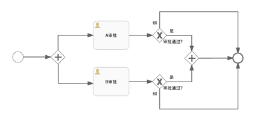

 **流程应用场景**

在云资源的自助化申请、审批、自动化部署、运维操作和手工工单处理过程中，流程定义了这些任务处理过程或服务配置过程的方法和策略。

系统默认提供标准流程，同时支持管理员通过流程设计器定义灵活的各项服务所需的流程，对云主机的申请、运维操作、回收进行控制，对手工工单服务的处理、关闭进行管控。

平台主要有三种类型的流程：审批、手工工单服务和云资源蓝图服务流程。

# 审批流程管理

支持租户管理员通过流程设计器自定义审批流程模板，自定义的具体配置包括审批的层级结构，审批员的指定，审批规则，以及可以执行的操作。

主要功能点

-   支持定义任意多级审批。

-   支持在流程设计器中图形化的设计审批的全过程。

-   支持定义按用户或角色进行审批。

-   支持定义审批时是否可以更改申请的配置。

-   支持在业务组和服务目录层面定义需要审批和通知的环节。

-   支持审批员批量操作审批

-   支持设置每一级审批员可以修改的字段

SmartCMP配置审批流程有两种方法：

1.  一是业务组管理员或租户管理员在业务组配置中添加审批流程A

2.  二是业务组管理员或租户管理员在服务配置中添加审批流程B

3.  当同时使用两种配置方法，审批流程发生冲突，服务配置中审批流程B优先于业务组配置中的审批流程A

在业务组中添加审批流程

可为业务组添加审批流程，配置成功后，业务组成员申请服务部署时，将需要通过审批模板中的流程进行控制。

1.  「组织架构」-「业务组」，点击业务组名称进入业务组详情页面

2.  在「审批流程」标签页，选择 审批模板，点击「保存」

3.  保存后，业务组成员申请服务时会进入审批流程

在服务配置中添加审批流程

在「服务目录」申请服务成功后，如果服务提前配置了审批流程，则服务将进入审批队列，获得审批模板中相关成员的审批意见。审批通过才能执行部署操作。

示例：选择一个服务如"vSphere单节点服务"，在服务配置中为该服务添加审批流程
1.  「服务建模」-「服务配置」，选择服务配置列表中的 "vSphere单节点服务"

2.  点击服务名称，进入编辑服务页面，在「审批配置」页面中，选择审批流程（服务配置过程，审批流程的内容只能查看和选择任意一个流程，不能编辑和删除。）点击「保存」。保存后，申请该服务需要按照该模板的审批流程通过后才能部署。

3.  服务申请者点击左侧导航栏「服务目录」，选择"vSphere单节点服务"，点击进入服务申请页面

4.  填写申请单：包括业务组（卡片共享给全部业务组时需要填写）、服务部署名称（若业务组未设置服务部署命名规则时需填写），部署数量，项目，所有者，部署原因、虚拟机模板等，填写完成后点击「申请」

5.  查看申请状态：进入「服务请求」-「待审批」，申请状态为「待审批」状态

6.  审批：审批模板中指定的审批人登入系统后进入「服务请求」-「待审批」，选择待审批的项目「Note」可选中多个待处理的审批，批量进行操作。

7.  输入审批意见，点击「批准」，弹出确认提示框，点击「是」

8.  查看已审批通过的项目：进入「服务请求」-「已审批」，项目的状态是「审批通过」

9.  申请者登入系统后进入「我的申请」里查看申请的蓝图部署状态变更为「审批通过」

10. 「服务部署」里，项目已经开始部署。部署成功后，在「服务部署」中，选择该服务，可对服务进行被允许的运维操作。

## 自定义并行审批流程 {#自定义并行审批流程 .afff6}

1.  在左侧导航栏点击「服务建模」-「流程配置」，点击添加名称（并行审批流程）、描述、类别（审批流程）等信息之后，使用流程设计器设计和定义您需要启用的审批流程。

2.  选中并行审批流程，进入「流程设计器」以图形化的方式自定义具体策略：

 为您介绍流程设计器的使用方法：左边圆圈代表开始的节点，右边圆圈代表结束节点，并行审批流程设定两个平行审批环节（审批A环节、审批B环节），某申请通过A环节并且通过B环节则审批通过申请成功，两个环节任意一个环节不通过则申请失败。如图所示：

### 审批人

+ 审批人可以选择角色或用户。例如租户管理员、业务组管理员等，也可以指定某个用户作为审批人。
    审批流程中内置角色使用：如果希望审批能够从申请者所在的最底层组织架构开始审批，然后再是资源所在的业务组，为满足这样的审批流程，我们需要在审批流程中添加额外的审批角色。管理员编辑审批流程时，审批人选择「角色」，列出内置审批用角色分别是：

    「一级业务组管理员」：定义为用户所在的最底层业务组的管理员

    「二级业务组管理员」：定义为用户所在的上一层业务组的管理员

    例如：审批流程中添加两级审批流程，第一级角色选择"一级业务组管理员"，第二级角色选择"二级业务组管理员"。审批时可以从申请者资源所在业务组的最底层组织架构开始审批。

2. 审批人选择动态用户，指定“动态用户”${FORM.approver}，为服务自定义表单，在表单配置处绑定approver字段，实现您可以指定任意一个用户作为审批人的需求。

3. 审批人选择基于访问权限，则当这个流程用于部署或云资源操作审批时，只有对该资源有读取权限的用户才能收到审批请求。

审批更改（允许或不允许审批员进行修改）高级配置（可配置审批员可以修改的具体字段，例如CPU、内存等）

审批规则分为两种：第一种是固定值即满足设定数目的审批者则可通过该层级审批，如若有一人拒绝通过则审批失败。第二种为百分比即满足设定的百分比的成员通过此项审批则为通过，若有一人拒绝则审批失败。

对于具体的操作分为审批操作和执行操作：

审批操作是赋予该层级审批人审批的权限，即可以批准、拒绝或退回该申请。执行操作则没有审批权限，不能拒绝或退回，只是作为该层审批的审阅者查看申请内容并确认审批完成。此外，还可以对该层审批者定义是否具备修改申请的权限，如需，请勾选允许修改申请。

## 内置的审批流程 {#内置的审批流程 .afff6}

系统内置租户管理员审批流程、业务组管理员审批流程、审批模板流程，方便用户直接选择所需要的审批流程。

内置的审批流程不可修改和删除，只支持查看和使用，用户自定义添加的审批流程支持修改和删除

-   「租户管理员审批」：定义为用户所在的租户系统内的管理员

-   「业务组管理员审批」：定义为用户所在的业务组的管理员

-   「审批模板流程」：内置的云服务部署审批流程

## 云资源操作许可 {#云资源操作许可 .afff6}

云资源相关操作的权限设置有两种方法。一是在业务组---云资源操作许可中设置；二是在服务配置中进行设置。

服务配置中的云资源操作许可将继承业务组配置，可在此范围内进行更改操作项启用与否和审批流程，业务组中未启用的操作将不能在服务配置处进行启用。

具体操作方法：

1.  「组织架构」-「业务组」，选择「云资源操作许可」标签页，该标签页将列出业务组所有启用的云资源操作。

2.  配置完成，申请服务部署成功后，可在「我的部署」-「云主机」中，进入云主机详情页面，对虚机做相应的运维操作。

在业务组中添加云资源操作许可

可在业务组层面添加云资源的操作许可。

1.  「组织架构」-「业务组」，选择「云资源操作许可」标签页

2.  点击「添加」，出现「添加操作许可」页面

3.  页面左侧第一列为云资源（包括虚机、云硬盘、容器服务、网络资源等）操作列表，第二列为角色列表，第三列为启用状况列表，最右侧一列为审批模板列表

4.  在虚机操作列表中勾选某项操作，如启用，停止，挂起等。在角色列表中选择能进行这项操作的角色，在启用状况列表中可勾选不启用（不能进行该项虚机操作），启用（能进行该项虚机操作）或启用且审批（能进行该项虚机操作且需要在审批模板列表中选择一个审批模板）

5.  「审批模板」选择默认模板（业务组管理员审批模板或租户管理员审批模板）

6.  点击「保存」

>「Note」添加操作许可时可一次性选择多个操作、多个角色，设置相同的启用和审批规则。保存之后可对每一条添加的设置进行修改或删除，或继续添加新的操作许可规则设置。

在服务配置中添加云资源操作许可

1.  点击左侧导航栏「服务建模」-「服务配置」，点击服务部署名称或选择某服务，点击「编辑」，进入服务部署「基本信息」页面

2.  点击「组件配置」标签页，点击Server或WindowsServer节点进入节点详细设置界面

3.  点击「操作许可」标签页，在此可配置云资源中的各项操作，以及配置所需的审批流程。对于每个操作，可针对不同的角色，配置不同的启用规则和审批流程

>「Note」云资源操作许可列表由业务组云资源操作许可继承而来，不勾选「继承业务组配置」可在此范围内删减许可。

4.  若勾选「继承业务组配置」，则与在业务组中的云资源操作配置相同，具体配置请参照上文在业务组中添加云资源操作许可

5.  若不勾选「继承业务组配置」，在每项操作后进行编辑，选择启用状况以及审批模板后点击「保存」

## 服务部署操作许可 {#服务部署操作许可 .afff6}

服务部署操作许可规定了对该服务部署成功后，可进行的运维操作以及针对该操作的审批流程。

在「我的部署」-「服务部署」页面，选择一个服务部署，列表页面顶部将显示该服务部署可进行的操作。

在业务组中添加服务部署操作许可

1.  「组织架构」-「业务组」，点击业务组名称，进入概况页面，选择「服务部署操作许可」标签页

2.  点击「添加」，出现「添加操作许可」页面

3.  页面左侧第一列为操作列表，第二列为角色列表，第三列为启用状况列表，最右侧一列为审批模板列表

4.  在操作列表中勾选某项操作，如更改所有者，启动服务部署，停止服务部署等。在角色列表中选择能进行这项操作的角色，在启用状况列表中可勾选不启用（不能进行该项操作），启用（能进行该项操作）或启用且审批（能进行该项操作且需要在审批模板列表中选择一个审批模板）

5.  点击「保存」，成功为业务组添加服务部署操作许可

在服务配置中添加服务部署操作许可

服务部署操作许可规定了对该服务部署成功后可启用服务部署管理中的各项操作，以及配置所需的审批流程。对于每个操作，可针对不同的角色，配置不同的启用规则和审批流程。

1.  点击左侧导航栏「服务建模」-「服务配置」，点击服务部署名称，进入服务部署「基本信息」页面

2.  点击「服务部署操作许可」标签页，在此可配置服务部署中的各项操作，以及配置所需的审批流程。对于每个操作，可针对不同的角色，配置不同的启用规则和审批流程

>「Note」服务部署操作许可列表由业务组服务部署操作许可继承而来，不勾选「继承业务组配置」可在此范围内删减许可。

1.  若勾选「继承业务组配置」，则与在业务组中的服务部署操作配置相同

2.  若不勾选「继承业务组配置」，在每项操作后进行编辑，选择启用状况，最后点击「保存」

# 手工工单服务流程管理

手工工单服务流程定义工单任务具体的处理步骤、服务团队、服务人员和流转方式。

## 内置的手工工单服务流程 {#内置的手工工单服务流程 .afff6}

平台内置的手工工单服务流程包括标准手工工单，标准事件管理流程、自动化服务流程，同时支持租户管理员自定义服务流程。

内置的手工工单流程不可修改和删除，只支持查看和使用，用户自定义添加的手工工单服务流程支持修改和删除

标准事件流程 Incident
Report，用来解决出现的IT资源相关的问题，例如服务器down了，网络IP地址冲突等等。流程类型属于手工工单服务。

具体流程如图：

1.  标准事件流程主要环节包括：一线处理支持、二线处理支持、关闭服务。

一线和二线的任务处理环节可以指定不同团队。一线处理支持收到事件之后，可以进行的操作如下：

-   直接处理，问题解决完成之后，填写问题或故障的原因或解决办法的说明

-   转派给其它服务团队

-   升级：升级到二线进行处理，并且填写升级说明

二线支持处理收到事件之后，可以进行的操作如下：

-   直接处理，问题解决完成之后，可以填写问题的原因和解决方法的说明

-   转派给其它团队

2.  邮件通知用户问题已经解决，当发起手工工单服务申请的用户收到问题解决的邮件之后，如果用户满意此次手工工单服务选择进行服务关闭则工单状态改变为「已处理」；如果用户选择将工单重新处理，则返回给上一级的处理人。（在邮件通知用户的上一步中谁处理的就返回给谁，二线处理的返回给二线，一线的返回给一线），工单状态改变为「处理中」

# 云资源蓝图服务流程

## 内置的标准云服务部署流程 {#内置的标准云服务部署流程 .afff6}

定义云资源自动化部署的流程，属于系统内置的云资源蓝图服务流程。

# 流程配置

为满足不同服务项的服务流程要求，平台内置多种服务流程和自定义添加服务流程。系统管理员和租户管理员可以进入「配置管理」-「服务流程配置」页面，进行添加、查看、流程设计、启用、禁用、编辑和删除流程模板的操作，下文为您介绍具体操作步骤。

>「Note」内置的服务流程不支持编辑、流程设计、启用、禁用、删除操作，具体的内置流程详细信息请参考：[流程应用场景](https://cloudchef.github.io/doc/AdminDoc/05服务建模/流程配置.html)

## 自定义添加流程

1.  在左侧导航栏点击「服务建模」-「流程配置」，点击「添加」按钮

2.  进入新增流程页面，输入自定义流程的基本信息：流程名称、描述、类别（云资源蓝图服务、手工工单服务和审批流程三种类型），保存名称、类别等信息之后可使用流程设计器设计和定义您需要启用的流程。

 为您介绍创建基础流程图的方法：左边圆圈代表开始的节点，右边圆圈代表结束节点，工单任务处理流程之后可以自定义任务一、自定义任务二、或其余的自定义任务。如图所示：

3.  点击保存按钮，自定义服务流程创建成功。

## 编辑、删除服务流程

在左侧导航栏点击「服务建模」-「流程配置」选中一个流程，点击「编辑」-「流程设计」直接进入服务流程设计器的UI，显示process的流程，以可视化的方式更改设计流程图。

>「Note」选中的流程必须是自定义添加的流程，系统内置的流程不支持流程设计

在左侧导航栏点击「服务建模」-「服务流程管理」，选择一个服务流程，点击「删除」按钮，弹出删除提示框点击「是」，提示删除服务流程成功。

>「Note」当流程定义正在某一个服务配置中使用时，删除服务流程失败

## 启用、禁用服务流程

在左侧导航栏点击「服务建模」-「服务流程管理」，选择一个服务流程，点击「启用」按钮，即可启用该服务流程。

在左侧导航栏点击「服务建模」-「服务流程管理」，选择一个服务流程，点击「禁用」按钮，即可禁止使用该服务流程。

>「Note」系统默认的流程主要有两种：标准云服务部署和标准手工工单。这两种内置流程默认启用，不可以禁用、修改或者删除。
