**流程应用场景**

在云资源的自助化申请、审批、自动化部署、运维操作和手工工单处理过程中，流程定义了这些任务处理过程或服务配置过程的方法和策略。系统默认提供标准流程，同时支持您通过流程设计器定义灵活的各项服务所需的流程，对云主机的申请、运维操作、回收进行控制，对手工工单服务的处理、关闭进行管控，主要流程包括：审批、手工工单服务和云资源蓝图服务流程等等。

# 备份流程

系统支持基于Veeam实现快速、可靠地备份vSphere云平台的云主机，并支持恢复单个文件、整个虚拟机、应用程序等等，确保服务的安全性和高可用性。

## 核心使用场景
备份：是一个即时发生的备份（即手工备份），当您为vSphere的Instance组件配置了备份操作后，您可以在 我的资源 - 云主机 选择某个vSphere云主机执行备份操作，并可以在操作历史中查看备份操作的执行过程和结果（备份成功或是失败）。 例如：将当前整个云主机进行备份，类似于打快照。

恢复：即支持选择备份点，在当前的云主机中进行恢复（备份点是一个列表， 允许用户进行选择备份文件的名称， 时间信息，更多额外的参数需要配置表单，点击备份点之后， 触发一次恢复的过程把备份点的数据恢复到当前云主机），您可以在云主机的操作历史中查看恢复操作的执行过程和结果（恢复成功或是失败）。 例如：实施备份的云主机副本恢复到当前云端虚拟机。

## 备份流程
系统支持用户上传或者导出流程配置文件，也支持通过流程设计器自定义备份流程模板。

在左侧导航栏点击 服务设计 - 流程配置 ，点击添加名称（Veeam备份流程）、描述、类别（标准工作流）等信息之后，点击保存按钮，进入流程设计界面。

您可以以图形化的方式设计和定义您需要启用的备份流程，以设计Veeam备份流程为例，

1. 设计备份流程
 + 拖动组件至设计界面，连接各个组件，并为不同组件设置参数。
    + Intergration task的class属性值：设置为“io.cloudchef.process.service.TaskDelegate.ProcessTaskDelegate”
    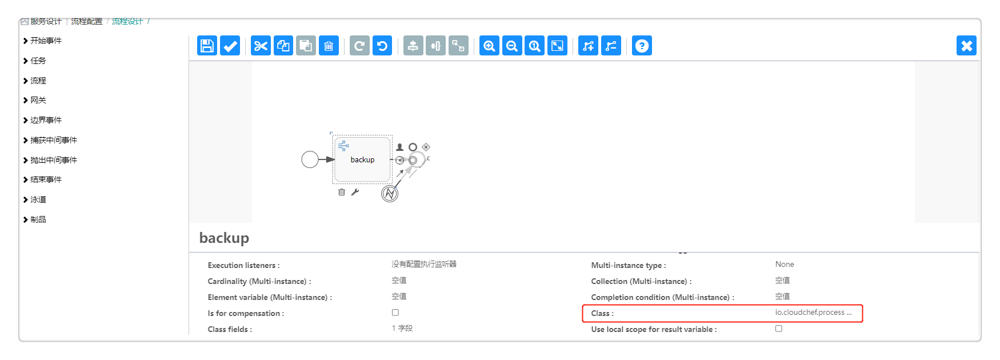

2. 点击验证按钮，验证设计的备份流程，如验证无问题，可保存该流程。
 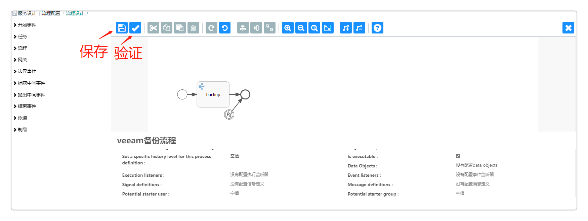

3. 在流程步骤中配置流程任务，为备份流程配置第三方系统。
 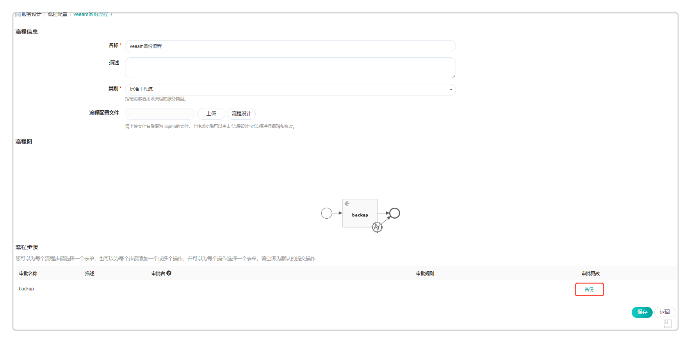
 - 任务类型选择第三方系统集成任务；
 - 选择启动该第三方系统集成任务时通知的用户；
 - 输入参数配置：
     - 类型：选择第三方系统类型Veeam，如无法选择，请先在 系统管理 - 第三方系统集成 中对接第三方系统。
     - 入口：选择具体的输入参数入口,本流程配置中请选择默认值 - Veeam。
 - 选择具体操作，本流程配置中请选择“创建备份”。
 - 配置操作参数
    - 来源：选择从上下文获取全局参数值。
    - 值：请选择systemContext - resource - externalHostname。
    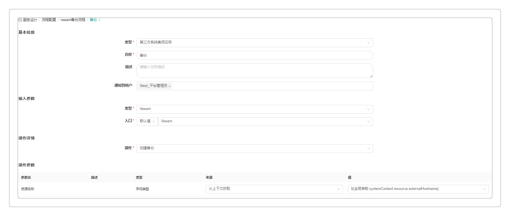 

4.  设置第三方备份任务执行的配置：
   - 超时时间：设置任务失败后超时的时间，在超过设置的时间后，会触发设置的执行任务；
   - 执行选项: 可选择任务失败后继续执行该任务或者在任务失败后直接结束流程；
   - 执行方式：可选择默认执行或者条件执行，如选择条件执行，请输入触发任务执行的条件。
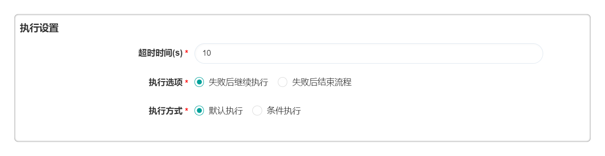

5. 点击 保存 按钮，生成Veeam备份流程。请点击 服务设计 - 组件库 ，选择vSphere的Instance组件，为其配置该备份流程，则能够实现为云主机进行备份操作。

以设计Veeam恢复备份流程为例，

1. 设计备份流程
 + 拖动组件至设计界面，连接各个组件。

2. 点击验证按钮，验证设计的备份流程，如验证无问题，可保存该流程。
 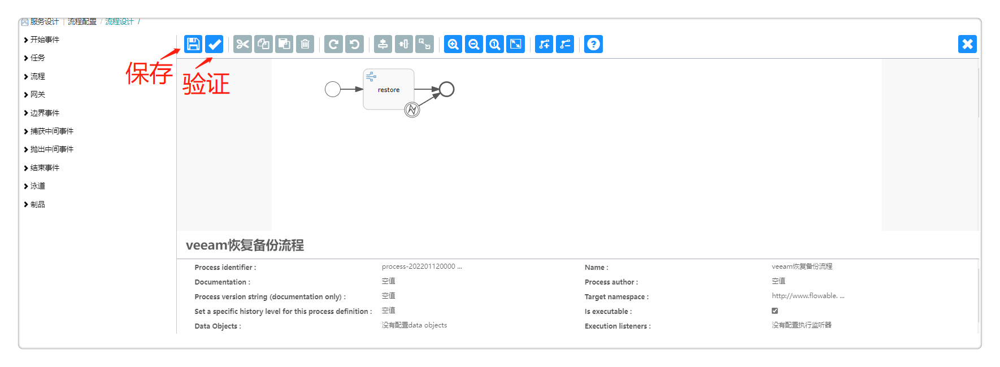

3. 在流程步骤中配置流程任务，为备份流程配置第三方系统。
 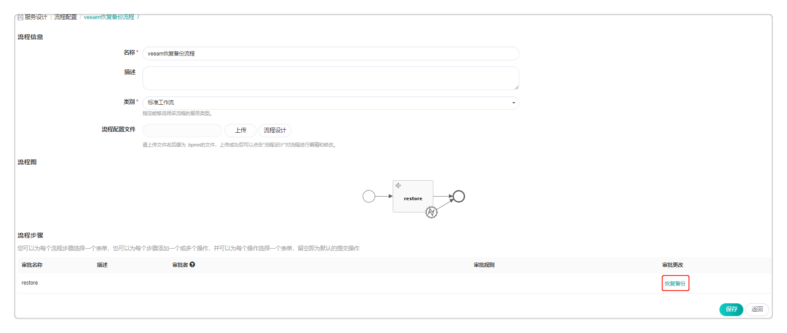
 - 任务类型选择第三方系统集成任务；
 - 选择启动该第三方系统集成任务时通知的用户；
 - 输入参数配置：
     - 类型：选择第三方系统类型Veeam，如无法选择，请先在 系统管理 - 第三方系统集成 中对接第三方系统。
     - 入口：选择具体的输入参数入口,本流程配置中请选择默认值 - Veeam。
 - 选择具体操作，本流程配置中请选择“恢复备份”。
 - 配置操作参数
    - 来源：选择默认值。
     

4.  设置第三方恢复备份任务执行的配置：
   - 超时时间：设置任务失败后超时的时间，在超过设置的时间后，会触发设置的执行任务；
   - 执行选项: 可选择任务失败后继续执行该任务或者在任务失败后直接结束流程；
   - 执行方式：可选择默认执行或者条件执行，如选择条件执行，请输入触发任务执行的条件。

5. 点击 保存 按钮，生成Veeam恢复备份流程。请点击 服务设计 - 组件库 ，选择vSphere的Instance组件，为其配置该恢复备份流程，则能够实现为云主机进行恢复备份的操作。

# 审批流程

系统支持用户上传或者导出流程配置文件，也支持通过流程设计器自定义审批流程模板，自定义的具体配置包括审批的层级结构，审批员的指定，审批规则，以及可以执行的操作。

主要功能点：

-   支持定义任意多级审批。

-   支持在流程设计器中图形化的设计审批的全过程。

-   支持定义按用户或角色进行审批。

-   支持定义审批时是否可以更改申请的配置。

-   支持在业务组和服务目录层面定义需要审批和通知的环节。

-   支持审批员批量操作审批

-   支持设置每一级审批员可以修改的字段

-   支持通过企业微信、钉钉审批，审批员可通过企业微信或钉钉收到审批消息通知，并在审批指定应用（在企业微信、钉钉中创建的第三方企业应用）完成审批流程。
    >「Note」 您需在 通知配置 中配置企业微信或钉钉的审批应用相关参数，具体请参考[通知配置](https://cloudchef.github.io/doc/AdminDoc/09系统管理/#通知配置)

## 配置审批流程

SmartCMP配置审批流程有两种方法：

+ 一是在业务组配置中添加审批流程A

+ 二是在服务配置中添加审批流程B

>「Note」 当同时使用两种配置方法，审批流程发生冲突，服务配置中审批流程B优先于业务组配置中的审批流程A。

### 在业务组中添加审批流程

您可为业务组添加审批流程，配置成功后，业务组成员申请应用栈时，将需要通过审批模板中的流程进行控制。

1.   组织架构 - 业务组 ，点击业务组名称进入业务组详情页面

2.  在审批流程标签页，选择 审批模板，点击保存

3.  保存后，业务组成员申请服务时会进入审批流程

### 在服务配置中添加审批流程

在 服务目录 申请服务成功后，如果服务提前配置了审批流程，则服务将进入审批队列，获得审批模板中相关成员的审批意见。审批通过才能执行部署操作。

以在服务配置中为"vSphere单节点服务"添加审批流程及用户申请该服务为例：

1. 在 服务建模 - 服务配置 选择服务配置列表中的 "vSphere单节点服务"。

2. 点击服务名称，进入编辑服务页面，在审批配置标签页中，选择审批流程（在服务配置过程中，审批流程的内容只能查看和选择任意一个流程，不能编辑和删除）点击保存。保存后，申请该服务需要按照该模板的审批流程通过后才能部署。

3. 服务申请者点击左侧导航栏 服务目录 ，选择"vSphere单节点服务"，点击进入服务申请页面。

4. 填写申请单：包括业务组（卡片共享给全部业务组时需要填写）、应用栈名称（若业务组未设置应用栈命名规则时需填写），部署数量，项目，所有者，部署原因、虚拟机模板等，填写完成后点击申请。

5. 查看申请状态：进入 服务请求 - 待审批 ，申请状态为待审批状态。

6. 审批：审批模板中指定的审批人登入系统后进入 服务请求 - 待审批 ，选择待审批的项目。
    >「Note」可选中多个待处理的审批，批量进行操作。

7. 输入审批意见，点击批准，弹出确认提示框，点击是。

8. 查看已审批通过的项目：进入 服务请求 - 已审批 ，项目的状态是 审批通过 。

9. 申请者登入系统后进入 我的申请 里查看申请的蓝图部署状态变更为 审批通过 。应用栈里，项目已经开始部署。部署成功后，在应用栈中，选择该服务，可对服务进行被允许的运维操作。

## 内置的审批流程 {#内置的审批流程}

系统内置审批模板流程，方便用户直接选择所需要的审批流程。

内置的审批流程不可修改和删除，只支持查看和使用，用户自定义添加的审批流程支持修改和删除。

-   审批模板流程：内置的云服务部署审批流程

## 自定义第三方审批流程
在左侧导航栏点击 服务设计 - 流程配置 ，点击添加名称（第三方审批流程）、描述、类别（审批流程）等信息之后，点击保存按钮，进入流程设计界面。

您可以以图形化的方式设计和定义您需要启用的审批流程，以设计钉钉审批流程为例，

1. 设计审批流程
 + 拖动组件至设计界面，连接各个组件，并为不同组件设置参数。
    + Intergration task的class属性值：设置为“io.cloudchef.process.service.TaskDelegate.GenericTaskDelegate”
    
    + 定时器的轮询时间：设置为“PT1S"
    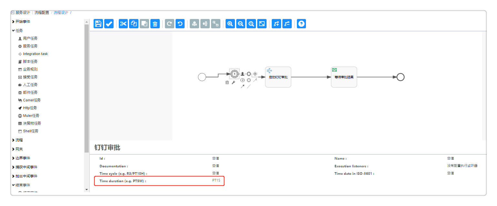
    + 等待任务的Id: 设置为“waitApprovalTask”
    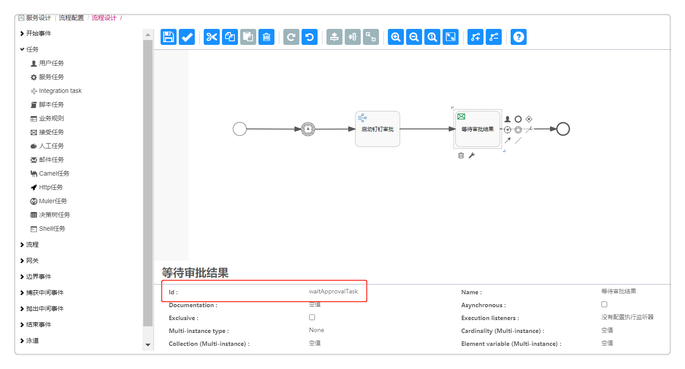

2. 点击验证按钮，验证设计的审批流程，如验证无问题，可保存该流程。
 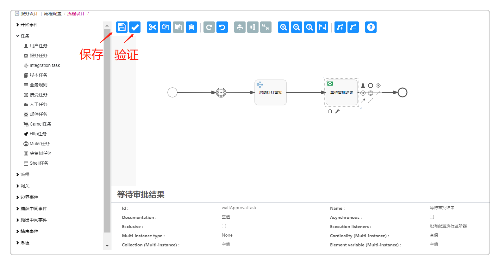

3. 在流程步骤中配置流程任务，为审批流程配置第三方系统。
 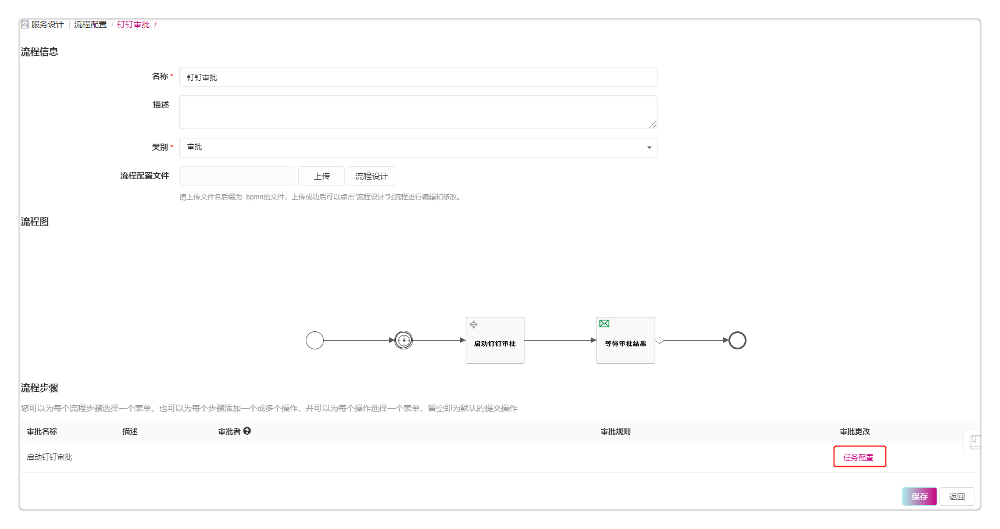
 - 任务类型选择第三方系统集成任务；
 - 选择启动该第三方系统集成任务时通知的用户；
 - 输入参数配置：
     - 类型：选择第三方系统类型，如无法选择，请先在 系统管理 - 第三方系统集成 中对接第三方系统。
     - 入口：选择具体的输入参数入口。
 - 选择具体操作，包括查询，刷新状态，创建，导入，配置，启动等等。
 - 配置操作参数
    - 审批上下文：选择从上下文获取全局参数值。
    - 模板id: 手动输入模板id值。
    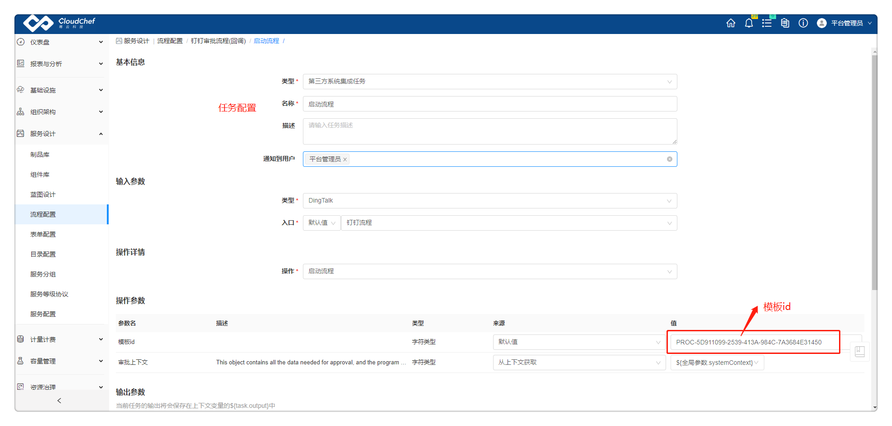 

4.  设置第三方审批任务执行的配置：
   - 超时时间：设置任务失败后超时的时间，在超过设置的时间后，会触发设置的执行任务；
   - 执行选项: 可选择任务失败后继续执行该任务或者在任务失败后直接结束流程；
   - 执行方式：可选择默认执行或者条件执行，如选择条件执行，请输入触发任务执行的条件。
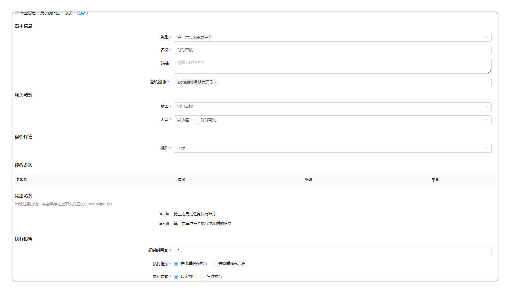

以设计企业微信审批流程为例，
1. 设计审批流程
 + 拖动组件至设计界面，连接各个组件，并为不同组件设置参数。
    + Intergration task的class属性值：设置为“io.cloudchef.process.service.TaskDelegate.ProcessTaskDelegate”
    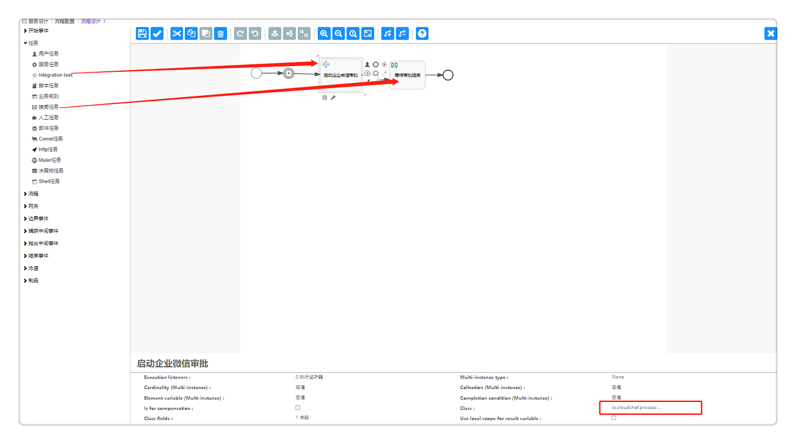
    + 接受任务的Id: 设置为“waitApprovalTask”
    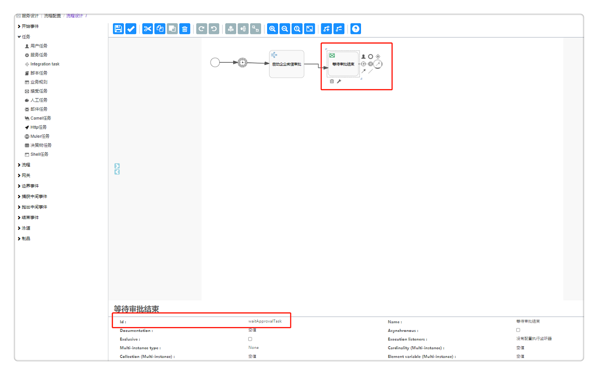 

2. 点击验证按钮，验证设计的审批流程，如验证无问题，可保存该流程。

3. 在流程步骤中配置流程任务，为审批流程配置第三方系统。
 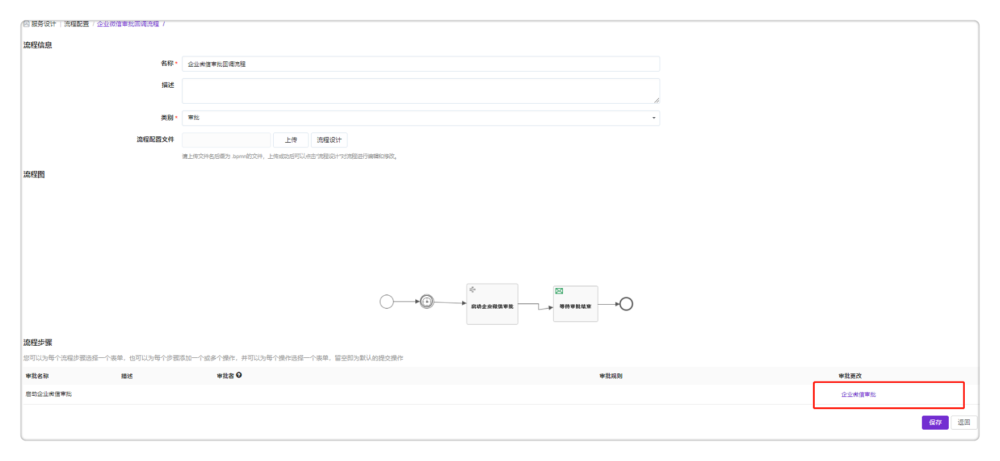
 - 任务类型选择第三方系统集成任务；
 - 选择启动该第三方系统集成任务时通知的用户；
 - 输入参数配置：
     - 类型：选择第三方系统类型，如无法选择，请先在 系统管理 - 第三方系统集成 中对接第三方系统。
     - 入口：选择具体的输入参数入口。
 - 选择具体操作，包括查询，刷新状态，创建，导入，配置，启动等等。
 - 配置操作参数
    - 审批上下文：选择从上下文获取全局参数值。
    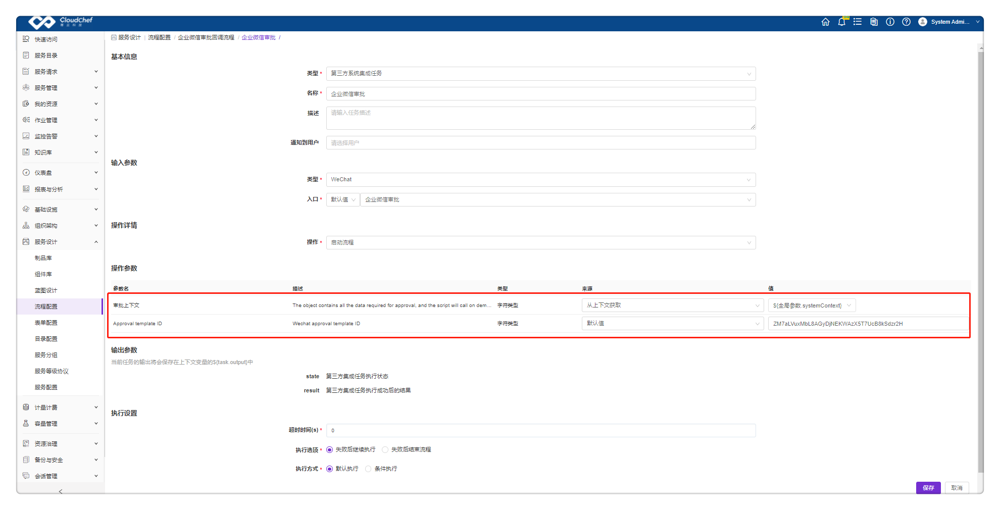
    -  Approval template ID: 请在登录企业微信后，点击应用管理配置一个审批模板，下图红框中的字符串即为template ID。
    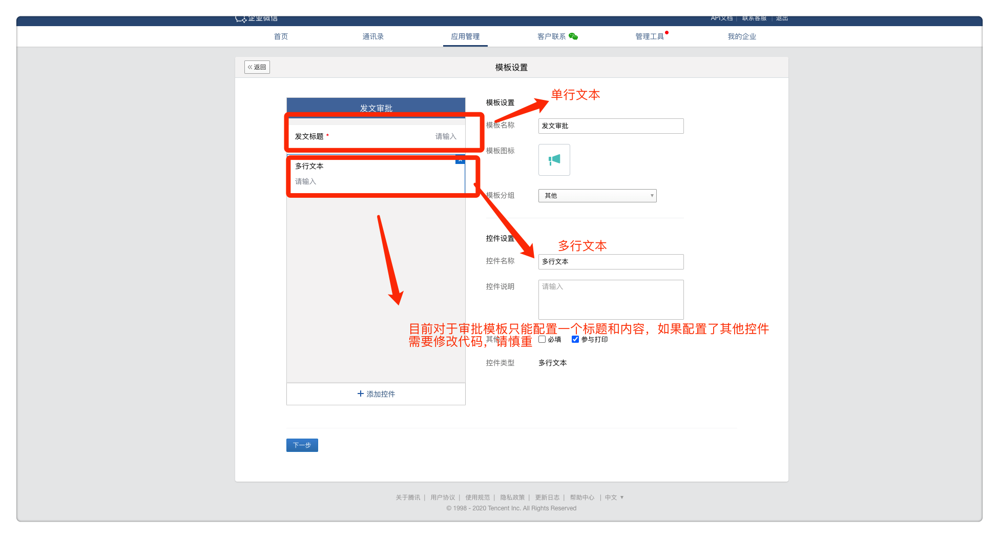 
    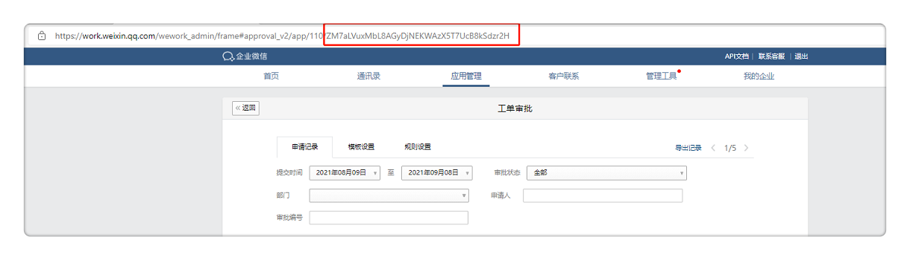 
    
4. 设置第三方审批任务执行的配置：
   - 超时时间：设置任务失败后超时的时间，在超过设置的时间后，会触发设置的执行任务；
   - 执行选项: 可选择任务失败后继续执行该任务或者在任务失败后直接结束流程；
   - 执行方式：可选择默认执行或者条件执行，如选择条件执行，请输入触发任务执行的条件。

## 自定义并行审批流程 {#自定义并行审批流程}

在左侧导航栏点击 服务建模 - 流程配置 ，点击添加名称（并行审批流程）、描述、类别（审批流程）等信息之后，使用流程设计器设计和定义您需要启用的审批流程。
选中并行审批流程，进入流程设计器以图形化的方式自定义具体策略：
为您介绍流程设计器的使用方法：左边圆圈代表开始的节点，右边圆圈代表结束节点，并行审批流程设定两个平行审批环节（审批A环节、审批B环节），某申请通过A环节并且通过B环节则审批通过申请成功，两个环节任意一个环节不通过则申请失败。如图所示：

1. 配置审批人
    + 审批人可以选择角色或用户。
      - 审批流程中内置角色使用：如果希望审批能够从申请者所在的最底层组织架构开始审批，然后再是资源所在的业务组，需要在审批流程中添加额外的审批角色。您在编辑审批流程时，审批人选择 角色 ,例如：审批流程中添加两级审批流程，第一级角色选择"一级业务组管理员"，第二级角色选择"二级业务组管理员"。审批时可以从申请者资源所在业务组的最底层组织架构开始审批。
    + 审批人选择动态用户，指定“动态用户”${FORM.approver}，为服务自定义表单，在表单配置处绑定approver字段，实现您可以指定任意一个用户作为审批人的需求。
    + 审批人选择基于访问权限，则当这个流程用于部署或云资源操作审批时，只有对该资源有读取权限的用户才能收到审批请求。
2. 审批更改（允许或不允许审批员进行修改）高级配置（可配置审批员可以修改的具体字段，例如CPU、内存等）
3. 审批规则分为两种：第一种是固定值即满足设定数目的审批者则可通过该层级审批，如若有一人拒绝通过则审批失败。第二种为百分比即满足设定的百分比的成员通过此项审批则为通过，若有一人拒绝则审批失败。
4. 在审批更改中点击任务配置，为审批流程配置第三方系统，具体配置步骤请参考[第三方系统集成任务配置](https://cloudchef.github.io/doc/AdminDoc/11作业管理/流水线作业.html###第三方系统集成任务)

对于具体的操作分为审批操作和执行操作：

审批操作是赋予该层级审批人审批的权限，即可以批准、拒绝或退回该申请。执行操作则没有审批权限，不能拒绝或退回，只是作为该层审批的审阅者查看申请内容并确认审批完成。此外，还可以对该层审批者定义是否具备修改申请的权限，如需，请勾选允许修改申请。

# 手工工单服务流程{#内置的手工工单服务流程}

手工工单服务流程定义工单任务具体的处理步骤、服务团队、服务人员和流转方式。

服务团队建立完成之后，通过服务配置创建工单，将工单发布到服务目录，完成服务卡片的发布和服务目录的管理。以下内容将为您详细介绍配置手工工单服务流程、配置手工工单服务和发布手工工单服务的具体步骤。

## 内置的手工工单服务流程

平台内置的手工工单服务流程包括标准事件管理流程、标准变更工单流程、标准问题工单流程、标准请求管理流程、标准任务执行流程和自动化服务流程。

+ 标准事件管理流程，用来解决出现IT资源相关的问题，例如：服务器意外关闭，网络出现中断问题等等，网络IP地址冲突等等。流程类型属于手工工单服务。
+ 标准请求管理流程：需要IT人工介入的服务，例如：申请重新设置密码的手工工单服务。
+ 自动化服务流程：用户申请手工工单服务，服务通过审批之后，自动化创建用户申请的资源，例如：创建项目，创建IP池，等等。

>「Note」内置的手工工单服务流程，不支持修改和删除，只支持查看和使用，用户自定义添加的手工工单服务流程支持修改和删除

## 自定义添加手工工单服务流程
系统支持用户上传或者导出流程配置文件，也支持通过流程设计器自定义手工工单服务流程模板。

在左侧导航栏点击 服务建模 - 流程配置 ，点击添加，输入名称（手工工单服务流程）、描述、选择类别（手工工单服务）、上传流程配置文件。

# 标准事件流程 Incident
Incident，用来解决出现的IT资源相关的问题，例如服务器down了，网络IP地址冲突等等，流程类型属于事件工单 。

标准事件流程主要环节包括：一线处理支持、二线处理支持、关闭服务。

1. 一线和二线的任务处理环节可以指定不同团队。平台在流程步骤已默认配置以下操作按钮，一线处理支持在处理工单时可进行如下操作：

    -   解决：直接处理，问题解决完成之后，填写问题或故障的原因或解决办法的说明

    -   转派：转派给其它服务团队

    -   升级：升级到二线进行处理，并且填写升级说明

2. 二线支持处理收到事件工单之后，可以进行的操作如下：

    -   解决：直接处理，问题解决完成之后，可以填写问题的原因和解决方法的说明

    -   转派：转派给其它团队

3. 服务关闭：此流程步骤需要申请者确认问题是否已经得到解决。平台在流程步骤已默认配置以下操作按钮。
   -    关闭：如果申请者满意此次处理结果，则可以选择关闭工单，工单状态改变为 已完成。
  
   -    重新处理：如果申请者选择将工单重新处理，则返回给上一级的处理人，工单状态改变为 处理中。

# 标准请求管理流程 
标准请求管理流程主要环节包括：服务处理、确认关闭。

1. 您可以为服务处理的步骤选择一个表单，也可以为该步骤添加以下操作按钮或者自定义新的操作按钮，则处理人在处理工单时可进行如下操作：
  
   -  完成：直接处理，问题解决完成之后，填写问题或故障的原因或解决办法的说明。
   
   -  转派：转派给其它服务团队。

2.  服务关闭：此流程步骤需要申请者确认问题是否已经得到解决。您可以在此添加以下操作按钮或者自定义新的操作按钮。
   -    关闭：如果申请者满意此次处理结果，则可以选择关闭工单，工单状态改变为 已处理。
  
   -    重新处理：如果申请者选择将工单重新处理，则返回给上一级的处理人。

# 标准变更工单流程
标准变更管理流程主要环节包括：方案计划、审核方案、变更审批、实施解决、确认关闭。您可以为各个流程步骤设计表单。

1. 您可以为方案计划步骤添加以下操作按钮或者自定义新的操作按钮，则处理人在确认变更方案时可进行如下操作：
  
   -  提交：确认提交申请人变更的方案。

2. 审核方案：此流程步骤需要处理人审核变更的方案。您可以在此添加以下操作按钮或者自定义新的操作按钮。

   -  同意：如果处理人同意变更的方案，则工单转至下一个流程步骤：变更审批。
   
   -  拒绝：如果处理人不同意变更的方案，则工单退回至方案计划步骤进行修改。
   
3. 变更审批：此流程步骤需要审批人审批变更操作，您可以在此添加以下操作按钮或者自定义新的操作按钮。
  
   -  同意：如果审批人同意变更的方案，则工单转至下一个流程步骤：实施解决。
   
   -  拒绝：如果审批人不同意变更的方案，则工单退回至审核方案步骤。

4.  确认关闭：此流程步骤需要申请者确认问题是否已经得到解决。您可以在此添加以下操作按钮或者自定义新的操作按钮
   -    关闭：如果申请者满意此次处理结果，则可以选择关闭工单，工单状态改变为 已处理。
  
   -    重新处理：如果申请者选择将工单重新处理，则返回给上一级的处理人。

# 标准问题工单流程
标准问题工单流程主要环节包括：根因分析、解决问题、审核。您可以为各个流程步骤设计表单。

1. 根因分析：此流程步骤需要处理人分析问题产生的原因。您可以在此添加以下操作按钮或者自定义新的操作按钮。

 - 开始修复：分析问题产生的原因，并开始解决问题

 - 标记重复：分析问题产生的原因，并标记该原因为重复的，结束流程

 - 取消：直接结束流程

2. 解决问题 ：此流程步骤需要处理人解决问题或接受风险。您可以在此添加以下操作按钮或者自定义新的操作按钮。
 
 - 解决：分析问题产生的原因，并开始解决问题

 - 标记重复：分析问题产生的原因，并标记该原因为重复的，结束流程

3. 审核：此流程步骤需要申请人判断问题是否已经解决。您可以在此添加以下操作按钮或者自定义新的操作按钮。
   
   -  完成：如果申请者满意此次处理结果，则可以选择关闭工单。
  
   -  重新分析：如果申请者选择重新分析，则工单返回至根因分析步骤。

# 云资源蓝图服务流程{#内置的标准云服务部署流程}

内置的标准云服务部署流程 ：定义云资源自动化部署的流程，属于系统内置的云资源蓝图服务流程。

配置云资源蓝图服务流程，为满足不同服务项的服务流程要求，平台内置多种服务流程和自定义添加服务流程。系统支持用户上传或者导出流程配置文件，也支持通过流程设计器自定义云服务部署流程模板，您可以进入 服务设计 - 流程配置 页面，进行添加、查看、流程设计、启用、禁用、编辑和删除流程模板的操作，下文为您介绍具体操作步骤。

>「Note」内置的服务流程不支持编辑、流程设计、启用、禁用、删除操作，具体的内置流程详细信息请参考：[流程应用场景](https://cloudchef.github.io/doc/AdminDoc/05服务建模/流程配置.html)

1.  在左侧导航栏点击 服务建模 - 流程配置 ，点击添加按钮

2.  进入新增流程页面，输入自定义流程的基本信息：流程名称、描述、类别（云资源部署服务、手工工单服务、审批流程和任务执行四种类型），保存名称、类别等信息之后可使用流程设计器设计和定义您需要启用的流程。点击保存按钮，自定义服务流程创建成功。

为您介绍创建基础流程图的方法：左边圆圈代表开始的节点，右边圆圈代表结束节点，工单任务处理流程之后可以自定义任务一、自定义任务二、或其余的自定义任务。如图所示：

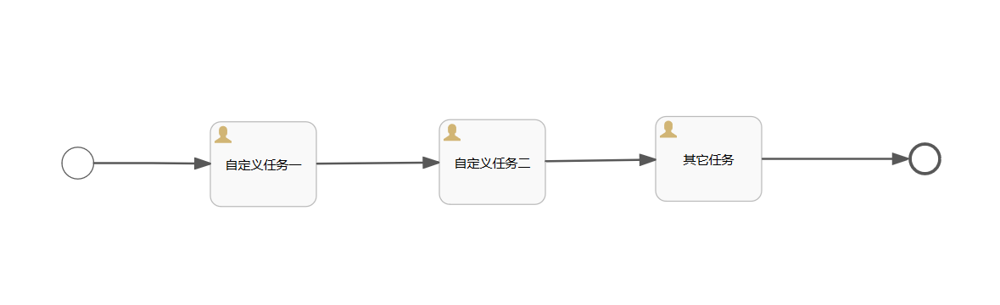

# 标准任务执行流程
系统支持用户上传或者导出流程配置文件，也支持通过流程设计器自定义标准任务执行流程模板。

内置的标准任务执行流程：定义任务自动化执行的流程，具体的任务类型包括：蓝图部署任务、云资源任务、Jenkins任务、脚本任务、等待任务等等。通过服务配置，配置服务具体的类型，以及绑定标准任务执行流程，配置完成后发布到服务目录，通过申请服务卡片来直接执行一个任务。

# 编辑、删除服务流程

在左侧导航栏点击 服务建模 - 流程配置 选中一个流程，点击 编辑 - 流程设计 直接进入服务流程设计器的UI，显示process的流程，以可视化的方式更改设计流程图。

>「Note」选中的流程必须是自定义添加的流程，系统内置的流程不支持流程设计

在左侧导航栏点击 服务建模 - 流程配置 ，选择一个服务流程，点击删除按钮，弹出删除提示框点击是，提示删除服务流程成功。

>「Note」当流程定义正在某一个服务配置中使用时，删除服务流程失败

# 启用、禁用服务流程

在左侧导航栏点击 服务建模 - 流程配置 ，选择一个服务流程，点击启用按钮，即可启用该服务流程。

在左侧导航栏点击 服务建模 - 流程配置 ，选择一个服务流程，点击禁用按钮，即可禁止使用该服务流程。

>「Note」系统默认的流程主要有两种：标准云服务部署和标准手工工单。这两种内置流程默认启用，不可以禁用、修改或者删除。
