**组件库**
SmartCMP云管平台的云组件拥有“将任意资源”提供服务化的核心能力，不仅内置丰富的组件资源和常用的操作，同时还拥有高度可扩展的能力，根据用户需求灵活自定义添加组件资源和配置运维操作。

组件的定义采用面向对象的设计方法，使用统一的数据结构进行建模，并将配置属性标准化。软件架构师也可以根据需要创建可重用的软件组件，并使用操作脚本准确指定在部署操作过程，支持随时重新编写这些操作脚本并实时发布，同步更新已安装的软件组件。

通过定义属性并将属性作为参数传递给操作脚本，以便在不同的环境中部署软件组件，而无需修改脚本。支持使用Ansible， Terraform， Shell， Python， Json， Ruby等语言来自定义软件组件，并且自定义软件组件的生命周期操作（包含创建，配置，启动，停止，删除、备份、巡检等等），系统内置创建，配置和启动操作，在移除的时候调用停止和删除操作，并且支持灵活自定义操作，实现软件和应用的全生命周期管理。

SmartCMP中的组件由属性和接口构成，软件组件由脚本、属性、元数据、生命周期管理四项共同组成，灵活的软件组件，可以关联主流制品库。具体概念如下：

 -   脚本：生命周期的每个阶段都通过脚本来进行控制，得益于强大的底层类库，SmartCMP支持包括Ansible， Terraform， Shell， Powershell， Json， Yaml， Python， Text等方式，可以快速将应用的部署整合在云管平台内。

 -   属性：不同应用系统对资源的需求和容量的控制都会有自定义要求，属性项可以按照不同系统的部署要求传递自定义参数。软件架构师可以通过设置自定义属性，将应用组件需要您填写的配置参数暴露在申请界面上，SmartCMP云管理平台会自动化调用相关参数执行应用的安装配置。

 -   操作：SmartCMP云管理平台可以对应用系统的创建、配置、启动、停止、删除等过程进行完整的生命周期管理。通过脚本对应，完成从安装部署到到期卸载的所有软件配置工作。

 -   软件组件与主流制品库关联，支持对接Jfrog Artifactory， Nexus制品库，实现软件版本的更新。
 
 -   组件也是构成蓝图的基本单元，SmartCMP自定义的软件组件，可以可视化的放置到SmartCMP的蓝图 软件架构师可以通过组件管理界面管理组件。在左边导航选择 服务建模 - 组件库 ，右侧浏览区域出现所有组件列表。通过拖拽的方式组合组件，形成蓝图部署服务的编排。

# 丰富的组件库{#组件库}

## 开箱即用的组件资源

SmartCMP云管平台内置大量常用的组件资源，包括IaaS（不同云平台的云主机、网络、存储等等）、PaaS（服务器、数据库、RDS等等）、容器（Kubernetes、Docker）、软件(MySQL、Oracle、Nginx等等)、代理（监控代理），不同类型资源在统一的界面进行创建和管理，采用树形结构的分组目录，支持自定义组件分组，支持二次编辑、快速复制、导入、导出组件。

树形展示，支持组件的分组目录，支持树形结构，可以在创建组件和组件列表搜索树形展示。在组件列表页的树形图可以增删改，已存在组件目录不能删除。树形结构是一个逻辑的文件夹的概念，与组件的资源类型没有绑定的关系。

+ IaaS  用于描述所有的Iaas的组件， 每个组件有自己的云平台类型，Iaas下的二级节点主要包括： 计算， 网络， 存储， 对象存储， 负载均衡， 安全组， 文件系统等。平台开箱即用常用的子类。

+ PaaS   用于描述所有的Pass的组件， 每个组件有自己的云平台类型，Paas下的二级节点主要包括云平台提供的服务能力，
平台开箱即用常用的子类。

+ 容器 Container，用于描述所有的容器平台的组件，例如：Docker，Kubernetes。

+ 软件组件 用于描述所有的Software的组件， 每个组件有自己的云平台类型， 软件分为两种类型， 一种是二进制安装的软件， 运行在机器里面， 一种是容器镜像软软件， 运行在容器里面 容器镜像组件可以通过类型进行区分，增加一个属性resource.software，来标记这个软件运行在机器里面还是容器里面。平台开箱即用常用的软件组件。

+ 代理，表示所有的代理组件，包括自动化组件， 监控组件等， 用于后续的代理管理，包括监控代理和自动化代理。
>「Note」 监控组件：若需要使用云平台监控查看云服务器指标数据并且产生告警，需在云服务器上正确安装监控组件，云服务器指标数据采集依赖于监控组件。

+ 第三方集成，为第三方系统组件，包括审批组件（钉钉，企业微信），堡垒机组件，备份组件等，用于对接第三方系统。

## 编辑组件
选中组件列表中某组件可以进入编辑组件视图。编辑组件和创建组件类似，为了保证已使用该组件创建的蓝图不会因为组件的更新而无法使用，在编辑时，组件每个子视图中都有一些项目不允许改动。编辑组件的过程中随时点击「返回」按钮放弃编辑组件。

## 导入组件
您可以根据以下步骤进行导入组件操作

1.  在左边导航选择 服务建模 - 组件库 

2.  点击导入按钮

3.  点击浏览，选择本地组件（ZIP格式），点击提交

4.  组件导入成功

导出组件，您可以根据以下步骤进行导出组件操作：

1.  在左边导航选择 服务建模 - 组件库 

2.  选择组件列表中的某一组件，菜单栏上的导出按钮将变得可用，点击导出

3.  组件导出成功

复制组件，您可以根据以下步骤进行复制组件操作：

1.  在左边导航选择 服务建模 - 组件库 

2.  选择组件列表中的某一组件，菜单栏上的复制按钮将变得可用，点击复制

3.  进入复制组件的编辑页面，可更改基本信息、属性、脚本列表以及节点接口信息。组件名字需要修改，组件不允许重名

删除组件，您可以根据下面的步骤来删除组件：

1.  在组件列表视图中，选中待删除组件

2.  在列表工具栏中点击删除按钮后，在确认对话框中确认后，组件会被删除

# 创建组件{#创建组件}

SmartCMP云管平台支持用户根据需求创建可重复使用的组件，将任意资源组件化以及将配置组件的过程标准化，包括定义资源类型，定义版本，定义属性，定义组件的操作等等，并且所有的配置界面都开放给用户自定义。

例如：DBA在创建数据库集群时，需要部署Oracle数据库，DBA可根据需求在组件库添加Oracle组件，配置组件，包括配置组件基本信息、属性、脚本、操作（指定数据库的创建、启动、停止、重启、删除等等操作），软件架构师可以根据下面的步骤来创建组件：

1.  在组件列表的工具栏点击添加按钮进入创建组件视图

2.  创建组件视图包含概况、使用说明、属性、脚本列表、操作、监控、监控代理、依赖关系，根据组件类型展示对应的标签页。

## 组件概况
在概况标签页，可以提供组件名称、描述、版本、类型（定义组件的资源类型，组件将会继承所选择类型的所有属性、操作、脚本文件和依赖关系。例如，添加Oracle组件时选择组件类型为软件，则新建的Oracle组件将继承父类软件组件的属性和操作，也可以通过自定义属性，使其获得与父类不同的功能。）和上传图标，还可添加该组件的分组和描述信息。

组件其他信息：根据组件的类型选择将对应展示可以填写的组件信息。
+ 对接云平台：启用后，该组件可以对接云平台上的资源，请选择组件的云平台类型
+ 配置监控：启用后，该组件可以配置监控及定义监控指标
+ 使用凭证：启用后该组件在创建和导入时需要用户指定可以访问该云资源管理信息的用户名密码
+ 是否启用远程SSH访问：启用后，可以通过Web SSH访问该组件的实例的SSHD服务
+ 运行环境：选择软件组件或代理组件的运行环境，云主机或容器。
+ 勾选制品之后，可以通过制品标签页选择二进制软件制品仓库，进行软件版本的配置。具体步骤，参考[制品库](https://cloudchef.github.io/doc/AdminDoc/05服务建模/制品库.html)
+ 授权：指定能够申请安装该软件组件的角色

## 属性
属性：用来满足不同系统对资源部署需求和参数控制的特定需求，由主键、类型、默认值、备选项和描述组成。可在备选项中添加可选值，使得您在申请服务的时候，只能从默认值和备选项中定义的值中进行选择。可以创建要求使用字符、浮点数、密码、布尔和整数值的软件属性（整数类型：对零以及正整数或负整数使用整数属性类型。布尔类型：使用布尔属性类型在“值”下拉菜单中提供 True 和 False 这两个选项），也支持使用数据字典的字段作为属性。支持设置校验规则和校验规则提示信息，输入正则表达式则输入的属性参数必须接受表达式的校验。打开组件属性的必填开关，可使该属性在服务申请时为必填项。

在属性标签页，您可以查看组件的内置属性（内置属性继承自在组件概况标签页选择的组件类型，不允许修改和删除）并且添加自定义的组件属性，添加完成后可将其作为参数传递给操作脚本。自定义的属性可在云主机和云资源列表进行展示并作为检索条件进行搜索。
例如：
+ 当创建组件Oracle时，不同应用系统对Oracle的部署需求和参数控制都会有特定的需求和自定义要求。“属性”可以按照不同系统的部署要求，通过设置自定义属性，将应用组件需要填写的配置参数暴露在界面配置上，传递自定义参数。
+ 当自动化部署Oracle时，SmartCMP云管理平台会自动化调用相关参数执行应用的安装配置，达到不同数据集群对Oracle部署的不同要求。需要注意的是自定义添加的属性键值和父组件中的属性键值不能相同，否则将覆盖父组件中的属性定义。

## 脚本列表
脚本：组件生命周期的每个阶段都通过脚本来进行控制，得益于强大的底层类库，支持包括Ansible, Terraform, Shell, Powershell, Json, Yaml, Python, Text等方式来自定义脚本。
在脚本列表标签页，您可以通过创建新文件添加脚本文件。这些脚本文件应该和组件接口中的某个操作关联，或者被其它的脚本文件引用。同时，您可以添加文本文件，这些文本文件一般用来提供组件的配置信息。多次点击创建新文件可以添加多个文件，输入文件名、文件类型后点击操作-编辑内容，可以在右面编写文件内容。

## 监控

在监控标签页，您可以为您的组件配置监控，可以添加多个监控配置页并删除多余的指标。您可以为云组件配置健康指数的JavaScript计算脚本。

1. 点击监控标签页的+号，为该组件配置监控。
2. 基本信息模块：填写监控名称、描述，下拉选择监控代理（如MySQL Exporter）。
3. 指标维度模块：展示当前监控代理的所有指标维度信息，包含指标名称、类型、单位等。指标维度分组展示，您可以删除任意指标分组（需至少保留一个分组），对指标分组下任意指标进行删除，自定义指标维度。点击指标维度旁的刷新按钮可以初始化当前指标维度表格内容。
    >「Note」监控代理的指标维度来着监控代理组件。您可以参考[监控指标](#监控指标)章节，定义监控代理的默认指标维度信息。
4. 仪表盘模块：选择监控仪表盘，如：Linux仪表盘、MySQL仪表盘等。关于监控仪表盘，请参考：[监控仪表盘](https://cloudchef.github.io/doc/AdminDoc/06云服务管理/云资源监控.html#监控仪表盘)
5. 健康指数模块：您可以为云组件配置一个健康指数的JavaScript计算脚本。组件的健康指数可以在资源状态图上展示。
6. 点击保存，组件监控配置完成。

## 监控指标
针对监控代理组件，您可以为该组件配置默认的指标维度信息，供用户在添加组件监控时配置使用。内置的监控代理组件不支持修改默认指标维度。
以自定义的MySQL Exporter组件为例，您可以按以下步骤设置指标维度：
1. 点击一个自定义的MySQL Exporter组件，点击监控指标标签页。
2. 在快速上传模块，您可以通过上传.csv指标文件，快速批量上传监控指标文件。
3. 在指标维度模块，点击+添加指标分组，输入分组名称。您可以设置分组别名，方便在配置组件监控时查看。
4. 在指标分组下点击+添加新的指标维度，输入指标维度的名称、别名并选择类型和单位。
5. 您可以设置多个指标分组，每个分组下建立多个指标维度。也可以删除已有的指标分组与维度，分组需至少保留一个。
6. 点击保存，已设置的监控指标可以在配置组件监控时供用户配置使用。

## 操作
操作：可以对应用系统的创建、配置、启动、停止、删除等过程进行完整的生命周期管理。通过脚本对应，完成从安装部署到到期卸载的所有软件配置工作。
在操作标签页，您可以将脚本列表标签页中添加的脚本文件关联到组件的对应操作上。内置的操作有配置、创建、删除、启动、停止等等，其中非云资源的操作只支持创建、更新与删除。内置操作继承自在组件概况标签页选择的组件类型，且不允许删除。

以刷新操作为例，系统提前配置完成，组件刷新操作所使用的实现方式、脚本、任务和刷新必须的参数。内置的操作可应用于平台上的任意资源。因此，在创建组件Oracle时，将自动继承内置的“启动、停止、重启、删除、刷新”操作。封装指隐藏复杂操作的实现细节，仅对外提供公共的访问方式。平台将复杂的操作内置，开箱即用，降低差异性和理解难度。

例如：“调整虚机配置”操作(调整虚拟机的计算规格和云平台规格)，同一个“调整虚机配置”操作当云平台类型不同时，SmartCMP云管平台隐藏资源操作的流转细节，只暴露公共的访问接口。“调整虚机配置”操作应用在Hyper -V平台的虚拟机和OpenStack平台的虚拟机上，具体的技术实现方式不同，但是用户配置界面，显示相同内容，配置简单，易用性强。

同时，您也可以在这里添加更多的组件操作，并且进行相应的脚本文件关联。添加组件操作：点击操作右侧的添加按钮。所有必填项都添加好了之后，点击保存按钮生成新的组件，在组件列表上可以看到新添加的组件。添加组件的过程中随时点击返回按钮放弃添加组件。

|生命周期操作 | 描述 | 示例 |
|:----:|:----:|:----:|	
|创建 |     创建软件|     创建 Tomcat 服务，为“创建”生命周期操作编写的脚本将在首次安装软件时运行。|
|配置 |    配置软件| 配置Tomcat，设置 JAVA_OPTS 和 CATALINA_OPTS。配置脚本会在安装操作完成后运行。|
|启动 |   启动软件| 使用 Tomcat 服务器中的启动命令启动 Tomcat 服务。启动脚本会在配置操作完成后运行。|
|停止 |   停止软件| 使用 Tomcat 服务器中的停止命令停止 Tomcat 服务。停止脚本会在启动操作完成后运行。|
|删除 |   删除软件| 在应用程序中执行特定操作，然后再销毁部署。删除脚本会在销毁软件组件后运行。|
###	配置操作{#配置操作}

内置大量常用操作的同时，支持自定义组件的操作，配置界面开放给用户，包括自定义操作的实现方式（支持脚本/任务）、脚本（脚本来自于自定义的脚本文件，支持SHELL、POWERSHELL、PYTHON、ANSIBLE等类型）、过滤条件（组件操作支持EL表达式的过滤条件，当自定义填写了表达式，只有满足过滤条件时，操作才能在操作列表显示，显示生效后可供选择来执行。否则，操作将不在操作列表中显示）、操作分组（操作进行分组，例如：常用操作下的启动、停止、挂起、重启等等；更改配置操作下的设置标签、调整虚机配置、更新云主机名称等等）以及执行的具体参数配置（超时时间和最大重试次数）。

>「Note」表达式的格式，例如：${param} ， ${param > 1}， ${param == 'abc'}， ${param != null}，${param == null}，当填写表达式 ${componentType !='resource.iaas.instance.vSphere'} 表示组件类型需要是vSphere云平台的虚拟机，自定义的操作对“满足以上条件”的组件资源才能生效，即会显示在满足条件的 “vSphere云平台虚拟机的操作列表” 中，并支持相应的运维操作。

例如：为IaaS云主机资源（vSphere云平台的linux虚拟机）添加备份操作。如下图，自定义操作基本信息，在脚本列表自定义“备份脚本backup.sh”，在配置操作时，选择脚本backup.sh，将脚本与操作绑定，并选择操作方式为“Shell”。

>「Note」vSphere云平台的linux虚拟机，添加的运维操作，支持在 我的资源 - 云主机 页面执行。详情请参考：[云主机运维操作](https://cloudchef.github.io/doc/AdminDoc/14我的资源/云主机.html#云主机运维操作)添加的运维操作支持权限控制，管理员在业务组的云资源操作许可标签页配置，详情请参考：[云资源操作许可](https://cloudchef.github.io/doc/AdminDoc/04组织架构管理/业务组.html#云资源操作许可)

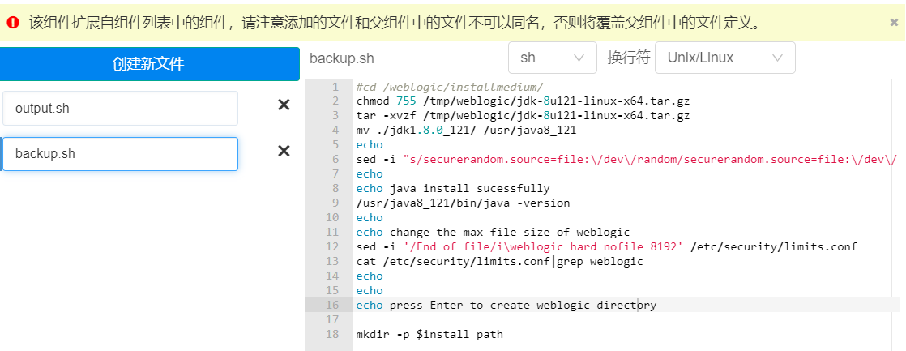

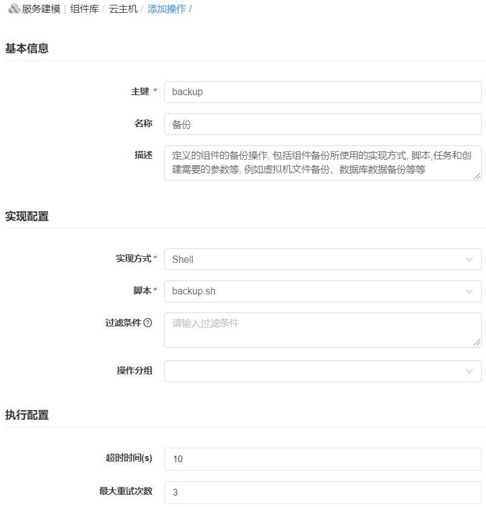

组件费用配置：勾选“操作引起费用变动”，在执行该操作时将据系统配置和计费规则显示预估费用并触发费用结单。系统配置请参考[费用配置](https://cloudchef.github.io/doc/AdminDoc/09系统管理/#费用配置)。

软件组件的表单配置：在软件组件中能够给"创建"操作和其他自定义操作配置属性和表单，属性类型支持使用字符、浮点数、密码、布尔、整数值或选择数据字典字段，表单是根据属性动态生成的。配置完成表单的内容（支持JSON格式），也能够直接显示表单的预览，以满足多样的需求。

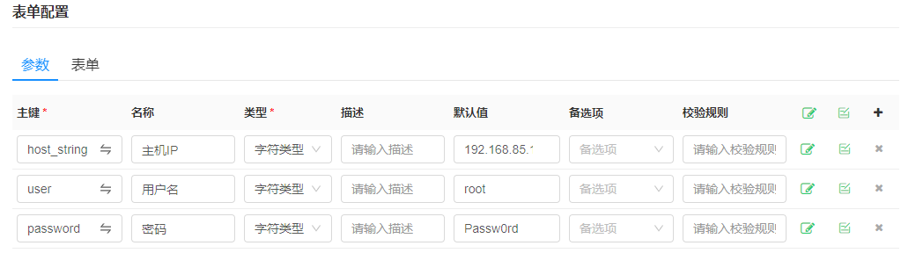

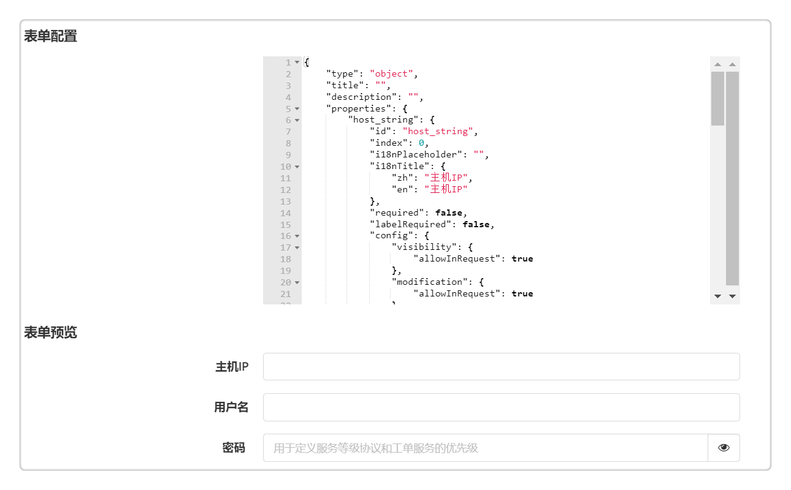

支持二次更新操作。系统已经提供该操作的实现，如果需要覆盖，可以启用该选项 "覆盖系统操作" 。

+ 在操作标签页，点击任意操作，进入操作标签页，当选择的主键名匹配到已有的系统内置操作会出现覆盖操作系统的选项和提示，勾选后 "覆盖系统操作"才会出现后面的实现配置、执行配置、表单配置等信息。
+ 不勾选则为内置操作。

以为vSphere云平台的linux虚拟机添加备份操作为例，

1. 在 服务设计 - 组件库 中选中vSphere云平台的Instance组件，在操作列表自定义添加备份操作。
  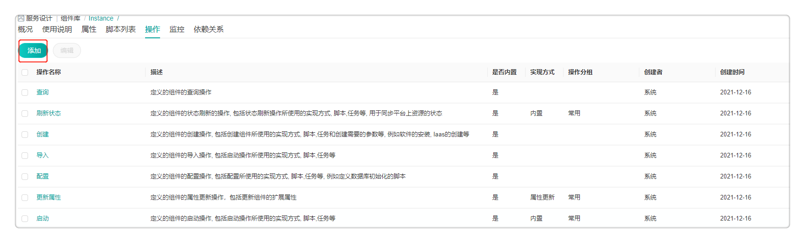

2. 为该操作自定义主键，并选择实现方式为“任务”，点击“备份”任务，为该操作配置备份流程。
  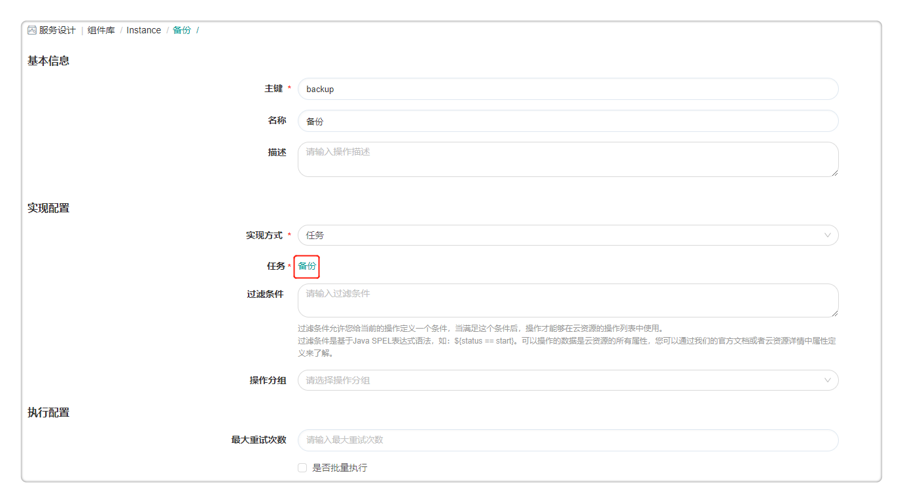

3. 任务类型请选择“标准工作流任务”，输入参数请选择已配置的Veeam备份流程，您需先在 服务设计 - 流程配置中配置相关流程。具体操作请参考[备份流程](https://cloudchef.github.io/doc/AdminDoc/05服务建模/云主机.html#云主机运维操作)。
  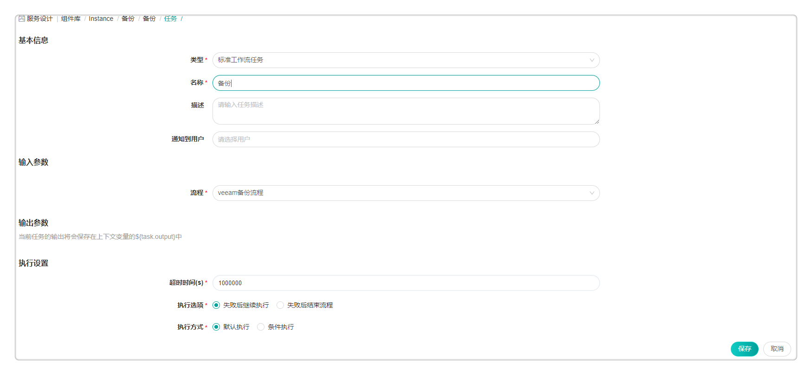

4. 点击保存按钮，则能够为纳管的vSphere云平台linux虚拟机进行备份操作。
  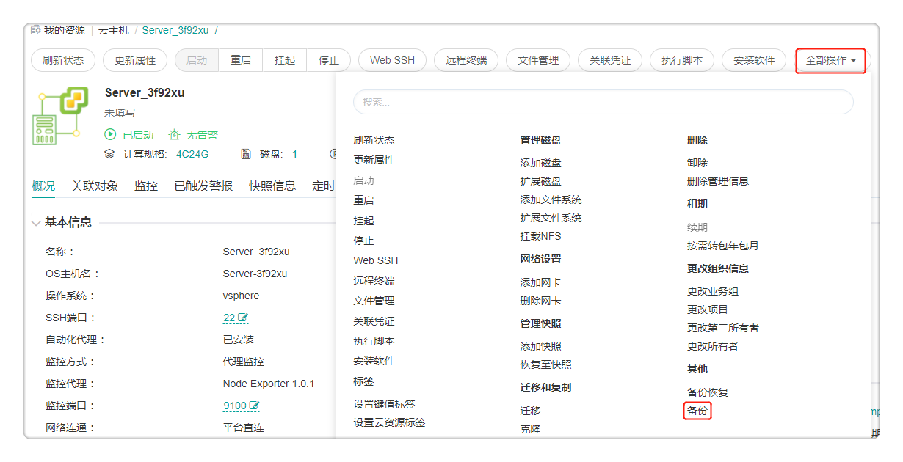

## 依赖关系

目前某些组件资源不能单独部署，例如，软件组件需要协同其他组件资源进行部署。而平台支持创建和管理当前组件和其他组件的依赖关系。依赖关系用于定义多个组件在同时进行编排部署的场景中不同先后顺序，并且可以在相互有依赖关系的组件之间传递运行时参数。

以图为例，在vSphere云平台中，MySQL组件与Serve组件，Serve组件与Network组件是依赖关系。

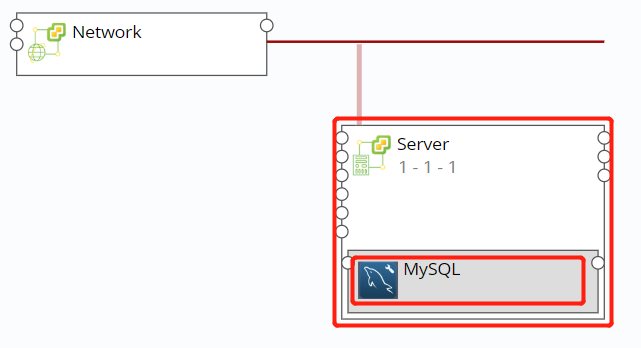

在依赖关系标签页，您可以添加当前组件和其他组件的依赖关系。
1. 点击添加图标，创建新的依赖关系。
2. 为创建的依赖关系自定义名称和描述。
3. 选择一种关系类型，可使用平台内置的关系类型（关联、属于、依赖于和监控），也可在 服务设计 - 关系类型 中自定义新的关系类型。
4. 选择关系映射的目标组件。
5. 选择关系映射的方式，根据需求选择一对一，一对多或者多对多。
6. 点击确定，依赖关系创建完成。

## 版本管理

当您更新组件时，每次更新的版本将会被记录下来，支持回退到历史版本，具体操作步骤如下：

1.  组件列表的工具栏点击任意组件按钮进入软件组件视图

2.  在历史版本标签页，您可以看到所有的历史版本，当您做出修改时，平台会默认记录您的历史版本信息包括：版本号、版本描述、创建人和创建时间

3.  您可以勾选相应的版本v1，点击恢复版本一键从版本v2回退到历史版本v1，点击保存并同步则同步组件信息。

4.  同时也支持一键删除任意历史版本，勾选要删除的版本，点击删除确认删除即删除成功。

## 关联主流制品库{#关联主流制品库}

支持软件组件与主流制品库关联，支持对接Jfrog Artifactory，Nexus制品库匹配包管理平台，实现软件版本的更新。

1. 在制品标签页，您可以选择 入口、仓库（Jfrog Artifactory、Nexus）、组、名称、版本（默认选择latest代表最新版本）
2. 点击保存按钮，即可将组件与包管理平台进行关联。

## 添加第三方堡垒机组件

您可以在 服务设计 - 组件库 添加第三方堡垒机组件，以添加奇安信堡垒机组件为例，请参考以下步骤。
 - 点击添加按钮，在概况标签页填写基本信息，
     - 主键： 只能输入英文和数字，比如chinesec，作为标识位
     - 名称：自定义堡垒机组件名称
     - 类型：选择堡垒机类型
     - 版本：自定义组件的版本
     - 图标：上传组件图标
     - 分组：为该组件分组至堡垒机组别，则在 系统管理 - 第三方系统集成 中就能对接第三方堡垒机
      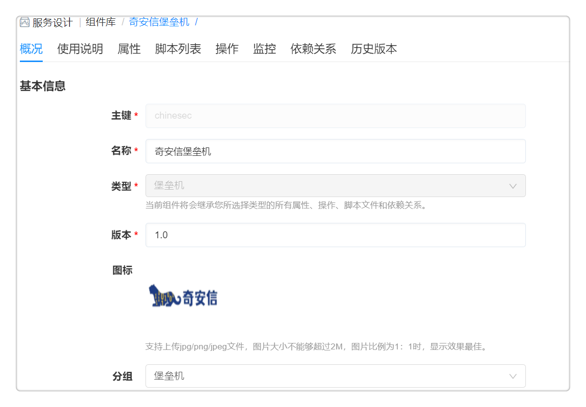
 - 在属性标签页添加连接第三方堡垒机所需的参数配置,所配置的参数在 系统管理 - 第三方系统集成 添加组件时会显示。
      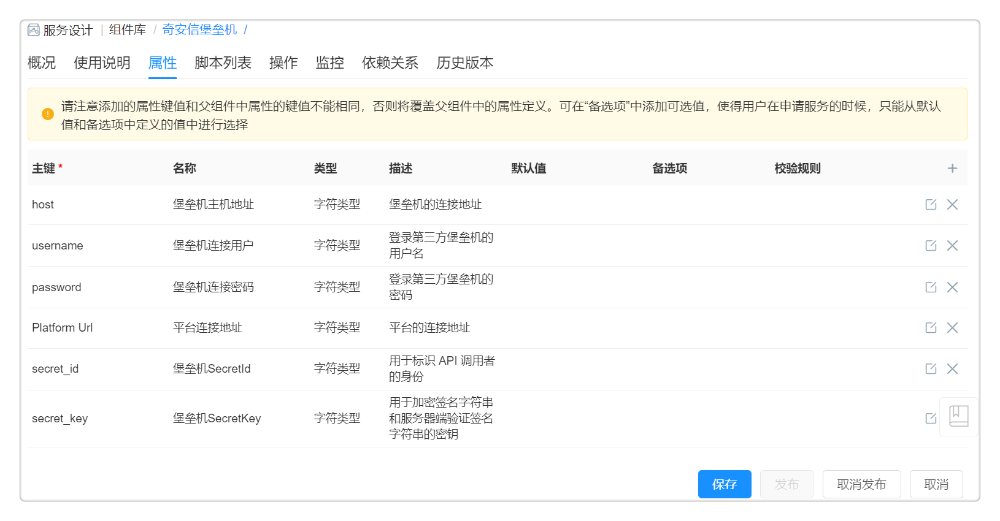
 - 在脚本列表标签页添加一系列操作的脚本，例如注册主机，删除主机等
      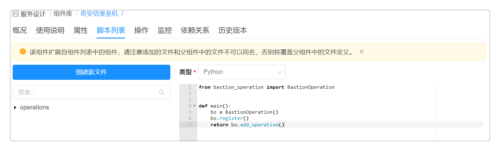
 - 在操作标签页添加相关操作，例如注册主机和删除主机的操作，以注册主机为例，
     - 主键：只能输入英文和数字，比如register_host，作为标识位
     - 名称：自定义操作名称
     - 实现方式：选择脚本
     - 脚本：选择在脚本列表标签页中已添加的脚本
     - 表单配置：配置注册主机所需的参数
     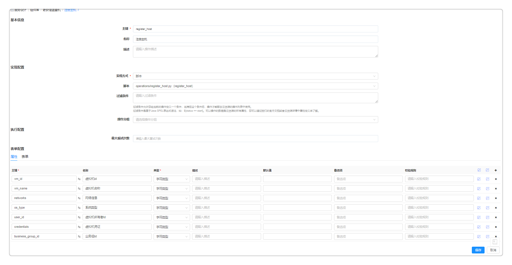
 - 点击保存按钮，成功添加第三方堡垒机组件。
