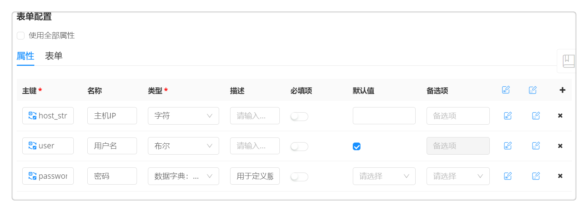

**组件库**
SmartCMP云管平台的云组件拥有“将任意资源”提供服务化的核心能力，无论是软件、基础设施还是容器资源，不同类型的云资源都可以组件化。组件的定义采用面向对象的设计方法，使用统一的数据结构进行建模，并将配置属性标准化。不仅内置丰富的组件资源和常用的操作，还拥有高度可扩展的能力，根据用户需求灵活自定义添加组件资源和配置运维操作。

SmartCMP内建了大量常用的组件，同时，软件架构师也可以根据需要创建可重用的软件组件，并使用操作脚本准确指定在部署操作过程，支持随时重新编写这些操作脚本并实时发布，同步更新已安装的软件组件。通过定义属性并将属性作为参数传递给操作脚本，以便在不同的环境中部署软件组件，而无需修改脚本。支持使用Linux Shell，Python，Ansible，PowerShell，Ruby等语言来自定义软件组件，并且自定义软件组件的生命周期操作（包含创建，配置，启动，停止，删除、备份、巡检等等），系统内置创建，配置和启动操作，在移除的时候调用停止和删除操作，并且支持灵活自定义操作，实现软件和应用的全生命周期管理。

SmartCMP中的组件由属性和接口构成,软件组件由脚本、属性、元数据、生命周期管理四项共同组成，灵活的软件组件，可以关联主流制品库。具体概念如下：

 -   脚本：生命周期的每个阶段都通过脚本来进行控制，得益于强大的底层类库，SmartCMP支持包括Shell,Powershell,Ruby,Python等语言，可以快速将应用的部署整合在云管平台内；

 -   属性：不同应用系统对资源的需求和容量的控制都会有自定义要求，属性项可以按照不同系统的部署要求传递自定义参数。软件架构师可以通过设置自定义属性，将应用组件需要您填写的配置参数暴露在申请界面上，SmartCMP云管理平台会自动化调用相关参数执行应用的安装配置；

 -   操作：SmartCMP云管理平台可以对应用系统的创建、配置、启动、停止、删除等过程进行完整的生命周期管理。通过脚本对应，完成从安装部署到到期卸载的所有软件配置工作。

 -   软件组件与主流制品库关联，支持对接Jfrog Artifactory, Nexus制品库，实现软件版本的更新。
 
 -  组件也是构成蓝图的基本单元，SmartCMP自定义的软件组件，可以可视化的放置到SmartCMP的蓝图 软件架构师可以通过组件管理界面管理组件。在左边导航选择「服务建模」-「软件组件」，右侧浏览区域出现所有组件列表。通过拖拽的方式组合组件，形成蓝图部署服务的编排。

# 丰富的组件库

开箱即用的组件资源。SmartCMP云管平台内置大量常用的组件资源，包括IaaS（不同云平台的云主机、网络、存储等等）、PaaS（服务器、数据库、RDS等等）、容器（Kubernetes、Docker）、软件(MySQL、Oracle、Nginx等等)、代理（监控代理、自动化代理），不同类型资源在统一的界面进行创建和管理，采用树形结构的分组目录，支持自定义组件分组，支持二次编辑、快速复制、导入、导出组件。

 树形展示,支持组件的分组目录，支持树形结构，可以在创建组件和组件列表搜索树形展示。在组件列表页的树形图可以增删改，已存在组件目录不能删除。
树形结构是一个逻辑的文件夹的概念，与组件的资源类型没有绑定的关系。
树形结构允许用户调整，比如有的用户一级是云平台，二级是该云平台下的计算、存储、网络组件；而有的用户一级是计算、网络、存储等，二级是各个云平台。具体内容：

+ Iaas  用于描述所有的Iaas的组件, 每个组件有自己的云平台类型,Iaas下的二级节点主要包括: 计算, 网络, 存储, 对象存储, 负载均衡, 安全组, 文件系统等
默认增加如下子类
云主机
存储
OSS:  对象存储
Disk: 块存储
NAS
Network: 网络
Subnet：子网
Router：路由
SecurityGroup：安全组
防火墙
负载均衡 (F5 的Pool 和SNATPool放这)
负载均衡监听器
浮动IP
域名
网关

+ Paas   用于描述所有的Pass的组件, 每个组件有自己的云平台类型,Paas下的二级节点主要包括云平台提供的服务能力,
默认增加如下子目录
Web
APP
MQ
Cache:缓存
RDS
NoSQL
BigData：大数据服务

+ Container，用于描述所有的容器平台的组件
Docker
Kubernetes

+ 软件组件 用于描述所有的Software的组件, 每个组件有自己的云平台类型, 软件分为两种类型, 一种是二进制安装的软件, 运行在机器里面, 一种是容器镜像软软件, 运行在容器里面 容器镜像组件可以通过类型进行区分，
  增加一个属性resource.software，来标记这个软件运行在机器里面还是容器里面。
默认增加如下子目录
Web
APP
MQ
Cache:缓存
RDS
NoSQL
BigData：大数据服务

+ 代理，表示所有的代理组件, 包括自动化组件, 监控组件等, 用于后续的代理管理
包括监控代理和自动化代理
>「Note」 监控组件:若需要使用云平台监控查看云服务器指标数据并且产生告警，需在云服务器上正确安装监控组件，云服务器指标数据采集依赖于监控组件。

编辑组件，选中组件列表中某组件可以进入编辑组件视图。编辑组件和创建组件类似，为了保证已使用该组件创建的蓝图不会因为组件的更新而无法使用，在编辑时，组件每个子视图中都有一些项目不允许改动。编辑组件的过程中随时点击「返回」按钮放弃编辑组件。

导入组件，您可以根据以下步骤进行导入组件操作：

1.  在左边导航选择「服务建模」-「软件组件」

2.  点击「导入」按钮

3.  点击「浏览」，选择本地组件（ZIP格式），点击「提交」

4.  组件导入成功

导出组件，您可以根据以下步骤进行导出组件操作：

1.  在左边导航选择「服务建模」-「软件组件」

2.  选择组件列表中的某一组件，菜单栏上的「导出」按钮将变得可用，点击「导出」

3.  组件导出成功

复制组件，您可以根据以下步骤进行复制组件操作：

1.  在左边导航选择「服务建模」-「软件组件」

2.  选择组件列表中的某一组件，菜单栏上的「复制」按钮将变得可用，点击「复制」

3.  进入复制组件的编辑页面，可更改基本信息、属性、脚本列表以及节点接口信息。组件名字需要修改，组件不允许重名

删除组件，您可以根据下面的步骤来删除组件：

1.  在组件列表视图中，选中待删除组件

2.  在列表工具栏中点击「删除」按钮后，在确认对话框中确认后，组件会被删除

# 创建组件

SmartCMP云管平台支持用户根据需求创建可重用的组件，将任意资源组件化以及将配置组件的过程标准化，包括定义资源类型，定义版本，定义属性，定义组件的操作等等，并且所有的配置界面都开放给用户自定义。
例如：DBA在创建数据库集群时，需要部署Oracle数据库，DBA可根据需求在组件库添加Oracle组件，配置组件，包括配置组件基本信息、属性、脚本、操作（指定数据库的创建、启动、停止、重启、删除等等操作），具体描述如下，软件架构师可以根据下面的步骤来创建组件：

1.  在组件列表的工具栏点击「添加」按钮进入创建组件视图

2.  创建组件视图包含「基本信息」「属性」「脚本列表」「操作」「历史版本」「制品」

## 组件基本信息
在「基本信息」视图，您可以提供组件名称、描述、组件版本、组件类型（类型来源组件分组，例如Container、PaaS、IaaS、Agent、Software等等）云平台信息和上传图标，还可添加该组件的说明信息.
+ 勾选制品之后，可以通过「制品」标签页选择二进制软件制品仓库，进行软件版本的配置。具体步骤，参考关联主流制品库
+ 勾选实例化，勾选后该组件可通过“蓝图设计”进行编排。软件架构师可以通过组件管理界面管理组件。在左边导航选择「服务建模」-「软件组件」，右侧浏览区域出现所有组件列表。添加的软件组件，勾选实例化之后会出现在组件列表里以供选择组合组件，形成蓝图部署服务的编排。

>「Note」 组件的设计，采用面向对象思想设计的结构，面向对象具有封装、继承和多态三大特性。继承可以使得子类别具有父类别的各种属性和方法，而不需要再次编写相同的代码。在令子类别继承父类别的同时，可以重新定义某些属性，并重写某些方法，即覆盖父类别的原有属性和方法，使其获得与父类别不同的功能。当选择组件类型Software，则创建的组件具有父类软件组件的各种属性，也可以通过自定义属性，使其获得与父类不同的功能。需要注意的是自定义添加的属性键值和父组件中的属性键值不能相同，否则将覆盖父组件中的属性定义。

## 组件属性
+ 在「属性」视图，您可以添加组件的属性，添加完成后可将其作为参数传递给操作脚本。

>「Note」面向对象思想设计	多态指同一个操作，由于传入的参数不同产生差异化效果。例如：当创建组件Oracle时，不同应用系统对Oracle的部署需求和参数控制都会有特定的需求和自定义要求。“属性”可以按照不同系统的部署要求，通过设置自定义属性，将应用组件需要填写的配置参数暴露在界面配置上，传递自定义参数。当自动化部署Oracle时，SmartCMP云管理平台会自动化调用相关参数执行应用的安装配置，达到不同数据集群对Oracle部署的不同要求。

+  属性由主键、类型、默认值、备选项和描述组成。可在备选项中添加可选值，使得您在申请服务的时候，只能从默认值和备选项中定义的值中进行选择。可以创建要求使用字符、浮点数、密码、布尔或整数值的软件属性，支持设置校验规则，输入正则表达式则输入的属性参数必须接受表达式的校验。（ 整数类型 : 对零以及正整数或负整数使用整数属性类型。布尔类型: 使用布尔属性类型在“值”下拉菜单中提供 True 和 False 这两个选项。）

## 脚本列表

在「脚本列表」视图，您可以通过创建新文件添加脚本文件。这些脚本文件应该和组件接口中的某个操作关联，或者被其它的脚本文件引用。同时，您可以添加文本文件，这些文本文件一般用来提供组件的配置信息。多次点击创建新文件可以添加多个文件，输入文件名、文件类型后点击操作-编辑内容，可以在右面编写文件内容。

## 操作

在「操作」视图，您可以将「脚本列表」视图中添加的脚本文件关联到组件的对应操作上，每个操作动作下实现-请选择下拉列表中选择这个操作对应的脚本文件。内置的操作有配置、创建、删除、启动、停止等等。

>「Note」操作可继承。（以刷新操作为例，系统提前配置完成，组件刷新操作所使用的实现方式、脚本、任务和刷新必须的参数。）内置的操作可应用于平台上的任意资源。因此，在创建组件Oracle时，将自动继承内置的“启动、停止、重启、删除、刷新”操作。封装指隐藏复杂操作的实现细节，仅对外提供公共的访问方式。平台将复杂的操作内置，开箱即用，降低差异性和理解难度。例如：“调整虚机配置”操作(调整虚拟机的计算规格和云平台规格)，同一个“调整虚机配置”操作当云平台类型不同时，SmartCMP云管平台隐藏资源操作的流转细节，只暴露公共的访问接口。例如：“调整虚机配置”操作应用在Hyper -V平台的虚拟机和OpenStack平台的虚拟机上，具体的技术实现方式不同，但是用户配置界面，显示相同内容，配置简单，易用性强。

同时，您也可以在这里添加更多的组件操作，并且进行相应的脚本文件关联。添加组件操作点击操作右侧的添加按钮。所有必填项都添加好了之后，点击保存按钮生成新的组件，在组件列表上可以看到新添加的组件。添加组件的过程中随时点击「返回」按钮放弃添加组件。

生命周期操作 | 描述 | 示例 
:------:|:------:|:------:
创建 |     创建软件|     创建 Tomcat 服务，为“创建”生命周期操作编写的脚本将在首次安装软件时运行。
配置 |    配置软件| 配置Tomcat，设置 JAVA_OPTS 和 CATALINA_OPTS。配置脚本会在安装操作完成后运行。
启动 |   启动软件| 使用 Tomcat 服务器中的启动命令启动 Tomcat 服务。启动脚本会在配置操作完成后运行。
停止 |   停止软件| 使用 Tomcat 服务器中的停止命令停止 Tomcat 服务。停止脚本会在启动操作完成后运行。
删除 |   删除软件| 在应用程序中执行特定操作，然后再销毁部署。删除脚本会在销毁软件组件后运行。

###	配置操作

内置大量常用操作的同时，支持自定义组件的操作，配置界面开放给用户，包括自定义操作的实现方式（支持Python、Shell、Ansible、Terraform、任务）、脚本（脚本来自于自定义的脚本文件）、过滤条件（自定义过滤条件，当满足过滤条件时，操作才生效，例如：当磁盘为挂载状态时，才能做分离操作；虚拟机是关机状态才能做关机操作）、操作分组（与云主机运维操作分组相同）以及执行的具体参数配置（超时时间和最大重试次数）。
例如：自定义备份操作。如下图，自定义操作基本信息，在脚本列表自定义“备份脚本backup.sh”，在配置操作时，选择脚本backup.sh，将脚本与操作绑定，并选择操作方式为“Shell”。

软件组件的表单配置：在软件组件中能够给"创建"操作和其他自定义操作配置参数和表单。配置参数表单的时候, 也能够直接显示表单的预览，以满足多样的需求。

## 版本管理

当您更新组件时，每次更新的版本将会被记录下来，支持回退到历史版本，具体操作步骤如下：

1.  组件列表的工具栏点击「任意组件」按钮进入软件组件视图

2.  在「历史版本」视图，您可以看到所有的历史版本，当您做出修改时，平台会默认记录您的历史版本信息包括：版本号、版本描述、创建人和创建时间

3.  您可以勾选相应的版本v1，点击「恢复版本」一键从版本v2回退到历史版本v1，点击「保存并同步」则同步组件信息。

4.  同时也支持一键删除任意历史版本，勾选要删除的版本，点击「删除」确认删除即删除成功。

## 关联主流制品库{#关联主流制品库}

支持软件组件与主流制品库关联，支持对接Jfrog Artifactory, Nexus制品库匹配包管理平台，实现软件版本的更新
包管理工具的版本支持latest标记, 表示使用最新版本。

1. 在「制品」视图，您可以选择 入口、仓库（Jfrog Artifactory、Nexus）、组、名称、版本（默认选择latest代表最新版本）
2. 点击保存按钮，即可将组件与包管理平台进行关联。

