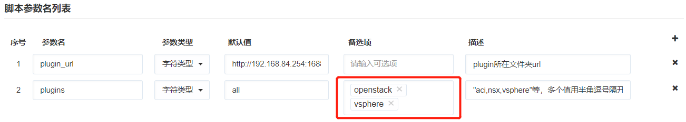

**脚本库**

SmartCMP支持执行多种类型的脚本，包括shell、powershell、ansible、python、perl等。
点击「服务建模」-「脚本库」，进入脚本库列表界面，可以管理云主机执行脚本时所需脚本，以便云主机批量运维操作中使用，可以设置脚本类型、系统类型、脚本内容和脚本参数。

# 添加脚本

在左边导航选择「服务建模」-「脚本库」，点击「添加」按钮，出现创建脚本页面

1.  输入脚本名称，脚本内容，选择脚本类型、系统类型、换行符、业务组。例如，下图创建更新插件的脚本，在创建脚本时需要注意，选择合适的业务组，脚本将只会应用在属于该业务组的云主机。
    
2.  在页面下方脚本参数列表中点击按钮，编辑脚本参数并「保存」。例如，下图中定义脚本参数，指定需要更新的插件存放地址，指定插件的云平台属性，all代表升级更新所有，openstack,vsphere作为备选项。
    
3.  点击「保存」，脚本创建成功
4. 执行创建成功的脚本具体步骤：在左边导航选择「我的部署」-「云主机」，选择业务组下的云主机，点击执行脚本，在执行脚本配置页面，选择all,更新所有的插件
    

    
# 查看脚本库

在左边导航选择「服务建模」-「脚本库」，进入脚本库界面，显示当前所有的脚本。

# 编辑、删除脚本

在脚本库列表界面，选中一个脚本，点击「编辑」，可对脚本进行编辑。也可直接点击脚本名称进入编辑页面。点击「删除」，确认删除提示点击「是」，可删除该脚本。