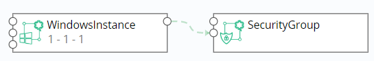

 **蓝图设计**

软件架构师可以通过蓝图管理界面以可视化的方式设计出基于TOSCA标准的应用蓝图。蓝图是对应用的抽象。蓝图包含应用的拓扑、工作流以及策略三部分。蓝图是系统核心的概念，整个系统都是围绕着蓝图管理。
# 蓝图
您可以根据下面的步骤来查看当前租户的蓝图:

1.  在左边导航栏选择「服务建模」-「蓝图设计」，出现蓝图列表。有添加、复制、发布、取消发布、导入、导出和删除操作，发布和取消发布操作根据蓝图状态动态可用，若蓝图处于已发布状态，在取消发布操作可用。发布操作同理

2.  蓝图列表可以按照名称、状态、创建时间排序。可以按照蓝图名称进行搜索

## 内建蓝图

目前SmartCMP内建了典型的vSphere、OpenStack、Kubernetes蓝图以方便您使用，您可以在创建服务配置时直接使用这些内建的蓝图。在左边导航栏选择「服务建模」-「蓝图设计」，出现蓝图列表，创建者为系统的蓝图为系统内建蓝图。

### 可视化编辑器概览

点击蓝图名称或添加新蓝图将进入可视化编辑器。

可视化编辑器包括以下几个部分：

1.  组件列表面板：
    组件列表包含SmartCMP支持的云基础架构的各个组件，以及您自定的组件。在SmartCMP组件视图中出现的所有组件都在「自定义组件」面板中。您可以选中任意一个组件，然后将它拖放到画布中

2.  画布：可视化蓝图的核心部分，您可以将组件拖放到画布上，不同的组件之间可以在画布上建立连接以定义组件之间的关系

3.  基本信息面板：包括蓝图的名称，描述和图标信息。您可以对其进行更改

4.  输入面板：管理蓝图里的所有输入项

5.  输出面板：管理蓝图里的所有输出

6.  选中组件的组件信息面板：包含选定组件的基本信息、参数等

### 组件的添加与设置 {#组件的添加与设置}

组件被拖放到画布上后，组件就被添加到蓝图中，在组件选中后，在组件信息面板里就可以编辑组件。编辑可以在以下子视图中进行：

-   基本信息：可以在基本信息里看到组件的类型，同时可以对组件的名称进行编辑

-   参数：组件的参数列表，包括组件自身的参数和从父节点继承的参数，可以在这里对参数进行设置

-   功能：组件的功能列表，表示组件可以提供的功能，一旦有其它的组件需要功能列表里的功能作为前提条件，那么就可以建立其它组件到该组件的连接以提供该功能给其它组件

-   前提条件：组件需要的潜在功能列表，一旦列表里的功能被完全或者部分满足，该组件就可以运行工作，您在这里建立和其它组件的连接关系，以满足自身的需求

-   连接：组件的所有连接列表，一旦前提条件里的某个组件需要的功能被满足，对应的连接就会出现在这里，您可以在这里对这一连接进行编辑和删除操作

### 组件的删除 {#组件的删除}

组件被拖放到画布上后，若要删除组件，在组件上单击鼠标右键，在弹出的上下文菜单中可以删除组件。

### 云平台组件及连接说明 {#云平台组件及连接说明}
|vSphere|云平台组件连接说明|
|:----:|:----:|
	|Network|	与Server连接时将Server的Network节点与Network组件的link节点相连|
	|Disk|	挂盘时需将Disk组件拖拽到Server内|
	|Lswitch|	NSX逻辑交换机可在完全脱离底层硬件的虚拟环境中再现交换功能（单播、多播和广播）。 将Lswitch与Server/WindowsServer节点相连|
	|DLR	|NSX逻辑(分布式)路由器，使用时将DLR与Lswitch相连|
  |	SecurityGroup|	NSX安全组，使用时将SecurityGroup与Server/WindowsServer节点相连	
	|LoadBalancer|	将VirtualServer内置于LoadBalancer内，使用时将LoadBalancer的edge节点与Edge相连|
	|VirtualServer|	将VirtualServer内置于LoadBalancer内，使用时将VirtualServer的Server节点与Sever相连|

|OpenStack|云平台组件连接说明|
|:----:|:----:|
	|Network|	与Server连接时将Server的Network节点与Network组件的link节点相连|
	|Router	|路由，使用时将Router的Network节点与Network组件的route节点相连|
	|FloatingIP	|浮动IP:使用时与Server组件的floatingIP节点相连接|
	|Volume|	使用时将Volume组件拖拽到Server内|
	|SecurityGroup|	安全组，使用时将Server组件的Security_Group节点与SecurityGroup相连|
	|LoadBalancer	|负载均衡，使用时将Listener内置于LoadBalancer，通过Listener与Server相连|
	|Firewall|	防火墙，单独部署|
	|Listener|	负载均衡监听器，使用时将Listener内置于LoadBalancer，将Listener的Server节点与Server相连。LoadBalancer中可内置多个Listener, Listener可与多个Server相连|
  |DNS|	域名系统，单独部署|

|PowerVC	|云平台组件连接说明|
|:----:|:----:|	
|	Network|	与Server连接时将Server的Network节点与Network组件的link节点相连|
|	Volume|	使用时将Volume组件拖拽到Server内|
|物理服务器	|Server	Network	|

|Kubernetes |云平台组件连接说明|
|:----:|:----:|	
|	Deployment|	为POD和ReplicaSet 提供了一个声明式定义方法，方便管理应用Container	容器，使用时将Containier组件拖拽到Deployment内|
|	Nginx- Container|	容器，使用时将Nginx-Containier组件拖拽到Deployment内，使用时其config_Map连接到ConfigMap|
|	Service|	Service 定义了这样一种抽象：一个 Pod 的逻辑分组，一种可以访问它们的策略 — 通常称为微服务。使用时将该组件的Deployment节点连接至Deployment组件|
|	Ingress|	给 service 提供集群外部访问的 URL、负载均衡、SSL 终止、HTTP 路由等。使用时将该组件的Service节点连接至Service组件|
|	PersistentVolumeClaim|	请求存储资源。使用时将Container的pvc节点连接至该组件|
|	ConfigMap|	用于保存配置数据的键值对，可用于保存单个属性或保存配置文件。使用时将Nginx-Container的ConfigMap节点连接至该组件|
|	Secret|	解决密码、token、密钥等敏感数据的配置问题。使用时将Container的Secret节点连接至该组件|
|	ServiceEndpoint	|使用时将Container的service_endpoint节点和ServiceEndpoint的container节点相连，然后将ServiceEndpoint 的software_component节点与软件组件相连|
|	DaemonSet|	保证在每个Node上都运行一个容器副本，常用来部署一些集群的日志、监控或者其他系统管理应用。使用时将Container内置于DaemonSet中|
|	StatefulSet|	为了解决状态服务的问题，使用时将Container内置于StatefulSet中

Docker	Container	Docker容器，可在组件参数中填入镜像名称，与其他组件相连时将组件的Dependency节点与容器的feature相连

|阿里云| 云平台组件连接说明|
|:----:|:----:|		
|	SecurityGroup|	使用时将Instance组件的dependency节点与SecurityGroup相连|
|	Disk	|需将Disk组件拖拽到Instance内|
|	LoadBalancer|	使用时将Instance组件的dependency节点与LoadBalancer相连|

阿里专有云	
+ SecurityGroup	使用时将Instance组件的dependency节点与SecurityGroup相连
+ Disk	需将Disk组件拖拽到Instance内
+	LoadBalancer	使用时将Instance组件的dependency节点与LoadBalancer相连

腾讯云	
+ SecurityGroup	使用时将Instance组件的Security_group节点与SecurityGroup组件的Security节点连接

青云
+ SecurityGroup	使用时将Instance组件的Security_group节点与SecurityGroup组件的Security节点连接
+ 	Volume	请求存储资源。
+ 物理服务器	Server	Network	
+ Disk	磁盘
+	Network	网络

|AWS |云平台组件连接说明|
|:----:|:----:|	
|	Instance|	使用时将Instance组件的Security_Group节点与SecurityGroup相连|
|	WindowsInstance	|使用时将WindowsInstance组件的Security_Group节点与SecurityGroup相连|
|	Volume|	请求存储资源。无节点|
|	RDS|	数据库实例是在云中运行的独立数据库环境。无节点。|
|	S3Bucket|	存储组件|
|	SecurityGroup|	使用时将Instance组件的Security_Group节点与SecurityGroup相连|

|Azure|云平台组件连接说明|
|:----:|:----:|	
	|Instance|	将Instance的virtualNetwork节点和VirtualNetwork的Link节点相连|
	|WindowsInstance|	将WindowsInstance的virtualNetwork节点和VirtualNetwork的Link节点相连	|
	|LoadBalancer	|使用时，将LoadBalancerRule内置于LoadBalancer中，通过LoadBalancerRule与Instance相连|
	|LoadBalancerRule|	使用时将LoadBalancerRule内置于LoadBalancer中，将LoadBalancerRule的instance节点与Instance的loadBalancer_rule相连|
	|AvailabilitySet|	可用性集，将Instance的availability_set节点和AvailabilitySet的instance节点相连|
	|BlobContainer|	块存储|
	|Disk|	磁盘|
	|SecurityGroup|	使用时将Instance组件的Security_group节点与SecurityGroup组件的Security节点连接|

|F5 云平台组件|连接说明|
|:----:|:----:|	
| BIG-IP	LoadBalancer|	负载均衡，使用时将该组件的Application节点连接至Server|
|	SNATPool|	负载均衡，使用时将该组件的dependency节点连接至Server|
|	Pool|	负载均衡，使用时将该组件的pool节点连接至Server|
|	VirtualServer|	负载均衡，使用时将该组件的virtualserver节点连接至Server|

ACI	
+ EPG	

软件组件		
+ 「软件组件」中自定义的软件

Exporter		
+ 「软件组件」中自定义的Exporter

抽象云组件

抽象云组件是SmartCMP设计的一个通用的方案, 能通过通用或者扩展的方式接入任何一个云平台的计算, 存储和网络.
为了提升这个方案的通用性, 提取每个云平台通用的属性, 这些属性包括Linux/Windows  Server,  Network/Subnet,  Disk，这些属性对应下面这些云组件
+ SecurityGroup
+ ObectStorage
+ LoadBalancer
+ Volume
+ Network
+ WindowCompute
+ Compute	

### 连接的建立 {#连接的建立}

1.  在组件信息面板-前提条件，添加连接。

2.  在蓝图中添加。画布上的所有组件和连接构成了蓝图。当一个组件被拖放到蓝图中后，组件的左边框和右边框上就会创建组件的「连接点」。在左边框上的连接点对应于组件的功能列表，在右边框上的连接点对应于组件的前提条件列表。因此，您可以用鼠标选择右边框上的「前提条件」连接点，这个时候，系统就会给出蓝图中所有潜在的可连接的「功能」连接点，您可以选择其中的某一个进行连接。

### 连接的编辑 {#连接的编辑}

参见 [组件的添加和设置](https://cloudchef.github.io/doc/AdminDoc/05服务建模/软件组件.html)

### 连接的删除 {#连接的删除}

在组件信息面板中删除：任何类型的组件连接均可以在这里删除。在「组件信息面板」「连接」中选定连接，点击删除。

在蓝图中删除：选中某一个连接，单击鼠标右键，在弹出的上下文菜单里可以删除选中的连接。绝大部分的连接都可以这样删除。

>「Note」：虚机和网络组件，虚机和存储组件的连接是例外，不可以通过这种方式删除。

## 创建蓝图

### 创建vSphere单节点蓝图 {#创建vSphere单节点蓝图}

1.  选择「服务建模」-「蓝图设计」，点击「添加」

2.  输入蓝图名称及描述，点击「确定」，进入可视化蓝图编辑页面

3.  从左边的组件列表中选择vSphere栏目下的Server和Network组件，分别将他们拖拽到右边的画布区域中

4.  定义网络：点击Server右边的network节点拖拽到Network的link节点上，建立server和network的网络连接

5.  点击左上角「验证」，验证蓝图，提示这是一个合法的蓝图

6.  验证成功后点击左上角「保存」，保存成功后点击「返回」，将回到蓝图列表界面

7.  发布蓝图：在蓝图列表里选择刚编辑的vSphere蓝图，点击「发布」，然后点击「是」

8.  蓝图发布成功，状态变为已发布，vSphere虚拟机蓝图创建成功

9.  也可在验证成功后，直接点击「保存并发布」，发布蓝图

### 创建VMware NSX 蓝图 {#创建VMwareNSX蓝图}

1.  选择「服务建模」-「蓝图设计」，点击「添加」

2.  输入蓝图名称及描述，点击「确定」，进入可视化蓝图编辑页面

3.  从左边的组件列表中选择vSphere栏目下的Server、Lswitch、DLR、SecurityGroup组件，分别将他们拖拽到右边的画布区域中

4.  点击Server右边的lswitch节点拖拽到Lswitch的节点上（显示绿色），建立server与Lswitch的连接

5.  点击DLR右边的lswitch节点拖拽到Lswitch的节点上，建立DLR与Lswitch的连接

6.  点击SecurityGroup右边的Server_WindowsServer节点拖拽到Server的节点上，建立SecurityGroup与Server的连接

7.  点击左上角「验证」，验证蓝图，提示这是一个合法的蓝图

8.  点击「保存并发布」，发布蓝图，提示蓝图发布成功

### 创建vSphere MySQL带监控蓝图 {#创建vSphereMySQL带监控蓝图}

创建应用软件部署和带应用监控的蓝图，以部署一台vSphere上的虚拟机、并安装MySQL以及MySQL监控为例:

1.  选择「服务建模」-「蓝图设计」，点击「添加」

2.  输入蓝图名称及描述，点击「确定」，进入可视化蓝图编辑页面

3.  从左边的组件列表中选择vSphere栏目下的Server和Network组件，分别将他们拖拽到右边的画布区域中

4.  定义网络：点击Server右边的network节点拖拽到Network的link节点上

5.  添加组件：从左边的组件列表中选择软件组件栏目下的MySQL和MySQLExporter组件，拖动至server节点框内，选择连接的名称，点击「完成」

6.  添加依赖关系：点击MySQLExporter右侧的节点拖拽到MySQL左侧的feature节点上，添加MySQLExporter与MySQL的依赖关系

7.  验证蓝图：点击左上角「验证」，验证蓝图的合法性

8.  保存并发布：点击左上角的「保存并发布」，发布蓝图

9.  根据下章6.4服务配置步骤，选择刚发布的蓝图，发布服务目录

10. 服务目录申请，经业务组流程（审批）后部署，部署成功后可查看MySQL组件的监控信息

### 创建OpenStack单节点蓝图 {#创建OpenStack单节点蓝图}

1.  选择「服务建模」-「蓝图设计」，点击「添加」

2.  输入蓝图名称及描述，点击「确定」，进入可视化蓝图编辑页面

3.  从左边的组件列表中选择OpenStack栏目下的Server和Network组件，分别将他们拖拽到右边的画布区域中

4.  定义网络：点击Server右边的network节点拖拽到Network的link节点上

5.  验证蓝图：点击左上角「验证」，验证蓝图，提示这是一个合法的蓝图

6.  保存蓝图：验证成功后点击左上角「保存」，保存成功后点击「返回」，将回到蓝图列表界面

7.  发布蓝图：在蓝图列表里选择刚编辑的OpenStack蓝图，点击「发布」，然后点击「是」

8.  蓝图发布成功，状态变为已发布，Openstack虚拟机蓝图创建成功

9.  也可在验证成功后，直接点击「保存并发布」，发布蓝图

### 创建OpenStack Firewall蓝图 {#创建OpenStackFirewall蓝图}

1.  选择「服务建模」-「蓝图设计」，点击「添加」

2.  输入蓝图名称及描述，点击「确定」，进入可视化蓝图编辑页面

3.  从左边的组件列表中选择Openstack栏目下的Firewall组件，将它拖拽到右边的画布区域中

4.  验证蓝图：点击左上角「验证」，验证蓝图，提示这是一个合法的蓝图

5.  保存蓝图：验证成功后点击左上角「保存」，保存成功后点击「返回」，将回到蓝图列表界面

6.  发布蓝图：在蓝图列表里选择刚编辑的OpenStack
    Firewall蓝图，点击「发布」，然后点击「是」

7.  蓝图发布成功，状态变为已发布，Openstack
    Firewall虚拟机蓝图创建成功

8.  也可在验证成功后，直接点击「保存并发布」，发布蓝图

### 创建OpenStack LoadBalancer with SecurityGroup蓝图 {#创建OpenStackLoadBalancerWithSecurityGroup蓝图}

1.  选择「服务建模」-「蓝图设计」，点击「添加」

2.  输入蓝图名称及描述，点击「确定」，进入可视化蓝图编辑页面

3.  从左边的组件列表中选择Openstack栏目下的Server、Network将它们拖拽到右边的画布区域中，点击Server右边的network节点拖拽到Network的link节点上，建立Server节点和Network的连接

4.  从左边组件列表Openstack栏目下，选择LoadBalancer组件到右边的画布区域，再将Openstack栏目下Listener拖动至LoadBalancer节点框内，点击「完成」，建立负载均衡监听器（Listener）和负载均衡器（LoadBalancer）的内置关系

5.  点击Listener右边的server节点拖拽至Server的server节点上，建立Listener和Server节点的关联关系

6.  从左边组件列表Openstack栏目下，拖动SecurityGroup组件到右边的画布区域，点击Server组件右边的security\_group节点到SecurityGroup左边的security节点上，建立Server与SecurityGroup的连接关系

7.  验证蓝图：点击左上角「验证」，验证蓝图，提示这是一个合法的蓝图

8.  保存蓝图：验证成功后点击左上角「保存」，保存成功后点击「返回」，将回到蓝图列表界面

9.  发布蓝图：在蓝图列表里选择刚编辑的OpenStack LoadBalancer with
    SecurityGroup蓝图，点击「发布」，然后点击「是」

10. 蓝图发布成功，状态变为已发布，OpenStack LoadBalancer with
    SecurityGroup虚拟机蓝图创建成功

11. 也可在验证成功后，直接点击「保存并发布」，发布蓝图

### 创建OpenStack FloatingIP蓝图 {#创建OpenStackFloatingIP蓝图}

1.  选择「服务建模」-「蓝图设计」，点击「添加」

2.  输入蓝图名称及描述，点击「确定」，进入可视化蓝图编辑页面

3.  从左边的组件列表中选择Openstack栏目下的FloatingIP，拖拽到右边的画布区域中

4.  验证蓝图：点击左上角「验证」，验证蓝图，提示这是一个合法的蓝图

5.  保存蓝图：验证成功后点击左上角「保存」，保存成功后点击「返回」，将回到蓝图列表界面

6.  发布蓝图：在蓝图列表里选择刚编辑的OpenStack
    FloatingIP蓝图，点击「发布」，然后点击「是」

7.  蓝图发布成功，状态变为已发布，OpenStack
    FloatingIP虚拟机蓝图创建成功

8.  也可在验证成功后，直接点击「保存并发布」，发布蓝图

### 创建OpenStack DNS蓝图 {#创建OpenStackDNS蓝图}

1.  选择「服务建模」-「蓝图设计」，点击「添加」

2.  输入蓝图名称及描述，点击「确定」，进入可视化蓝图编辑页面

3.  从左边的组件列表中选择Openstack栏目下的DNS，拖拽到右边的画布区域中

4.  验证蓝图：点击左上角「验证」，验证蓝图，提示这是一个合法的蓝图

5.  保存蓝图：验证成功后点击左上角「保存」，保存成功后点击「返回」，将回到蓝图列表界面

6.  发布蓝图：在蓝图列表里选择刚编辑的OpenStack
    DNS蓝图，点击「发布」，然后点击「是」

7.  蓝图发布成功，状态变为已发布，OpenStack DNS虚拟机蓝图创建成功

8.  也可在验证成功后，直接点击「保存并发布」，发布蓝图

### 创建Kubernetes蓝图 {#创建Kubernetes蓝图}

1.  选择「服务建模」-「蓝图设计」，点击「添加」

2.  输入蓝图名称及描述，点击「确定」，进入可视化蓝图编辑页面

3.  从左边的组件列表中选择Kubernetes栏目下的Service和Deployment组件拖拽到右边的画布区域中

4.  拖拽Service组件上的Deployment节点至Deployment组件，建立Service与Deployment的依赖关系

5.  添加Container组件：从左边的组件列表中选择Kubernetes栏目下的Container组件，拖动至Deployment节点框内，选择连接的名称，点击「完成」，建立Container与Deployment的依赖关系

6.  添加PersistentVolumeClaim组件：从左边的组件列表中选择Kubernetes栏目下PersistentVolumeClaim组件，拖动至右边的画布区域。拖拽Container组件的pvc节点至PersistentVolumeClaim，建立Container与PersistentVolumeClaim的依赖关系

7.  验证蓝图：点击左上角「验证」，验证蓝图，提示这是一个合法的蓝图验证成功后点击左上角「保存」，保存成功后点击「返回」

8.  保存蓝图：验证成功后点击左上角「保存」，保存成功后点击「返回」，将回到蓝图列表界面

9.  发布蓝图：在蓝图列表里选择刚编辑的Kubernetes蓝图，点击「发布」，然后点击「是」

10. 蓝图发布成功，状态变为已发布，Kubernetes蓝图创建成功

11. 也可在验证成功后，直接点击「保存并发布」，发布蓝图

### 创建阿里云蓝图 {#创建阿里云蓝图}

1.  选择「服务建模」-「蓝图设计」，点击「添加」

2.  输入蓝图名称及描述，点击「确定」，进入可视化蓝图编辑页面

3.  从左边的组件列表中选择阿里云栏目下的Instance和SecurityGroup组件拖拽到右边的画布区域中

4.  拖拽Instance组件上的Dependency节点至SecurityGroup组件的feature节点，建立Instance与SecurityGroup的依赖关系

>「Note」若需在服务配置时新建安全组，则在SecurityGroup的参数下，去掉勾选"使用已有资源"

5.  验证蓝图：点击左上角「验证」，验证蓝图，提示这是一个合法的蓝图验证成功后点击左上角「保存」，保存成功后点击「返回」

6.  保存蓝图：验证成功后点击左上角「保存」保存成功后点击「返回」，将回到蓝图列表界面

7.  发布蓝图：在蓝图列表里选择刚编辑的阿里云蓝图，点击「发布」，然后点击「是」

8.  蓝图发布成功，状态变为已发布，阿里云蓝图创建成功

9.  也可在验证成功后，直接点击「保存并发布」，发布蓝图

### 创建Azure蓝图 {#创建Azure蓝图}

1.  选择「服务建模」-「蓝图设计」，点击「添加」

2.  输入蓝图名称及描述，点击「确定」，进入可视化蓝图编辑页面

3.  从左边的组件列表中选择Azure栏目下的VirtualNetwork和Instance组件拖拽到右边的画布区域中，拖拽Instance组件上的virtualNetwork节点至VirtualNetwork组件的link节点，建立Instance与VirtualNetwork的依赖关系

4.  再选择Azure栏目下的AvailabilitySet、
    SecurityGroup、BlobContainer组件拖拽到右边的画布区域中，拖拽Instance组件上的availability_set节点至AvailabilitySet组件的instance节点，拖拽Instance组件上的security_group节点至SecurityGroup组件的security节点，建立Instance与Availability、SecurityGroup的依赖关系

5.  再选择Azure栏目下的LoadBalancer组件拖拽到右边的画布区域中，再将LoadBalancerRule拖动至LoadBalancer节点框内，点击「完成」，建立负载均衡规则（LoadBalancerRule）和负载均衡器（LoadBalancer）的内置关系

6.  拖拽LoadBalancerRule组件上的instance节点至Instance组件的loadbalancer_rule节点，建立Instance与LoadBalancerRule的依赖关系

7.  验证蓝图：点击左上角「验证」，验证蓝图，提示这是一个合法的蓝图验证成功后点击左上角「保存」，保存成功后点击「返回」

8.  保存蓝图：验证成功后点击左上角「保存」，保存成功后点击「返回」，将回到蓝图列表界面

9.  发布蓝图：在蓝图列表里选择刚编辑的阿里云蓝图，点击「发布」，然后点击「是」

10. 蓝图发布成功，状态变为已发布，阿里云蓝图创建成功

11. 也可在验证成功后，直接点击「保存并发布」，发布蓝图

### 创建AWS蓝图 {#创建AWS蓝图}

1.  选择「服务建模」-「蓝图设计」，点击「添加」

2.  输入蓝图名称及描述，点击「确定」，进入可视化蓝图编辑页面

3.  从左边的组件列表中选择AWS栏目下的Instance和SecurityGroup组件拖拽到右边的画布区域中，拖拽Instance组件上的security_group节点至SecurityGroup组件的security_group节点，建立Instance与SecurityGroup的依赖关系

4.  验证蓝图：点击左上角「验证」，验证蓝图，提示这是一个合法的蓝图验证成功后点击左上角「保存」，保存成功后点击「返回」

5.  保存蓝图：验证成功后点击左上角「保存」，保存成功后点击「返回」，将回到蓝图列表界面

6.  发布蓝图：在蓝图列表里选择刚编辑的AWS蓝图，点击「发布」，然后点击「是」

7.  蓝图发布成功，状态变为已发布，AWS蓝图创建成功

8.  也可在验证成功后，直接点击「保存并发布」，发布蓝图

### 创建青云蓝图 {#创建青云蓝图}

1.  选择「服务建模」-「蓝图设计」，点击「添加」

2.  输入蓝图名称及描述，点击「确定」，进入可视化蓝图编辑页面

3.  从左边的组件列表中选择青云栏目下的WindowsInstance和SecurityGroup组件拖拽到右边的画布区域中，拖拽WindowsInstance组件上的security\_group节点至SecurityGroup组件的security节点，建立WindowsInstance与SecurityGroup的依赖关系

4.  验证蓝图：点击左上角「验证」，验证蓝图，提示这是一个合法的蓝图验证成功后点击左上角「保存」，保存成功后点击「返回」

5.  保存蓝图：验证成功后点击左上角「保存」，保存成功后点击「返回」，将回到蓝图列表界面

6.  发布蓝图：在蓝图列表里选择刚编辑的青云蓝图，点击「发布」，然后点击「是」

7.  蓝图发布成功，状态变为已发布，青云蓝图创建成功

8.  也可在验证成功后，直接点击「保存并发布」，发布蓝图

### 创建Hyper-V蓝图 {#创建Hyper-v蓝图}

1.  选择「服务建模」-「蓝图设计」，点击「添加」

2.  输入Hyper-V蓝图名称及描述，点击「确定」，进入可视化蓝图编辑页面

3.  从左边的组件列表中选择Hyper-V栏目下的WindowsInstance和NetworkAdapter组件，分别将他们拖拽到右边的画布区域中

4.  定义网络：点击WindowsInstance右边的network节点,将其拖拽到NetworkAdapter的link节点上，建立WindowsInstance和NetworkAdapter的网络连接

5.  点击左上角「验证」，验证蓝图，提示这是一个合法的蓝图

6.  验证成功后点击左上角「保存」，保存成功后点击「返回」，将回到蓝图列表界面

7.  发布蓝图：在蓝图列表里选择刚编辑的Hyper-V蓝图，点击「发布」，然后点击「是」

8.  蓝图发布成功，状态变为已发布，vSphere虚拟机蓝图创建成功

9.  也可在验证成功后，直接点击「保存并发布」，发布蓝图

### 创建F5与OpenStack组合蓝图 {#创建F5与OpenStack组合蓝图}

平台支持部署虚拟机和应用软件时，连同F5的Virtual Server、Pool以及SNAT
Pool等网络配置同时自动化部署下发，以下内容以OpenStack组件与F5组件结合为例向您介绍。

您可以根据以下步骤创建OpenStack虚拟机、OpenStack应用软件和F5组件结合的蓝图：

1.  选择「服务建模」-「蓝图设计」，点击「添加」

2.  输入蓝图名称及描述，点击「确定」，进入可视化蓝图编辑页面

3.  从左边的组件列表中选择OpenStack栏目下的Server和Network组件，分别将他们拖拽到右边的画布区域中

4.  定义网络：点击Server右边的network节点拖拽到Network的link节点上，建立Server和Network的网络连接

5.  然后再从左边的组件列表中选择F5栏目下的Pool、VirtualServer和SNATPool组件，分别将他们拖拽到右边的画布区域中

6.  点击Pool右边的application节点与Server左边的server节点相连接，点击VirtualServer右边的pool节点与Pool左边的virtualserver节点相连接，点击VirtualServer右边的snatpool与SNATPool左边的virtualserver节点相连接，如下图展示

7.  点击左上角「验证」，验证蓝图，提示这是一个合法的蓝图

8.  验证成功后点击左上角「保存」，保存成功后点击「返回」，将回到蓝图列表界面

9.  发布蓝图：在蓝图列表里选择刚编辑的蓝图，点击「发布」，然后点击「是」

10. 蓝图发布成功，状态变为已发布，蓝图创建成功,也可在验证成功后，直接点击「保存并发布」，发布蓝图

## 修改蓝图

您可以根据下面的步骤来修改蓝图:

1.  在左边导航选择「服务建模」-「蓝图设计」

2.  点击蓝图名称，则进入蓝图编辑界面，根据需要修改蓝图，点击「保存」

## 复制蓝图

您可以根据下面的步骤来删除蓝图:

1.  在左边导航选择「服务建模」-「蓝图设计」

2.  选择蓝图列表中的某一蓝图后，菜单栏中的「复制」按钮将变得可用，点击「复制」，更改蓝图名称，点击「提交」，蓝图复制成功

## 导入蓝图

您可以根据下面的步骤来导入蓝图:

1.  在左边导航选择「服务建模」-「蓝图设计」

2.  点击「导入」按钮

3.  填写蓝图名称，蓝图描述（选填），点击「浏览」，选择本地蓝图，点击「提交」

4.  蓝图导入成功

5.  蓝图导入成功时，蓝图中的组件被同步更新，如果组件类型已经在CMP中存在，则直接更新组件，组件版本增加1，您可以在「软件组件」-「历史版本」中查看组件版本详情；如果组件类型不存在，则直接新建对应的组件。

## 导出蓝图

您可以根据下面的步骤来导出蓝图:

1.  在左边导航选择「服务建模」-「蓝图设计」

2.  选择蓝图列表中的某一蓝图后，菜单栏中的「导出」按钮将变得可用，点击「导出」

Zip格式的蓝图导出成功

## 删除蓝图

您可以根据下面的步骤来删除蓝图:

1.  在左边导航选择「服务建模」-「蓝图设计」

2.  选中蓝图点击「删除」按钮，确认后蓝图删除成功

# 蓝图发布

您可以根据下面的步骤来发布服务:

1.  在左边导航选择「服务建模」-「蓝图设计」

2.  选择列表里状态为"未发布"蓝图，点击操作按钮选「发布」，确认发布后，蓝图发布成功，列表中蓝图状态为"已发布"

## 取消蓝图发布

您可以根据下面的步骤来取消已经发布的蓝图：

1.  在左边导航选择「服务建模」-「蓝图设计」

2.  选择列表里状态为"已发布"蓝图，点击操作按钮选「取消发布」，蓝图取消发布成功，列表中蓝图状态为
    "未发布"
