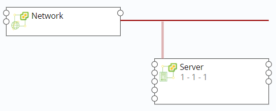
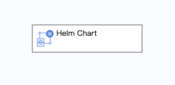
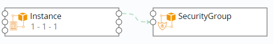

 **蓝图设计**
　　
# 蓝图

　　蓝图是包含计算、存储、网络、软件等资源在内的整体应用环境的完整规范定义，用于确定各种资源的的属性与依赖关系、工作流和执行策略。您可以通过可视化画布进行蓝图设计，将一个或多个组件进行组合，从而创建标准化的服务框架。蓝图发布之后，可用于创建云资源部署服务。蓝图设计列表展示目前生成的蓝图信息，以及其发布状态，并可以按照蓝图名称进行搜索。勾选具体蓝图名称，则可以对其进行一系列操作，包括编辑、复制、发布、取消发布、导入、导出、删除等。
　　
　
## 内建蓝图

　　内建蓝图为系统创建的蓝图，目前SmartCMP内建了一系列典型的蓝图以方便您使用，例如Windows on vSphere, linux VM，您可以在创建服务配置时直接使用这些内建的蓝图。在左边导航栏选择 服务建模 - 蓝图设计 ，在蓝图列表中选择内建的蓝图，您便可以使用当前蓝图配置您的服务。

## 可视化编辑器概览

　　点击蓝图名称或添加新蓝图将进入可视化编辑器，您可以在其中编辑蓝图架构或修改组件参数。

　　可视化编辑器包括以下几个部分：

 -  组件列表面板：组件列表包含SmartCMP支持的云基础架构的各个组件，以及您自定义组件。您可以选中任意一个组件，然后将它拖放到画布中。

 -  画布：您可以将组件拖放到画布上，不同的组件之间可以在画布上建立连接以定义组件之间的关系。

 -  基本信息面板：包括蓝图的名称，描述和图标信息。您可以对其进行修改。

 -  输入面板：管理蓝图里的所有输入项。

 -  输出面板：管理蓝图里的所有输出项，可添加或者编辑输出信息。在添加输出信息时，可选择或输入表达式。

 -  选中组件的组件信息面板：包含选定组件的基本信息、参数等。

## 组件的添加与设置 {#组件的添加与设置}

　　当您把组件拖放到画布上，组件就被添加至蓝图中。选中组件，在组件信息面板里可以编辑组件信息。组件编辑信息包括：

 -   基本信息：可以在基本信息里看到组件的类型和版本，同时可以对组件的名称进行修改。

 -   参数：组件的参数列表，包括组件自身的参数和从父节点继承的参数，可以在这里对参数进行设置。

 -   功能：组件的功能列表，展示组件可以提供的功能，一旦有其它的组件需要功能列表里的功能作为前提条件，那么就可以建立其它组件到该组件的连接以提供该功能给其它组件。

 -   前提条件：组件需要的潜在功能列表，一旦列表里的功能被完全或者部分满足，该组件就可以运行工作，您在这里建立和其它组件的连接关系，以满足自身的需求。

 -   连接：组件的所有连接列表，一旦前提条件里的某个组件需要的功能被满足，对应的连接就会出现在这里，您可以在这里对这一连接进行编辑和删除操作。

## 组件的删除 {#组件的删除}

　　组件被拖放到画布上后，若要删除组件，鼠标右键点击该组件，进行删除操作。

## 连接的建立 {#连接的建立}

　　您可根据以下步骤建立连接：

　　1.  在组件 信息面板-前提条件，添加连接。

　　2.  在蓝图中添加。画布上的所有组件和连接构成了蓝图。当一个组件被拖放到蓝图中后，组件的左边框和右边框上就会创建组件的 连接点 。在左边框上的连接点对应于组件的功能，在右边框上的连接点对应于组件的前提条件。因此，您可以用鼠标选择右边框上的 前提条件 连接点，这个时候，系统就会给出蓝图中所有潜在的可连接的 功能 组件连接点，您可以选择其中的某一个组件进行连接。

## 连接的删除 {#连接的删除}

　　在组件信息面板中删除：任何类型的组件连接均可以在这里删除。在 组件信息面板 - 连接 中选定连接，点击删除。

　　在蓝图中删除：选中某一个连接，单击鼠标右键，在弹出的上下文菜单里可以删除选中的连接。绝大部分的连接都可以这样删除。

>「Note」：虚机和网络组件，虚机和存储组件的连接是例外，不可以通过这种方式删除。

## 创建蓝图

### 创建vSphere单节点蓝图 {#创建vSphere单节点蓝图}

　　当您需要创建vSphere单节点蓝图时，请按以下操作步骤操作：

1.  选择 服务建模 - 蓝图设计 ，点击添加

2.  输入蓝图名称及描述，点击确定，进入可视化蓝图编辑页面

3.  从左边的组件列表中选择vSphere栏目下的Server和Network组件，分别将他们拖拽到右边的画布区域中，蓝图中的组件描述和连接说明可参考文中表格

4.  定义网络：点击Server右边的network节点拖拽到Network的link节点上，建立server和network的网络连接
	

5.  点击左上角 验证，验证蓝图，提示这是一个合法的蓝图

6.  验证成功后点击左上角保存，保存成功后点击返回，将回到蓝图列表界面

7.  发布蓝图：在蓝图列表里选择刚编辑的vSphere蓝图，点击发布，然后点击是

8.  蓝图发布成功，状态变为已发布，vSphere虚拟机蓝图创建成功

9.  也可在验证成功后，直接点击保存并发布，发布蓝图

|vSphere|组件描述|云平台组件连接说明|
|:----:|:----:|:----:|
|Instance|  实例的基本单元，承载运算的主体  |使用时将Instance的Network连接点与Network组件的link连接点相连|
|WindowsInstance	|  实例的基本单元，承载运算的主体  |     将WindowsInstance组件的dependency连接点与SecurityGroup相连  |
|Network|	 容器组内的容器共享相同的IP地址和端口号    |使用时将Instance的Network连接点与Network组件的link连接点相连|
|Volume|    是一个可辨认的数据存储单元    	 |  将Volume组件拖拽到Instance内 |
|Logical Switch| NSX逻辑交换机可在完全脱离底层硬件的虚拟环境中再现交换功能（单播、多播和广播）|  将Lswitch与Instance/Windows Instance连接点相连 |
|DLR	|NSX逻辑(分布式)路由器| 将DLR与Lswitch相连|
|Security Group|	NSX安全组，由同一地域内具有相同保护需求并相互信任的实例组成，是一种虚拟防火墙，用于设置实例的网络访问控制| 将Security Group与Instance/WindowsInstance连接点相连 |	  
|Edge	| 增强型数据速率GSM演进技术,是一种从GSM到3G的过渡技术 |将Edge的Load Balancer的edge连接点与Load Balancer相连 |
|LoadBalancer|  负载均衡是将访问流量根据转发策略分发到后端多台云服务器的流量分发控制服务  |将VirtualServer内置于LoadBalancer内，使用时将LoadBalancer的edge连接点与Edge相连 |
|VirtualServer|	 是一个高扩展和高可用性server，在一个真正server的集群中构建而成   | 将VirtualServer内置于LoadBalancer内，使用时将VirtualServer的Server连接点与Sever相连 |
|   软件组件|	实现快速地部署不同的软件  | 内嵌至基础设施组件中 |
|   Exporter|	用于监控实例运行情况  | 内嵌至基础设施组件中 |

### 创建VMware NSX 蓝图 {#创建VMwareNSX蓝图}

　　当您需要创建VMware NSX 蓝图时，请按以下操作步骤操作：

1.  选择 服务建模 - 蓝图设计 ，点击添加

2.  输入蓝图名称及描述，点击确定，进入可视化蓝图编辑页面

3.  从左边的组件列表中选择vSphere栏目下的Server、Lswitch、DLR、SecurityGroup组件，分别将他们拖拽到右边的画布区域中,蓝图中的组件描述和连接说明可参考1.7.1中表格

4.  点击Server右边的lswitch节点拖拽到Lswitch的节点上（显示绿色），建立server与Lswitch的连接

5.  点击DLR右边的lswitch节点拖拽到Lswitch的节点上，建立DLR与Lswitch的连接

6.  点击SecurityGroup右边的Server_WindowsServer节点拖拽到Server的节点上，建立SecurityGroup与Server的连接

	

7.  点击左上角 验证，验证蓝图，提示这是一个合法的蓝图

8.  点击保存并发布，发布蓝图，提示蓝图发布成功

### 创建vSphere MySQL带监控蓝图 {#创建vSphereMySQL带监控蓝图}

　　当您需要创建应用软件部署和带应用监控的蓝图时，以部署一台vSphere上的虚拟机、并安装MySQL以及MySQL监控为例：

1.  选择 服务建模 - 蓝图设计 ，点击添加

2.  输入蓝图名称及描述，点击确定，进入可视化蓝图编辑页面

3.  从左边的组件列表中选择vSphere栏目下的Server和Network组件，分别将他们拖拽到右边的画布区域中，蓝图中的组件描述和连接说明可参考1.7.1中表格

4.  定义网络：点击Server右边的network节点拖拽到Network的link节点上

5.  添加组件：从左边的组件列表中选择软件组件栏目下的MySQL和MySQLExporter组件，拖动至server节点框内，选择连接的名称，点击「完成」

6.  添加依赖关系：点击MySQLExporter右侧的节点拖拽到MySQL左侧的feature节点上，添加MySQLExporter与MySQL的依赖关系

	

7.  验证蓝图：点击左上角 验证，验证蓝图的合法性

8.  保存并发布：点击左上角的保存并发布，发布蓝图

9.  根据下章服务配置步骤，选择刚发布的蓝图，发布服务目录

10. 服务目录申请，经业务组流程（审批）后部署，部署成功后可查看MySQL组件的监控信息

### 创建OpenStack单节点蓝图 {#创建OpenStack单节点蓝图}

　　当您需要创建OpenStack单节点蓝图时，请按以下操作步骤操作：

1.  选择 服务建模 - 蓝图设计 ，点击添加

2.  输入蓝图名称及描述，点击确定，进入可视化蓝图编辑页面

3.  从左边的组件列表中选择OpenStack栏目下的Server和Network组件，分别将他们拖拽到右边的画布区域中，蓝图中的组件描述和连接说明可参考文中表格

4.  定义网络：点击Server右边的network节点拖拽到Network的link节点上

	

5.  验证蓝图：点击左上角 验证，验证蓝图，提示这是一个合法的蓝图

6.  保存蓝图：验证成功后点击左上角保存，保存成功后点击返回，将回到蓝图列表界面

7.  发布蓝图：在蓝图列表里选择刚编辑的OpenStack蓝图，点击发布，然后点击是

8.  蓝图发布成功，状态变为已发布，Openstack虚拟机蓝图创建成功

9.  也可在验证成功后，直接点击保存并发布，发布蓝图

|OpenStack|组件描述|云平台组件连接说明|
|:----:|:----:|:----:|
	|Instance| 实例的基本单元，承载运算的主体  |  将Instance组件的dependency连接点与SecurityGroup相连   |		
    |WindowsInstance	|  实例的基本单元，承载运算的主体  |     将WindowsInstance组件的dependency连接点与SecurityGroup相连  |
	|Network|   容器组内的容器共享相同的IP地址和端口号  | 使用时将Instance的Network连接点与Network组件的link连接点相连 |
	|Router	|   路由， | 将Router的Network连接点与Network组件的route连接点相连  |
	|FloatingIP	|浮动IP，通常是一个公开的、可以路由到的IP地址，可灵活，自由地根据需要分配 |  与Instance组件的floatingIP连接点相连接  |
	|Volume|    是一个可辨认的数据存储单元    	 |  将Volume组件拖拽到Instance内 |
	|Security Group|	安全组由同一地域内具有相同保护需求并相互信任的实例组成，是一种虚拟防火墙，用于设置实例的网络访问控制  |  将Instance组件的Security_Group连接点与SecurityGroup相连  |
	|Load Balancer	|负载均衡是将访问流量根据转发策略分发到后端多台云服务器的流量分发控制服务 |  使用时将Instance组件的dependency连接点与LoadBalancer相连  |
	|Firewall|	防火墙 | 单独部署  |
	|Load Balancer Listener|	负载均衡监听器，可监听客户端的请求，服务端的操作等 | 将Listener内置于LoadBalancer，将Listener的Server连接点与Server相连。LoadBalancer中可内置多个Listener， Listener可与多个Server相连|
    |DNS|	域名系统,是将域名和IP地址相互映射的一个分布式数据库 |  单独部署 |
	| EIP|    弹性公网IP是独立的公网IP资源,使用方便灵活   	 | 使用时将EIP组件的machine连接点与Instance相连,也可单独部署  |
	|   软件组件|	实现快速地部署不同的软件  | 内嵌至基础设施组件中 |
    |   Exporter|	用于监控实例运行情况  | 内嵌至基础设施组件中 |

### 创建OpenStack LoadBalancer with SecurityGroup蓝图 {#创建OpenStackLoadBalancerWithSecurityGroup蓝图}

　　当您需要创建OpenStack LoadBalancer with SecurityGroup蓝图时，请按以下操作步骤操作：

1.  选择 服务建模 - 蓝图设计 ，点击添加

2.  输入蓝图名称及描述，点击确定，进入可视化蓝图编辑页面

3.  从左边的组件列表中选择Openstack栏目下的Server、Network将它们拖拽到右边的画布区域中，点击Server右边的network节点拖拽到Network的link节点上，建立Server节点和Network的连接，蓝图中的组件描述和连接说明可参考1.7.4中表格

4.  从左边组件列表Openstack栏目下，选择LoadBalancer组件到右边的画布区域，再将Openstack栏目下Listener拖动至LoadBalancer节点框内，点击完成，建立负载均衡监听器（Listener）和负载均衡器（LoadBalancer）的内置关系

5.  点击Listener右边的server节点拖拽至Server的server节点上，建立Listener和Server节点的关联关系

6.  从左边组件列表Openstack栏目下，拖动SecurityGroup组件到右边的画布区域，点击Server组件右边的security\_group节点到SecurityGroup左边的security节点上，建立Server与SecurityGroup的连接关系

	

7.  验证蓝图：点击左上角 验证，验证蓝图，提示这是一个合法的蓝图

8.  保存蓝图：验证成功后点击左上角保存，保存成功后点击返回，将回到蓝图列表界面

9.  发布蓝图：在蓝图列表里选择刚编辑的OpenStack LoadBalancer with
    SecurityGroup蓝图，点击发布，然后点击是

10. 蓝图发布成功，状态变为已发布，OpenStack LoadBalancer with
    SecurityGroup虚拟机蓝图创建成功

11. 也可在验证成功后，直接点击保存并发布，发布蓝图

### 创建OpenStack DNS蓝图 {#创建OpenStackDNS蓝图}

　　当您需要创建OpenStack DNS蓝图时，请按以下操作步骤操作：

1.  选择 服务建模 - 蓝图设计 ，点击添加

2.  输入蓝图名称及描述，点击确定，进入可视化蓝图编辑页面

3.  从左边的组件列表中选择Openstack栏目下的DNS，拖拽到右边的画布区域中，蓝图中的组件描述和连接说明可参考1.7.4中表格
	

4.  验证蓝图：点击左上角 验证，验证蓝图，提示这是一个合法的蓝图

5.  保存蓝图：验证成功后点击左上角保存，保存成功后点击返回，将回到蓝图列表界面

6.  发布蓝图：在蓝图列表里选择刚编辑的OpenStack
    DNS蓝图，点击发布，然后点击是

7.  蓝图发布成功，状态变为已发布，OpenStack DNS虚拟机蓝图创建成功

8.  也可在验证成功后，直接点击保存并发布，发布蓝图

### 创建阿里云蓝图 {#创建阿里云蓝图}

　　当您需要创建阿里云蓝图时，请按以下操作步骤操作：

1.  选择 服务建模 - 蓝图设计 ，点击添加

2.  输入蓝图名称及描述，点击确定，进入可视化蓝图编辑页面

3.  从左边的组件列表中选择阿里云栏目下的Instance，SecurityGroup，EIP, Load Balancer组件拖拽到右边的画布区域中，蓝图中的组件描述和连接说明可参考文中表格

4.  拖拽Instance组件上的Dependency连接点至SecurityGroup组件的feature连接点，建立Instance与SecurityGroup的依赖关系

	  

	 >「Note」若需在服务配置时新建安全组，则在SecurityGroup的参数下，去掉勾选"使用已有资源"

5.  拖拽EIP组件上的Machine连接点至Instance的Machine连接点，建立EIP与Instance的依赖关系

6.  拖拽Load Balancer组件上的Server连接点至Instance的Server连接点，建立Load Balancer与Instance的依赖关系

5.  验证蓝图：点击左上角 验证，验证蓝图，提示这是一个合法的蓝图验证成功后点击左上角保存，保存成功后点击返回

6.  保存蓝图：验证成功后点击左上角保存保存成功后点击返回，将回到蓝图列表界面

7.  发布蓝图：在蓝图列表里选择刚编辑的阿里云蓝图，点击发布，然后点击是

8.  蓝图发布成功，状态变为已发布，阿里云蓝图创建成功

9.  也可在验证成功后，直接点击保存并发布，发布蓝图

|阿里云| 组件描述|云平台组件连接说明|
|:----:|:----:|:----:|
|	Instance| 实例的基本单元，承载运算的主体  |  将Instance组件的dependency连接点与SecurityGroup相连   |		
|	WindowsInstance	|  实例的基本单元，承载运算的主体  |     将WindowsInstance组件的dependency连接点与SecurityGroup相连  |
|	SecurityGroup|安全组由同一地域内具有相同保护需求并相互信任的实例组成，是一种虚拟防火墙，用于设置实例的网络访问控制|    将Instance组件的dependency连接点与SecurityGroup相连   |
|   Volume|    是一个可辨认的数据存储单元	 |  将Volume组件拖拽到Instance内 |
|	LoadBalancer| 负载均衡是将访问流量根据转发策略分发到后端多台云服务器的流量分发控制服务 |    使用时将LoadBalancer组件的server连接点与Instance相连   |
|	Object Storage| 对象存储是一种以对象形式的存储数据的系统 |   单独部署   |
|	ESS| 弹性伸缩，能够根据用户的业务需求和策略，自动调整对弹性计算资源的管理 |  单独部署   |
|   EIP|    弹性公网IP是独立的公网IP资源,使用方便灵活   	 | 使用时将EIP组件的machine连接点与Instance相连,也可单独部署  |
|   VPC|    虚拟私有云，为云服务器、云容器、云数据库等资源构建隔离的、用户自主配置和管理的虚拟网络环境  | 单独部署 |
|   Redis|    Redis是一个缓存数据库 | 单独部署  |
|   Kubernetes Cluster| Kubernetes集群，由节点组成，这些节点可以是物理服务器或者虚拟机，在上面安装了 Kubernetes 平台 | 单独部署  |
|   Container Registry| 容器镜像仓库，提供安全的镜像托管能力 | 单独部署  |
|   MySQL|    MySQL是一个关系型数据库管理系统  	 |单独部署  |
|   MariaDB|    MariaDB是一个数据库管理系统,属于MySQL的一个分支  | 单独部署  |
|   SQLServer|    SQLServer是一个关系型数据库管理系统    | 单独部署  |
|   Vswitch|    虚拟交换机，配置灵活、扩展性强 | 单独部署 |
|   NAS| 网络附属存储，一种将分布、独立的数据整合为大型、集中化管理的数据中心，以便于对不同主机和应用服务器进行访问的技术 |单独部署  |
|   软件组件|	实现快速地部署不同的软件  | 内嵌至基础设施组件中 |
|   Exporter|	用于监控实例运行情况  | 内嵌至基础组件中 |

### 创建Kubernetes蓝图 {#创建Kubernetes蓝图}

　　当您需要创建Kubernetes蓝图时，请按以下操作步骤操作：

1.  选择 服务建模 - 蓝图设计 ，点击添加

2.  输入蓝图名称及描述，点击确定，进入可视化蓝图编辑页面

3.  从左边的组件列表中选择Kubernetes栏目下的Service和Deployment组件拖拽到右边的画布区域中，蓝图中的组件描述和连接说明可参考1.7.8中表格

4.  拖拽Service组件上的Deployment节点至Deployment组件，建立Service与Deployment的依赖关系

5.  添加Container组件：从左边的组件列表中选择Kubernetes栏目下的Container组件，拖动至Deployment节点框内，选择连接的名称，点击完成，建立Container与Deployment的依赖关系

6.  添加PersistentVolumeClaim组件：从左边的组件列表中选择Kubernetes栏目下PersistentVolumeClaim组件，拖动至右边的画布区域。拖拽Container组件的pvc节点至PersistentVolumeClaim，建立Container与PersistentVolumeClaim的依赖关系

7.  验证蓝图：点击左上角 验证，验证蓝图，提示这是一个合法的蓝图验证成功后点击左上角保存，保存成功后点击返回

8.  保存蓝图：验证成功后点击左上角保存，保存成功后点击返回，将回到蓝图列表界面

9.  发布蓝图：在蓝图列表里选择刚编辑的Kubernetes蓝图，点击发布，然后点击是

10. 蓝图发布成功，状态变为已发布，Kubernetes蓝图创建成功

11. 也可在验证成功后，直接点击保存并发布，发布蓝图

|Kubernetes |组件描述|云平台组件连接说明|
|:----:|:----:|:----:|		
|	Deployment|	为POD和ReplicaSet 提供了一个声明式定义方法，方便管理应用|           |    
|Container | 容器 |   将Containier组件拖拽到Deployment内   |
|	Nginx- Container|	容器 |    将Nginx-Containier组件拖拽到Deployment内，其config_Map连接到ConfigMap   |
|	Service|	Service 定义了这样一种抽象：一个 Pod 的逻辑分组，一种可以访问它们的策略 — 通常称为微服务。|   将该组件的Deployment节点连接至Deployment组件  |
|	Ingress|	给 service 提供集群外部访问的 URL、负载均衡、SSL 终止、HTTP 路由等。|   将该组件的Service节点连接至Service组件  |
|	Persistent Volume Claim|	请求存储资源。|     将Container的pvc节点连接至该组件  |
|	ConfigMap|	用于保存配置数据的键值对，可用于保存单个属性或保存配置文件。|   将Nginx-Container的ConfigMap节点连接至该组件  |
|	Secret|	解决密码、token、密钥等敏感数据的配置问题。 |   将Container的Secret节点连接至该组件 |
|	ServiceEndpoint	| 用于记录service对应的所有Pod的访问地址           |   将Container的service_endpoint节点和ServiceEndpoint的container节点相连，然后将ServiceEndpoint 的software_component节点与软件组件相连   |
|	DaemonSet|	保证在每个Node上都运行一个容器副本，常用来部署一些集群的日志、监控或者其他系统管理应用。|   将Container内置于DaemonSet中 |
|	StatefulSet|	为了解决状态服务的问题|    将Container内置于StatefulSet中  |
|	Tomcat|	为了解决状态服务的问题|    将Tomcat内置于Devployment中  |
|	MySQL|	为了解决状态服务的问题|    将MySQL内置于StatefulSet中  |
|Helm Chart|	用于快速部署容器应用|    单独部署|
|   软件组件|	实现快速地部署不同的软件  | 内嵌至基础设施组件中 |
|   Exporter|	用于监控实例运行情况  | 内嵌至基础设施组件中 |

### 创建Helm Chart蓝图 {#创建Helm Chart蓝图}

　　当您需要创建Helm chart蓝图时，请按以下操作步骤操作：

1.  选择 服务建模 - 蓝图设计 ，点击添加

2.  输入蓝图名称及描述，点击确定，进入可视化蓝图编辑页面

3.  从左边的组件列表中选择Helm Chart栏目下的Helm Chart组件拖拽到右边的画布区域，蓝图中的组件描述和连接说明可参考文中表格

>「Note」以Helm Chart举例请确保您的Kubernetes集群已安装Helm,如您需要创建一般Kubernetes蓝图，您可以拖拽其他Kubernetes组件

4.  验证蓝图：点击左上角 验证，验证蓝图，提示这是一个合法的蓝图

5.  保存蓝图：验证成功后点击左上角保存保存成功后点击返回，将回到蓝图列表界面

6.  发布蓝图：在蓝图列表里选择刚编辑的Helm Chart蓝图，点击发布，然后点击是

7.  蓝图发布成功，状态变为已发布，Helm Chart蓝图创建成功

8.  也可在验证成功后，直接点击保存并发布，发布蓝图

### 创建Azure蓝图 {#创建Azure蓝图}

　　当您需要创建Azure蓝图时，请按以下操作步骤操作：

1.  选择 服务建模 - 蓝图设计 ，点击添加

2.  输入蓝图名称及描述，点击确定，进入可视化蓝图编辑页面

3.  从左边的组件列表中选择Azure栏目下的VirtualNetwork和Instance组件拖拽到右边的画布区域中，拖拽Instance组件上的virtualNetwork节点至VirtualNetwork组件的link节点，建立Instance与VirtualNetwork的依赖关系，蓝图中的组件描述和连接说明可参考文中表格

4.  再选择Azure栏目下的AvailabilitySet、
    SecurityGroup、BlobContainer组件拖拽到右边的画布区域中，拖拽Instance组件上的availability_set节点至AvailabilitySet组件的instance节点，拖拽Instance组件上的security_group节点至SecurityGroup组件的security节点，建立Instance与Availability、SecurityGroup的依赖关系

5.  再选择Azure栏目下的LoadBalancer组件拖拽到右边的画布区域中，再将LoadBalancerRule拖动至LoadBalancer节点框内，点击「完成」，建立负载均衡规则（LoadBalancerRule）和负载均衡器（LoadBalancer）的内置关系

6.  拖拽LoadBalancerRule组件上的instance节点至Instance组件的loadbalancer_rule节点，建立Instance与LoadBalancerRule的依赖关系

	
7.  验证蓝图：点击左上角 验证，验证蓝图，提示这是一个合法的蓝图验证成功后点击左上角保存，保存成功后点击返回

8.  保存蓝图：验证成功后点击左上角保存，保存成功后点击返回，将回到蓝图列表界面

9.  发布蓝图：在蓝图列表里选择刚编辑的阿里云蓝图，点击发布，然后点击是

10. 蓝图发布成功，状态变为已发布，阿里云蓝图创建成功

11. 也可在验证成功后，直接点击保存并发布，发布蓝图

|Azure|组件描述|云平台组件连接说明|
|:----:|:----:|:----:|		
	|Instance|	实例的基本单元，承载运算的主体    |     将Instance的virtualNetwork连接点和Network的Link连接点相连    |
	|WindowsInstance| 实例的基本单元，承载运算的主体  |     将WindowsInstance的virtualNetwork连接点和Network的Link连接点相连   |
	|Load Balancer	| 负载均衡是将访问流量根据转发策略分发到后端多台云服务器的流量分发控制服务   |    将Load Balancer Rule内置于Load Balancer中，通过Load Balancer Rule与Instance相连    |
	|Network|   容器组内的容器共享相同的IP地址和端口号  | 使用时将Instance的Network连接点与Network组件的link连接点相连 |
	|	Volume|	是一个可辨认的数据存储单元 |   单独部署    |
	|	Object Storage| 对象存储是一种以对象形式的存储数据的系统 |   单独部署   |
	|Load Balancer Rule| 负载均衡规则	 |     将Load Balancer Rule内置于Load Balancer中，将Load Balancer Rule的instance连接点与Instance的loadBalancer_rule连接点相连   |
	|AvailabilitySet|可用性集可确保在 Azure 上部署的虚拟机能够跨多个隔离的硬件群集分布	| 将Instance的availability_set连接点和AvailabilitySet的instance连接点相连    |                           
	|Disk|	磁盘|      将Disk组件拖拽到Instance内      |
	|Security Group|	 安全组由同一地域内具有相同保护需求并相互信任的实例组成，是一种虚拟防火墙，用于设置实例的网络访问控制   |    使用时将Instance组件的Security_group连接点与SecurityGroup组件的Security连接点连接  |
	|MySQL|    MySQL是一个关系型数据库管理系统  	 |单独部署  |
	|SQLServer|    SQLServer是一个关系型数据库管理系统    | 单独部署  |
    |Redis|    Redis是一个缓存数据库 | 单独部署  |
	|   Kubernetes Cluster| Kubernetes集群，由节点组成，这些节点可以是物理服务器或者虚拟机，在上面安装了 Kubernetes 平台 | 单独部署  |
	|   软件组件|	实现快速地部署不同的软件  | 内嵌至基础设施组件中 |
    |   Exporter|	用于监控实例运行情况  | 内嵌至基础设施组件中 |

### 创建AWS蓝图 {#创建AWS蓝图}

　　当您需要创建AWS蓝图时，请按以下操作步骤操作：

1.  选择 服务建模 - 蓝图设计 ，点击添加

2.  输入蓝图名称及描述，点击确定，进入可视化蓝图编辑页面

3.  从左边的组件列表中选择AWS栏目下的Instance和SecurityGroup组件拖拽到右边的画布区域中，拖拽Instance组件上的security_group节点至SecurityGroup组件的security_group节点，建立Instance与SecurityGroup的依赖关系，蓝图中的组件描述和连接说明可参考文中表格

	

4.  验证蓝图：点击左上角 验证，验证蓝图，提示这是一个合法的蓝图验证成功后点击左上角保存，保存成功后点击返回

5.  保存蓝图：验证成功后点击左上角保存，保存成功后点击返回，将回到蓝图列表界面

6.  发布蓝图：在蓝图列表里选择刚编辑的AWS蓝图，点击发布，然后点击是

7.  蓝图发布成功，状态变为已发布，AWS蓝图创建成功

8.  也可在验证成功后，直接点击保存并发布，发布蓝图

|AWS |组件描述|云平台组件连接说明|
|:----:|:----:|:----:|		
|	Instance| 实例的基本单元，承载运算的主体  |  将Instance组件的Security_Group节点与SecurityGroup相连   |
|	WindowsInstance	|  实例的基本单元，承载运算的主体    |     将WindowsInstance组件的Security_Group节点与SecurityGroup相连  |
|	Volume|	是一个可辨认的数据存储单元 |   单独部署    |
|	RDS|	数据库实例是在云中运行的独立数据库环境。|    单独部署    |
|	SecurityGroup| 安全组由同一地域内具有相同保护需求并相互信任的实例组成，是一种虚拟防火墙，用于设置实例的网络访问控制     |    	 将Instance组件的Security_Group连接点与SecurityGroup相连     |
|	Object Storage|	对象存储是一种以对象形式的存储数据的系统 |    单独部署    |
|	EIP  |	弹性公网IP是独立的公网IP资源,使用方便灵活 |   使用时将EIP组件的machine连接点与Instance相连,也可单独部署   |
|   软件组件|	实现快速地部署不同的软件  | 内嵌至基础设施组件中 |
|   Exporter|	用于监控实例运行情况  | 内嵌至基础设施组件中 |

### 创建青云蓝图 {#创建青云蓝图}

　　当您需要创建青云蓝图时，请按以下操作步骤操作：

1.  选择 服务建模 - 蓝图设计 ，点击添加

2.  输入蓝图名称及描述，点击确定，进入可视化蓝图编辑页面

3.  从左边的组件列表中选择青云栏目下的WindowsInstance和SecurityGroup组件拖拽到右边的画布区域中，拖拽WindowsInstance组件上的security_group节点至SecurityGroup组件的security节点，建立WindowsInstance与SecurityGroup的依赖关系，蓝图中的组件描述和连接说明可参考文中表格

	
4.  验证蓝图：点击左上角 验证，验证蓝图，提示这是一个合法的蓝图验证成功后点击左上角保存，保存成功后点击返回

5.  保存蓝图：验证成功后点击左上角保存，保存成功后点击返回，将回到蓝图列表界面

6.  发布蓝图：在蓝图列表里选择刚编辑的青云蓝图，点击发布，然后点击是

7.  蓝图发布成功，状态变为已发布，青云蓝图创建成功

8.  也可在验证成功后，直接点击保存并发布，发布蓝图

|青云| 组件描述|云平台组件连接说明|
|:----:|:----:|:----:|
|	Instance| 实例的基本单元，承载运算的主体  |  将Instance组件的dependency连接点与SecurityGroup相连   |		
|	WindowsInstance	|  实例的基本单元，承载运算的主体  |     将WindowsInstance组件的dependency连接点与SecurityGroup相连  |
|	SecurityGroup| 安全组由同一地域内具有相同保护需求并相互信任的实例组成，是一种虚拟防火墙，用于控制实例的网络访问	 |   使用时将Instance组件的dependency连接点与SecurityGroup相连   |
|   Volume| 是一个可辨认的数据存储单元|将Volume组件拖拽到Instance内 |
|   Redis|    Redis是一个缓存数据库 | 单独部署  |
|   MySQL|    MySQL是一个关系型数据库管理系统  	 |单独部署  |
|   软件组件|	实现快速地部署不同的软件  | 内嵌至基础设施组件中 |
|   Exporter|	用于监控实例运行情况  | 内嵌至基础设施组件中 |

### 创建通用云蓝图 {#创建通用云蓝图}

　　通用云蓝图是完全的云中立，创建完成后，方便您按需部署到任何所需云平台。当您需要创建通用云蓝图时，请按以下操作步骤操作：

1.  选择 服务建模 - 蓝图设计 ，点击添加

2.  输入蓝图名称及描述，点击确定，进入可视化蓝图编辑页面

3.  从左边的组件列表中选择通用云栏目下的Instance和Security　Group组件拖拽到右边的画布区域中，拖拽Instance组件上的security_group连接点至SecurityGroup组件的security连接点，建立Instance与Security　Group的依赖关系，蓝图中的组件描述和连接说明可参考文中表格

	
4.  验证蓝图：点击左上角验证，验证蓝图，提示这是一个合法的蓝图

5.  保存蓝图：验证成功后点击左上角保存当前蓝图，保存成功后点击返回，将回到蓝图列表界面

6.  发布蓝图：在蓝图列表里选择刚编辑的通用云蓝图，点击发布，然后点击是

7.  蓝图发布成功，状态变为已发布，通用云蓝图创建成功

8.  也可在验证成功后，直接点击保存并发布，发布蓝图

|通用云| 组件描述|云平台组件连接说明|
|:----:|:----:|:----:|
|	Instance| 实例的基本单元，承载运算的主体  |  将Instance组件的dependency连接点与SecurityGroup相连   |		
|	WindowsInstance	|  实例的基本单元，承载运算的主体  |     将WindowsInstance组件的dependency连接点与SecurityGroup相连  |
|	SecurityGroup| 安全组由同一地域内具有相同保护需求并相互信任的实例组成，是一种虚拟防火墙，用于设置实例的网络访问控制	 |   使用时将Instance组件的dependency连接点与SecurityGroup相连   |
|   Network|	 容器组内的容器共享相同的IP地址和端口号    |使用时将Instance的Network连接点与Network组件的link连接点相连|
|	Object Storage|	对象存储是一种以对象形式的存储数据的系统 |    单独部署    |
|	LoadBalancer| 负载均衡是将访问流量根据转发策略分发到后端多台云服务器的流量分发控制服务 |    使用时将LoadBalancer组件的server连接点与Instance相连   |
|   Volume|    是一个可辨认的数据存储单元    	 |  将Volume组件拖拽到Instance内 |
|   VPC|    虚拟私有云，为云服务器、云容器、云数据库等资源构建隔离的、用户自主配置和管理的虚拟网络环境  | 单独部署 |
|   EIP|    弹性公网IP是独立的公网IP资源,使用方便灵活   	 | 使用时将EIP组件的Machine连接点与Instance相连,也可单独部署  |
|   软件组件|	实现快速地部署不同的软件  | 内嵌至基础设施组件中 |
|   Exporter|	用于监控实例运行情况  | 内嵌至基础设施组件中 |

## 修改蓝图

　　如果因业务需求，您需要对现有蓝图进行修改，您可以根据下面的步骤来修改蓝图：

1.  在左边导航选择 服务建模 - 蓝图设计

2.  点击蓝图名称，则进入蓝图编辑界面，根据需要修改蓝图，点击保存

## 复制蓝图

　　如果您想要快速添加现有蓝图的设计，您可以根据下面的步骤来复制蓝图：

1.  在左边导航选择 服务建模 - 蓝图设计

2.  选择蓝图列表中的某一蓝图后，菜单栏中的复制按钮将变得可用，点击复制，更改蓝图名称，点击保存，蓝图复制成功

## 导入蓝图

　　如果您在本地已存有蓝图设计，可以根据下面的步骤来导入蓝图：

1.  在左边导航选择 服务建模 - 蓝图设计

2.  点击导入按钮

3.  填写蓝图名称，蓝图描述（选填），点击浏览，选择本地蓝图，点击提交

4.  蓝图导入成功

5.  蓝图导入成功时，蓝图中的组件被同步更新，如果组件类型已经在CMP中存在，则直接更新组件，组件版本增加1，您可以在 服务建模 - 组件库 中查看新增组件， 点击组件名称，在历史版本标签页中查看组件版本详情；如果组件类型不存在，则直接新建对应的组件。

## 导出蓝图

　　如果您需要把在平台中创建的蓝图设计保存到本地，可以根据下面的步骤来导出蓝图：

1.  在左边导航选择 服务建模 - 蓝图设计

2.  选择蓝图列表中的某一蓝图后，菜单栏中的 导出 按钮将变得可用，点击导出，Zip格式的蓝图导出成功

## 删除蓝图

　 当您不再需要某个蓝图时，可以根据下面的步骤来删除蓝图：

1.  在左边导航选择 服务建模 - 蓝图设计

2.  选中蓝图点击删除按钮，点击确认后蓝图删除成功

# 蓝图发布

　　当您发布蓝图后，可以在配置云资源蓝图服务时，选择已发布的蓝图设计。配置完成后，用户可以直接通过服务目录申请该云资源蓝图服务，您可以根据下面的步骤来发布服务：

1.  在左边导航选择 服务建模 - 蓝图设计

2.  选择列表里状态为"未发布"蓝图，点击操作按钮选发布，确认发布后，蓝图发布成功，列表中蓝图状态为"已发布"

　　当您取消蓝图发布后，在进行服务配置时，就无法选择取消发布的蓝图设计，您可以根据下面的步骤来取消现有蓝图的发布：

1.  在左边导航选择 服务建模 - 蓝图设计

2.  选择列表里状态为"已发布"蓝图，点击操作按钮选取消发布，蓝图取消发布成功，列表中蓝图状态为"未发布"
