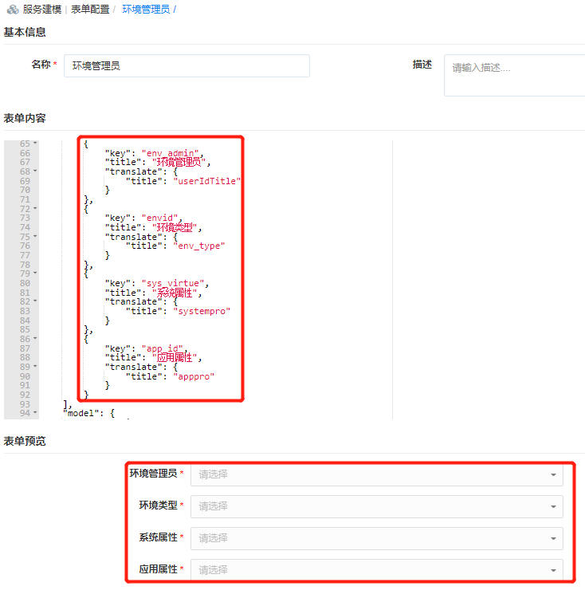

**表单配置**

在创建或配置服务时，可以选择系统内置的表单（IP池创建表单、项目创建表单使用户可自动化创建IP池、项目等配置），如果您需要修改或添加额外的字段信息供用户在申请时填写，可以通过表单设计器，自定义配置表单，例如：申请新项目、申请邮箱账户、申请资源池、添加环境管理员。
系统内置表单：
+ 创建IP池，定义了用户申请创建一个新的IP池时需要输入的信息。
+ 创建项目，定义了用户申请创建一个新的项目时需要输入的信息。
+ 上传附件，上传所需要的材料提供审批的时候使用。文件大小不能超过500KB。
+ 资源池扩容，定义了用户申请资源池扩容时需要输入的信息。

下面为您介绍新增表单的具体操作步骤。
表单配置的字段完成之后，您可以在服务目录申请服务时自定义填写。

# 添加表单

 在左侧导航选择「服务建模」-「表单配置」，在表单配置列表界面点击添加，输入表单基本信息（表单名称和表单描述）；在表单内容处输入Schema的JSON配置，在UI上需要支持JSON的语法高亮；在表单预览处可查看自定义的表单内容。例如：添加环境管理员，定义字段信息，表单预览查看字段

+ 环境管理员的来源和职责：环境管理员从测试人员中进行指定；测试人员与“测试业务组”进行关联。环境管理员只拥有查看和操作“与本人关联虚拟机”的权限（即当为vSphere服务配置环境管理员时，环境管理员会与该服务部署的虚拟机进行关联）

+ 通过环境管理员的设置，实现对服务部署的扩展，更好的控制服务部署和操作虚拟机

+ 在服务配置时，为服务绑定 环境管理员表单

+ 在服务申请时，指定环境管理员、选择环境类型（后台结合企业业务需求提前配置）、系统属性和应用属性。

>「Note」  支持灵活扩展，支持您根据业务需求，配置更多满足您需求的字段信息。

# 编辑、删除表单

在左侧导航选择「服务建模」-「表单配置」，在表单配置列表界面点击编辑，即可修改表单基本信息（表单名称和表单描述）；在表单内容处修改Schema的JSON配置；在表单预览处可查看自定义的表单内容。

在左侧导航选择「服务建模」-「表单配置」，在表单配置列表界面点击删除，即可删除表单。
