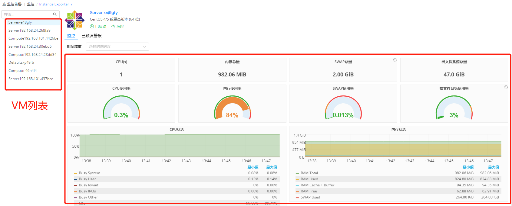

**云资源监控**

# 资源状态图

　　资源状态图能够显示云主机、容器的健康状态，根据性能指标的状态显示不同的颜色。若该云主机或容器未配置监控，默认显示灰色。浅绿到深绿到红色，颜色越深代表使用的资源越多。

-   鼠标移至该云主机上，将显示该云主机名称

-   点击后显示详情：

    +   基本信息：IP地址、操作系统、vCPU数量、内存、磁盘总空间

    +   组织信息：业务组、项目、所有者

    +   性能监控指标：内存使用率、CPU使用率、磁盘使用率

        >「Note」若未安装监控，将不显示性能监控指标

-   可根据您的需求对展示内容进行筛选，如全部或已安装监控或未安装监控、按云平台筛选、业务组筛选、项目筛选、标签筛选等。
 

# 资源监控

　　监控数据收集后，需要提供统一的界面进行展示。平台不仅能在部署或云资源的界面进行监控信息地展示，还能在全新的页面，统一展示监控信息。组件监控作为单独的页面，展示对应用、云主机或虚拟机的监控。

+ 添加代理组件的具体步骤，请参考：[组件库](https://cloudchef.github.io/doc/AdminDoc/05服务建模/组件库.html)
+ 点击左侧导航栏 监控告警 - 资源监控 ，左侧展现Export组件的树形结构，右侧显示相关的Exporter（用于描述所有的Exporter的组件， 每个组件能定义自己支持的组件类型）。
    例如：点击右侧显示的NginxExporter，进入 NginxExporter 标签页，页面左侧显示NginxExporter关联的实例，右侧显示NginxExporter组件的相关描述信息。
+ Instance Exporter 提供了一个监控不同VM的抽象组件，不管是何种监控方式的虚机，都会在Instance Exporter中列表展示。进入 Instance Exporter 标签页，页面左侧显示Instance Exporter关联的虚机实例，右侧显示虚机的监控信息。

>「Note」 组件监控的权限管理：每个用户都可以看见菜单，能够查看的组件资源范围是基于用户提前配置的权限。

# 云资源监控

　　支持针对云主机、应用软件以及容器进行监控，实时动态搜集监控数据。

## 云主机监控 {#云主机监控 .afff6}

1.  若在配置虚机模板时已添加监控代理，服务部署成功后，点击左侧导航栏 我的部署 - 服务部署 进入服务部署列表界面，点击服务部署名称，进入服务部署详情界面

2.  点击监控标签页，点击云主机名标签页将显示该部署下的云主机的监控信息。若该部署含多个云主机，则会出现多个标签页，每个标签页对应一个云主机的监控。可调整时间跨度查看监控信息。
 + CPU、CPU使用率、CPU状态

 + 内存总量、内存使用率、内存状态

 + SWAP总量、SWAP使用率

 + 根文件系统总量、根文件系统使用率

 + 丢失/错误的网络包、网络流量

 + 磁盘吞吐量、磁盘IOPS

 + 文件系统空间使用率

　　若在配置虚机模板时未添加监控，可在部署成功后，运维添加。 
+ 在我的部署 - 云主机 ，进入云主机列表界面，选择云主机，点击顶部的更多操作， 启用/切换监控 ，给该云主机添加监控，添加成功后，可选择我的部署 - 服务部署 ，点击云主机名称，在监控标签页查看。
+ 也可点击 我的部署 - 云主机 ，进入云主机列表界面，点击云主机名称进行云主机详情页面，点击 监控 标签页，点击云主机名标签页将显示云主机的监控信息。可调整时间跨度查看监控信息。

## 应用监控 {#应用监控 .afff6}

　　支持对JMX、MySQL、Nginx的应用监控。需要在蓝图建模时，增加对应用的Exporter监控的添加，带应用及其监控的蓝图部署成功后。

1.  点击左侧导航栏 我的部署 - 服务部署 进入服务部署列表界面

2.  点击服务部署名称，进入服务部署详情界面

3.  点击监控标签页，点击应用标签栏，该页面将显示该部署下的应用监控的监控信息

## Kubernetes监控 {#kubernetes监控 .afff6}

　　支持Kubernetes的监控告警，查看Kubernetes监控前提：

-   Kubernetes云平台中已添加Prometheus监控

-   在 基础设施 - 云平台管理 - Kubernetes 中，添加Kubernetes云平台添加的Prometheus监控地址：如192.xx.xx.xx：xxxx

　　完成以上操作，部署kubernetes成功后，

1.  点击 我的部署 - 云资源 - 容器服务 - 部署 进入容器部署列表界面

2.  点击部署名称，进入kubernetes部署详情界面

3.  点击监控标签页，该页面将显示该部署监控信息：Pods CPU使用情况(核)、Pods内存使用情况、Pods网络 流量等
