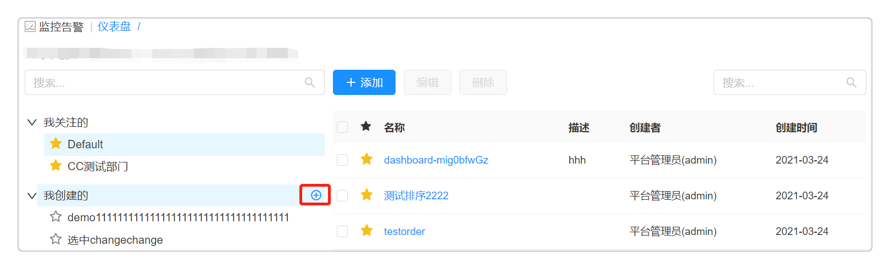
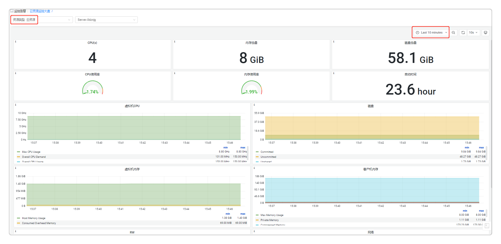

**云资源监控**

# 监控仪表盘
仪表盘能够直观展示各类云组件的监控数据，方便您快速查找相关信息，协助您通过趋势和异常值分析指标。点击 监控告警 - 仪表盘 ，左侧展现仪表盘的分类，右侧显示相关分类的仪表盘基本信息，包括名称，描述，授权，创建者和创建时间。目前平台展现四种类型的仪表盘：

 + 我关注的：展现所有您感兴趣的仪表盘。点亮仪表盘的星号标识，仪表盘会自动移动至此分类；取消星标，仪表盘会相应地移动至最初的分类。
     + 编辑或删除分类：您可以对已添加的仪表盘分组进行编辑或者删除。
      
 + 我创建的：展现所有您创建的仪表盘。
     + 添加分类：您可以手动添加一个仪表盘分类，例如云主机，数据库等。点击添加按钮，并自定义名称和相关描述。
      
     + 编辑或删除分组：您可以对已添加的仪表盘分组进行编辑或者删除。
  
 + 系统的：展现系统内置的仪表盘，类型包括云主机，Web Server, App Server，关系型数据库等。系统内置的系统仪表盘不能被删除和编辑，但是能够被归类至 我关注的 。
  
 + 共享的：展现平台管理员分享给您使用的仪表盘。

除了使用系统内置的仪表盘，您也可以自建新的仪表盘来展现您关注的监控数据，具体操作请参照以下步骤：

 + 在 我创建的 或者 我关注的 中选中某个分类，点击添加按钮，进入创建仪表盘的界面。
     
    
 + 点击仪表盘名称旁的下拉箭头，点击编辑按钮
     + 基本信息: 自定义新建仪表盘的名称和相关描述
         + 资源类型：请选择想要查看监控信息的资源类型，可选类型包括IaaS、PaaS、CaaS、软件和代理。例如，当您选择Instance(vSphere)，您可以查看被平台纳管且安装了监控的vSphere虚拟机的监控信息。
     + 共享：平台管理员可以将仪表盘共享给指定业务组中授权角色的用户使用
         + 允许共享：选择允许共享该仪表盘
         + 业务组：请选择一个业务组，业务组中的用户都能使用该共享的仪表盘
         + 角色：请选择一个或多个授权的角色，则在指定业务组中，拥有授权角色的用户才能使用该共享的仪表盘。如不选择任何角色，则指定业务组中所有用户都能使用共享的仪表盘
     

 + 点击 保存 按钮，保存仪表盘的基本信息。

 + 您也可以对仪表盘信息展示部分进行配置操作，如下图所示，新增或编辑仪表盘，右上角的红框中表示：新建、保存、设置、查询模式、时间段、缩小（针对时间段进行放宽，即小时间段换成了大时间段）、刷新等。
  

# 云资源监控大盘
云资源监控大盘为您提供了统一入口查看各类云资源的监控信息，您只需选择资源类型，就能快速查看该类型下的纳管资源的监控数据。您也可以通过调节参数来展示不同时间段的监控信息。
 

# 资源状态图

资源状态图能够显示云主机、容器等云资源的健康状态，根据性能指标的状态显示不同的颜色。若该云资源未配置监控，默认显示灰色。浅绿到深绿到红色，颜色越深代表使用的资源越多。

-   鼠标移至某一蜂窝模块上，将显示该云主机或容器名称

-   点击后显示详情：

    +   基本信息：IP地址、操作系统、vCPU数量、内存、磁盘总空间

    +   组织信息：业务组、项目、所有者

    +   已装软件、键值标签

    +   性能监控指标：健康指数、内存使用率、CPU使用率、磁盘使用率、网络流量等

        >「Note」若未安装监控，将不显示性能监控指标

-   可根据您的需求对展示内容进行筛选，如全部或已安装监控或未安装监控、按云平台筛选、业务组筛选、项目筛选、资源类型、标签等筛选。

# 组件监控

监控数据收集后，需要提供统一的界面进行展示。平台不仅能在部署或云资源的界面进行监控信息地展示，还能在全新的页面，统一展示监控信息。组件监控作为单独的页面，展示对云主机、Web Server、App Server、存储、数据库的监控。

平台目前支持对已纳管的资源添加监控的功能，若您在创建云资源时未添加监控，可在部署成功后，参照以下步骤进行安装（以安装MySQL监控为例）：

 + 点击左侧导航栏  监控告警 - 组件监控 ，左侧展现Export组件的树形结构，右侧显示相关的Exporter（用于描述所有的Exporter的组件， 每个组件能定义自己支持的组件类型）。您可以选择其中一个分类，查看云资源的详细监控信息。
  
 + 点击 MySQL Exporter, 您可以在基本信息页面查看平台对MySQL的基本监控信息，包括监控目标，监控状态，监控代理所安装的云主机，更新时间等。
  
 + 点击添加按钮，选择需要监控的云资源类型和对应类型的具体云资源，您可以选择单个或者多个需要监控的云资源，点击下一步。
  
 + 请选择安装监控代理的云主机，您需要为每一个被监控的资源指定安装监控代理的云主机，并配置监控代理服务的参数。
  
 + 点击下一步，确认每个资源的监控代理的安装情况。点击确认，安装监控代理。

您可以通过以下方式查看已安装监控的云资源详情：
 
 + 点击 监控告警 - 组件监控 ，选择一个云资源分类，点击监控目标，查看被监控资源的具体信息。
 
 + 点击 我的资源 - 云资源 ，选择一个已安装监控的云资源，在监控标签页查看详细信息。
 
 + 点击 我的资源 - 应用栈，选择一个安装监控的应用栈，在监控标签页查看详细信息。

>「Note」 组件监控的权限管理：每个用户都可以看见菜单，能够查看的组件资源范围是基于用户提前配置的权限。

# 云资源监控

支持针对云主机、应用软件以及容器进行监控，实时动态搜集监控数据。

## 云主机监控 {#云主机监控 .afff6}

1.  若在配置虚机模板时已添加监控代理，应用栈部署成功后，点击左侧导航栏 我的资源 - 应用栈 进入应用栈列表界面，点击应用栈名称，进入应用栈详情界面

2.  点击监控标签页，点击云主机名标签页将显示该部署下的云主机的监控信息。若该部署含多个云主机，则会出现多个标签页，每个标签页对应一个云主机的监控。可调整时间跨度查看监控信息。
 + CPU、CPU使用率、CPU状态

 + 内存总量、内存使用率、内存状态

 + SWAP总量、SWAP使用率

 + 根文件系统总量、根文件系统使用率

 + 丢失/错误的网络包、网络流量

 + 磁盘吞吐量、磁盘IOPS

 + 文件系统空间使用率

若在配置虚机模板时未添加监控，可在部署成功后，运维添加。 
+ 在我的资源 - 云主机 ，进入云主机列表界面，选择云主机，点击顶部的更多操作， 启用/切换监控 ，给该云主机添加监控，添加成功后，可选择我的资源 - 应用栈 ，点击云主机名称，在监控标签页查看。
+ 也可点击 我的资源 - 云主机 ，进入云主机列表界面，点击云主机名称进行云主机详情页面，点击 监控 标签页，点击云主机名标签页将显示云主机的监控信息。可调整时间跨度查看监控信息。

## 应用监控 {#应用监控 .afff6}

支持对JMX、MySQL、Nginx的应用监控。需要在蓝图建模时，增加对应用的Exporter监控的添加，带应用及其监控的蓝图部署成功后。

1.  点击左侧导航栏 我的资源 - 应用栈 进入应用栈列表界面

2.  点击应用栈名称，进入应用栈详情界面

3.  点击监控标签页，点击应用标签栏，该页面将显示该部署下的应用监控的监控信息

## Kubernetes监控 {#kubernetes监控 .afff6}

支持Kubernetes的监控告警，查看Kubernetes监控前提：

-   Kubernetes云平台中已添加Prometheus监控

-   在 基础设施 - 云平台管理 - Kubernetes 中，添加Kubernetes云平台添加的Prometheus监控地址：如192.xx.xx.xx：xxxx

完成以上操作，部署kubernetes成功后，

1.  点击 我的资源 - 云资源 - 容器服务 - 部署 进入容器部署列表界面

2.  点击部署名称，进入kubernetes部署详情界面

3.  点击监控标签页，该页面将显示该部署监控信息：Pods CPU使用情况(核)、Pods内存使用情况、Pods网络 流量等

