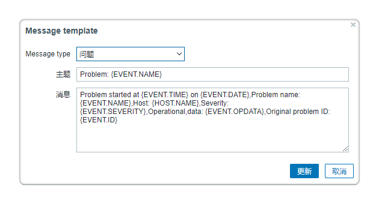

**告警**

告警为用户提供了云主机、任意应用的告警配置自服务。

# 告警策略

用来定义所选的对象类型（如云主机/应用/容器等）触发警报的条件。点击左侧导航监控告警下的二级菜单告警策略，显示告警策略列表，列表中包括告警策略名称、类别、类型（宕机、阈值或预测）、创建时间以及创建者等。可对告警策略进行添加、编辑、删除等操作。

## 添加告警策略 {#添加告警策略 .afff6}
在左侧导航选择告警策略，进入告警策略列表界面，点击添加，进入添加告警策略界面。 在添加告警策略界面，定义告警策略的基本信息。依次输入告警策略的名字，选择告警类别和告警类型。告警类别支持对云主机、应用和容器的告警。告警类型支持对云主机的宕机告警、阈值告警和预测告警，支持对应用的阈值告警和预测告警，对容器的阈值和预测告警。可根据选择的不同告警类型定义告警策略的触发条件。

+ 宕机告警：输入时间（分钟），云主机在规定时间内失去响应后，将触发宕机警报

+ 阈值告警：选择云主机/容器的xx指标（如内存使用（百分比）、CPU使用率（百分比）、POD内存使用等）的取最大值/最小值/平均值，在过去xx时间（分钟/小时），若该值小于/小于等于/大于/大于等于xx值后，将触发警报。
  + 监控指标：系统会根据您选择的云资源类型显示在监控代理中定义好的指标，并支持搜索功能。定义监控指标的步骤请参考[监控指标](https://cloudchef.github.io/doc/AdminDoc/05服务建模/组件库.html#监控指标)

+ 预测告警：基于过去xx时间（分钟/小时/天）内的xx指标的值（如内存使用（百分比）、CPU使用率（百分比）等），预测未来xx时间（分钟/小时/天）内，若该指标的值小于/小于等于/大于/大于等于xx值后，将触发警报

点击保存，提示告警策略添加成功，返回告警策略列表界面

## 编辑告警策略 {#编辑告警策略 .afff6}

点击告警策略，选择一行已添加的告警策略，工具栏编辑按钮变成可用，点击编辑按钮，或者直接点击告警策略名称，进入告警策略编辑界面。

## 删除告警策略 {#删除告警策略 .afff6}

点击告警策略，选择一行已添加的告警策略，工具栏删除按钮变成可用，点击删除按钮，确认删除提示后，提示告警策略删除成功。

# 告警

用来定义所选告警策略应用到的范围以及触发的通知和操作。点击左侧导航监控告警下的二级菜单告警，显示告警列表，包括告警名称、警报级别、告警策略名称、范围、对象、状态、创建时间、创建者等。可对告警进行添加、编辑、启用、禁用、删除等操作。

## 添加告警 {#添加告警 .afff6}

1. 在左侧导航选择告警，点击添加，进入添加告警界面，定义告警的基本信息。
2. 输入告警的名字，选择告警策略、告警范围、告警对象以及警报级别，触发xx次后，自动升级为更高级别。
    + 告警范围支持对业务组、项目、应用栈和云主机的告警；
    + 告警对象依据所选的告警范围；告警级别为警告和危险。 
3. 定义触发告警后，通知到的用户、角色或邮件
4. 定义告警通知的值班人员，配置后系统会选择排班管理中的值班班次，并根据告警的触发时间通知班次中的值班人员
5. 可定义警报触发后的行为，触发行为后，可设置最多xx次操作后停止自动执行
6.  点击保存，返回告警列表界面

# 告警集成

告警集成通过提供统一的WebHook的API，可以将第三方平台系统所发送的告警接入到系统中，实现告警的统一通知，统一分析和告警自愈。目前支持主流公有云平台，和业界常用的监控平台, 如Prometheus, Zabbix, SNMP等。

## 接入来自云平台的告警

### 接入来自公有云的告警

目前平台支持通过REST API方式接入来自腾讯云、阿里云、Azure或AWS的告警；接入后，平台能够根据用户自定义的通知与操作配置将阿里云、腾讯云、Azure、AWS监控平台发送的告警通知到用户并自动执行操作。

以阿里云为例介绍接入公有云告警的方式：

点击左侧导航栏监控告警 - 告警集成，您可以按以下步骤接入告警集成：

1. 点击阿里云图标添加告警集成，进入详情页定义告警集成的详细信息
2. 配置基本信息：输入策略名称，选择策略启用状态（默认启用），选择云平台入口（若下拉为空请首先添加云平台）
    >「Note」 若不选择云平台入口，告警触发后平台将无法匹配到触发告警的具体资源信息如云资源、业务组、项目等。
3. 点击获取AppKey。AppKey是告警回调唯一标识，点击后将自动生成接口回调地址Webhook URL。
4. 配置告警：选择警报级别（警告、紧急）并输入触发多少次后自动升级为更高级别。
5. 配置通知：您可以将通知发送到指定的用户、角色、值班班次或特定的邮件地址。平台将根据所选用户或角色已配置的消息通知平台发送通知。设置最大通知次数，在通知次数达到上限后将不再发送通知（留空为无限制）。
6. 配置操作：您可以添加操作建议。当告警触发时，后续人员可以直接通过您预定义的操作建议修复资源。
7. 点击保存并返回告警集成列表页。

您需要在阿里云监控控制台配置报警回调以将云监控发送的报警通知集成到平台：
1. 登录云监控控制台，在左侧导航栏选择报警服务→报警规则。
2. 在阈值报警标签页，点击目标规则的修改按钮，您也可以创建新的报警规则。
3. 填写上文中获得的接口回调地址Webook URL并点击确认。

>「Note」 您可以参考腾讯云、Azure、AWS添加告警集成页面的配置步骤，在腾讯云、Azure、AWS监控控制台内填写告警回调URL，接入腾讯云、Azure、AWS的告警集成。

当报警规则被触发时，阿里云监控会将报警消息发送到您指定的URL地址，您在接收到报警通知后，可以根据通知内容做进一步处理。

### 接入来自私有云的告警

目前平台支持基于SNMP方式接入来自vCenter的告警；接入后，平台能够根据用户自定义的通知与操作配置将vCenter平台发送的告警通知到用户并自动执行操作。

点击左侧导航栏监控告警 - 告警集成，

1. 点击VMware图标添加告警集成，进入详情页定义告警集成的详细信息
2. 配置基本信息：输入策略名称，选择策略启用状态（默认启用）
3. 点击获取AppKey。AppKey是告警回调唯一标识，点击后将自动生成接口回调地址Webhook URL。
4. 配置告警：选择警报级别（警告、紧急）并输入触发多少次后自动升级为更高级别。
5. 配置通知：您可以将通知发送到指定的用户、角色或特定的邮件地址。平台将根据所选用户或角色已配置的消息通知平台发送通知。设置最大通知次数，在通知次数达到上限后将不再发送通知（留空为无限制）。
6. 配置操作：您可以添加操作建议。当告警触发时，后续人员可以直接通过您预定义的操作建议修复资源。
7. 点击保存并返回告警集成列表页。

您需要在vCenter中配置告警回调以将监控报警系统发送的告警通知集成到平台：
1. 下载SNMP-Agent，安装并启动。
    >「Note」您可以在平台告警集成详情页下载安装包并参考安装方法及常见问题进行安装。
2. 配置Agent地址，以vCenter 6.5为例介绍配置方法：
    + 登录vSphere Web Client，前往vCenter Server实例页面。
    + 单击配置选项卡，选择设置→常规，点击编辑。
    + 在编辑vCenter常规设置中选择SNMP接收方。
    + 在主要接收方URL内填入SNMP Agent地址并保存。
    

当告警规则被触发时，vCenter会将告警消息发送到您指定的URL地址。

## 接入来自监控平台的告警

平台支持接入业界常用的第三方监控平台告警，如Prometheus、Zabbix、SNMP等。

您可以参考平台告警集成详细信息页面的配置步骤，在第三方监控平台内配置告警回调地址。

### 接入Zabbix告警集成

点击左侧导航栏监控告警 - 告警集成，

1. 点击Zabbix图标添加告警集成，进入详情页定义告警集成的详细信息
2. 配置基本信息：输入策略名称，选择策略启用状态（默认启用），选择云平台入口（若下拉为空请首先添加云平台）
3. 点击获取AppKey。AppKey是告警回调唯一标识，点击后将自动生成接口回调地址Webhook URL。
4. 配置告警：选择警报级别（警告、紧急）并输入触发多少次后自动升级为更高级别。
5. 配置通知：您可以将通知发送到指定的用户、角色、值班班次或特定的邮件地址。平台将根据所选用户或角色已配置的消息通知平台发送通知。设置最大通知次数，在通知次数达到上限后将不再发送通知（留空为无限制）。
6. 配置操作：您可以添加操作建议。当告警触发时，后续人员可以直接通过您预定义的操作建议修复资源。
7. 点击保存并返回告警集成列表页。

您需要在Zabbix中配置报警回调以将监控平台发送的告警通知集成到平台：
1. 登录Zabbix可视化界面，在左侧导航栏选择管理→报警媒介类型。
2. 在报警媒介类型页面，点击创建媒体类型。类型选择Webhook，填写参数配置与脚本。
    
3. 点击Message templates标签页，添加Message type。配置Message template，确保报警媒介类型已启用并点击保存。
    
4. 在左侧导航栏选择管理→用户，点击某个用户，在报警媒介标签页添加已创建的报警媒介类型，勾选已启用。

当报警规则被触发时，Zabbix会将报警消息发送到您指定的URL地址。

>「Note」您可以在平台告警集成详情页一键复制需要填写的参数脚本。

### 接入Prometheus告警集成

点击左侧导航栏监控告警 - 告警集成，

1. 点击Prometheus图标添加告警集成，进入详情页定义告警集成的详细信息
2. 配置基本信息：输入策略名称，选择策略启用状态（默认启用），选择云平台入口（若下拉为空请首先添加云平台）
3. 点击获取AppKey。AppKey是告警回调唯一标识，点击后将自动生成接口回调地址Webhook URL。
4. 配置告警：选择警报级别（警告、紧急）并输入触发多少次后自动升级为更高级别。
5. 配置通知：您可以将通知发送到指定的用户、角色、值班班次或特定的邮件地址。平台将根据所选用户或角色已配置的消息通知平台发送通知。设置最大通知次数，在通知次数达到上限后将不再发送通知（留空为无限制）。
6. 配置操作：您可以添加操作建议。当告警触发时，后续人员可以直接通过您预定义的操作建议修复资源。
7. 点击保存并返回告警集成列表页。

您需要在Prometheus中配置告警回调以将监控报警系统发送的告警通知集成到平台：
1. 修改Alertmanager配置文件以通过Webhook方式发送告警通知：在配置文件中新增webhook_configs并填写告警回调地址。
2. 重新启动Alertmanager模块，并加载该配置文件。

当告警规则被触发时，Prometheus监控报警系统会将告警消息发送到您指定的URL地址。

### 接入SNMP告警集成

点击左侧导航栏监控告警 - 告警集成，

1. 点击SNMP图标添加告警集成，进入详情页定义告警集成的详细信息
2. 配置基本信息：输入策略名称，选择策略启用状态（默认启用），选择云平台入口（若下拉为空请首先添加云平台）
3. 点击获取AppKey。AppKey是告警回调唯一标识，点击后将自动生成接口回调地址Webhook URL。
4. 配置告警：选择警报级别（警告、紧急）并输入触发多少次后自动升级为更高级别。
5. 配置通知：您可以将通知发送到指定的用户、角色、值班班次或特定的邮件地址。平台将根据所选用户或角色已配置的消息通知平台发送通知。设置最大通知次数，在通知次数达到上限后将不再发送通知（留空为无限制）。
6. 配置操作：您可以添加操作建议。当告警触发时，后续人员可以直接通过您预定义的操作建议修复资源。
7. 点击保存并返回告警集成列表页。

您需要在SNMP中配置告警回调以将监控报警系统发送的告警通知集成到平台：
1. 下载SNMP-Agent，安装并启动。
    >「Note」您可以在平台告警集成详情页下载安装包并参考安装方法及常见问题进行安装。
2. 在SNMP设备端配置Agent地址，当告警规则被触发时，SNMP会将告警消息发送到您指定的URL地址。

>「Note」针对非公版mib设备，Snmp告警集成在Agent的安装目录中支持OID映射的配置文件，可以填入额外的OID的映射数组（OID、名称、描述），Snmp Explorter能加载并能够从设备中查询并显示监控数据。

# 已触发警报

点击左侧导航监控告警下的二级菜单已触发警报，显示已触发警报列表，包括警报级别、告警名称、触发告警对象、告警类型、第一次触发时间、最后一次触发时间、已触发次数以及告警状态。告警状态分为已触发、已暂停、已解除。还可对列表中的触发警报进行恢复、暂停、解除操作。

1.  选择已触发警报，任意选择一条已触发的警报，工具栏中的暂停和解除将变为可用，点击暂停，将会有提示，确认后，提示操作成功。

2.  点击列表中的告警名称，可查看该警报的详细信息以及历史数据。该页显示了告警触发的对象、警报的级别，触发的条件、业务组、所有者、IP地址、警报图表（可调控时间范围灵活查看各个时间段的警报数据）、以及该告警的后续操作历史
   - 如果您需要为触发的告警新建一个或者多个工单任务，点击提单按钮
      - 服务类型：选择工单类型，可选类型包括通用工单，问题工单，事件工单，变更工单，请求工单。
      - 工单服务：根据服务类型选择具体的工单服务，具体的申请工单步骤可参考[工单服务](https://cloudchef.github.io/doc/AdminDoc/06云服务管理/服务目录.html#工单服务)
    
3.  告警触发的对象可链接，如应用栈链接至应用栈监控页面、云主机链接至云主机监控页面、应用链接至应用栈监控页面。

4.  您可以在提单信息列表处查看您所有的提单记录，包括工单标题、关联单、状态、类型、优先级等信息。点击工单编号，可查看工单处理的详细信息。

4.  您可以在提单信息列表处查看您所有的提单记录，包括工单标题、关联单、状态、类型、优先级等信息。点击工单编号，可查看工单处理的详细信息。

# 告警概览
告警概览菜单展示当前租户下的所有监控数据，监控的云资源类型包括云主机，OSS，RDS, 软件等。目前只有平台管理员和基础设施管理员有权限查看该告警概览菜单。
告警概览菜单分为以下几个模块：

 - 今日告警：展示所有的资源告警数，点击告警数跳转至详细告警信息。
     - 主告警：指所有未解除的告警。
     - 所有告警：指所有未解除告警的云资源所触发告警的次数
     - 已升级告警：指所有未解除危险，且警报升级的告警。
 - 近期告警：展示最近的10条告警的基本信息，您可以点击“更多”查看详细信息。
 - 告警最多的云资源TOP10：展示触发告警最多的告警对象，您可以选择时间范围为最近7天，最近15天和最近30天。
 - 告警趋势：展示一段时间内，不同级别（轻微警告，警告，比较危险，紧急）告警的变化趋势。您可以选择时间范围为最近7天，最近15天和最近30天。
 - 资源告警趋势：展示不同告警对象在一段时间内告警的变化趋势。您可以选择时间范围为最近7天，最近15天和最近30天。
 - 告警平均解决时间：展示在一段时间内解决告警的平均时间。您可以选择时间范围为最近7天，最近15天和最近30天。

