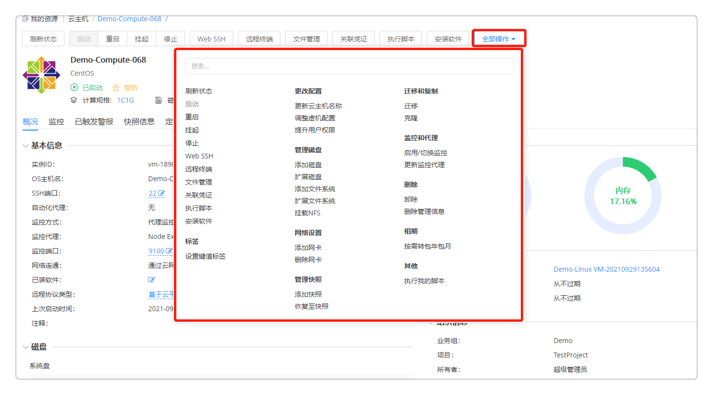

**我的部署**

# 服务部署

服务部署页面可查看服务部署的状态、详情、监控等。用户在「服务目录」选择蓝图自服务申请或服务目录申请后，可在服务部署界面查看部署的服务状态，若该部署有审批流程，在服务部署页面可跳转至审批页面，查看当前的审批流程；若无审批，则可查看该部署详情信息。

1.  在左侧导航栏选择「我的部署」-「服务部署」后，用户将会看到服务部署列表，点击高级搜索，可根据业务组、阶段（运行、操作进行中、关闭、操作失败、已取消、部署审批中
    ）、状态（正常、异常）、所有者、项目进行筛选，也可直接进行搜索操作

2.  在服务部署列表中，用户可以选中一个或者多个服务部署快速进行一些操作，包括「停止服务部署」「安装软件」「复制服务部署」「延长过期时间」「卸除服务部署」「删除管理信息」「更改所有者」，更多操作如：「更改项目」「更改业务组」和「伸缩」

3.  点击服务部署名称，可查看该服务部署的详细信息。服务部署详情信息界面包括「基本信息」「服务部署拓扑」「操作历史」「监控」（对云主机和应用组件的监控）以及顶部的运维操作

4.  「基本信息」包括服务部署的名称、业务组、项目、蓝图、资源池、云平台，以及费用、状态、时间等相关信息。还包括该服务部署的输入参数列表以及输出结果信息。服务部署失败后，某些场景可线下修复，修复成功后支持更改服务部署状态，将操作失败更改为运行

5.  「服务部署拓扑」包括服务部署的蓝图、详情和流程信息。鼠标悬停至服务拓扑图中，将显示该节点的关键信息，如Server节点将显示云主机名称、客户操作系统、IP地址、内存、磁盘总空间、vCPU数量、CPU使用率、内存使用率等

6.  「操作历史」显示该服务部署的操作历史记录

7.  「监控」显示对该部署中有的组件应用的监控信息

## 服务部署运维操作{#服务部署运维操作}

在服务部署列表界面或点击服务部署名称进入服务部署详情界面，均可对服务部署做运维操作。服务部署的运维操作由业务组和服务配置进行控制。可在「业务组」-「服务部署操作许可」中选择启用或不启用相应的运维操作给相应的角色，若启用还可指定是否需要审批，以及其审批模板。若启用，则可以在「服务建模」-「服务配置」-「服务部署操作许可」中选择为该服务继承业务组配置或在业务组配置基础上，对运维操作进行删减。在展示页面对服务部署运维的更多操作进行分组。

### 刷新状态
状态为遗失的虚拟机无法查看详情，在某些业务场景中，遗失的虚拟机会重新加入平台中，需要支持能够手动刷新状态。同时，也要能够支持其他云资源状态的刷新。
+ 支持批量刷新，在服务部署列表中，选中一个或多个部署
+ 点击“刷新状态”按钮，可以手工刷新状态。刷新状态的按钮放在第一个。
+ 刷新后，后台更新每个服务部署的状态还包括：规格配置的修改，磁盘的增加，IP地址的修改，刷新的结果通过通知返回。刷新的操作会记录到操作历史中。
+ 在云主机中进行运维操作时，SmartCMP能够根据虚拟机的UUID重新刷新虚拟机的正确状态

### 启动服务部署 

若服务部署处于关闭状态，则「启动服务部署」操作可用。可以通过设置「启用定时」，从而定时（将来某一时刻）触发此项任务。

### 停止服务部署 
若服务部署处于正在运行的状态，则可以「停止服务部署」，该操作将对该服务部署下的所有虚机进行关机操作。可以通过设置「启用定时」，从而定时（将来某一时刻）触发此项任务。

### 安装软件

选择服务部署下的云主机，并选择需要安装的软件。该软件列表来源于「软件组件」，可对软件的属性键值进行更改。 

### 更改组织信息
 更改所有者 

更改服务部署的所有者，将会同时改变该服务部署下的所有虚机的所有者。现在目标所有者，该所有者为该业务组下的成员。

 更改项目 

更改服务部署的所属项目，将会同时改变该服务部署下的所有虚机的所属项目。选择目标项目，并选择该项目下的用户。

 更改业务组 

将会把该服务部署下的所有虚机同时更改到新业务组中，并修改所有者等相关信息。选择目标业务组，项目（可选），所有者（该业务组下的成员），资源池（该业务组下的资源池）。如果资源池列表为空，表示该业务组上没有可用的资源。
 

### 扩展与收缩
伸缩 

扩展当前部署下的实例，静态IP部署的Server不支持伸缩。至少伸缩1个实例，最多6个。可以通过设置「启用定时」，从而定时（将来某一时刻）触发此项任务。
复制服务部署
服务部署成功后，可将该服务部署整体的应用环境复制至其他云平台或克隆至当前云平台。

常见应用场景：例如将vSphere服务部署复制至阿里云，vSphere至vSphere，阿里云至阿里专有云

操作步骤：

1.  选择目标服务：选择目标业务组、项目（可选）、所有者以及服务，选择当前实例节点作为模板来复制/新建到所选的服务拓扑图中的目标节点

2.  配置参数：填写服务部署名称（若业务组有规则将根据业务组规则自动生成）、服务部署租用到期时间，以及配置该服务拓扑图中的其他节点参数，针对每个计算节点，可以选择复制或者新建（从模板部署一台新机器）

3.  点击提交，等待执行。

>「Note」若是跨云复制，则需要第三方支持

 延长过期时间

延长服务部署的租用到期时间，点击将显示业务组中设置的最大可延期次数以及已延期次数，选择延长到哪一时间到期，精确到分钟。

### 删除
 卸除服务部署 

服务部署后，可卸除该服务部署下的云资源。卸除服务部署将删除在SmartCMP中新建的所有资源。若该服务部署中包含共享资源，将不删除共享资源；若该服务部署包含已有资源，如LoadBalance"使用已有资源"，将不删除已有资源；若导入资源后，您是该资源的Owner，可删除导入资源。

删除管理信息 

删除该服务部署以及所属虚拟机在SmartCMP上的相关信息，在相关云平台中仍然保留，不进行删除。

 删除节点 
可在服务部署后删除计算节点、存储和软件组件。点击「删除节点」，将展示该服务部署名称、该部署下的所有计算节点、存储和软件组件节点以及部署状态，可单选或多选节点进行删除，可启用定时指定时间进行操作。

### 重新部署

重新执行部署 

可在服务部署后针对部署节点进行重新执行部署的操作。

操作步骤：

1.  点击「重新执行部署」，将展示该服务部署名称、该部署下的所有计算节点/存储节点/软件组件节点以及部署状态

2.  可单选或多选节点进行重新执行；可启用定时，指定时间进行操作

3.  点击「提交」，等待执行

# 云主机

用户可以根据下面的步骤来查看云主机列表来对其进行管理和操作，操作的启用和是否需要审批需要在业务组级别或者服务配置级别进行设置：

在左侧导航栏选择「我的部署」-「云主机」后，用户将会看到云主机的列表。可在该列表界面查看云主机名称、所属云平台、操作系统、云主机状态（已启动、遗失、停止等）、健康状态、业务组、项目、服务部署、租用到期时间、保留到期时间、所有者、IP地址、标签、已装软件、资源标签等，其他展示列可通过点击「展示列」，可以勾选或者不选某些列进行展示。根据业务组，项目，所有者，状态，标签、云平台类型、是否启用监控、云平台类型、是否安装代理、操作系统类型、是否导入进行筛选

在云主机列表中，用户可以选中一个或者多个云主机快速进行一些操作，包括「启动」「重新启动」「挂起」「停止」「执行脚本」「设置标签」「启用/切换监控」「更新监控代理」「更新自动化代理」，具体操作介绍会在下文展开

您也可以单击某一个云主机进入其详情界面进行管理和操作，虚拟机详情界面包括「基本信息」「操作历史」「快照信息」「监控」「应用列表」和顶部的运维操作列表

「基本信息」包括了虚拟机及其相关主机的一些信息，该虚拟机在平台中的组织信息以及该虚拟机的CPU、内存、存储的运行状态、VNC连接信息等

「操作历史」包括了该虚拟机进行过的操作的历史记录

「快照信息」显示当前的快照信息（快照名称、创建时间等），点击「添加」可以创建快照

 「监控」包括了该虚拟机CPU、内存、磁盘、网络的监控数据（可以按照需要调整时间跨度或者平均时间来查看历史监控数据）

>「Note」只有在虚拟机模板中配置安装监控的虚拟机在部署生成后，才可以在监控中看到数据，如何配置安装监控请参看「虚拟机模板管理」章节。

 「应用列表」显示当前虚机已安装的应用列表

  运维的操作列表包括了该虚拟机可执行的操作列表，具体操作介绍会在下文展开

>「Note」只有在业务组设置或服务配置时配置虚拟机的操作许可，虚拟机在部署生成后才能看到允许的操作列表，如何配置虚拟机操作许可请参看「业务组管理」和「服务配置」章节。

## 云主机运维操作{#云主机运维操作}

在云主机列表界面或点击云主机名称进入云主机详情页面，均可对云主机进行下列运维操作，运维操作的启用与否由业务组/服务部署进行控制。

 ### 启动 

可以实时启动（关机状态的）虚拟机，也可以通过设置「启用定时」，定时（在将来某一时刻）触发此项任务。

### 挂起（vSphere）

挂起（开机状态的）虚拟机，可以通过设置「启用定时」，定时（在将来某一时刻）触发此项任务。

挂起多个（开机状态的）虚拟机，可以通过设置「启用定时」，从而定时（将来某一时刻）触发此项任务。

>「Note」只有vSphere的虚拟机才会有此操作选项。

 ### 停止 

停止（即关机）（开机状态的）虚拟机，可以通过设置「启用定时」，定时（在将来某一时刻）触发此项任务。

### 重启

重启（开机状态的）虚拟机，可以通过设置「启用定时」，定时（在将来某一时刻）触发此项任务。

重启多个（开机状态的）虚拟机，可以通过设置「启用定时」，定时（在将来某一时刻）触发此项任务。

### 执行脚本 

在该虚拟机中执行一个脚本库的脚本，可以通过设置「启用定时」，定时（在将来某一时刻）触发此项任务，也可选择某个IP地址。

>「Note」如果没有安装代理，执行脚本时必须输入虚机的用户名和密码

### vMotion迁移（vSphere）

支持对vSphere
的计算资源迁移和存储迁移。利用vSphere的vMotion迁移功能，使用不同的迁移方式，将虚拟机在不同主机之间进行迁移。

-   计算资源迁移，选择目标主机，可以通过设置「启用定时」，定时（在将来某一时刻）触发此项任务。

-   存储迁移：

<!-- -->

-   链接克隆：选择需要存储，将目标云主机迁移到所选的存储中去；

-   完全克隆：选择置备模式（与源格式相同、精简置备、厚置备延迟置零、后置备置零）；选择虚拟机存储策略（保留现有虚拟机存储策略、数据存储默认值，以及其他自定义存储策略）；存储（根据所选的存储策略判定存储的兼容性，并显示各存储的空间和占比）

-   启用定时：设置时间在将来某一时刻触发此项任务

>「Note」只有vSphere的虚拟机才会有此操作选项。迁移存储时，可保留原有的置备模式和存储策略，或进行修改

### 远程终端 

>「Note」OpenStack虚拟机远程终端操作需要使用VNC Web Client，
您的浏览器需要支持HTML5 Canvas和HTML5 WebSockets。如果需要了解VNC Web
Client所支持的全部浏览器，可以访问
<https：//github.com/kanaka/noVNC/wiki/Browser-support>

 WEB远程终端（vSphere）
vSphere的Web console client，无需浏览器特别支持。

>「Note」只有vSphere的虚拟机才会有此操作选项。

 ### 设置云主机标签 

>「Note」每个用户都可以为云主机设置标签，无需管理员配置操作许可。

可为云主机设置键值标签，从而为云主机分类和过滤。

云主机标签的使用方法如下：

 添加标签

对新建的云主机添加标签：

1.  在左侧导航栏选择「我的部署」-「云主机」，在云主机的列表界面，选择一个云主机

2.  点击上方的「更多操作」，「设置标签」，出现键值标签的设置界面

3.  填写键、值，点击「创建」「执行」，标签创建成功；也可选择已有的标签，点击「执行」。在云主机列表的右侧列项，可查看添加的云主机标签

对导入的云主机添加标签：

1.  在左侧菜单选择「基础设施」，点击「资源池管理」，选择一个资源池，进入编辑资源池界面

2.  进入「云主机」页面，点击「导入」

3.  点击「标签」后的输入框，弹出键值标签创建页面，输入键值，创建新标签；也可选择已有标签

 修改/删除标签：

在云主机列表界面，选择一个云主机；点击「设置标签」，出现该云主机的键标签，可直接删除并重新创建。

 

### 管理磁盘
添加新磁盘

给虚拟机添加一块新的磁盘，可以通过设置「启用定时」，定时（在将来某一时刻）触发此项任务。

>「Note」在挂起状态下不能执行该操作

 扩展磁盘

给虚拟机扩展一块已有的磁盘，可以通过设置「启用定时」，定时（在将来某一时刻）触发此项任务。

>「Note」支持通过云管平台部署或在上一小节创建的磁盘进行扩展。在挂起状态下不能执行该操作

 删除磁盘 

删除虚拟机上除系统盘以外的磁盘，包括服务配置添加的磁盘或运维新增的磁盘，均可删除。

添加新逻辑卷 
给Linux虚拟机添加一个新的逻辑卷，可以通过设置「启用定时」，定时（在将来某一时刻）触发此项任务。

>「Note」在挂起状态下不能执行该操作

 扩展逻辑卷

给Linux虚拟机扩展一个已有的逻辑卷，可以通过设置「启用定时」，定时（在将来某一时刻）触发此项任务。

>「Note」支持通过云管平台部署或在上一小节创建的逻辑卷进行扩展。

### 更改配置

 调整虚机配置 

调整虚拟机或容器节点的配置（vCPU，内存），点击「提交」。

添加网卡

添加一个新网卡，针对该计算节点的所有实例生效，选择网络标签和IP分配方式，目前vSphere只支持DHCP，OpenStack和PowerVC支持DHCP和IP池两种IP分配方式，OpenStack云主机还支持手动指定IP。

 删除网卡 

删除运维新增加的网卡，该操作会影响该节点的所有云主机。

挂载NFS 

将一个NFS（网络文件系统）挂载到虚拟机，可以通过设置「启用定时」，定时（在将来某一时刻）触发此项任务。

>「Note」当配置NFS云平台和资源池后，此项操作才可用
更新云主机显示名

点击「更新云主机显示名」，可以重新设置云主机的显示名。

 重置操作系统主机名 

点击「重置操作系统主机名」，可以重新设置操作系统主机名。

>「Note」windows操作系统只有安装代理的情况下才能进行该项操作

 提升Linux用户权限

可临时给某个Linux用户提升一段时间的Sudo权限（免密）。若该云主机已安装自动化代理，则只需输入用户名以及权限使用时间。若该云主机未安装自动化代理，将输入管理员用户名和密码（或选择密钥对）、以及选择IP地址。

 重置密码

点击「重置密码」，可以重新设置虚拟机的新密码。

 应用级别的生命周期操作 

云主机详细界面里，有应用标签页，里面有属于该云主机的应用列表，选择一个应用，会出现该应用的生命周期操作，操作包括「启动」「停止」和「自定义」操作。
### 管理快照
 创建快照

支持创建快照的时候，设置定时循环任务，例如在每天的某个时间，每周或每月的某一天，自动的进行快照创建，并且支持随时查看、取消已经设置的定时循环任。

1.  在左边导航选择「我的部署」-「云主机」，在右边选择「快照信息」

2.  点击「添加」按钮 ，填入定时循环信息。

3.  点击提交，定时创建快照的任务设置成功。

4.  在左边导航选择「我的部署」-「云主机」，在右边选择「定时任务」

5.  选中操作名称，点击上方的删除，即可取消已经设置的定时循环任务。

 恢复至快照（vSphere） 

把虚拟机恢复到之前的某一个快照，可以通过设置「启用定时」，定时（在将来某一时刻）触发此项任务

>「Note」只有vSphere的虚拟机才会有此操作选项。

 删除快照 

删除已创建的快照

 执行快照策略
针对阿里云的实例下的单个磁盘做执行快照策略，快照策略在阿里云平台中被创建。

 取消快照策略 

针对阿里云的实例下的单个磁盘取消快照策略期间。

### 监控和代理
添加自动化代理

如果云主机未安装自动化代理，可通过该操作安装；输入具有SSH功能并具有管理员权限的用户名和密码/密钥对，输入完成后点击「执行」。若未输入端口，还需在云主机详情页，「云主机中配置的SSH端口」中输入端口号。

 更新自动化代理 

如果云主机已安装自动化代理，可通过该操作进行更新。

 启用/切换监控

目前对vSphere云主机支持两种监控方式：内置代理监控以及云平台监控。内置代理监控包括预安装监控代理和WinRM/SSH监控代理（WinRM对于Windows操作系统的云主机，SHH对于Linux操作系统的云主机）；云平台监控是指直接从vCenter上读取虚机的监控数据而不需要安装监控代理。

对Openstack云平台只支持内置监控代理。

 更新监控代理 

如果云主机安装了内置代理监控，可通过该操作进行更新。

### 其他 

支持根据实际需求自定义运维操作，点击「更多操作」- 「其他」，显示自定义操作列表。例如下图，为vSphere云平台的虚拟机自定义备份操作，自定义操作的具体步骤，请参考：[配置操作](https://cloudchef.github.io/doc/AdminDoc/05服务建模/组件库.html#配置操作)

# 云资源

云资源菜单下统一纳管所有的云资源，展示其相关信息以及提供各云资源对应的运维
操作。

点击左侧导航栏「我的部署」-「云资源」，将在左侧看到「存储资源」「容器服务」「网络资源」「PaaS资源」「软件资源」五个菜单。

### 容器服务 

支持在云资源中展示kubernetes的各个组件信息，包括部署（Deployment）、容器（Container）、服务（Service）、路由（Ingress）、存储卷（PVC）、配置字典（ConfigMap）、保密字典（Secrets）等。

#### 部署
Kubernetes的部署（Deployment）为Pod和ReplicaSet提供声明式更新。通过在Deployment中描述所期望的集群状态，DeploymentController会将现在的集群状态在一个可控的速度下逐步更新成所期望的集群状态。Deployment的主要职责同样是为了保证Pod的数量和健康，90%的功能与ReplicationController完全一样，可以看作下一代的Replication Controller。
  + 支持对部署（Deployment） 的资源展示，点击「容器服务」-「部署」，将看到Kubernetes的部署列表：显示名称、云平台类型、状态、业务组、服务部署、项目、所有者、标签、容器组、镜像以及创建时间。高级搜索可通过业务组、状态、项目和所有者对列表信息进行快速筛选定位

  + 点击名称，进入部署详情页面。部署详情页面包括「基本信息」「容器组」「操作历史」「监控」「已触发警报」，以及「更新副本数量」「更新镜像」「调整配置」等运维操作

>「Note」「监控」「已触发警报」标签页需要在Kubernetes的云平台处设置Prometheus监控地址后才会出现。

 部署的「基本信息」页面包括：

-   基本信息：名称、命名空间、标签、注释、策略、镜像、创建时间等

-   组织信息：服务部署名称、服务名称、业务组、租户、项目等

-   运维操作

  -   更新副本数量：更新POD的副本数量（Replicas），点击后在弹框中选择需要更新的副本数量，也可启用定时在特定时间执行操作

  -   更新镜像：更新该部署的实例镜像，点击后在弹出框中选择需要更新的容器节点（必填），选择镜像源，选择镜像名称（必填），选择镜像标签，也可启用定时在特定时间执行操作。点击「提交」，等待操作执行完成

 >「Note」支持集成Habor以及Docker 原生镜像作为Image Registry。在Kubernetes云平台中，可添加容器镜像源。参考[[添加Kubernetes云平台](https://cloudchef.github.io/doc/AdminDoc/03基础设施管理/云平台管理.html)

  -   调整容器配置：调整选定容器节点的vCPU和内存的大小，包括请求值和最大值，请求值（request）必须小于最大值（limit）

+ 「操作历史」：包括了该Deployment进行过的操作历史记录

+ 「监控」：显示该部署的监控信息，如Pod
    CPU使用情况、Pods内存使用情况、Pod网络流量等，可更改时间跨度查看不同时间段的监控信息

+ 「已触发警报」：根据定义好的对容器的告警策略和告警操作，若监控信息检测到该部署已达到触发警报条件，将触发警报。该页面显示已触发的警报信息，以及可对该警报做恢复、暂停、解除等操作

#### 守护进程集

Kubernetes的守护进程集（DaemonSet）保证在每个Node上都运行一个容器副本，常用来部署一些集群的日志、监控或者其他系统管理应用。部署成功后可在左侧导航栏选择「云资源」-「容器服务」-「守护进程集」中查看详细信息。

  在「容器服务」-「守护进程集」中可查看守护进程集的基本信息，如：名称、云平台类型、状态、业务组、服务部署、项目、所有者、标签、容器组、镜像和创建时间等。**高级搜索可通过业务组、状态、项目和所有者对列表信息进行快速筛选定位

 点击名称，进入DaemonSet的详情页面。包括「基本信息」「容器组」「操作历史」「监控」「已触发警报」等

 「基本信息」页面包括了：

-   基本信息：名称、命名空间、标签、注释、镜像、创建时间等

-   组织信息：服务部署名称、服务名称、业务组、租户、项目等

-   运维操作：更新镜像、调整配置

- 「操作历史」页面：包括了对守护进程组进行过的操作历史记录

>「Note」「监控」「已触发警报」标签页需要在Kubernetes的云平台处设置Prometheus监控地址后才会出现。

#### 有状态副本集

Kubernetes的有状态副本集（StatefulSet）是为了解决状态服务的问题。由以下几个部分组成：用于定义网络标志（DNS domain）的Headless
Service、用于创建PersistentVolumes的volumeClaimTemplates、定义具体应用的StatefulSet。部署成功后可在左侧导航栏选择「云资源」-「容器服务」-「有状态副本集」中查看详细信息。

  在「容器服务」-「有状态副本集」中可查看有状态副本集的基本信息，如：名称、云平台类型、状态、业务组、服务部署、项目、所有者、标签、容器组、镜像和创建时间等。**高级搜索可通过业务组、状态、项目和所有者对列表信息进行快速筛选定位

  点击名称，进入StatefulSet的详情页面。包括「基本信息」「容器组」「操作历史」「监控」「已触发警报」，以及「更新副本数量」「更新镜像」「调整配置」等运维操作

#### 容器

K8s Container部署成功后可在左侧导航栏选择「云资源」-「容器服务」-「容器」中查看详细信息。

  在容器（Container）的列表界面，可查看该容器的名称、云平台类型、状态、业务组、服务部署、项目、所有者、镜像、端口、创建时间等。高级搜索可通过业务组、状态、项目和所有者对列表信息进行快速筛选定位

 点击名称，进入容器的详情页面。包括「基本信息」「操作历史」

 运维操作：「调整配置」

#### 服务

在K8集群中，客户端需要访问的服务就是Service对象。每个Service会对应一个集群内部有效的虚拟IP，集群内部通过虚拟IP访问一个服务。部署成功后可在左侧导航栏选择「云资源」-「容器服务」-「服务」中查看详细信息。

  在容器服务的服务（Service）的列表界面，可查看该服务的名称、云平台类型、状态、业务组、服务部署、项目、所有者、集群IP、内部端点、外部端点、创建时间等。高级搜索可通过业务组、状态、项目和所有者对列表信息进行快速筛选定位

  点击名称，进入服务的详情页面。包括「基本信息」「容器组」「操作历史」「监控」「已触发警报」等页面

  运维操作：「更新副本数量」「更新镜像」「调整配置」

#### 路由

在kubernetes中，通常情况下，服务（service）和pod的IP仅可在集群内部访问。集群外部的请求需要通过负载均衡转发到service在Node上暴露的NodePort上，然后再由kube-proxy将其转发给相关的Pod，而路由（Ingress）就是为进入集群的请求提供路由规则的集合。部署成功后可在左侧导航栏选择「云资源」-「容器服务」-「路由」中查看详细信息。

1.  在路由（Ingress）的列表界面，可查看该路由的名称、云平台类型、状态、业务组、服务部署、项目、所有者、端点、规则、创建时间等。高级搜索可通过业务组、状态、项目和所有者对列表信息进行快速筛选定位

2.  点击名称，进入路由的详情页面。包括「基本信息」「操作历史」

#### 存储卷

Kubernetes中的存储卷（PVC：PersistentVolumeClaim）是用户存储的请求。它类似于pod。Pod消耗节点资源，PVC消耗光伏资源。部署成功后可在左侧导航栏选择「云资源」-「容器服务」-「存储卷」中查看详细信息。

1.  在存储卷（PVC）的列表界面，可查看该存储卷的名称、云平台类型、状态、业务组、服务部署、项目、所有者、卷状态、总量、访问模式、存储类、创建时间等。高级搜索可通过业务组、状态、项目和所有者对列表信息进行快速筛选定位

2.  点击名称，进入存储卷的详情页面。包括「基本信息」「操作历史」

#### 配置字典

在kubernetes中，配置字典（ConfigMap）用于保存配置数据的键值对，可以用来保存单个属性，也可以用来保存配置文件。ConfigMap跟保密字典（Secret）很类似，但它可以更方便地处理不包含敏感信息的字符串。部署成功后可在左侧导航栏选择「云资源」-「容器服务」-「配置字典」中查看详细信息。

1.  在配置字典（ConfigMap）的列表界面，可查看该配置字典的名称、云平台类型、状态、业务组、服务部署、项目、所有者、创建时间等。高级搜索可通过业务组、状态、项目和所有者对列表信息进行快速筛选定位

2.  点击名称，进入配置字典的详情页面。包括「基本信息」「操作历史」

#### 保密字典

在kubernetes中，保密字典（Secret）解决了密码、token、密钥等敏感数据的配置问题，而不需要把这些敏感数据暴露到镜像或者Pod
Spec中。Secret可以以Volume或者环境变量的方式使用。部署成功后可在左侧导航栏选择「云资源」-「容器服务」-「保密字典」中查看详细信息。

1.  在保密字典（Secret）的列表界面，可查看该保密字典的名称、云平台类型、状态、业务组、服务部署、项目、所有者、类型、创建时间等。高级搜索可通过业务组、状态、项目和所有者对列表信息进行快速筛选定位

2.  点击名称，进入保密字典的详情页面。包括「基本信息」「操作历史」

### 存储资源 

#### 云硬盘

支持对OpenStack/Azure/阿里云/青云的云硬盘进行统一管理。

1.  点击「存储资源」下的「云硬盘」，将看到云硬盘列表

2.  在云硬盘的列表界面，可查看云硬盘的相关信息：名称、云平台类型、状态、业务组、服务部署、项目、所有者、大小（GB）、挂载状态、挂载到的云主机以及创建时间

3.  点击名称，进入云硬盘详情页面。云硬盘详情页面包括「基本信息」「操作历史」

4.  云硬盘详情的「基本信息」页面包括：

-   基本信息：名称、云平台类型、状态、业务组、服务部署、项目、所有者、大小挂载到的云主机、创建时间等

-   组织信息：服务部署名称、服务名称、业务组、租户、项目等

-   运维操作：

<!-- -->

-   卷分离：去除云硬盘和云主机的挂载关系

-   卷挂载：建立云硬盘和云主机的挂载关系

-   调整大小：支持对硬盘调整大小（Azure/AWS）

5.  云硬盘详情的「操作历史」页面：包括了该云硬盘进行过的操作历史记录

#### 对象存储

支持对AWS、Azure、阿里云的对象存储进行统一管理，分别是S3、Blob、OSS。

1.  点击「存储资源」下的「对象存储」，将看到对象存储列表

2.  在对象存储的列表界面，可查看对象存储的相关信息：名称、云平台类型、状态、状态、业务组、服务部署、项目、所有者、创建时间

3.  点击名称，进入对象存储详情页面。对象存储详情页面包括「基本信息」「操作历史」

4.  对象存储详情的「基本信息」页面包括：

-   基本信息：名称、云平台类型、状态、所有者、公共访问级别、存储账户、资源组、创建时间等

-   组织信息：服务部署名称、服务名称、业务组、租户、项目等

5.  对象存储详情的「操作历史」页面：包括了该云硬盘进行过的操作历史记录

### 网络资源 

支持OpenStack的防火墙（FireWall）、浮动IP（Floating
IP）的独立部署和全生命周期管理。部署完成后，可在「云资源」-「网络资源」处查看基本信息和运行状况。还支持OpenStack的负载均衡器（LoadBalance）和负载均衡监听器（Listener），以及VMware
NSX的虚拟服务器（VirtualServer）。

#### 负载均衡器

负载均衡是高可用网络基础架构的关键组件，通常用于将工作负载分布到多个服务器来提高网站、应用、数据库或其他服务的性能和可靠性。

若部署中包含负载均衡器（LoadBalancer），则部署成功后可在「云资源」-「网络资源」-「负载均衡器」中查看详细信息。

1.  在负载均衡器（LoadBalancer）列表界面，显示负载均衡器的名称、云平台类型、状态、业务组、服务部署、项目、所有者、IP地址、创建时间等

2.  点击名称进入详情页面，包括「基本信息」「操作历史」

3.  运维操作（OpenStack）：

-   绑定浮动IP：选择某一浮动IP，将该负载均衡器和浮动IP
    进行绑定，可启动定时在特定时间执行操作

-   解绑浮动IP：若该负载均衡器已绑定浮动IP，则可进行解绑操作，可启动定时在特定时间执行操作

#### 负载均衡监听器

支持VMWare NSX / OpenStack / Azure的负载均衡监听器，VMWare NSX
负载均衡监听器为VirtualServer，OpenStack 负载均衡监听器为Listener，Azure
负载均衡监听器为LoadBalancerRule。负载均衡器可以监听多个端口上请求，每个端口通过负载均衡监听器指定。部署成功后可在「云资源」-「网络资源」-「负载均衡监听器」中查看详细信息。

1.  在负载均衡器监听器（Listener）列表界面，显示负载均衡监听器的名称、状态、描述、业务组、项目、所有者、协议、云平台类型、创建时间等

2.  点击名称进入详情页面，包括「基本信息」「操作历史」界面，以及「添加成员」「删除成员」等运维

3.  运维操作 -- OpenStack

-   「添加成员」：添加成员（member），可添加内部成员和外部成员。选择要添加成员的云主机、指定IP地址、端口和权重。可启动定时在特定时间执行操作

-   「删除成员」：点击后选择需要删除的成员，可启动定时在特定时间执行操作

#### 浮动IP

支持OpenStack的的浮动IP（FloatingIP），FloatingIP可单独部署，部署成功后可在左侧导航栏选择「云资源」-「网络资源」-「浮动IP」中查看详细信息。

1.  在选择「云资源」-「网络资源」-「浮动IP」，可查看已部署成功的浮动IP的列表界面，该界面显示浮动IP的名称、云平台类型、状态、业务组、服务部署、项目、所有者、IP地址、网络、映射地址、创建时间等

2.  点击名称，进入详情页面，包括「基本信息」「操作历史」

3.  「基本信息」页面，显示该浮动IP的的基本信息和组织信息

4.  「操作历史」页面，显示操作历史记录，点击后将在操作历史列表下方显示操作详情

5.  运维操作：

-   「关联端口」：若当前Floating
    IP未关联任何一个端口，则在详情页上方会显示「关联端口」操作，点击后在弹框中选择需要绑定的端口，下拉框中会列出当前业务组下，OpenStack云平台中所有未被关联的端口（Port）。选择后点击「提交」

-   「解除绑定」：若当前Floating
    IP已关联端口，则在详情页上方会显示「解除绑定」操作，点击后「提交」，也可启用定时在特定时间执行操作

#### 防火墙

支持OpenStack防火墙即服务（Firewall as a
service），Fwaas应用于OpenStack对象，如项目，路由器和路由器端口。OpenStack防火墙的核心概念是防火墙策略和防火墙规则。策略是有序的规则集合。可在左侧导航栏选择「云资源」-「网络资源」-「防火墙」查看已部署成功的防火墙。

1.  选择「云资源」-「网络资源」-「防火墙」，可查看已部署成功的防火墙列表界面，该界面显示防火墙的名称、云平台类型、状态、业务组、服务部署、项目、所有者、策略、路由、激活状态、管理员状态、创建时间等

2.  点击名称，进入详情页面，包括「基本信息」「操作历史」

3.  「基本信息」页面：显示该防火墙的的基本信息和组织信息

4.  「操作历史」页面：显示操作历史记录，点击后将在操作历史列表下方显示操作详情

5.  运维操作：

  + 「更新防火墙」：点击后可在页面中选择已有的防火墙策略或新建防火墙策略。勾选「使用已有策略」，将列出当前业务组下，OpenStack云平台中所有可用的防火墙策略。若未勾选，则新建防火墙策略，需填写策略名称（必填），策略描述（选填），可选择是否属于已共享、已审计，还可定时，操作完成后点击「提交」

  + 「更新防火墙策略」：该页面将列出当前所有可用的规则列表。支持使用已有规则和新建规则。若使用已有规则，在列表中勾选将使用的规则即可。若新建规则，将展现新建规则界面：

-   填写基本信息：名称、描述、协议（必填，TCP、UDP、ICMP和任何）、动作（必填，允许、拒绝）、源IP、源端口、目的IP、目的端口、选择是否是共享的、激活

-   可选择新增的规则的位置，指定当前规则在某条规则之前插入（规则前于），或指定规则在某条规则后插入（规则后于）。如果两者均被指定，前者优先级更高。

>「Note」：一个防火墙策略可关联多个规则，但规则只能被一个策略所关联

「删除防火墙规则」：删除防火墙中已关联的规则，删除后将不可恢复。可同时选择多个规则删除，也可启动定时在特定时间执行操作

#### 安全组

安全组是一种虚拟防火墙，具备状态检测和数据包过滤功能，用于在云端划分安全域。您可以通过配置安全组规则，允许或禁止安全组内的虚拟机实例对公网或私网的访问。

支持展示OpenStack、AWS、Azure、阿里云的安全组。若安全组组件部署后，将在「云资源」-「网络资源」-「安全组」中查看部署的安全组组件。

1.  在「安全组」列表界面，显示安全组名称、云平台类型、状态、所属业务组、服务部署、所属项目、所有者、创建时间等

2.  点击名称进入详情页面，包括「基本信息」「操作历史」界面

3.  「基本信息」页面，显示该安全组的的基本信息、组织信息和入站/出站安全组规则。

4.  「操作历史」页面，显示操作历史记录，点击后将在操作历史列表下方显示操作详情

#### 域名系统DNS

支持OpenStack域名系统DNS，若DNS组件部署后，将在「云资源」-「网络资源」-「域名系统DNS」中查看部署的DNS组件。

1.  在「域名系统DNS」列表界面，显示DNS名称、状态、业务组、项目、所有者、DNS类型、DNS域、DNS服务器、DNS参数等

2.  点击名称进入详情页面，包括「基本信息」「操作历史」界面

3.  运维操作

-   「更新DNS」：更新DNS参数，DNS类型不可更改

### PaaS资源 

支持AWS、Azure、阿里云的关系型数据库（RDS）的独立部署和全生命周期管理，支持关系型数据库即服务（RDS as a Service）和Web应用。部署完成后，可在「云资源」-「PaaS资源」处查看基本信息和运行状况。

#### 关系型数据库

在左侧导航栏选择「云资源」-「PaaS资源」-「关系型数据库」查看已部署成功的关系型数据库（RDS）。

1.  在关系型数据库的列表界面，可查看关系型数据库的相关信息，如名称、所属业务组、所属项目、所有者、云平台类型、创建时间等

2.  点击名称可进入该关系型数据库详情页面，有「基本信息」「操作历史」两个页面

3.  「基本信息」页面，显示该关系型数据库的基本信息和组织信息。

4.  「操作历史」页面，显示对该关系型数据库的操作历史记录，点击后将在操作历史列表下方显示操作详情

5.  运维操作：

-   更新防火墙：点击关系型数据库名称进入详情页，或在关系型数据库的列表页勾选一个关系型数据库，点击「更新防火墙」按钮，打开「更新防火墙 -
    RDS名称」弹窗。勾选"定时"，设置执行时间，点击「提交」按钮，定时更新防火墙；或者直接点击「提交」按钮，立即更新防火墙

#### Web应用

在左侧导航栏选择「云资源」-「PaaS资源」-「Web应用」查看已部署成功的Web应用

1.  在Web应用的列表界面，可查看Web应用的相关信息，如名称、所属业务组、所属项目、所有者、云平台类型、创建时间等

2.  点击名称可进入该Web应用详情页面，有「基本信息」「操作历史」两个页面

3.  「基本信息」页面，显示该Web应用的基本信息和组织信息。

4.  「操作历史」页面，显示对该Web应用的操作历史记录，点击后将在操作历史列表下方显示操作详情

### 软件资源

>「Note」  支持对软件资源的统一展示和管理。

1.  选择「云资源」-「软件资源」-「软件」，可查看已部署成功的软件列表，该界面显示软件名称、云平台类型、状态、业务组、服务部署、项目、所有者、版本、系统类型、创建时间等。可通过高级搜索对业务组、状态、项目或所有者进行筛选，也可使用普通搜索进行快速定位

2.  点击名称，进入详情页面，包括「基本信息」「操作历史」

3.  「基本信息」页面：显示该软件的基本信息、组织信息、参数

4.  「操作历史」页面：显示操作历史记录，点击后将在操作历史列表下方显示操作详情

5.  运维操作：

>「Note」  运维操作根据「服务建模」-「软件组件」中对个软件的操作定义显示对应的运维操作，例如：启动、停止、删除、创建、配置等

# 资源状态图

资源状态图能够显示云主机、容器的健康状态，根据性能指标的状态显示不同的颜色。若该云主机或容器未配置监控，默认显示灰色。浅绿到深绿到红色，颜色越深代表使用的资源越多。

-   鼠标移至该云主机上，将显示该云主机名称

-   点击后显示详情：

-   基本信息：IP地址、操作系统、vCPU数量、内存、磁盘总空间

-   组织信息：业务组、项目、所有者

-   性能监控指标：内存使用率、CPU使用率、磁盘使用率

>「Note」若未安装监控，将不显示性能监控指标

-   可根据您的需求对展示内容进行筛选，如全部或已安装监控或未安装监控、按云平台筛选、业务组筛选、项目筛选、标签筛选等。
