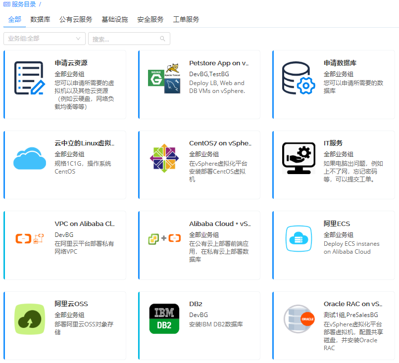
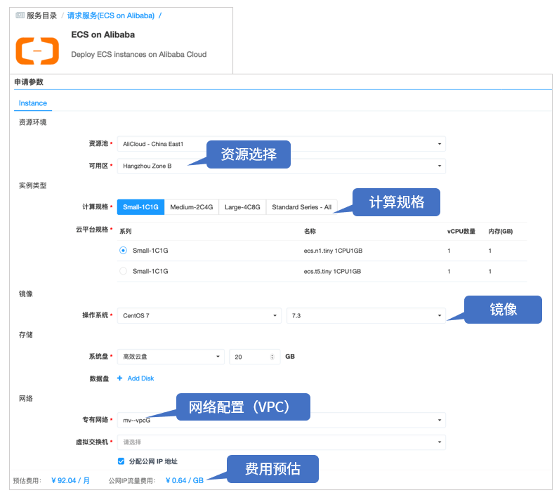
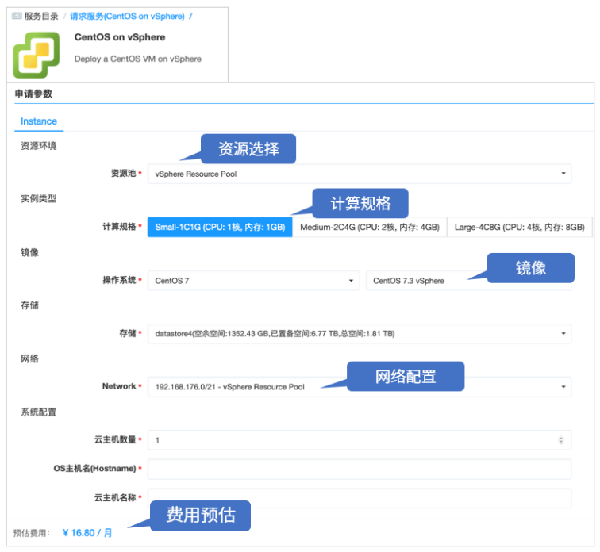
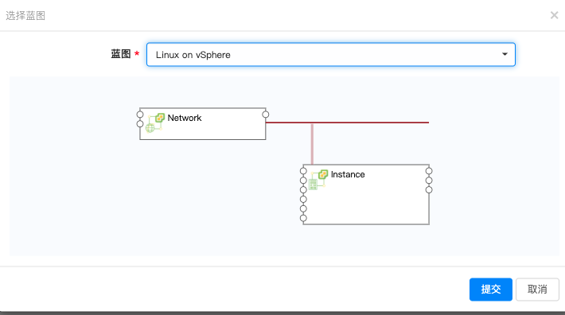
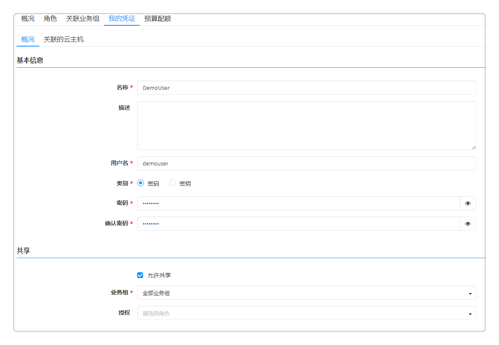
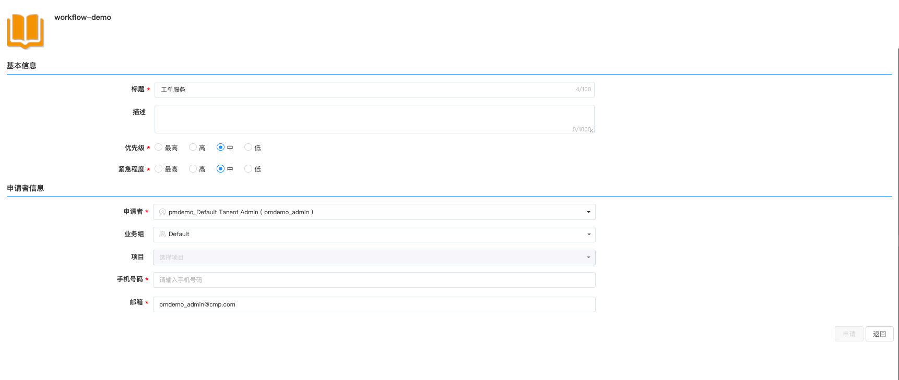

**服务目录**
# 功能描述

服务目录的主要作用是为用户提供统一的云服务入口。将云资源的申请、运维、变更、监控和回收都服务化，并配套提供企业级的流程、权限和配额管控。
   + 提供在一个页面，申请任意云服务的能力，这样用户可以非常方便的以服务目录的形式，访问有权限的多种类型的阿里云服务、VMware云资源服务、容器云服务、工单服务、邮件服务等等。例如：Tomcat，MySQL集群，J2EE三层应用等。示例如下图：

   + 其中，工单服务，即非标准化需要人工介入和支持的服务，包括服务请求，云资源出现问题时的事件处理，例如用户忘记密码需要进行重置，或是提交一个开通邮箱或账户的请求。
   + 服务目录项都是通过云管理平台的蓝图编排设计后进行相应的参数配置。服务既可以部署在私有云，也可以部署到公有云，还可以适用于越来越广泛地混合云部署，例如，前端应用部署在阿里云上，数据库部署在私有云上。  
   + 可以定义服务分组，方便服务管理。
   + 支持多种云服务类型、统一服务入口。

   + 在申请服务时，无论是申请阿里云的服务，还是VMware的资源，云平台提供了统一的类公有云服务体验，降低用户使用门槛，还能根据资源用量和价格，展示每个服务不同配置的整体服务费用。如下图所示：

# 服务目录展现方式
服务配置发布成功之后，将会在服务目录界面看到发布的服务卡片，服务目录的界面展示支持两种方式：
   1. 标签页展示：即分组按照标签页展示，可以通过服务分组标签、业务组或搜索框快速定位您需要申请的服务。

   2. 层级展示：按照卡片的模式，先展示分组（图标，名称，描述）--文件夹的显示方式，点击一个分组，再展现这个分组的所有卡片，对于没有分组的卡片，如果按照层级展示，增加一个 未分组的服务 文件夹，点击进入展现所有未分组的卡片。如果卡片都是有分组的，则这个文件夹不显示。

 >「Note」 服务目录展现方式，在系统管理-界面配置功能区进行选择，具体操作步骤，请参考：[界面配置](https://cloudchef.github.io/doc/AdminDoc/09系统管理/#界面配置)

## 标签页展示{#服务目录申请}

当服务目录以标签页方式展示时，可以通过服务分组标签，例如：数据库、基础设施、工单服务等等，或通过不同的业务组，或通过搜索框快速定位您需要申请的服务。

以"在vSphere云平台上部署虚拟机"为例：

1.  在左侧导航栏点击 服务目录 ，选择内置的 "Linux VM" 服务，点击将进入服务申请页面

2.  填写服务申请页面的相关申请参数：
  - 组织信息
     +  业务组：若该服务应用至全部业务组，即共享服务，需选择业务组（该业务组需有相关资源池，否则将不允许申请）；若服务配置时该服务已指定业务组，则无需填写
     +  项目：可以选择具体项目
     +  所有者：选择该服务的所有者，所有者需为业务组成员，服务部署的所有者，在服务部署的运维操作中支持更新所有者

  - 部署信息
      + 名称：若业务组已配置 “服务部署名命名规则”，则服务部署名无需填写，将根据业务组规则自动生成；若业务组未配置“服务部署名命名规则”，需自定义输入服务部署名称
      + 数量：填写部署的数量，默认为1
      + 执行时间：可指定时间开始服务部署，精确到分钟
      + 租用到期日期：可以指定服务部署的使用期限。到期之后，所有的服务将被停机，最长到期日期无限制
  - 标签设置
      + 键值标签：默认勾选，所有、节点使用相同的键值标签， 若不勾选，将列出该服务部署下的所有节点，可为每个节点单独设置键值标签
      + 云资源标签：若管理员已在[资源标签](https://cloudchef.github.io/doc/AdminDoc/03基础设施管理/资源标签.html)中预设云资源标签，可为部署的云资源设置云资源标签。
        >「Note」 管理员需首先在系统设置 - [界面配置](https://cloudchef.github.io/doc/AdminDoc/09系统管理/#界面配置) 中启用键值标签或云资源标签的申请字段配置以允许用户在申请服务时设置标签。管理员可在 系统配置 - 系统参数 启用同步标签功能，启用后，在服务申请时新建的键值标签将被同步至云平台。

  - 其他信息
      + 表单配置的参数：如果您在服务配置的表单配置中为云资源蓝图服务和手工单服务自定义相关字段，则在此处填写所需信息

  - 申请参数
      + 资源池：选择具体的资源环境，请先至 资源池管理 配置资源池

  - 实例类型
      + 计算规格：根据业务需求选择不同规格的计算资源

  - 镜像
      + 操作系统：根据需求选择不同操作系统的镜像

3. 填写完成后点击申请，将根据业务组流程控制直接部署或等待审批，可至 我的部署 - 服务部署 中查看部署情况（也可在右上角 操作历史 中查看部署情况），或至 服务请求 - 待审批 中查看审批流程。

   若您在进行服务申请时，未能一次性填写完相关参数，点击 保存 能够对已填写参数进行保存，并且在下次申请的时候，点击 加载 可以重新加载，自动填充上次已经填写好的参数。

   

## 层级展示

采用层级展示的方式，按照卡片的模式，先展示服务分组，服务分组的具体操作步骤，请参考：[服务分组](https://cloudchef.github.io/doc/AdminDoc/05服务建模/服务分组.html)

在服务目录视图界面，可查看服务分组的图标、名称、描述和文件夹的显示方式，点击一个分组，展现此服务分组的所有卡片。（注意：当管理员创建的服务卡片没有选择服务分组时，如果按照层级展示，此类型卡片会存入 “未分组的服务” 文件夹，点击进入展现所有未分组的卡片。如果管理员创建的服务卡片都是有分组的，则“未分组的服务” 文件夹不显示。）

# 云资源部署

在服务目录下，会罗列您在 服务建模 - 服务配置 发布的所有的服务 ，同时平台提供了内置服务，通过 服务目录 你可以直接申请和部署各类云服务。

同时，您可以在 服务目录 - 云主机 和 服务目录 - 云资源中，点击 创建 按钮，申请各种不同类型的云服务。

>「Note」 在 服务建模 - 服务配置 添加发布您的服务，具体操作步骤，请参考：[服务配置](https://cloudchef.github.io/doc/AdminDoc/05服务配置/#服务配置)

## 通过蓝图部署云资源
SmartCMP支持一个服务绑定多个蓝图，支持您根据需求快速选择蓝图，例如："申请云应用"，系统提前配置了应用服务相关的蓝图，您可以申请部署所需要的软件应用，包括中间件、网站应用、数据库、或是多层架构的应用环境。

您可以通过以下步骤申请蓝图自服务：

1.  通过蓝图申请云资源。

2.  填写服务基本信息：
    + 业务组：选择部署所属业务组。
    + 服务部署名称： 自定义输入部署名称（若业务组已设定服务部署命名规则，服务部署名称将按照规则自动生成，无需填写）。
    + 项目：选择服务部署所属的项目。
    + 所有者：选择服务部署的所有者。
    + 数量：输入数字，您可以一次创建多个服务部署。
    >「Note」 您可以在 系统管理 - 界面配置 里控制服务申请页面显示需申请时填写的字段。具体操作步骤，请参考：[服务配置](https://cloudchef.github.io/doc/AdminDoc/09系统管理/#界面配置)
    + 执行时间：设定未来的某个时间，在这个时间点进行服务部署的创建。
    + 付费方式：您可以选择“包年包月”或者“按需”的付费方式
    + 购买时长：当您选择“包年包月”的付费方式后，可选择购买时长，范围从“1个月”至“3年”
    + 租用到期日期:当您选择“按需”的付费方式后,可以指定服务部署的使用期限。到期之后，所有的服务将被停机,最长到期日期无限制

3. 设置标签： 您可以为您申请部署的云资源创建或设置键值标签，也可以设置管理员提供的云资源标签。
    + 键值标签：若勾选 所有节点使用相同的键值标签 ，可为所有节点设置相同的标签；您也可以取消勾选，平台将列出该服务部署下的所有节点并允许为每个节点设置不同的标签。
    + 云资源标签：选择管理员预设的云资源标签，每个标签由一个键值对组成，例如一个键为“环境”且值为“UAT”的标签。云资源标签将对部署下所有资源生效。
    >「Note」
        i. 若允许用户在服务申请时设置标签，管理员需先在[服务配置](https://cloudchef.github.io/doc/AdminDoc/05服务建模/服务配置.html#添加服务配置)或 系统设置 - [界面配置](https://cloudchef.github.io/doc/AdminDoc/09系统管理/#界面配置) 中启用键值标签或云资源标签的申请字段配置，并在[资源标签](https://cloudchef.github.io/doc/AdminDoc/03基础设施管理/资源标签.html)中预设云资源标签。
        ii. 管理员可在 系统配置 - [系统参数](https://cloudchef.github.io/doc/AdminDoc/09系统管理/#系统配置) 启用同步标签功能，启用后在服务申请时新建的键值标签将被同步至云平台。

4. 填写相关申请参数，例如：资源池、私有网络、虚拟机配置、存储大小、节点数量等等信息。

    + 资源池：选择具体的资源环境，请先至 资源池管理 配置资源池。

    + 计算规格：根据业务需求选择不同规格的计算资源。

    + 操作系统：根据需求选择不同操作系统的镜像。

    + 存储：选择磁盘类型或基于存储标签选择，根据配置可以添加数据盘。
        - 若提示选择磁盘类型，请从下拉框直接选择存储 
        - 若提示选择表情，请从下拉框选择存储标签，系统将自动匹配符合条件的存储
        - 若服务配置允许添加新的数据盘，您可点击 添加数据盘 创建一个或多个磁盘。新创建的磁盘可做为文件系统的来源。
        
    + 文件系统：根据需求选择文件系统挂载点、文件格式及大小，选择文件系统的来源。根据配置您可创建一个或多个文件系统：
        - 基于卷组创建文件系统：若该服务配置已启用LVM并配置卷组，可下拉选择已配置的卷组作为文件系统来源。若您设置的文件系统大小大于所选卷组中磁盘的大小，系统将动态扩展其中一个磁盘节点。
        - 基于磁盘创建文件系统：您可下拉选择磁盘作为文件系统的来源，此时可选的磁盘包含服务配置中未关联到卷组的磁盘节点和您在存储中创建的磁盘。若您设置的文件系统大小大于所选磁盘的大小，系统将动态扩展磁盘。

    + Network: 选择具体的网络IP地址。
    >「Note」 您可以在配置服务时控制参数是否在申请时可查看或修改。具体操作步骤，请参考：[配置云资源蓝图服务](https://cloudchef.github.io/doc/AdminDoc/05服务建模/服务配置.html#配置云资源蓝图服务)

    + 软件配置：您可以点击加号按钮，选择要在云主机上安装的软件。

5. 如需使用凭证，验证用户身份，可参考如下步骤，创建并使用您的凭证：
    1. 点击页面右上角用户名称，选择编辑资料，进入个人中心界面。
    2. 在我的凭证标签页，点击添加，进入基本信息标签页。
    3. 输入名称、描述、用户名并选择凭证类别：密码、密钥。
        + 密码：填写密码、确认密码（前后输入的密码必须一致）。服务配置时，可允许企业成员申请时，修改您创建的密码，还支持企业成员在申请服务时选择自己的凭证或者手动输入用户名和密码。
        + 密钥：创建或导入密钥。在虚拟机模板中，若选择密钥对的验证类型，将只能选择系统中已存在的共享的且类型为密钥的凭证（新建生成或导入的密钥）。
            - 创建密钥：选择算法（RSA）以及长度，目前支持1024、2048和4096三个长度的密钥生成。
            - 导入密钥:可导入私钥在系统中保存以便随后使用。
    4. 允许共享：勾选允许共享，可将我的凭证共享给指定业务组的指定角色。
    5. 申请服务时：您可选择自己的凭证或者手动输入用户名和密码进行身份验证
    

6. 点击保存，确认无误后点击提交，等待部署完成。

## 通过云组件部署云资源
SmartCMP也支持一个服务绑定多个云组件，您可以根据需求快速选择组件，例如："申请云资源"，系统提前配置了虚拟机组件以及其他云资源组件（例如云硬盘、网络负载均衡等），这些组件都是可以单独部署的组件（例如RDS、Redis、Storage、EIP等）或者是能够自动部署生成简单蓝图的组件（例如Instance等）。所以针对这些云资源，您无需再设计相关蓝图，就可以直接申请部署。

您可以通过以下步骤申请云资源（以申请Instance(vSphere)为例）：
1.  点击服务卡片，选择部署云组件

2.  填写服务基本信息：
    + 业务组：选择部署所属业务组。
    + 服务部署名称： 自定义输入部署名称。
    + 项目：选择服务部署所属的项目。
    + 所有者：选择服务部署的所有者。
    + 数量：输入数字，您可以一次创建多个服务部署。
    + 键值标签：默认勾选，所有节点使用相同的键值标签， 若不勾选，将列出该服务部署下的所有节点，可为每个节点单独设置键值标签。管理员可在 系统配置 - 系统参数 启用同步标签功能，启用后在服务申请时新建的键值标签将被同步至云平台。
    >「Note」 您可以在 系统管理 - 界面配置 里控制服务申请页面显示需申请时填写的字段。具体操作步骤，请参考：[服务配置](https://cloudchef.github.io/doc/AdminDoc/09系统管理/#界面配置)
    + 执行时间：设定未来的某个时间，在这个时间点进行服务部署的创建。
    + 付费方式：您可以选择“包年包月”或者“按需”的付费方式
    + 购买时长：当您选择“包年包月”的付费方式后，可选择购买时长，范围从“1个月”至“3年”
    + 租用到期日期:当您选择“按需”的付费方式后,可以指定服务部署的使用期限。到期之后，所有的服务将被停机,最长到期日期无限制
    + 保留时间（日）：您可以指定使用期限到期之后，服务部署的保留时间。到期之后，所有的服务将被卸除。您可以输入大于等于 2，留空为无限期

3. 填写相关申请参数，例如：资源池、私有网络、虚拟机配置、存储大小、节点数量等等信息。

    + 资源池：选择具体的资源环境，请先至 资源池管理 配置资源池。

    + 计算规格：根据业务需求选择不同规格的计算资源。

    + 操作系统：根据需求选择不同操作系统的镜像。

    + 存储：选择系统盘磁盘类型，根据配置可以添加数据盘。

    + Network: 选择具体的网络IP地址。
    >「Note」 您可以在配置服务时控制参数是否在申请时可查看或修改。具体操作步骤，请参考：[服务配置](https://cloudchef.github.io/doc/AdminDoc/05服务配置/#服务配置)

4. 设置标签： 您可以为您申请部署的云资源创建或设置键值标签，也可以设置管理员提供的云资源标签。
    + 键值标签：若勾选 所有节点使用相同的键值标签 ，可为所有节点设置相同的标签；您也可以取消勾选，平台将列出该服务部署下的所有节点并允许为每个节点设置不同的标签。
    + 云资源标签：选择管理员预设的云资源标签，每个标签由一个键值对组成，例如一个键为“环境”且值为“UAT”的标签。云资源标签将对部署下所有资源生效。
    >「Note」
        i. 若允许用户在服务申请时设置标签，管理员需先在[服务配置](https://cloudchef.github.io/doc/AdminDoc/05服务建模/服务配置.html#添加服务配置)或 系统设置 - [界面配置](https://cloudchef.github.io/doc/AdminDoc/09系统管理/#界面配置) 中启用键值标签或云资源标签的申请字段配置，并在[资源标签](https://cloudchef.github.io/doc/AdminDoc/03基础设施管理/资源标签.html)中预设云资源标签。
        ii. 管理员可在 系统配置 - [系统参数](https://cloudchef.github.io/doc/AdminDoc/09系统管理/#系统配置) 启用同步标签功能，启用后在服务申请时新建的键值标签将被同步至云平台。

5. 如需使用凭证，验证用户身份，可参考如下步骤，创建并使用您的凭证：
    1. 点击页面右上角用户名称，选择编辑资料，进入个人中心界面。
    2. 在我的凭证标签页，点击添加，进入基本信息标签页。
    3. 输入名称、描述、用户名并选择凭证类别：密码、密钥。
        + 密码：填写密码、确认密码（前后输入的密码必须一致）。服务配置时，可允许企业成员申请时，修改您创建的密码，还支持企业成员在申请服务时选择自己的凭证或者手动输入用户名和密码。
        + 密钥：创建或导入密钥。在虚拟机模板中，若选择密钥对的验证类型，将只能选择系统中已存在的共享的且类型为密钥的凭证（新建生成或导入的密钥）。
            - 创建密钥：选择算法（RSA）以及长度，目前支持1024、2048和4096三个长度的密钥生成。
            - 导入密钥:可导入私钥在系统中保存以便随后使用。
    4. 允许共享：勾选允许共享，可将我的凭证共享给指定业务组的指定角色。
    5. 申请服务时：您可选择自己的凭证或者手动输入用户名和密码进行身份验证
    

6. 点击保存，确认无误后点击提交，等待部署完成。

# 手工工单服务
SmartCMP支持在 服务建模-服务配置 发布手工工单服务，企业成员在使用过程中，如需提交工单，可以通过服务目录手工工单服务快速提交工单。
>「Note」 您可以配置在手工工单中配置审批流程、申请表单、工单流程。具体配置步骤，请参考[配置手工工单服务](https://cloudchef.github.io/doc/AdminDoc/05服务配置/#配置手工工单服务)

您可以通过以下步骤申请手工工单服务：
1. 点击服务卡片，选择申请工单服务

2. 填写申请者信息
 + 业务组：选择申请者所属业务组。
 + 手机号码和邮箱：请填写申请人的联系方式，方便您实时跟进工单状态

3. 填写工单信息
 + 标题：请自定义工单标题
 + 影响程度：请根据业务需求选择此工单服务的影响程度，可选项包括特大、大、中和小
 + 紧急程度：请根据业务需求选择此工单服务的影紧急程度，可选项包括特急、急、中和低
 + 优先级：平台会根据您所选的影响程度和紧急程度自动匹配，此项不可编辑
 + 服务等级协议：您只能选择与优先级相匹配的服务等级协议

4. 确认无误后点击申请，申请通过后，您可以在 服务请求 - 我的请求 中查看进度、处理人和处理时间。
