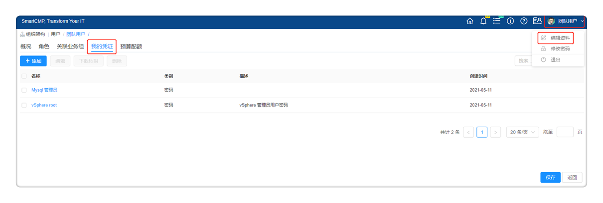
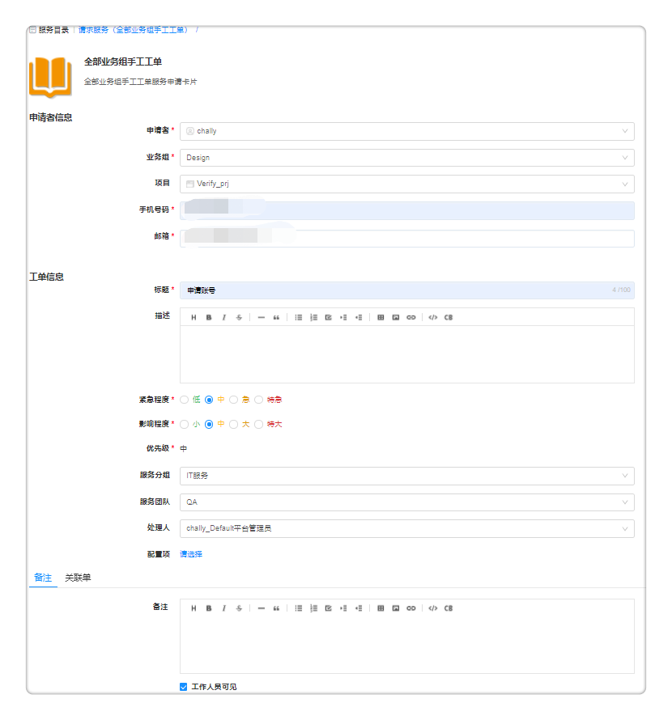

**服务目录**
# 功能描述

　　服务目录的主要作用是为用户提供统一的云服务入口。将云资源的申请、运维、变更、监控和回收都服务化，并配套提供企业级的流程、权限和配额管控。
   + 提供在一个页面，申请任意云服务的能力，这样用户可以非常方便的以服务目录的形式，访问有权限的多种类型的阿里云服务、VMware云资源服务、容器云服务、工单服务、邮件服务等等。例如：Tomcat，MySQL集群，J2EE三层应用等。示例如下图：

   + 其中，工单服务，即非标准化需要人工介入和支持的服务，包括服务请求，云资源出现问题时的事件处理，例如用户忘记密码需要进行重置，或是提交一个开通邮箱或账户的请求。
   + 服务目录项都是通过云管理平台的蓝图编排设计后进行相应的参数配置。服务既可以部署在私有云，也可以部署到公有云，还可以适用于越来越广泛地混合云部署，例如，前端应用部署在阿里云上，数据库部署在私有云上。  
   + 可以定义服务分组，方便服务管理。
   + 支持多种云服务类型、统一服务入口。

   + 在申请服务时，无论是申请阿里云的服务，还是VMware的资源，云平台提供了统一的类公有云服务体验，降低用户使用门槛，还能根据资源用量和价格，展示每个服务不同配置的整体服务费用。如下图所示：

# 服务目录展现方式
　　服务配置发布成功之后，将会在服务目录界面看到发布的服务卡片，服务目录的界面展示支持两种方式：
   1. 标签页展示：即分组按照标签页展示，可以通过服务分组标签、业务组或搜索框快速定位您需要申请的服务。

   2. 层级展示：按照卡片的模式，先展示分组（图标，名称，描述）--文件夹的显示方式，点击一个分组，再展现这个分组的所有卡片，对于没有分组的卡片，如果按照层级展示，增加一个 未分组的服务 文件夹，点击进入展现所有未分组的卡片。如果卡片都是有分组的，则这个文件夹不显示。

 >「Note」 服务目录展现方式，在系统管理-界面配置功能区进行选择，具体操作步骤，请参考：[界面配置](https://cloudchef.github.io/doc/AdminDoc/09系统管理/#界面配置)

## 标签页展示{#服务目录申请}

　　当服务目录以标签页方式展示时，可以通过服务分组标签，例如：数据库、基础设施、工单服务等等，或通过不同的业务组，或通过搜索框快速定位您需要申请的服务。

　　以"在vSphere云平台上部署虚拟机"为例：

1.  在左侧导航栏点击 服务目录 ，选择某 "Linux VM" 服务，点击将进入服务申请页面

2.  填写服务申请页面的相关申请参数：
  - 组织信息
     +  业务组：若该服务应用至全部业务组，即共享服务，需选择业务组（该业务组需有相关资源池，否则将不允许申请）；若服务配置时该服务已指定业务组，则无需填写
     +  项目：若该业务组下划分了项目，则可以选择项目
     +  所有者：选择该服务的所有者，所有者需为业务组成员，服务部署的所有者，在服务部署的运维操作中支持更新所有者

  - 部署信息
      + 名称：若业务组已配置 “服务部署名命名规则”，则服务部署名无需填写，将根据业务组规则自动生成；若业务组未配置“服务部署名命名规则”，需自定义输入服务部署名称
      + 数量：填写部署的数量，默认为1
      + 执行时间：可指定时间开始服务部署，精确到分钟
      + 租用到期日期：可以指定服务部署的使用期限。到期之后，所有的服务将被停机，最长到期日期无限制
      + 键值标签：默认勾选，所有、节点使用相同的键值标签， 若不勾选，将列出该服务部署下的所有节点，可为每个节点单独设置键值标签
        >「Note」 管理员可在 系统配置 - 系统参数 启用同步标签功能，启用后，在服务申请时新建的键值标签将被同步至云平台。

  - 其他信息
      + 表单配置的参数：如果您在服务配置的表单配置中为云资源蓝图服务和手工单服务自定义相关字段，则在此处填写所需信息

  - 申请参数
      + 资源池：选择具体的资源环境，请先至 资源池管理 配置资源池

  - 实例类型
      + 计算规格：根据业务需求选择不同规格的计算资源

  - 镜像
      + 操作系统：根据需求选择不同操作系统的镜像

3. 填写完成后点击申请，将根据业务组流程控制直接部署或等待审批，可至 我的部署 - 服务部署 中查看部署情况（也可在右上角 操作历史 中查看部署情况），或至 服务请求 - 待审批 中查看审批流程。

   若您在进行服务申请时，未能一次性填写完相关参数，点击 保存 能够对已填写参数进行保存，并且在下次申请的时候，点击 加载 可以重新加载，自动填充上次已经填写好的参数。

   

## 层级展示

　　采用层级展示的方式，按照卡片的模式，先展示服务分组，服务分组的具体操作步骤，请参考：[服务分组](https://cloudchef.github.io/doc/AdminDoc/05服务建模/服务分组.html)

　　在服务目录视图界面，可查看服务分组的图标、名称、描述和文件夹的显示方式，点击一个分组，展现此服务分组的所有卡片。（注意：当管理员创建的服务卡片没有选择服务分组时，如果按照层级展示，此类型卡片会存入 “未分组的服务” 文件夹，点击进入展现所有未分组的卡片。如果管理员创建的服务卡片都是有分组的，则“未分组的服务” 文件夹不显示。）

# 云资源部署

　　在服务目录下，会罗列您在 服务建模 - 服务配置 发布的所有的服务 ，同时平台提供了内置服务，通过 服务目录 你可以直接申请和部署各类云服务。

　　同时，您可以在 服务目录 - 云主机 和 服务目录 - 云资源中，点击 创建 按钮，申请各种不同类型的云服务。

>「Note」 在 服务建模 - 服务配置 添加发布您的服务，具体操作步骤，请参考：[服务配置](https://cloudchef.github.io/doc/AdminDoc/05服务配置/#服务配置)

## 通过蓝图部署云资源
　　SmartCMP支持一个服务绑定多个蓝图，支持您根据需求快速选择蓝图，例如："申请数据库"，提前配置了Mysql、Oracle、NoSQL等等与数据库相关的蓝图。

　　您可以通过以下步骤申请蓝图自服务：

1.  通过蓝图申请云资源。

2.  填写服务基本信息：
    + 业务组：选择部署所属业务组。
    + 服务部署名称： 自定义输入部署名称（若业务组已设定服务部署命名规则，服务部署名称将按照规则自动生成，无需填写）。
    + 项目：选择服务部署所属的项目。
    + 所有者：选择服务部署的所有者。
    + 数量：输入数字，您可以一次创建多个服务部署。
    + 键值标签：默认勾选，所有节点使用相同的键值标签， 若不勾选，将列出该服务部署下的所有节点，可为每个节点单独设置键值标签。管理员可在 系统配置 - 系统参数 启用同步标签功能，启用后在服务申请时新建的键值标签将被同步至云平台。
    >「Note」 您可以在 系统管理 - 界面配置 里控制服务申请页面显示需申请时填写的字段。具体操作步骤，请参考：[服务配置](https://cloudchef.github.io/doc/AdminDoc/09系统管理/#界面配置)

3. 填写相关申请参数，例如：资源池、私有网络、虚拟机配置、存储大小、节点数量等等信息。

    + 资源池：选择具体的资源环境，请先至 资源池管理 配置资源池。

    + 计算规格：根据业务需求选择不同规格的计算资源。

    + 操作系统：根据需求选择不同操作系统的镜像。

    + Network: 选择具体的网络IP地址。
    >「Note」 您可以在配置服务时控制参数是否在申请时可查看或修改。具体操作步骤，请参考：[服务配置](https://cloudchef.github.io/doc/AdminDoc/05服务配置/#服务配置)

4. 如需使用凭证，验证用户身份，可参考如下步骤，创建并使用您的凭证：
    1. 点击页面右上角用户名称，选择编辑资料，进入个人中心界面。
    2. 在我的凭证标签页，点击添加，进入基本信息标签页。
    3. 输入名称、描述、用户名并选择凭证类别：密码、密钥。
        + 密码：填写密码、确认密码（前后输入的密码必须一致）。服务配置时，可允许企业成员申请时，修改您创建的密码，还支持企业成员在申请服务时选择自己的凭证或者手动输入用户名和密码。
        + 密钥：创建或导入密钥。在虚拟机模板中，若选择密钥对的验证类型，将只能选择系统中已存在的共享的且类型为密钥的凭证（新建生成或导入的密钥）。
            - 创建密钥：选择算法（RSA）以及长度，目前支持1024、2048和4096三个长度的密钥生成。
            - 导入密钥:可导入私钥在系统中保存以便随后使用。
    4. 允许共享：勾选允许共享，可将我的凭证共享给指定业务组的指定角色。
    5. 申请服务时：您可选择自己的凭证或者手动输入用户名和密码进行身份验证
    

4. 点击保存，确认无误后点击提交，等待部署完成。

## 手工工单服务
　　SmartCMP支持在 服务建模-服务配置 发布手工工单服务，企业成员在使用过程中，如需提交工单，可以通过服务目录手工工单服务快速提交工单。
>「Note」 您可以配置在手工工单中配置审批流程、申请表单、工单流程。具体配置步骤，请参考[配置手工工单服务](https://cloudchef.github.io/doc/AdminDoc/05服务配置/#配置手工工单服务)

1. 申请手工工单

2. 申请通过后，您可以在 服务请求 - 我的请求 中查看进度、处理人和处理时间。
