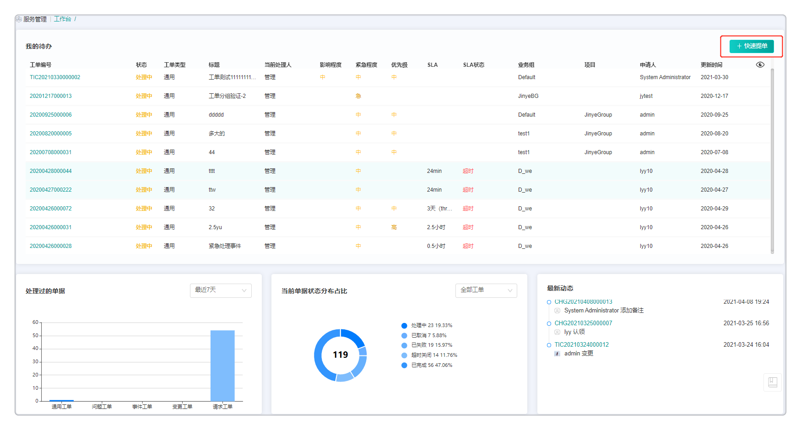
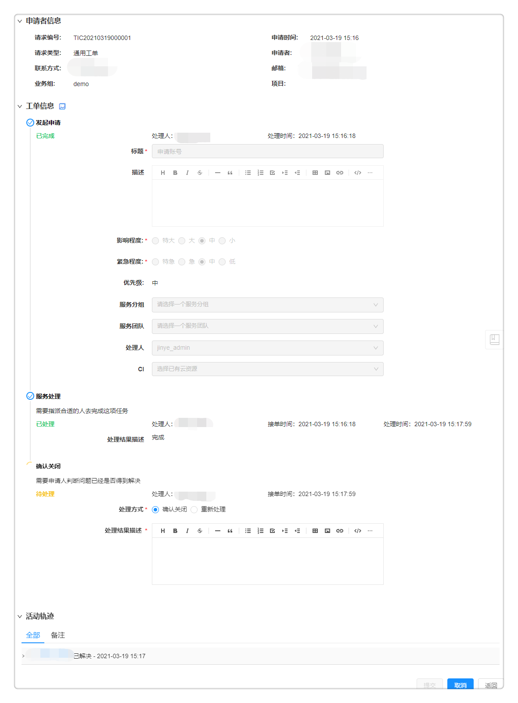
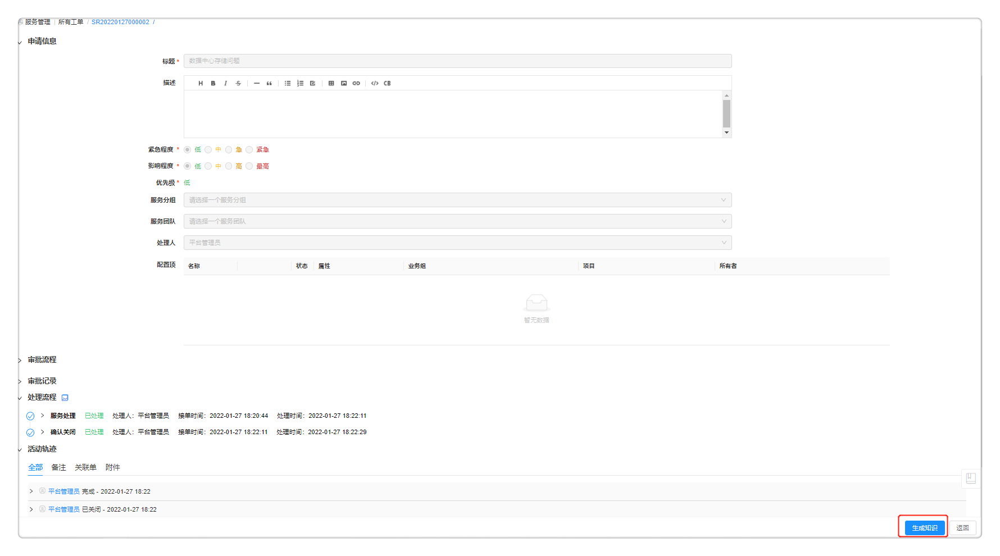
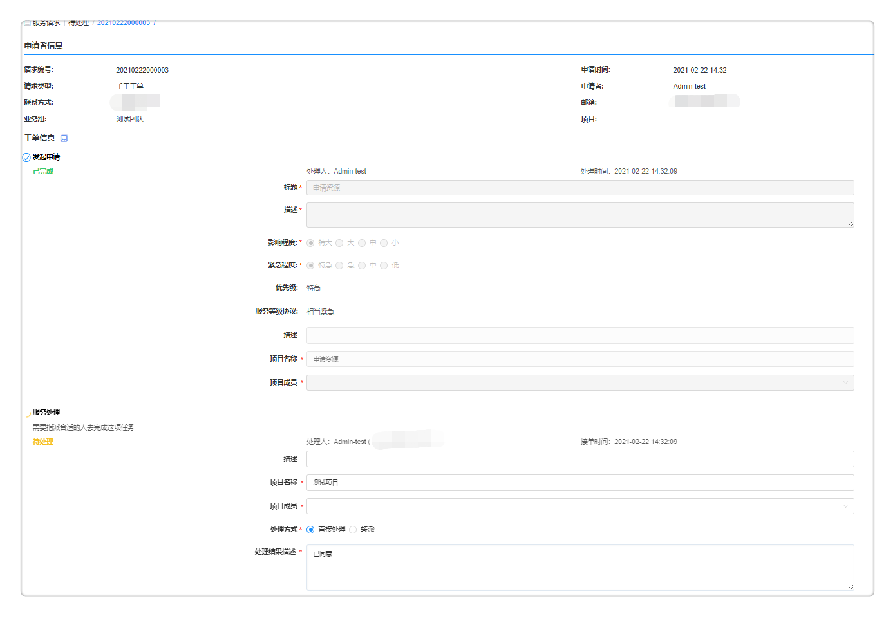
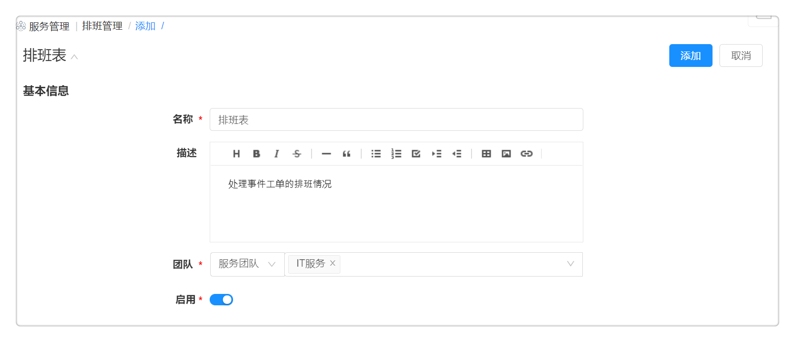
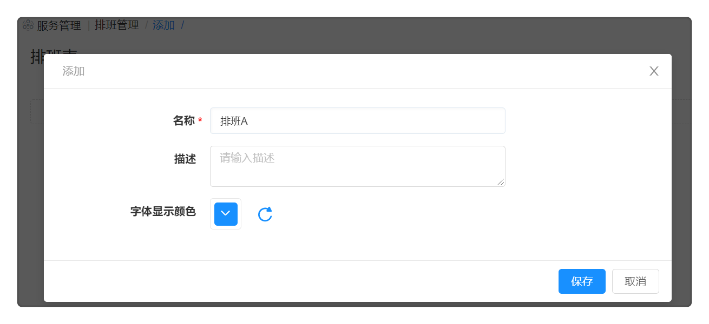
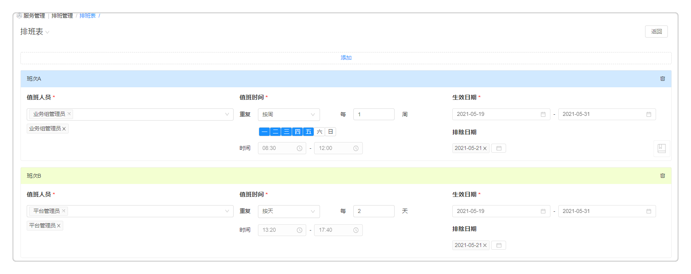
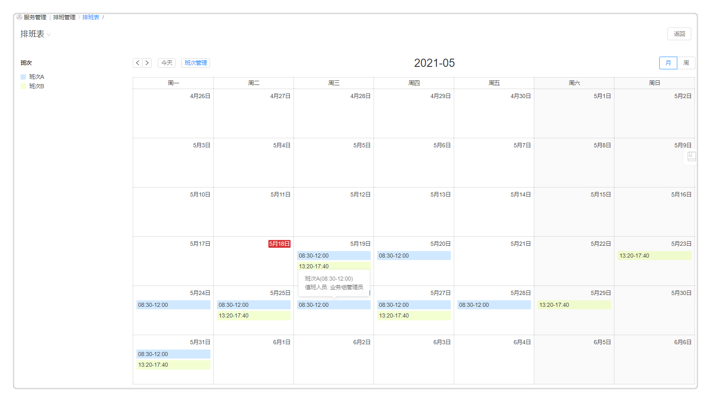

**服务请求管理**

SmartCMP可以管控和记录云资源服务和工单的全生命周期，包括服务配置、申请、处理和实时查看服务进展。

用户可在服务目录申请业务组发布的、已配置好的服务和共享的服务，其中服务类型包括两种类型：其一是工单服务，其二是云资源蓝图服务。服务申请完成，该服务信息可进入我的申请列表页面查看，稍后为您介绍我的申请详细信息。

当用户在服务目录申请工单完成后，根据预先配置的流程，系统将根据工单与服务团队的关联关系，派发工单给相应的服务团队进行处理。服务团队的成员也可以主动进行节点操作。服务团队中的指定人员收到工单请求之后，可以进行转派，也可以进行线下处理，完成之后更新工单状态，系统自动通知用户，也支持用户查看处理进程。在工单的任意流转阶段，工单处理人都能在服务管理模块下的菜单中为工单配置关联单。

# 工作台 {#工作台}
ITIL处理员和ITIL管理员（包括问题管理员，事件管理员，问题管理员和请求管理员）可以通过工作台查看您和您的团队所发布工单的最新动态和详细信息,  并能统一处理待办工单。您也可以在此快速发布工单，具体步骤请参考下文：
  + 点击快速提单按钮，进入创建工单的页面：
    + 服务类型：选择您需要创建工单的服务类型，包括通用工单，问题工单，事件工单，变更工单和请求工单。
    + 工单服务：选择您需要创建工单的具体服务，您可以在服务配置   中提前配置工单服务。
  + 点击确定按钮，进入申请工单页面，填写相关信息，完成申请。
 

# 我的申请 {#我的请求}

选择某一个云资源蓝图服务或工单服务，点击进入服务信息详情页。输入服务基本信息并点击申请即可申请服务成功。服务申请成功之后，服务申请状态变更为处理中，申请进入我的申请当中。

用户可根据以下步骤查看用户自己已经申请的云资源蓝图服务或工单并跟踪处理进程。如果一个服务正在审批中，您可以点击“取消”按钮取消该操作，也可以批量进行取消操作。同时，用户也可以通过高级搜索或者选择不同条件来筛选工单，筛选条件包括工单所属服务目录，工单处理阶段，请求工单类型，业务组，项目，状态等：

  +  在左侧导航栏点击 服务请求 - 我的申请 ，我的申请页面显示申请的基本信息：工单编号，工单类型，处理方式，标题，申请人，业务组，项目，状态，申请时间，更新时间等。
      + 支持勾选编辑列表的工单基本信息展示列（如关联单、影响程度、优先级等），支持根据分组、工单类型、业务组、项目、状态、时间范围、SLA状态对工单进行筛选，点击 导出数据 按钮可以导出筛选后的工单列表，导出格式支持CSV和Excel。

  +  选择任意云资源蓝图服务的服务请求，点击工单编号链接，跳转到服务请求详情页面，可查看该工单的基本信息，部署信息、申请参数、审批记录、处理记录等。
  
    1. 基本信息包括工单编号，申请时间，工单类型，申请者，联系方式，邮箱，业务组，项目等。
    
    2. 部署信息包括部署名称、描述、部署数量、付费方式、执行时间、租用到期日期、键值标签、保留时间等。
    
    3. 申请参数信息包括申请资源的信息等
    
    4. 审批记录信息包括审批流程、审批流程名称、状态、审批意见、审批人、审批角色、审批时间等。
    
    5. 处理记录信息包括流程步骤，描述，状态，处理结果描述、处理人、处理时间。
    
  +   选择任意工单服务的服务请求，点击工单编号链接，跳转到服务请求详情页面，可查看该工单的申请者信息、工单信息等。 
    
    1. 您可以判断问题是否已经得到解决，并选择不同的处理方式
    
       + 确认关闭：判断问题已经得到解决并关闭该工单。
    
          +  处理结果描述：请描述解决方案或提供额外信息。
       
       + 重新处理：判断问题没有解决并要求处理人重新处理。

          + 重新处理说明：请描述重新处理的原因或者请求。
  
    2. 您可以查看此工单处理的活动轨迹，也可以添加备注，并可以选择备注所见范围
        + 所有人：处理此项工单时，所有人都能看到工单的备注信息。
        + 用户：处理此项工单时，指定某个或多个用户能够查看工单的备注信息。
        + 角色：处理此项工单时，指定某个或多个角色能够查看工单的备注信息。
    
    3. 您可以选择关联已有的工单或者创建新的工单进行关联，方便您之后快速查看问题的相关信息。
       + 关联：点击关联按钮，进入选择工单页面
          + 工单类型：选择“关联已有”
           + 工单关联关系：您可以选择以下几种关系
             + 关联：正在处理的工单与该关联单信息相关
             + 重复：正在处理的工单与该关联单信息重复
             + 导致：正在处理的工单导致的关联单问题
             + 被导致：正在处理的工单是由于关联单问题而生成的
          + 服务类型：选择需要关联工单的服务类型，包括“云服务请求”，“通用工单”,"问题工单”，“事件工单”，“变更工单”，“请求工单”和“任务执行”；您也可以通过高级搜索功能或者搜索工单状态和SLA来筛选您需要关联的工单。
       + 新建：点击新建按钮，进入创建页面，在输入下列信息后，申请创建新的关联工单。
           + 工单类型：选择“创建新的”
           + 工单关联关系：您可以选择以下几种关系，包括“关联”，“重复”，“导致”，“被导致”
           + 服务类型：请选择工单类型，包括“通用工单”，“请求工单”，“问题工单”，“事件工单”和“变更工单”。
           + 工单服务：请选择您想要创建的工单服务类型，具体设置请参考[服务配置](https://cloudchef.github.io/doc/AdminDoc/05服务建模/#配置工单服务) 
    
    4. 点击提交，关闭此工单或者转给处理人重新处理。
     
  
+  选择已完成或超时关闭的工单，点击重新提交按钮，将会生成一条新的工单，并且新建的工单流程与原工单保持一致，而原工单的状态仍然保持不变。

+  选择已完成的工单，点击生成知识按钮，将会自动跳转至知识库添加知识的界面，实现一键生成知识。该功能支持通用工单，请求工单，变更工单，事件工单和问题工单。目前拥有知识库管理权限的用户才能进行此操作，请先在 组织架构 - 角色 为用户赋予知识库权限。
  

# 我的审批 {#待审批}

在我的审批页面，管理员在审批流程中配置审批人，审批人具有审批权限，则能够查看待审批的服务请求的详细信息，并进行审批操作。

  1.  在左侧导航栏点击 服务请求 - 我的审批 ，待审批页面显示所有等待您审批的服务工单，其中显示审批请求的基本信息：工单编号，工单类型，标题，申请人，业务组，项目，申请状态，申请时间等。
      + 支持勾选编辑列表的工单基本信息展示列（如关联单、影响程度、优先级等），支持根据分组、工单类型、业务组、项目、时间范围、SLA状态对工单进行筛选，点击 导出数据 按钮可以导出筛选后的工单列表，导出格式支持CSV和Excel。

  2.  您可以列表点击多个审批单，进行批量审批通过，拒绝或者批量接单。您也可以选择一个工单，点击工单编号链接，跳转到我的申请详情页面，可查看该请求的审批人，审批状态，基本信息，工单信息，应用栈信息，组件参数，IP地址，部署资源占用信息总览，服务请求，资源申请依据等。

  3.  基本信息包括工单编号，申请时间，工单类型，申请者，业务组，项目等。

  4.  部署信息包括应用栈名称、数量、描述、租用到期时间等。若[界面配置](https://cloudchef.github.io/doc/AdminDoc/09系统管理/#界面配置) - 服务申请中启用了云资源标签字段且[资源标签](https://cloudchef.github.io/doc/AdminDoc/03基础设施管理/资源标签.html)中预设了云资源标签值，部署信息内将展示云资源标签（根据审批流程的设置，审批人将有权限修改云资源标签）。

  5.  组件参数：采集蓝图部署组件的参数

  6.  查看部署资源占用信息总览：包括资源池名称，待分配资源等

  7.  服务请求信息：审批流程，审批流程名称，状态，审批意见，审批人，审批角色，审批时间和审批意见等。

  8.  点击页面下方批准按钮即可批准此次申请，申请状态变更为已审批；点击拒绝，则此处申请被驳回，填写审批意见点击退回；点击申请则退回申请人处修改申请详情。
此处显示等待您处理的服务请求工单。您可以查看详细的请求信息，并进行相应的处理操作。

# 我的待办 {#待处理}

此处显示等待您处理的服务请求工单。您可以查看详细的请求信息，并进行相应的处理操作。

1.  在左侧导航栏点击 服务管理 - 我的待办 ，待处理页面显示发起的所有处理请求中待处理的部分，其中显示处理请求的基本信息包括：工单编号，工单类型，标题，服务名称，申请人，业务组，项目，申请状态，申请时间，完成时间等。
    + 支持勾选编辑列表的工单基本信息展示列（如关联单、影响程度、优先级等），支持根据分组、工单类型、业务组、项目、时间范围、SLA状态对工单进行筛选，点击 导出数据 按钮可以导出筛选后的工单列表，导出格式支持CSV和Excel。

2.  选择一个待处理的服务请求，点击请求编链接，跳转到请求详情页面，处理人有权限查看该请求的申请者信息，工单信息，服务处理信息等。

3.  申请者信息包括工单编号，申请时间，工单类型，申请者，联系方式，邮箱，业务组，项目等。
   
4.  工单信息包括标题，描述，影响程度，紧急程度，优先级，服务分组，服务团队，处理人，CI,服务等级协议，表单信息等字段信息。

5.  服务处理：您需要指派合适的人去完成这项任务，您也可以为此步骤配置表单，处理人可以根据表单配置填写不同的内容，具体步骤请参考[工单服务配置](https://cloudchef.github.io/doc/AdminDoc/05服务建模/服务配置.html#添加手工工单服务配置 .afff6)。
  
  + 选择直接处理方式：点击完成按钮，填上处理结果描述，即可点击提交处理，平台会通知服务申请者，申请者可进行工单关闭操作，则服务请求状态变更为已处理。

  + 选择转派处理方式：点击转派按钮
    
      + 选择转派类型（服务团队、用户、角色或者申请人），处理人和转派说明，点击页面下方提交按钮即可处理完成此次服务请求，平台会通知服务申请者，申请者可进行工单关闭操作，则服务请求状态变更为已处理。
      
        + 选择“服务团队”，并选择具体的服务团队，如无法选择，请点击 组织架构 - 服务团队 进行创建。
      
        + 选择“用户”，并直接选择一个处理人。
      
        + 选择“角色”，并选择具体的处理人，平台会根据您选择的角色筛选处理人的选项，您可以点击 组织架构 - 角色 创建角色。
      
        + 选择“申请人”，工单直接转派回给申请人。
      
      + 处理人：请选择转派处理该任务的具体处理人。
    
      + 转派说明：请描述转派的原因或背景。
     
      
6. 活动轨迹：您可以查看此工单处理的活动轨迹，也可以添加备注，并可以选择备注所见范围
  + 备注：
     + 所有人：处理此项工单时，所有人都能看到工单的备注信息。
     + 用户：处理此项工单时，指定某个或多个用户能够查看工单的备注信息。
     + 角色：处理此项工单时，指定某个或多个角色能够查看工单的备注信息。 

 + 关联单：在处理时关联工单，方便您之后快速查看问题的相关信息。您可以选择关联已有的工单或者创建新的工单进行关联。
     + 关联：点击关联按钮，进入选择工单页面
        + 工单类型：选择“关联已有”
         + 工单关联关系：您可以选择以下几种关系
           + 关联：正在处理的工单与该关联单信息相关
           + 重复：正在处理的工单与该关联单信息重复
           + 导致：正在处理的工单导致的关联单问题
           + 被导致：正在处理的工单是由于关联单问题而生成的
        + 服务类型：选择需要关联工单的服务类型，包括“云服务请求”，“通用工单”和“任务执行”；您也可以通过高级搜索功能或者搜索工单状态和SLA来筛选您需要关联的工单。
     + 新建：点击新建按钮，进入创建页面，在输入下列信息后，申请创建新的关联工单。
        + 工单类型：选择“创建新的”
        + 工单关联关系：您可以选择以下几种关系，包括“关联”，“重复”，“导致”，“被导致”
        + 服务类型：请选择通用工单
        + 工单服务：请选择您想要创建的工单服务类型，具体设置请参考[服务配置](https://cloudchef.github.io/doc/AdminDoc/05服务建模/#配置工单服务) 

# 请求管理{#请求管理}

您可以查看所有的请求工单详情，具体步骤如下：

  1.  点击左侧菜单栏的 服务管理 - 请求管理 ，可查看所有的请求工单的申请列表，包括申请状态为待审批和已审批，待处理和已处理。

  2.  该页面显示工单编号、服务名称、工单类型、标题、申请人、业务组、项目、申请状态、申请时间以及完成时间。可点击工单编号查看申请的详细信息。
      + 支持勾选编辑列表的工单基本信息展示列（如关联单、影响程度、优先级等），支持根据分组、工单类型、业务组、项目、时间范围、SLA状态对工单进行筛选，点击 导出数据 按钮可以导出筛选后的工单列表，导出格式支持CSV和Excel。

  3.  基本信息包括工单编号，申请时间，工单类型，申请者，联系方式，邮箱，业务组，项目等等。

  4.  工单信息包括标题，描述，优先级，紧急程度。

  5.  审批信息包括审批人，审批状态，应用栈名称，服务请求，资源申请依据。
 
  6.  处理记录包括流程步骤，描述，处理结果描述，状态，处理人，处理时间。

  7.  工单类型为请求工单。

  8.  在请求管理列表页面，支持您快速定位到您需要查看的请求管理工单，您可以通过状态（服务请求的审批状态：处理中、审批中、已完成、已拒绝、已退回、已失败、已取消），业务组，项目，SLA状态（正常、剩余时间25%-50%），剩余时间不足25%、超时），申请时间（服务请求的起止时间）或关键字搜索框快速定位。

# 事件管理{#事件管理}
您可以查看所有的事件工单详情，具体步骤如下：

  1.  点击左侧菜单栏的 服务管理 - 事件管理 ，可查看所有的事件工单的申请列表，包括申请状态为待审批和已审批，待处理和已处理。

  2.  该页面显示工单编号、服务名称、工单类型、标题、申请人、业务组、项目、申请状态、申请时间以及完成时间。可点击工单编号查看申请的详细信息。
      + 支持勾选编辑列表的工单基本信息展示列（如关联单、影响程度、优先级等），支持根据分组、工单类型、业务组、项目、时间范围、SLA状态对工单进行筛选，点击 导出数据 按钮可以导出筛选后的工单列表，导出格式支持CSV和Excel。

  3.  基本信息包括工单编号，申请时间，工单类型，申请者，联系方式，邮箱，业务组，项目等等。

  4.  工单信息包括标题，描述，优先级，紧急程度。
   -  一线处理支持：展示一线处理人的解决方案代码和解决方案描述。
   -  二线处理支持：展示二线处理人的解决方案代码和解决方案描述。
   -  服务关闭：展示问题是否已经解决的相关描述。

  5.  活动轨迹显示工单处理的流转信息，以及处理人添加的备注，关联单和附件信息。

  6.  工单类型为事件工单。

  7.  在请求管理列表页面，支持您快速定位到您需要查看的请求管理工单，您可以通过状态（服务请求的审批状态：处理中、审批中、已完成、已拒绝、已退回、已失败、已取消），业务组，项目，SLA状态（正常、剩余时间25%-50%），剩余时间不足25%、超时），申请时间（服务请求的起止时间）或关键字搜索框快速定位。

# 问题管理{#问题管理}
您可以查看所有的问题工单详情，具体步骤如下：

  1.  点击左侧菜单栏的 服务管理 - 问题管理 ，可查看所有的问题工单的申请列表，包括申请状态为待审批和已审批，待处理和已处理。

  2.  该页面显示工单编号、服务名称、工单类型、标题、申请人、业务组、项目、申请状态、申请时间以及完成时间。可点击工单编号查看申请的详细信息。
      + 支持勾选编辑列表的工单基本信息展示列（如关联单、影响程度、优先级等），支持根据分组、工单类型、业务组、项目、时间范围、SLA状态对工单进行筛选，点击 导出数据 按钮可以导出筛选后的工单列表，导出格式支持CSV和Excel。

  3.  基本信息包括工单编号，申请时间，工单类型，申请者，联系方式，邮箱，业务组，项目等等。
  
  4.  工单信息包括问题工单的相关信息
   -  发起申请：展示发起申请工单的基本信息，包括标题，紧急程度和影响程度
   -  根因分析：展示分析问题产生的原因，包括处理工单时的规避方法和原因分析等。
   -  解决问题：展示处理人是否解决问题或者解决风险，并显示解决方案描述。
   -  审核：显示问题是否已经解决的相关描述。
 
  5.  活动轨迹显示工单处理的流转信息，以及处理人添加的备注，关联单和附件信息。

  6.  工单类型为问题工单。 

  7.  在请求管理列表页面，支持您快速定位到您需要查看的请求管理工单，您可以通过状态（服务请求的审批状态：处理中、审批中、已完成、已拒绝、已退回、已失败、已取消），业务组，项目，SLA状态（正常、剩余时间25%-50%），剩余时间不足25%、超时），申请时间（服务请求的起止时间）或关键字搜索框快速定位。

# 变更管理{#变更管理}
您可以查看所有的变更工单详情，具体步骤如下：

  1.  点击左侧菜单栏的 服务管理 - 变更管理 ，可查看所有的变更工单的申请列表，包括申请状态为待审批和已审批，待处理和已处理。

  2.  该页面显示工单编号、服务名称、工单类型、标题、申请人、业务组、项目、申请状态、申请时间以及完成时间。可点击工单编号查看申请的详细信息。
      + 支持勾选编辑列表的工单基本信息展示列（如关联单、影响程度、优先级等），支持根据分组、工单类型、业务组、项目、时间范围、SLA状态对工单进行筛选，点击 导出数据 按钮可以导出筛选后的工单列表，导出格式支持CSV和Excel。

  3.  基本信息包括工单编号，申请时间，工单类型，申请者，联系方式，邮箱，业务组，项目等等。

  4.  工单信息包括变更方案的相关信息
   -  发起申请：展示发起申请工单的基本信息，包括标题，紧急程度和影响程度
   -  方案计划：展示变更方案的相关信息，包括变更原因，变更方案，风险评估，回退计划，测试计划，计划开始日期和计划结束日期等。
   -  审核方案：显示审核变更方案的处理描述意见。
   -  变更审批：显示审批变更操作的审批意见。
   -  实施解决：显示实施变更方案的实际开始日期和实际结束日期。
   -  确认解决：显示变更方案完成的相关描述。

  5.  活动轨迹显示工单处理的流转信息，以及处理人添加的备注，关联单和附件信息。
 
  6.  工单类型为变更工单。 

  7.  在请求管理列表页面，支持您快速定位到您需要查看的请求管理工单，您可以通过状态（服务请求的审批状态：处理中、审批中、已完成、已拒绝、已退回、已失败、已取消），业务组，项目，SLA状态（正常、剩余时间25%-50%），剩余时间不足25%、超时），申请时间（服务请求的起止时间）或关键字搜索框快速定位。

# 所有工单{#所有工单}

您可查看所有申请的详细信息，具体步骤如下：

  1.  点击左侧菜单栏的 服务管理 - 所有工单 ，可查看所有工单的申请列表，包括申请状态为待审批和已审批，待处理和已处理。

  2.  该页面显示工单编号、服务名称、工单类型、标题、申请人、业务组、项目、申请状态、申请时间以及完成时间。可点击工单编号查看申请的详细信息。
      + 支持勾选编辑列表的工单基本信息展示列（如关联单、影响程度、优先级等），支持根据分组、工单类型、业务组、项目、时间范围、SLA状态对工单进行筛选，点击 导出数据 按钮可以导出筛选后的工单列表，导出格式支持CSV和Excel。

  3.  基本信息包括工单编号，申请时间，工单类型，申请者，联系方式，邮箱，业务组，项目等等。

  4.  工单信息包括标题，描述，优先级，紧急程度。

  5.  审批信息包括审批人，审批状态，应用栈名称，服务请求，资源申请依据。
 
  6.  处理记录包括流程步骤，描述，处理结果描述，状态，处理人，处理时间, 以及处理人添加的备注，关联单和附件信息。

  7.  工单类型包括云应用部署，云资源部署，通用工单，问题工单，事件工单，变更工单，请求工单，任务执行申请，不同工单类型展示的详情页面稍显不同。

  8.  在服务请求列表页面，支持您快速定位到您需要查看的服务请求，您可以通过状态（服务请求的审批状态：处理中、审批中、已完成、已拒绝、已退回、已失败、已取消），业务组，项目，SLA状态（正常、剩余时间25%-50%），剩余时间不足25%、超时），申请时间（服务请求的起止时间）或关键字搜索框快速定位。

# 排班管理

在排班管理中，平台管理员或排班管理员可以查看并管理团队排班的详细信息，ITIL处理员、事件管理员、变更管理员、问题管理员和请求管理员只能查看其所在排班的信息。添加排班表之后，可以选择值班人员处理工单等任务。以为一个团队中成员添加不同班次为例，添加排班的步骤如下：

 1. 点击左侧菜单栏 服务管理 - 排班管理 ，进入排班概况界面，此界面展示排班的简要信息，包括名称，描述，团队，是否启用，班次时间，班次人员等。
      + 点击 导出数据 按钮可以导出排班表列表，导出格式支持CSV和Excel。
 
 2. 点击 添加 按钮，自定义排班表的名称和描述，选择该排班表的所属团队，并启用该排班表
   
 
 3. 点击 排班管理 按钮 ，选择添加排班，在此界面，您可以自定义班次名和描述，并设定字体显示颜色。
   
 
 4. 您可以在一个排班表里添加多个班次，并调整班次的显示顺序，您也可以为添加的班次设定详细信息，并保存
   + 值班人员：选择服务团队中的某个用户
   + 值班时间：选择用户的值班时间，并选择班次的重复次数，例如每1周重复一次。
   + 生效日期：该班次在该时间段生效
   + 排除日期：该班次在该日期无效
     
 
 5. 点击返回按钮，您可以看到该排班表的排班情况。
   