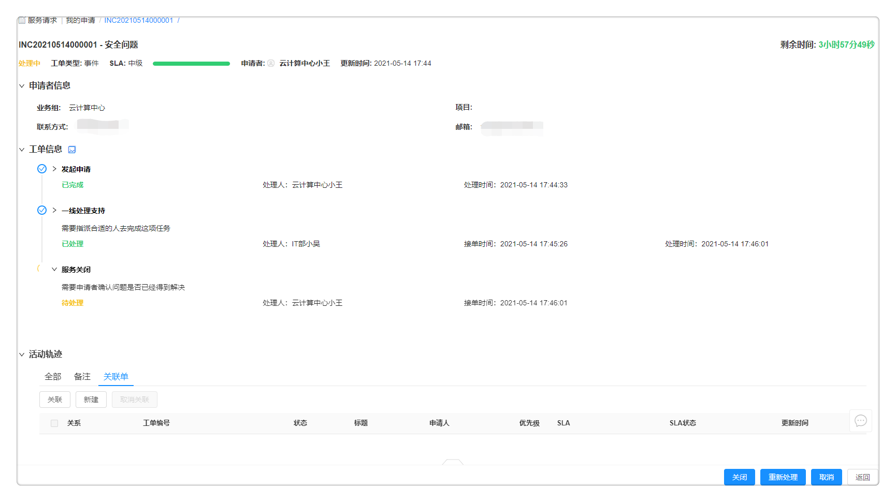
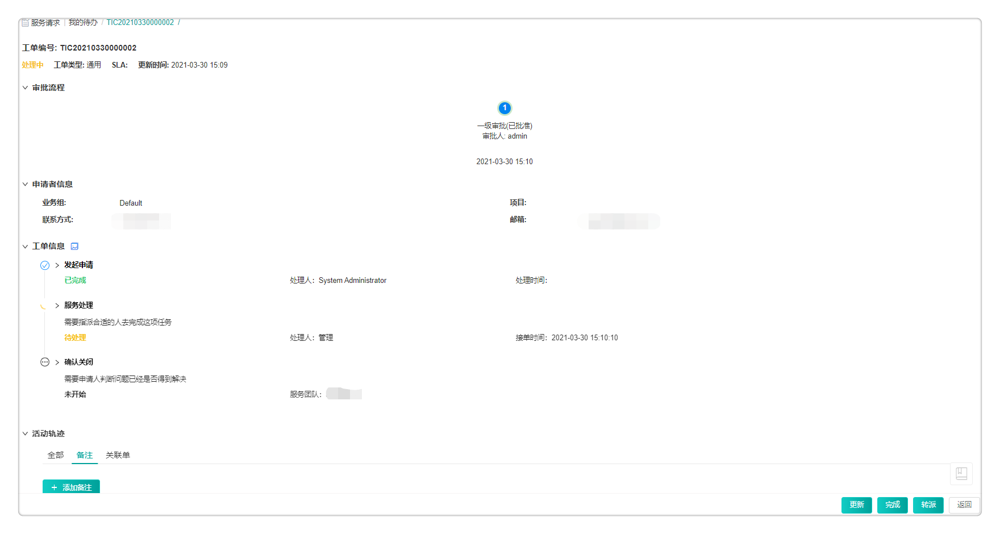

**服务请求管理**

SmartCMP可以管控和记录云资源服务和工单的全生命周期，包括服务配置、申请、处理和实时查看服务进展。

用户可在服务目录申请业务组发布的、已配置好的服务和共享的服务，其中服务类型包括两种类型：其一是手工工单服务，其二是云资源蓝图服务。服务申请完成，该服务信息可进入我的请求列表页面查看，稍后为您介绍我的请求详细信息。

当用户在服务目录申请工单完成后，根据预先配置的流程，系统将根据工单与服务团队的关联关系，派发工单给相应的服务团队进行处理。服务团队的成员也可以主动进行节点操作。服务团队中的指定人员收到工单请求之后，可以进行转派，也可以进行线下处理，完成之后更新工单状态，系统自动通知用户，也支持用户查看处理进程。

# 我的请求 {#我的请求}

选择某一个云资源蓝图服务或手工工单服务，点击进入服务信息详情页。输入服务基本信息并点击申请即可申请服务成功。服务申请成功之后，服务申请状态变更为处理中，申请进入我的请求当中。

用户可根据以下步骤查看用户自己已经申请的云资源蓝图服务或手工工单并跟踪处理进程：

  +  在左侧导航栏点击 服务请求 - 我的请求 ，我的请求页面显示我的请求的基本信息：请求编号，请求类型，标题，服务名称，申请人，业务组，项目，申请状态，申请时间，完成时间。

  +  选择任意云资源蓝图服务的服务请求，点击请求编号链接，跳转到服务请求详情页面，可查看该请求的基本信息，部署信息、申请参数、处理记录、审批流程等。
  
    1. 基本信息包括请求编号，申请时间，请求类型，申请者，联系方式，邮箱，业务组，项目等。
    
    2. 部署信息包括部署名称、描述、部署数量、付费方式、执行时间、租用到期日期、键值标签、保留日期等。
    
    3. 申请参数信息包括申请资源的信息等
    
    4. 处理记录信息包括流程步骤，描述，处理结果描述、处理状态和处理人、处理时间。
    
  +   选择任意手工工单服务的服务请求，点击请求编号链接，跳转到服务请求详情页面，可查看该请求的申请者信息、工单信息等。 
    
    1. 您可以判断问题是否已经得到解决，并选择不同的处理方式
    
       + 确认关闭：判断问题已经得到解决并关闭该工单。
    
            + 处理结果描述：请描述解决方案或提供额外信息。
       
       + 重新处理：判断问题没有解决并要求处理人重新处理。

          + 重新处理说明：请描述重新处理的原因或者请求。
    
    2. 点击提交，关闭此工单或者转给处理人重新处理。
     
  
  +  选择已完成或超时关闭的工单，点击重新提交按钮，将会生成一条新的工单，并且新建的工单流程与原工单保持一致，而原工单的状态仍然保持不变。

# 待审批 {#待审批}

在待审批的页面，管理员在审批流程中配置审批人，审批人具有审批权限，则能够查看待审批的服务请求的详细信息，并进行审批操作。

  1.  在左侧导航栏点击 服务请求 - 待审批 ，待审批页面显示你发起的所有审批请求其中待审批部分，其中显示审批请求的基本信息：申请编号，请求类型，服务部署名称，申请人，业务组，项目，申请状态，申请时间。

  2.  选择一个请求，点击请求编号链接，跳转到我的请求详情页面，可查看该请求的审批人，审批状态，基本信息，工单信息，服务部署信息，组件参数，IP地址，部署资源占用信息总览，服务请求，资源申请依据等。

  3.  基本信息包括请求编号，申请时间，请求类型，申请者，业务组，项目等。

  4.  部署信息包括服务部署名称、数量、描述、租用到期时间等。若[界面配置](http://CMP-PUBLIC-IP/help/AdminDoc/09系统管理/#界面配置) - 服务申请中启用了云资源标签字段且[资源标签](http://CMP-PUBLIC-IP/help/AdminDoc/03基础设施管理/资源标签.html)中预设了云资源标签值，部署信息内将展示云资源标签（根据审批流程的设置，审批人将有权限修改云资源标签）。

  5.  组件参数：采集蓝图部署组件的参数

  6.  查看部署资源占用信息总览：包括资源池名称，待分配资源等

  7.  服务请求信息：审批流程，审批流程名称，状态，审批意见，审批人，审批角色，审批时间和审批意见等。

  8.  点击页面下方批准按钮即可批准此次申请，申请状态变更为已审批；点击拒绝，则此处申请被驳回，填写审批意见点击退回；点击申请则退回申请人处修改申请详情。

# 已审批 {#已审批}

此处显示已经通过审批的所有请求。

在左侧导航栏点击 服务请求 - 已审批 ，已审批页面显示你发起的所有审批请求中已经通过审批的部分，其中显示审批请求的基本信息包括：请求编号、请求类型、申请人、业务组、项目及申请时间；部署信息展示服务名称、部署名称、部署数量、云资源标签等信息；服务请求展示了审批流程的状态、审批意见及审批时间等信息。

# 待处理 {#待处理}

此处显示等待您处理的服务请求。您可以查看详细的请求信息，并进行相应的处理操作。

1.  在左侧导航栏点击 服务请求 - 待处理 ，待处理页面显示发起的所有处理请求中待处理的部分，其中显示处理请求的基本信息包括：请求编号，请求类型，标题，服务名称，申请人，业务组，项目，申请状态，申请时间，完成时间。

2.  选择一个待处理的服务请求，点击请求编链接，跳转到请求详情页面，处理人有权限查看该请求的申请者信息，工单信息，服务处理信息等。

3.  申请者信息包括请求编号，申请时间，请求类型，申请者，联系方式，邮箱，业务组，项目等。
   
4.  工单信息包括标题，描述，影响程度，紧急程度，优先级，服务等级协议，表单信息等的字段信息。

5.  服务处理：您需要指派合适的人去完成这项任务，您也可以为此步骤配置表单，处理人可以根据表单配置填写不同的内容，具体步骤请参考[手工工单服务配置](http://CMP-PUBLIC-IP/help/AdminDoc/05服务建模/服务配置.html#添加手工工单服务配置 .afff6)。
  
  + 选择直接处理方式：点击直接处理，填上处理结果描述，即可点击提交处理，平台会通知服务申请者，申请者可进行工单关闭操作，则服务请求状态变更为已处理。

  + 选择转派处理方式：
    
      + 选择转派类型（服务团队、用户、角色或者申请人），处理人和转派说明，点击页面下方提交按钮即可处理完成此次服务请求，平台会通知服务申请者，申请者可进行工单关闭操作，则服务请求状态变更为已处理。
      
        + 选择“服务团队”，并选择具体的服务团队，如无法选择，请点击 组织架构 - 服务团队 进行创建。
      
        + 选择“用户”，并直接选择一个处理人。
      
        + 选择“角色”，并选择具体的处理人，平台会根据您选择的角色筛选处理人的选项，您可以点击 组织架构 - 角色 创建角色。
      
        + 选择“申请人”，工单直接转派回给申请人。
      
      + 处理人：请选择处理该任务的处理人。
    
      + 转派说明：请描述转派的原因或背景。
      

# 已处理 {#已处理}

此处显示服务团队已经处理完成并且申请人已经确认关闭服务的请求。

  1.  在左侧导航栏点击 服务请求 - 已处理 ，页面显示发起的所有处理请求中已处理部分

  2.  显示处理请求的基本信息：请求编号，请求类型，服务名称，标题，申请人，业务组，项目，申请状态，申请时间，完成时间

  3.  选择一个请求，点击请求编号链接，跳转到我的请求详情页面，可查看该请求的基本信息，工单信息，处理记录。

# 所有请求

您可查看所有申请的详细信息，具体步骤如下：

  1.  点击左侧菜单栏的 服务请求 - 所有请求 ，可查看所有的申请列表，包括申请状态为待审批和已审批，待处理和已处理。

  2.  该页面显示请求编号、服务名称、请求类型、标题、申请人、业务组、项目、申请状态、申请时间以及完成时间。可点击请求编号查看申请的详细信息。

  3.  基本信息包括请求编号，申请时间，请求类型，申请者，联系方式，邮箱，业务组，项目等等。

  4.  工单信息包括标题，描述，优先级，紧急程度。

  5.  审批信息包括审批人，审批状态，服务部署名称，服务请求，资源申请依据。
 
  6.  处理记录包括流程步骤，描述，处理结果描述，状态，处理人，处理时间。

  7.  请求类型包括手工工单请求、云资源蓝图部署、Day2操作，不同请求类型展示的详情页面稍显不同。

  8.  在服务请求列表页面，支持您快速定位到您需要查看的服务请求，您可以通过状态（服务请求的审批状态：处理中、审批中、已完成、已拒绝、已退回、已失败、已取消），业务组，项目，SLA状态（正常、剩余时间25%-50%），剩余时间不足25%、超时），申请时间（服务请求的起止时间）或关键字搜索框快速定位。

