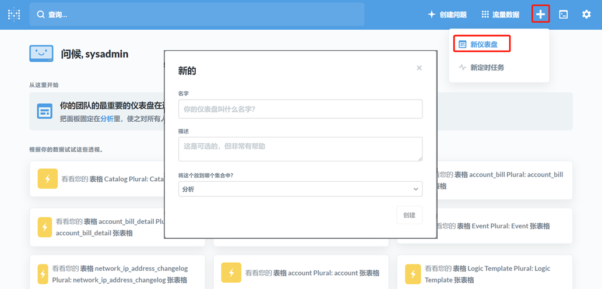

**仪表盘**

仪表盘页面可展示用户登录后最关心的内容，如申请的资源总量、资源的利用率排名，正在执行的部署、正在等待的审批、即将到期的资源等。

系统提供四个内置仪表盘：云资源使用情况仪表盘、业务组仪表盘、项目仪表盘和基础架构仪表盘。经过用户以及角色控制过滤后，在仪表盘菜单目录下能够为不同的用户展示不同的内置仪表盘。设置角色过滤的具体方法请参考：[编辑现有仪表盘](#编辑现有仪表盘)。用户点击左侧导航栏「仪表盘」，菜单将显示当前用户有权限可见的所有仪表盘。

同时系统提供自定义仪表盘功能，由用户自定义设置所展现内容。

# 内置仪表盘

系统提供四个内置仪表盘：云资源使用情况仪表盘、业务组仪表盘、项目仪表盘和基础架构仪表盘。以下将为您介绍具体展示内容：

## 云资源使用情况

云资源使用情况仪表盘以图表形式展示了已部署的云资源使用情况，用户可查看云资源的分布、告警、即将到期的服务部署等。

系统默认展示以下模块：云资源分布、云主机总览、云主机操作系统分布、云主机和应用告警、正在进行的操作、即将卸载的服务部署、即将到期的服务部署、CPU利用率最高的云主机-Top10、CPU利用率最低的云主机-Top10、内存利用率最高的云主机-Top10、内存利用率最低的云主机-Top10、磁盘利用率最高的云主机-Top10及磁盘利用率最低的云主机-Top10。

您可以查看云资源使用情况仪表盘，点击模块右上方箭头可下载该模块具体报告的完整结果，导出格式支持.csv、.xlsx和.json。

## 业务组仪表盘

业务组仪表盘展示了业务组内人员资源分布以及云资源概况等，使用户能够清晰直观了解业务组的基础架构整体情况。

系统默认展示以下模块：业务组云主机分布、业务组成员数量、待处理的审批、业务组云主机申请趋势、业务组云主机卸除趋势、业务组资源平均交付时间、业务组资源概况及业务组人员资源分布。

您可以查看业务组仪表盘，点击模块右上方箭头可下载该模块具体报告的完整结果，导出格式支持.csv、.xlsx和.json。

## 项目仪表盘

项目仪表盘展示了项目云主机分布、项目成员数量、待处理的审批、项目云主机申请趋势、项目云主机卸除趋势及项目资源平均交付时间等模块。

您可以查看项目仪表盘，点击模块右上方箭头可下载该模块具体报告的完整结果，导出格式支持.csv、.xlsx和.json。

## 基础架构仪表盘

基础架构仪表盘默认展示虚拟化平台总体情况，陈列IP池、宿主机总览、CPU配额使用最高的资源池-Top10、内存配额使用率最高的资源池-Top10、存储配额使用率最高的资源池-Top10以及虚拟机配额使用率最高的资源池-Top10。

您可以查看基础架构仪表盘，点击模块右上方箭头可下载该模块具体报告的完整结果，导出格式支持.csv、.xlsx和.json。

# 编辑现有仪表盘{#编辑现有仪表盘}

点击导航栏「系统管理」-「菜单配置」

可编辑已添加的仪表盘，进行一些参数配置，例如：修改名称、描述、图标、仪表盘在菜单目录下的显示顺序、URL参数、可以查看该仪表盘的角色以及是否启用该仪表盘。

各参数的详细介绍请参考：[添加菜单配置](https://cloudchef.github.io/doc/AdminDoc/09系统管理#菜单配置)

# 添加自定义仪表盘

平台支持用户添加自定义仪表盘，用户可以在菜单设置中添加自定义添加通过dashboard后台配置的外嵌仪表盘。

Dashboard可以展现虚拟机、服务部署、宿主机等的资源使用或监控告警等，也可以展示资源池、业务组和项目的人员资源概况。

Dashboard可以是私有的，也可以共享给团队的其他人。

可按以下步骤创建新的仪表盘：

1. 创建新看板：通过浏览器访问 云管理平台-Public-IP/metabase 登录dashboard服务进行创建。

2. 点击创建新看板，输入看板名称、描述与分类。

3. 向看板中添加报表模块：业务组和资源池相关报表、虚机相关报表、费用相关报表、项目相关报表等。

4. 创建好仪表盘后，分享仪表盘，选择在一个应用中嵌入这个dashboard，发布仪表盘。

5. 返回平台仪表盘配置页，填写参数，进行添加仪表盘。 添加步骤请参考：[添加菜单配置](https://cloudchef.github.io/doc/AdminDoc/09系统管理#菜单配置)。

