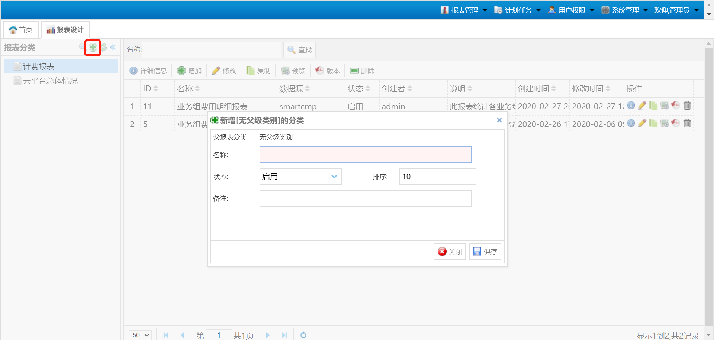
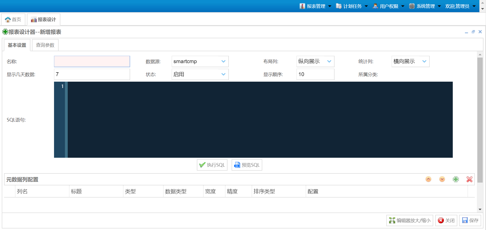

**报表与分析**

# 数据中心概览

对于拥有查看概览权限的用户，用户可以看到 资源分析 - 数据中心概览 菜单。概览视图用来查看数据中心的当前状态和最近7天的状态信息。在SmartCMP里，数据中心是指一个地理位置上的所有云平台的集合。在 数据中心概览 界面内，用户可以看到数据中心分布图，以及每个数据中心目前CPU、内存、存储、云主机和物理主机的状态和使用情况，点击右上角的 放大 图标，可进入全屏模式查看。
全屏展示界面，可按 Esc 可退出全屏状态：

图表说明：

-   数据中心分布图：显示系统中所有数据中心的当前资源，包括CPU、内存、存储、虚拟机数量和物理主机数量。

-   当前资源使用情况：显示一个或多个数据中心中的资源使用情况，资源包括CPU、内存和存储，以及显示近7天的使用趋势图

-   云主机概览：显示一个或多个数据中心当前的云主机数量以及对应的状态

-   物理主机概览：显示一个或多个数据中心当前的物理主机数量以及对应的状态

-   最近7天实例数量和物理主机数量：显示一个或多个数据中心最近7天实例和物理机的数量以及对应的状态

# 资源申请趋势

在资源申请页面，用户可以看到当前租户下业务组的资源申请情况，这个页面包含四个图表，分别对应为云主机申请/卸除量（个）、应用栈申请/卸除量（个）、CPU申请量（个）、内存申请量（GB）、硬盘申请量（GB）。

在页面上方选择筛选项：业务组、类型（各云平台）、时间跨度。用户通过设置时间跨度来改变图表的统计方式，从而更直观的获取资源申请信息。

# 业务组资源占用

在业务组资源占用页面，用户可以看到当前系统中，每个业务组的资源占用情况。业务组资源占用页面中显示了四种信息，分别对应四个图表，分别是：CPU使用情况（个）、内存使用情况（GB）、存储使用情况（GB）、虚机使用个数（个）。

用户可以选择类型下拉列表中的云平台，图表会显示当前选中的云平台的相应信息，同时也可以设置时间跨度，来更改图表统计方式。如果当前系统中有多个业务组，用户可从业务组下拉列表中选择某个业务组，则会显示对应业务组的数据统计页面，查看相应的图表，获取信息。

# 报表

您可以在 报表与分析 - 报表 中，查看相关的云主机总体情况报表或其他自定义报表。在 系统管理 - 报表配置 中，可针对不同用户角色，选择启用或禁用某一报表。支持对报表的多个维度的筛选条件以及表头的展示列选择，可导出Excel。

## 内置报表

系统提供内置的云平台总体情况报表供用户查看。

点击 报表与分析 - 报表 ，可查看云平台总体情况报表：主机总体情况报表，虚拟机总体情况报表，存储总体情况报表，当月即将到期虚机报表和IP池使用情况报表。 在当前页面点击生成，并根据数据中心、业务组、项目。所有者、查询月份、云平台类型、IP池以及关键字进行筛选。点击导出可以导出筛选后的报表，导出格式为Excel文件。

## 添加自定义报表

平台也支持用户按需添加自定义报表，用户可以在菜单设置中添加自定义添加通过后台配置的自定义报表按需查看。

可按以下步骤创建新的报表：

+ 通过浏览器访问 云管理平台-Public-IP/report 登录report服务进行创建。

+ 在报表设计页面，点击新增（或在某父级类别下点击新增），输入报表名称、启用状态、排序以及备注，点击保存。

+ 在报表设计器页面，填写基本设置、数据列配置、SQL语句、查询参数等信息，点击保存。

+ 创建好报表后，可以点击预览，以表格或图表的形式预览当前报表。

## 报表配置

管理员可在 系统管理 - 报表配置 中启用或禁用某一报表，并可选择将报表赋予给某角色进行查看，如租户成员、业务组管理员、软件架构师以及自定义角色。