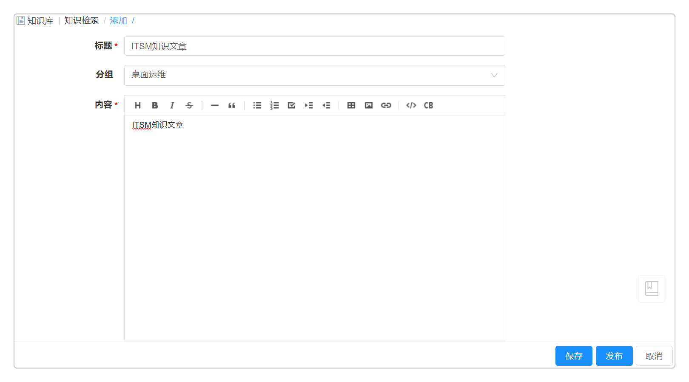

**知识库**
知识库(Knowledge Base) , 作为ITIL/ITSM的重要内容， 包含企业IT服务部门希望保留和共享的信息，避免信息孤岛和知识流失，为终端用户提供更快的解决方案，让IT技术人员具备更高的效率。

# 知识检索
知识库展示了已发布的文章列表，列表包含标题、内容、创建人和发布时间。同时知识库支持知识信息的检索查找，您可以在搜索栏搜索关键词来查找您需要的知识库文章，也可以根据分组搜索相关文章，分组类别包括桌面运维，服务器，应用软件，网络管理和IT服务。

普通用户可以对知识库中的文章进行收藏，点赞和评论，点击进入文章详情页，您可以查看当前知识库文章的所有评论，也可以对别人的评论进行回复。
 

# 知识管理
在知识管理模块，ITIL处理员、变更管理员、事件管理员、问题管理员、请求管理员和知识库管理员可以添加，编辑，发布并取消发布知识库的文章，已发布的文章能够在知识检索中展示，而只有知识库管理员可以归档知识库的文章，并且归档的文章无法在知识检索中展示或搜索。

当您需要添加知识库文章，请按以下步骤操作：
 - 选择 知识库 - 知识管理 ，点击添加按钮，进入添加文章的界面。
     - 标题：自定义文章标题
     - 分组：选择文章所属的分组，方便后续查找
     - 内容：自定义添加文章内容，您可以添加富文本，图片，附件，链接等内容
 - 点击发布按钮，文章状态更新为已发布，用户能够在知识检索中搜索到该文章；点击取消保存按钮，文章状态更新为未发布，您可以之后对该文章就行编辑修改。
 

以下角色都有权限使用知识管理的功能，并能够进行下列操作。

 - ITIL Agent(变更管理员，事件管理员，ITIL处理员，问题管理员，请求管理员)：可查看自己所创建的，并处于未发布，归档和待审批状态的知识库文章。
 - 知识库管理员：能够查看当前租户下所有的知识库信息，并能够进行添加、编辑、发布、取消发布、删除、归档的操作。
  

