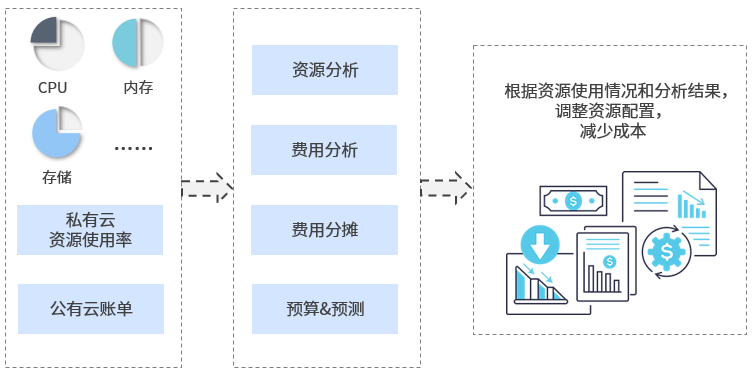

**计量计费**

　　SmartCMP为用户提供了丰富的计量计费功能：

+ 费用管理：支持自定义计费模型，以实现私有云的计费和公有云的二次计费，统一公有云和私有云的费用管理。
+ 资源分析：发现和分析多云环境的使用情况和利用率，让所有资源可追踪、可追溯。通过自定义成本核算，公有云成本可见性，洞察多云环境的花费，提高ROI。能够按照策略定时同步公有云账单，自动按照业务组、项目等维度进行分账；多维度展现费用使用情况和趋势。
+ 费用优化：费用可视化，结合资源使用率，帮助优化工作负载部署，合理化配置。申请时候预估整体服务价格，进行不同云平台的比价；结合资源使用率和成本，提出优化建议，降低过高配置。
+ 容量管理：针对资源池和IP池等基础设置，提供容量使用分析、告警功能。
+ 资源治理：针对定义的事件，触发相关的任务或操作，实现告警、自愈。

