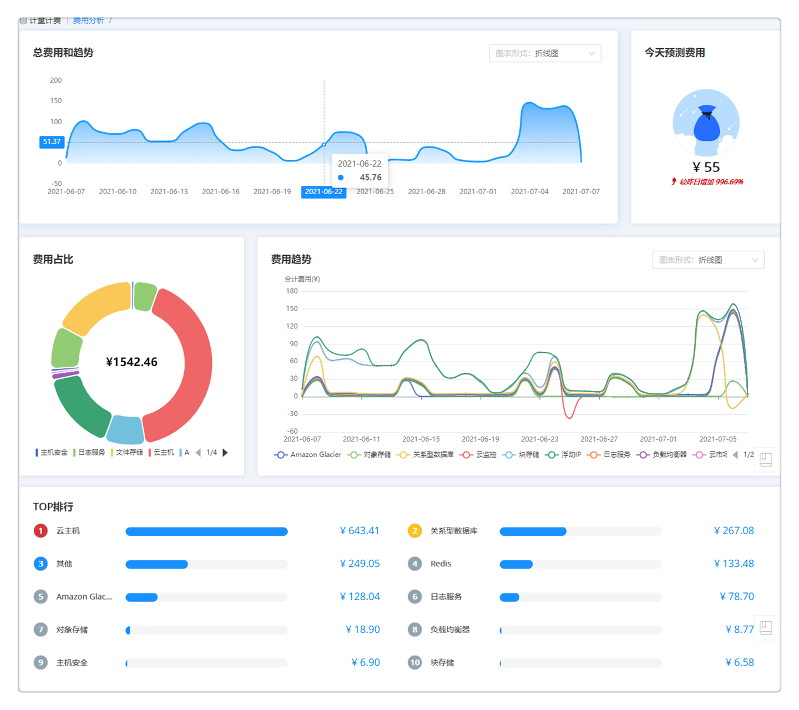
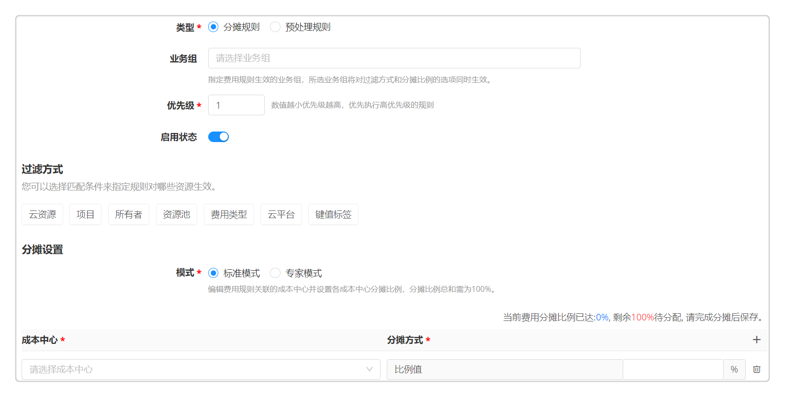
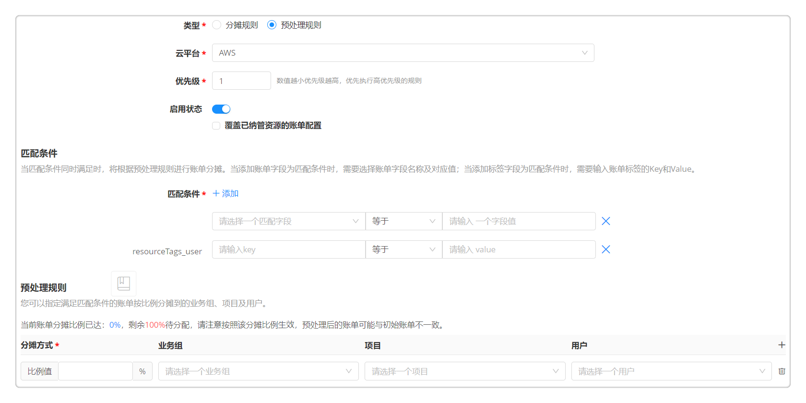

**计量计费**

# 费用类型

平台支持为不同的云资源类型关联计费项，从而将费用账单中的费用明细按照费用类型进行匹配。用户可以使用平台内置的费用类型，也可以根据业务需要自定义添加。
平台内置费用类型涵盖云主机、网络（如浮动IP、VPN、防火墙等）、存储、监控、缓存及关系型数据库等。内置的费用类型不允许修改或删除，用户可以复制该费用类型，或在该类型分组下创建新的费用类型分组。

您可以根据以下步骤自定义添加费用类型及计费项：
1. 点击左侧导航 计量计费 - 费用类型 ，当前页面展示平台内置的所有费用类型及分组。
2. 点击添加费用类型，输入主键、名称及描述，点击保存并成功创建类型分组。

您可以在内置费用类型或自定义添加的费用类型下添加计费项。
1. 选择某一费用类型，点击计费项下的添加按钮。在费用明细映射页面，输入名称、描述及代码（如instance_type）。
2. 添加计费项属性，输入属性主键、名称、描述、默认值，选择属性类型及备选项。您可以添加一个或多个计费项属性。
3. 若此计费项是公有云计费项，勾选 公有云计费项 并在映射标签页下公有云映射关系。映射表示每一个计费项与各个公有云平台中相关产品和实际计费项的关联关系。

# 费用明细

用户可以通过云平台管理启用账单同步，定时同步导入费用信息。

在费用明细页面，用户可以查看聚合分摊的费用明细信息，同时可以在费用明细详情中进行费用校准和更改费用归属。
+ 针对平台已管理的资源，如果因某些原因导致公有云、私有云账单不准的，用户可以通过执行添加、编辑或删除费用明细的操作来校准账单费用。
+ 点击费用明细页面的一条费用类型，可以编辑该费用的归属（业务组、项目及所有者）和配置（费用类型及计费项）并校准账单费用。费用明细支持计费项属性，在费用类型中自定义的计费项属性可以自动显示在费用明细中，用户也可以直接修改这些属性。
+ 支持费用明细多选，批量编辑归属（业务组、项目及所有者）或者删除费用。
+ 费用明细页面展示了费用明细的费用类型、云资源、付费类型、所有者等。支持勾选编辑列表的基本信息展示列（如成本中心、云平台类型、键值标签等），可以根据业务组、项目、所有者、时间范围、成本中心等对列表进行筛选。
+ 点击 导出数据 按钮可以导出筛选后的费用明细，导出格式支持CSV和Excel。

在账单详情页面，用户可以查看已产生的和从云平台导入的账单费用详情。
+ 账单详情页面展示了账单详情的费用类型、账单时间、起始时间、结束时间、账单费用等。支持勾选编辑列表的基本信息展示列（如付费类型、订单ID、键值标签等），可以根据业务组、项目、所有者、时间范围、键值标签等对列表进行筛选。点击 导出数据 按钮可以导出筛选后的账单详情，导出格式支持CSV和Excel。
+ 点击刷新按钮，将把最新的账单费用同步到当前页面，同时把最新的费用类型和计费项更新到当前所有的账单详情中。
+ 点击 导出数据 按钮可以导出筛选后的账单详情，导出格式支持CSV和Excel。

# 费用分析

SmartCMP能够从不同维度统计资源费用信息，帮助您了解各个业务组、项目、云平台等在过去一段时间内的花费情况。

1. 点击左侧导航 计量计费 - 费用分析 ，平台支持展示总体费用分析概览和分组费用分析概览：费用类型、云平台入口、业务组、项目、用户和成本中心。页面展示了“总费用趋势”、“预测今天（本月）费用”、“费用占比”、“费用趋势”及“费用排行”模块。各模块支持根据分组（费用类型、云平台入口、业务组、所有者等）、时间粒度（天、月）和具体时间跨度进行筛选展示，同时支持更多筛选维度如云平台类型、成本中心、所有者、费用类型、键值标签等。鼠标悬浮于图表上时，将显示悬浮区域的数据明细。

  >「Note」根据时间粒度设置（天或月），可分别展示“预测今天费用”或“预测本月费用”。

2. “总费用趋势”和“费用趋势”的图表形式支持折线图和（堆叠）柱状图，点击模块右上角下拉框可切换图表形式。

3. 点击“总费用趋势”和“费用趋势”中的某一项将跳转至[费用明细](#费用明细)页面，时间跨度根据费用分析页面时间粒度设置展示。可根据时间、云平台、资源类型、费用类型、业务组、项目和所有者等不同维度进行筛选查看。

4. 在“费用占比”可视化图表上展示当前时间粒度下Top10费用占比数据，其他汇总为“其他费用”。点击“其他费用”可以查看更多费用分组。

5. 点击“费用占比”和“费用排行”的某一项资源类型，将跳转至该类型的费用概览页面（按费用分析页面时间粒度设置展示），包含“总费用趋势”、“预测今天（本月）费用”、“分组费用占比和趋势”及“费用明细”模块。支持根据时间粒度、分组、业务组、所有者等维度筛选展示，以及图表形式切换。
  + 在费用明细模块可按业务组、项目、所有者等筛选费用明细，支持以应用栈或云资源为单位显示费用明细（费用类型费用分析概览不包含该功能）。
  + 在费用明细模块点击任意资源名称可进入该资源费用概览页面（按上级费用分析页面时间粒度设置展示），包括“总费用趋势”和“预测今天（本月）费用”。支持根据时间粒度和时间跨度筛选展示，以及图表形式切换。

# 费用报表

系统提供内置的费用报表供用户查看。

点击 计量计费 - 费用报表 ，可查看费用报表：成本中心费用统计报表、成本中心费用明细报表、业务组费用统计报表、业务组费用明细报表、项目费用统计报表、云平台费用统计报表、云资源费用明细报表和云资源费用统计报表。 

以业务组费用明细报表为例介绍报表生成的步骤：

1. 点击任意报表名称进入报表生成页面。点击生成，可生成用户所属业务组所有费用明细报表。

2. 用户可根据云平台类型、业务组、云平台类型、费用类型及起始时间进行筛选。

3. 可点击合并左边相同维度行，并可选择需要展示的报表表头，如：云平台名称、费用。

3. 点击导出可以导出筛选后的报表，导出格式为Excel文件。

# 优化建议

优化建议列表展现了需进行费用优化的资源，您可以根据操作建议进行配置调整。

点击资源名称可进入优化建议详情页，展示了影响程度、修复建议与操作（如有）、状态、触发的修复操作、任务状态、执行人以及开始/结束时间。

您可以根据修复建议与建议修复操作一键对需要费用优化的资源进行修复（要求策略中已定义建议修复操作）：
1. 点击建议修复操作中已配置的操作名称（如“启动云主机”操作），对资源进行费用优化。您也可以点击“更多操作”，选择刷新状态、启动、停止、更改配置等该云资源支持的Day 2运维操作。
2. 正在修复的资源状态将被标记为“修复中”，若资源修复成功，状态将被标记为“已修复”，若资源修复失败将被标记为“未修复”。
3. 在优化建议详情页面可以查看历史修复记录，包含：操作、服务名称、请求用户及状态等。
4. 同时平台支持您根据修复建议手动对资源进行修复，修复后您可以在优化建议详情页手动将该条优化建议的状态修改为已修复。

# 价格模型

SmartCMP允许自定义价格模型，对纳管的私有云、公有云等多种不同类型资源进行计费；并能够同步公有云的费用账单（详见账单同步小节），统一公有云和私有云的费用管理和分析。

+ 平台支持多种计费模式，包括，经典模式和专家模式。
    + 经典模式，是指当前的计费规格都是对单种资源来计费的，您可以按需选择云平台、资源池后，选择具体的组件来设定价格，例如：针对腾讯云平台下的全部资源池，IaaS云主机设置价格；也可以创建未对接云平台组件的价格模型。支持按云资源属性自定义计费，设置基础价格和计费项单价自定义云资源价格。

    + 专家模式，通过脚本定义一套价格模型，例如：阿里云的规格类型多种多样，不同规格的价格不一致，如果单个配置会非常繁琐，支持Javascript的脚本来定义一套阿里云不同规格的计费价格。

+ 价格模型支持多个货币单位，包括，人民币、美元、沙特里亚尔等等，您可以在系统配置选择一个货币单位，（默认人民币）可以选择沙特里亚尔或美元。选择后，价格模型、资金账户的充值时候的货币单位都为配置的保存一致，并且三种货币单位，都支持设定打折系数。。

  

下文为您介绍添加、编辑、删除价格模型的步骤：

点击左侧菜单栏 计量计费 - 价格模型 ，将看到已创建好的价格模型列表，列表中列出了已经创建的资源类型及价格等信息。您可以对已创建的计费规格进行编辑和删除，同时可以添加新的计费规格。价格模型会显示云平台、资源类别、存储类型、计价单位、价格、货币单位、周期等。

  1.  添加价格模型：进入菜单 计量计费 - 价格模型 ，点击添加，在弹出页面中填写以下信息：
      
      +  名称：自定义计费名称，请说明云资源类型
      
      +  云平台类型、云平台：根据接入的云平台进行选择或选择全部云平台
      
      +  资源池：选择全部资源池
      
      +  模式：根据业务需求选择计费模式，可选模式包括经典模式和专家模式

      +  费用类型：选择平台内置或者用户自定义添加的费用类型。若留空，系统将映射到默认的费用类型。

      +  基础价格和自定义定价：选择“经典模式”时，可根据云资源属性设置基础价格（默认按量计价），并支持为非云主机资源添加自定义定价。在添加自定义定价时可选择“按量”或者“按固定值”的计价方式。当价格模型启用时，自动计算价格=基础价格+自定义定价。

      +  周期：选择“经典模式”时，需设置计费时长，可选小时、天、周、月

      +  计费脚本：选择“专家模式”时，可通过输入脚本自定义一套价格模型

      +  打折系数：可针对公有云平台不同的资源设置不同的折扣系数

      +  结单周期：设置结单周期的频率，平台将对该价格模型产生的费用数据按照配置周期频率进行结单处理，默认为每天。
      
      点击提交，添加价格模型成功，计费管理列表显示刚才添加的信息，在费用明细页面将生成价格模型对应的费用账单记录。

  2.  编辑价格模型：选中列表中某个项目，点击编辑，修改信息后点击保存。

  3.  删除价格模型：选中列表中某个项目，点击删除，弹出确认提示框，点击确认。

# 成本中心

成本中心是对成本和费用承担控制和考核中心，是对费用进行归集、分配，对成本加以控制、考核的责任单位，亦即对成本具有可控性的责任单位。

平台支持为每个组织部门关联成本中心，在配置了每个组织部门费用的分摊规则之后，用户可以实现对部门中所有产生的费用的统一的控制和考核，也可以在费用分析和费用报表中查看每个成本中心的费用细节。

点击左侧菜单栏 计量计费 - 成本中心，管理（新增、编辑或删除）成本中心并关联业务组，一个成本中心可以关联多个业务组。

+ 点击添加成本中心，输入成本中心名称及代码。

+ 在基本信息页面，填写成本中心描述并为成本中心关联业务组

    + 点击右侧+号，在下拉框选择需要为成本中心关联的业务组。支持为成本中心设置默认业务组。
    + 可以为成本中心关联多个业务组。
    >「Note」在 组织架构 - 业务组 中可以查看该业务组关联的成本中心及默认成本中心。

+ 点击保存，成本中心新建成功。

# 费用规则

通过定义费用规则，用户可以定义每个满足条件的费用如何分摊到不同的成本中心，或定义预处理规则将账单分摊到不同的业务组、项目及用户。

点击左侧菜单栏 计量计费 - 费用规则，在当前页面可以查看已有费用规则的名称、描述、业务组、优先级、启用状态、创建者和创建时间，并可以对规则进行编辑或删除。

  + 点击添加，新建费用规则

  + 输入费用规则的名称、描述，选择优先级与启用状态，
    + 优先级：数值越小，优先级越高。系统将优先执行高优先级的规则。

  + 选择费用规则类型：分摊规则、预处理规则。
  
  + 当选择创建分摊规则时，可将匹配过滤条件的资源产生的费用分摊到指定的成本中心。
      + 选择业务组：指定费用规则生效的业务组，所选业务组将对下文的过滤方式和分摊比例的选项同时生效。
      + 指定费用规则的过滤方式，通过选择匹配条件（如云资源、所有者、云平台、标签等）来指定规则对哪些资源生效（匹配条件取交集）。
      + 配置分摊设置：平台支持通过标准模式或专家模式进行分摊设置
        + 标准模式：在下拉框中选择费用规则关联的成本中心并设置各成本中心分摊比例，分摊比例总和需为100%。
        + 专家模式：通过Javascript分摊脚本来满足更多的费用规则要求。
    

  + 当选择创建预处理规则时，可将平台未纳管的公有云资源费用分摊到指定的业务组、项目及用户。
      + 选择云平台
      + 勾选是否覆盖已纳管资源的账单配置
      + 设置匹配条件，当匹配条件同时满足时，将根据预处理规则进行账单分摊。当添加账单字段为匹配条件时，需要选择账单字段名称及对应值；当添加标签字段为匹配条件时，需要输入账单标签的Key和Value。
      + 配置预处理规则，指定满足匹配条件的账单按比例分摊到的业务组、项目及用户。请注意按照该分摊比例生效，预处理后的账单可能与初始账单不一致。     
       

  + 点击保存完成费用规则创建，系统将为聚合后的资源费用匹配最优的费用规则。

>「Note」在云资源有所属业务组前提下，若该资源未匹配费用规则，则该资源费用将100%分摊至所属业务组的默认费用规则中。