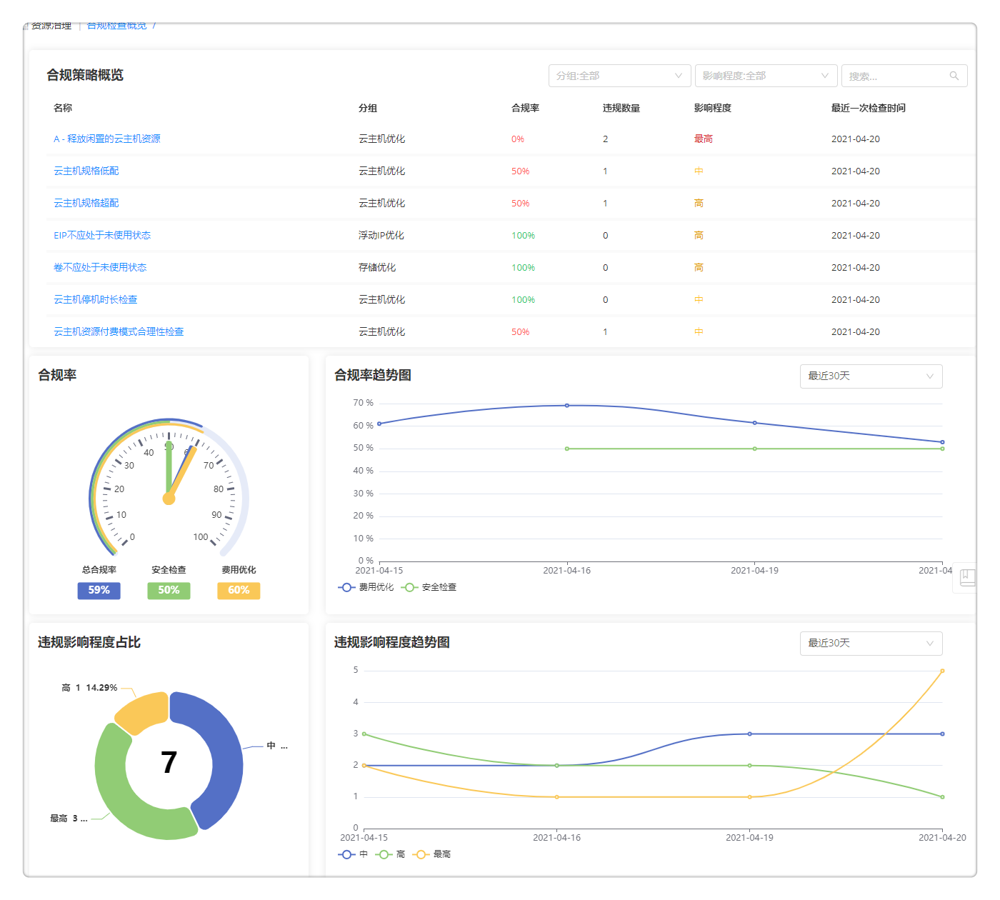

**资源治理**

# 合规性策略

平台内置提供合规性检查功能，自动化的合规框架实时满足安全和合规性要求。用户可以依据不断丰富合规性策略知识库进行配置合规检查，自动比对、发现差异。当平台检测到违规行为时，将根据用户的通知配置通知到具体的角色成员，该成员可以结合建议和规范进行清理修复。

平台内置了部分合规性策略，包含：云主机安全检查、云资源费用优化（如云主机、存储、浮动IP、RDS、CDN）等，用户也可以根据需求自定义合规性检查策略，满足不同业务场景的检查需求。

下面介绍编辑内置合规策略与自定义添加合规策略的步骤：

## 编辑内置合规策略

在合规性策略页面展示了平台内置的合规性策略名称、描述、影响程度、启用状态、作用范围、创建者、创建时间、最近一次检查时间以及合规率。

您可以在当前页面对已有策略进行启用/禁用，支持批量操作。对已启用的策略，您可以点击执行，快速进行合规性检查。

系统内置的合规策略不支持修改名称、描述、资源类型、分组、影响程度以及修复建议，也不允许删除。您可以按照以下步骤编辑内置策略的作用范围、通知设置与操作建议：
1. 点击合规性策略名称，进入策略详情页。
2. 在概况标签页，您可以编辑策略作用范围、通知配置、添加建议修复操作。
    + 作用范围：您可以选择匹配条件来指定策略对哪些资源进行合规性检查，不满足任意一个条件的资源将不会在检查范围中。匹配条件支持选择业务组、项目、所有者、资源池、云资源标签、云平台及云资源。您可添加一个或多个匹配条件。
    + 通知配置：您可以将通知发送到指定的用户、角色或特定的邮件地址。平台将根据所选用户或角色已配置的消息通知平台发送通知。
    + 建议修复操作：您可以添加建议修复操作，当发生违规操作时，后续人员可以直接通过您预定义的修复操作修复资源。
3. 点击保存，该策略已更新。

您可以在策略详情页的执行历史标签页查看该策略的执行历史，包含已执行检查的开始/结束时间、合规率、违规数量及执行人。

如需修改内置合规策略的名称、描述等参数，请在合规性策略界面复制该内置策略，并参考以下章节进行参数编辑。

## 添加自定义合规策略

为了满足用户业务场景需求，平台支持用户添加自定义合规策略。
1. 在合规性策略界面，点击添加，进入策略概况标签页。
2. 填写策略基本信息：名称、描述、资源类型（如IaaS、PaaS、软件等）、分组。选择策略影响程度并勾选是否启用资源。
    >「Note」合规性策略分组包含费用优化（云主机优化、存储优化、浮动IP优化、RDS优化及CDN优化）和云主机安全检查。平台根据策略分组在合规性策略界面对策略进行树形分组展示。
3. 配置策略作用范围：您可以选择匹配条件来指定策略对哪些资源进行合规性检查，不满足任意一个条件的资源将不会在检查范围中。匹配条件支持选择业务组、项目、所有者、资源池、云资源标签、云平台及云资源。您可添加一个或多个匹配条件。
4. 配置策略通知设置：您可以将通知发送到指定的用户、角色或特定的邮件地址。平台将根据所选用户或角色已配置的消息通知平台发送通知。
5. 添加修复建议与修复操作：
    + 修复建议：您可以编辑修复建议，方便后续人员通过该建议修复违规资源。
    + 建议修复操作：您可以添加建议修复操作，当发生违规操作时，后续人员可以直接通过您预定义的修复操作修复资源。
6. 点击保存，策略已添加。您可以在合规性策略界面执行该合规性检查。

# 合规检查概览

平台内置合规检查概览页面，供用户查看策略合规检查执行的总体情况。当前页面展示了合规策略概览、合规率、合规率趋势图、违规影响程度占比、违规影响程度趋势图等模块。

+ 合规策略概览：展示了当前平台已有合规策略，包括策略名、策略分组、合规率、违规数量、影响程度与最近一次检查时间。用户可以按分组、影响程度对策略概览展示进行筛选。点击策略名称将跳转至该策略最近一次检查的详情页面。

+ 合规率：以图形形式展示了总合规率、安全检查合规率以及费用优化合规率。点击相应的合规率指针，将跳转至该策略分组的合规检查历史页面。

+ 合规率趋势图：展示了费用优化与安全检查的合规率趋势曲线。用户可以在右上角切换时间范围（最近30天、最近15天、最近7天）查看不同时间跨度的趋势图。鼠标移动到某个日期上，悬浮展示该日费用优化和安全检查合规率数字。鼠标悬停在某一曲线上将仅展示该曲线。点击某一曲线（如费用优化曲线），跳转至曲线策略分组的合规检查历史页面。

+ 违规影响程度占比：以饼图形式、按影响程度分类展示了未修复违规的数量与相应占比。点击某一影响程度，跳转至该影响程度下未修复的违规资源的违规记录页面。

+ 违规影响程度趋势图：展示了各影响程度的违规趋势曲线。用户可以在右上角切换时间范围（最近30天、最近15天、最近7天）查看不同时间跨度的趋势图。鼠标移动到某个日期上，悬浮展示该日各影响程度的合规率数字。鼠标悬停在某一曲线上将仅展示该曲线。

# 合规检查历史

您可以在合规检查历史中查看过往检查的详细信息。页面展示了策略执行编号、策略名称、合规率、违规数量、影响程度、执行人与开始/结束检查时间。可以按策略分组、影响程度与开始/结束日期筛选查看策略执行历史。

点击策略执行编号，将跳转至该策略执行的详细信息页面。用户可以在当前页面查看策略名称、策略描述和该策略的合规率趋势图（支持查看不同时间跨度的趋势图），该次执行的合规率、合规数量、违规数量与检查总数。能够查看该次执行检查的资源名称、类型、属性与检查状态。针对发生违规的资源，可以点击资源名称跳转至该资源的违规记录详情页进行查看与修复操作。

# 违规记录

您可以在违规记录中查看检测到发生了违规操作的资源。支持根据策略类型、违规记录状态（未修复、修复中、已修复）、影响程度筛选查看违规记录。
点击资源名称可进入违规记录详情页，展示了策略基本信息、修复建议与操作（如有）、违规记录状态、触发的修复操作、任务状态、执行人以及开始/结束时间。

您可以根据修复建议与建议修复操作一键对发生违规行为的资源进行修复（要求策略中已定义建议修复操作）：
1. 点击建议修复操作中已配置的操作名称（如“触发脚本任务”操作），对资源进行修复。您也可以点击“更多操作”，选择刷新状态、重启、停止、更改配置等该云资源支持的Day 2运维操作修复资源。
2. 正在修复的资源状态将被标记为“修复中”，若资源修复成功，状态将被标记为“已修复”，若资源修复失败将被标记为“未修复”。
3. 在违规记录详情页面可以查看历史修复记录，包含：操作、服务名称、请求用户及状态等。
4. 同时平台支持您根据修复建议手动对资源进行修复，修复后您可以在违规记录详情页手动将该条违规记录的状态修改为已修复。

# 事件配置

事件配置功能用来定义事件应用到的范围以及触发的通知和操作，如：当检测到IP地址被未知机器占用时，能够检测到冲突并触发告警；针对云主机部署成功设置通知（云主机部署成功）；支持扩展其他类型，比如云主机名称修改通知，云主机IP地址修改通知等等；支持在“操作配置”功能区，灵活的自定义触发的事件的名称，类型，应用的范围，触发的操作。

点击左侧菜单栏 资源治理 - 事件配置 ，将看到事件配置列表，显示名称、类型、范围、对象、状态、创建者、创建时间。

创建步骤如下：
1.  添加事件配置：点击添加，输入事件名称，触发条件，选择针对的范围（用户），选择对某对象触发通知。通知配置所选用户邮箱，如果事件触发将收到系统通知和邮件通知。

2. 操作配置：提供通用的任务配置，事件、告警发生后，能够触发操作，如：云资源部署完成之后不仅是可以发送邮件通知，同时也可以进行云资源的运维操作，通知和操作可以同时配置，不配置具体操作就不会触发后续的运维操作。（具体的操作配置步骤与流水线的流程设计任务配置相似，请参考：[配置任务](https://cloudchef.github.io/doc/AdminDoc/11作业管理/#配置任务)）

3.  编辑事件配置：在列表中选择一项事件，点击编辑，进入编辑界面，可针对新建中的所有项进行编辑更改。

4.  启用/禁用事件：在列表界面选择某项已启用/禁用的事件，上方的禁用/启用操作将可用。

# 事件历史
列出触发的事件以及执行的任务状态。事件历史页面显示：

+ 展示事件编号，事件名称，事件类型，触发对象，触发时间，通知对象，触发操作，操作执行状态.
+ 触发的对象显示实际的对象名称，例如，检测到IP冲突，则触发对象显示具体的某个IP地址；部署完成或更新，则触发的对象是该部署.
+ 可根据筛选条件快速定位事件.
+ 点击任意事件进入事件详情页面：包括事件本身的信息，通知信息，触发的操作信息。
