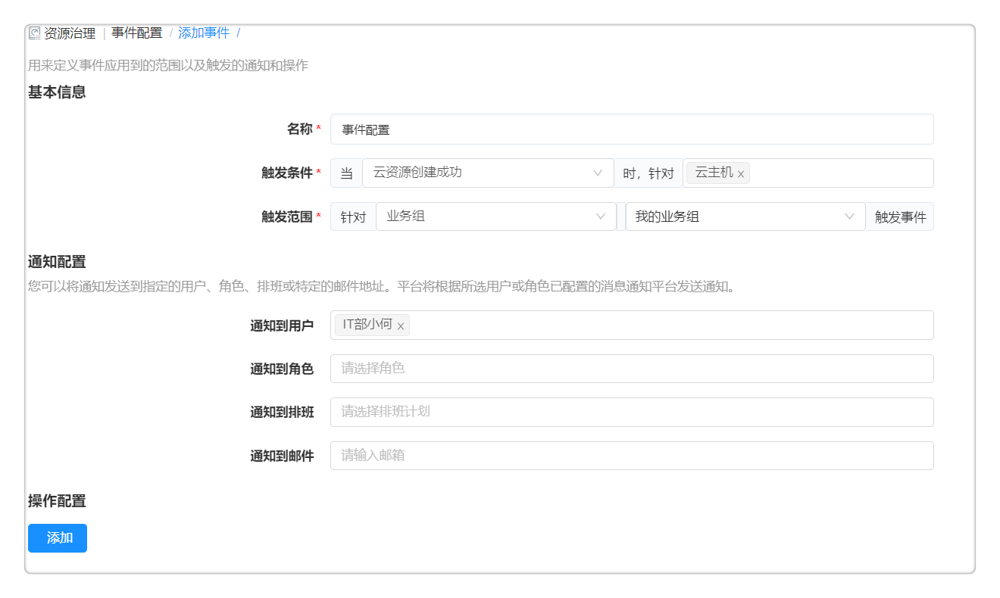

**资源治理**

# 事件配置

事件配置功能用来定义事件应用到的范围以及触发的通知和操作，如：当检测到IP地址被未知机器占用时，能够检测到冲突并触发告警；针对云主机部署成功设置通知（云主机部署成功）；支持扩展其他类型，比如云主机名称修改通知，云主机IP地址修改通知等等；支持在“操作配置”功能区，灵活的自定义触发的事件的名称，类型，应用的范围，触发的操作。

点击左侧菜单栏 资源治理 - 事件配置 ，将看到事件配置列表，显示名称、类型、范围、对象、状态、创建者、创建时间。

创建步骤如下：
1.  添加事件配置：点击添加，输入事件名称，触发条件，选择针对的范围（用户），选择对某对象触发通知。通知配置所选用户邮箱，如果事件触发将收到系统通知和邮件通知。

2. 操作配置：提供通用的任务配置，事件、告警发生后，能够触发操作，如：云资源部署完成之后不仅是可以发送邮件通知，同时也可以进行云资源的运维操作，通知和操作可以同时配置，不配置具体操作就不会触发后续的运维操作。（具体的操作配置步骤与流水线的流程设计任务配置相似，请参考：[配置任务](https://cloudchef.github.io/doc/AdminDoc/11作业管理/#配置任务)）

3.  编辑事件配置：在列表中选择一项事件，点击编辑，进入编辑界面，可针对新建中的所有项进行编辑更改。

4.  启用/禁用事件：在列表界面选择某项已启用/禁用的事件，上方的禁用/启用操作将可用。

# 事件历史
列出触发的事件以及执行的任务状态。事件历史页面显示：

+ 展示事件编号，事件名称，事件类型，触发对象，触发时间，通知对象，触发操作，操作执行状态.
+ 触发的对象显示实际的对象名称，例如，检测到IP冲突，则触发对象显示具体的某个IP地址；部署完成或更新，则触发的对象是该部署.
+ 可根据筛选条件快速定位事件.
+ 点击任意事件进入事件详情页面：包括事件本身的信息，通知信息，触发的操作信息。
