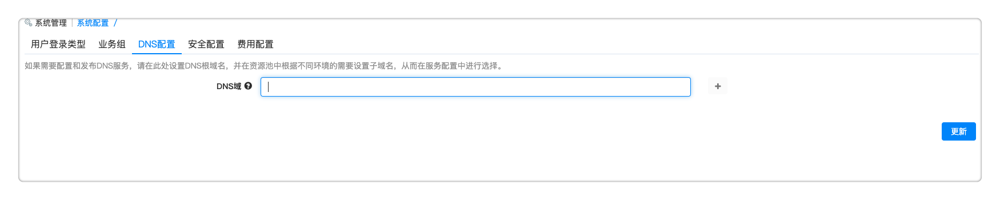
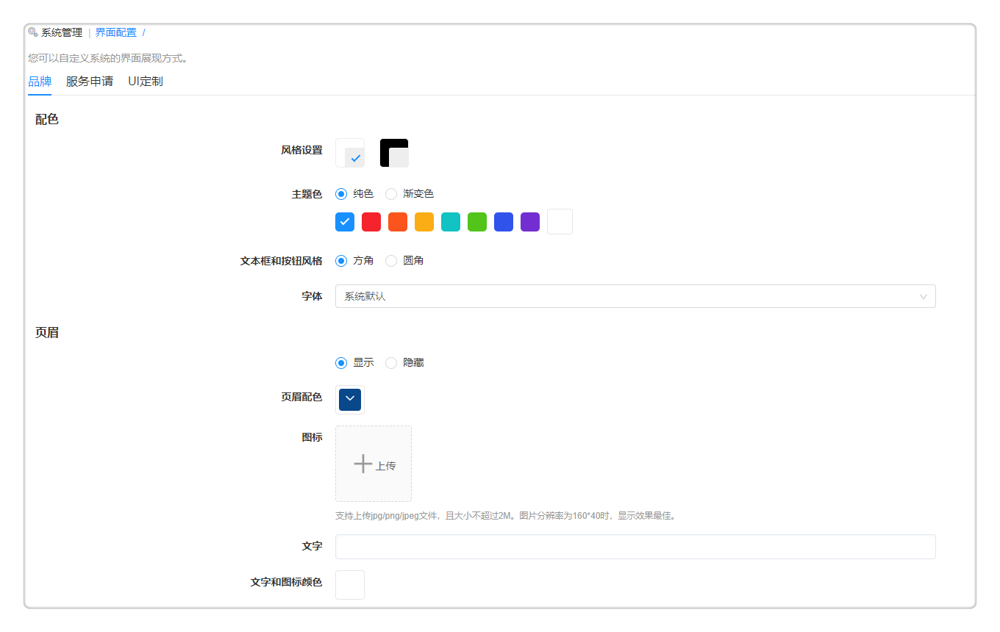
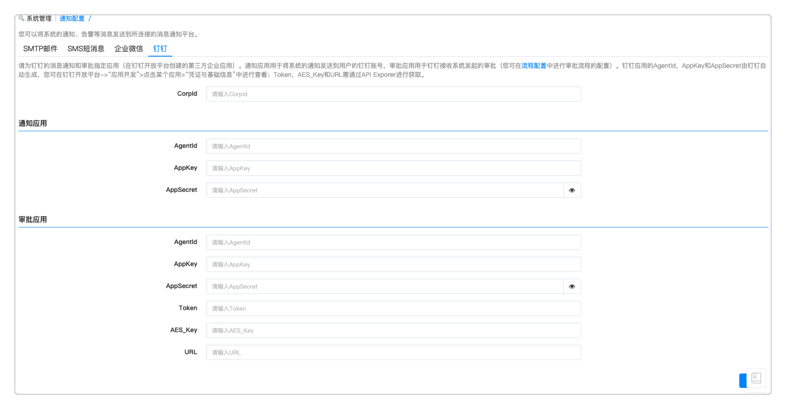

**系统管理**

# 系统配置
　　在左侧菜单栏选择 系统管理 - 系统配置 ，进入概况标签页：

## 用户登录类型
　　目前SaaS版本只允许本地登录，可以直接使用SmartCMP配置的用户名和密码登录。

## 业务组

　　管理员可在当前页面为所有业务组配置默认命名规范模板及授权配置模板，并可勾选是否在将用户加入到子业务组时同时加入到父业务组中。

　　该默认配置可以为空。若配置默认模板，则每个业务组不再需要单独配置。

 -  授权配置模板：可选“允许所有操作”和“允许常规操作”

 -  命名规范：您可以选择云主机和云资源的命名规则，得先在 组织架构管理 - 命名规范 中设置命名规则

## DNS配置
　　如果需要配置和发布DNS服务，可在这里设置DNS根域名，并在资源池中根据不同环境的需要设置子域名，从而在服务配置中进行选择。

+ 管理员可以新增新增一个或多个DNS域（选填）。

>「Note」DNS域名需在DNS服务器上配置，如无，在申请服务时将报错。
  域名由根域名、顶级域、二级、三级等多级域名构成，每级域名由字母、数字和连字符(-)构成(第一个字符不能是连字符)，不区分大小写，长度不超过63个字符。一个完整域名总长度不超过255个字符，必须以点结尾。配置成功后，可在OpenStack资源池中配置二级、三级域名。

## 安全配置{#安全配置}

### 双因素认证概述

　　平台支持对用户的登录和运维操作启用双因素认证，启用双因素认证后，将在原有静态密码验证的基础上新增验证动态信息的认证步骤。平台支持通过短信、邮箱、企业微信及钉钉发送动态认证信息进行双因素认证。

>「Note」双因素验证(Two Factor Authentication)是在用户名和密码之外，额外增加的一层安全认证，用于确保登录和使用云资源的用户身份的安全性。

### 启用双因素认证

　　如需开启双因素认证，请按以下步骤设置：

1. 在 系统管理 - 通知配置 中对接需要发送认证信息的系统，具体配置方法请参考：[通知配置](#通知配置)

2. 在 系统管理 - 系统配置 的安全配置标签页选择双因素认证方式，支持短信验证、邮箱验证、微信验证及钉钉验证。

3. 如需对用户登录开启双因素认证，请进行界面配置，具体配置方法请参考：[界面配置](#界面配置)

4. 如需对用户的运维操作开启双因素认证，请在授权配置中设置对部署操作授权或云资源操作授权启用双因素认证，具体配置方法请参考：[授权配置](#授权配置)

### 双因素认证使用场景

+ 当用户登录开启双因素认证时，在登录界面，用户输入静态密码点击登录后会跳出弹框提示“已启用双因素认证，需要输入验证码进行验证”。用户可通过配置的认证方式获取动态验证码完成双因素认证，如下图所示。

+ 当运维操作开启双因素认证时，以安装软件为例，用户需根据提示点击获取验证码，通过已配置的认证方式完成双因素认证。

## 费用配置

　　管理员可在当前页面设置服务计费的货币单位，支持选择人民币、欧元、美元、日元、英镑等。可勾选是否在服务申请和部署时显示预估费用。

# 界面配置{#界面配置}

　　通过 系统管理 - 界面配置 来确定品牌和服务申请信息包括，配色、页眉页脚、菜单配色、浏览器标签、登录页面、自注册功能、主页、关于页面和是否显示帮助文档，以及调整服务目录的显示方式。

## 配置品牌

　　在配置品牌的品牌标签页中自定义系统的具体步骤：

+ 选择亮色系或暗色系风格，控制左边导航栏区域的配色风格。
   主题色可选择纯色或渐变色，使用调色面板选择设置颜色。当选择渐变色时，高亮显示的菜单和按钮将用渐变颜色显示，而链接和标签将用第二个颜色显示。
   文本框和按钮风格可设置为方角或者圆角。

+ 可选择是否隐藏页眉。当选择不隐藏时，使用调色面板选择页眉配色、文字及图标颜色（分别生效），上传图标、自定义文字内容。

+ 为菜单配置颜色。可使用调色面板分别为菜单、文字和图标配置颜色，配色设置将分别生效。

+ 可选择是否隐藏页脚。当选择不隐藏时，使用调色面板选择页脚配色、文字颜色（分别生效），上传图标、自定义文字内容。

+ 新建用户菜单和页眉页脚颜色将不受其他用户影响。

+ 上传浏览器图标，自定义浏览器标题。

+ 上传登录页面背景图片，定义登录页左边文字，自定义文字样式颜色，文字支持使用Markdown 语法格式。
   选择登录页面是否使用验证码，设置忘记密码的启用与禁用。
   选择登录时是否启用双因素认证。
   >「Note」 开启双因素认证需优先设置对接认证信息系统，具体配置步骤请参考[安全配置](#安全配置)

+ 选择是否隐藏用户自注册功能。当选择不隐藏时，点击下拉框选择已配置好的表单和服务定义自注册时用户需要填写的字段及自注册流程。

+ 上传主页图标并配置主页按钮的跳转链接，支持外部链接或系统内部使用相对路径。

+ 可选择是否隐藏关于页面，当选择不隐藏时，上传图片，定义产品名称和版权声明。

+ 定义是否显示帮助文档，选择隐藏时，导航栏右上角的问号按钮将被隐藏。

##  配置服务申请

　　配置服务申请的具体步骤：目前服务目录支持2种视图。在服务申请标签页，

+ 您可以配置在服务目录中分组与服务的展现方式：标签页展示或层级展示

  具体展现方式：标签页展示：即分组按照标签页展示。层级展示的方式，按照卡片的模式，先展示服务分组，服务分组的具体操作步骤，请参考：[服务分组](https://cloudchef.github.io/doc/AdminDoc/05服务建模/服务分组.html) 在服务目录视图界面，可查看服务分组的图标、名称、描述和文件夹的显示方式，点击一个分组，展现此服务分组的所有卡片。

+ 您可以配置服务申请页面字段显示，其中可配置的字段有：描述、执行时间、键值标签、业务组、项目及所有者。

# 通知配置{#通知配置}

　　管理员可设置对接平台，将系统的通知、告警等消息发送到所连接的消息通知平台。支持SMTP邮箱、SMS短消息、企业微信与钉钉。

　　以下为您详细介绍各平台配置流程：

## SMTP配置

　　进入菜单 系统管理 - 系统配置 ，在SMTP配置标签页，可以配置当前能够访问的SMTP配置。

　　在SMTP配置中可以填入下列信息：

基本信息     |说明
:-----------:|:------------:
使用SSL     | 当前SMTP是否适用了SSL
SMTP服务器  | SMTP服务器地址
端口        | SMTP端口号
用户名      | 用户名
密码        | 密码
发件人      | 默认的邮件发件人

　　配置完成后，可点击验证设置，系统将会根据配置自动发送一封测试邮件到当前账户的邮箱地址，以验证SMTP服务器是否工作。

## SMS配置

　　进入菜单 系统管理 - 系统配置 ，在SMS配置标签页中，可以填入当前能够访问的SMS（短消息）配置。

  基本信息    |说明
  :---:|:---:
  用户名   |   用户名
  密码      |  密码
  SMS服务器 |  SMS服务器地址
  端口     |   SMS端口

## 企业微信配置

　　进入菜单 系统管理 - 系统配置 ，在企业微信配置标签页中，可以配置企业微信的相关信息,为企业微信的消息通知和审批指定应用。通知应用用于将系统的通知发送到用户的企业微信账号，审批应用用于企业微信接收系统发起的审批（可在流程配置中进行审批流程的配置）。

 基本信息 | 说明
  :---:|:--:
 CorpId | 在企业微信管理后台“我的企业”->“企业信息”下查看
 AgentId | 每一个应用的唯一AgentID，请在企业微信管理后台“应用与小程序”->“应用”下查看
 Secret | 每一个应用都有一个独立的访问密钥，请在企业微信管理后台“应用与小程序”->“应用”下查看
 Token  | 调用接口凭证，必须使用审批应用或企业内自建应用的secret获取
 EncodingAESKey | 请在企业微信管理后台“应用与小程序”->“应用”下查看

## 钉钉配置
　　进入菜单 系统管理 - 系统配置 ，在钉钉配置标签页中，可以配置钉钉的相关信息,为钉钉的消息通知和审批指定应用（在钉钉开放平台创建的第三方企业应用）。通知应用用于将系统的通知发送到用户的钉钉账号，审批应用用于钉钉接收系统发起的审批（您可在流程配置中进行审批流程的配置）。

 基本信息 | 说明
  :---:|:---:
 CorpId | 企业在钉钉中的标识，每个企业拥有唯一的CorpId，可登录钉钉开发者后台-“首页”下查看
 AgentId |创建应用时，系统自动生成的AgentId，可用于发送企业会话消息等场景
 AppKey |创建应用时，与应用Key一起同时由系统自动生成
 AppSecret |创建应用时，系统自动分配，是应用开发过程中的唯一性标识
 Token  | 企业后台获取信息时的重要凭据，由Appkey和AppSecret产生。需通过API Exporer进行获取
 AES_Key | 需通过API Exporer进行获取
 URL | 需通过API Exporer进行获取

# 菜单配置

　　当您接入第三方系统或扩展系统（如接入百度、京东、Azure账单、仪表盘）时，菜单配置使接入的菜单能够更加灵活。

　　在菜单配置中您可以定义多种仪表盘，您也可以接入外部系统，并自由灵活的选择扩展菜单，下文为您介绍具体的操作方法。

## 添加菜单配置

　　菜单配置可定义内置菜单访问权限、接入多种仪表盘和多种不同第三方系统，内置菜单、仪表盘和扩展系统将根据定义的权限分配给不同的角色查看，并可根据定义的位置灵活地展现仪表盘和扩展系统。

　　点击 系统管理 - 菜单配置 ，点击添加，在添加菜单配置标签页中，选择菜单配置类型：

+   选择内置菜单访问权限可以设置拥有查看该菜单的角色。在下拉框中选择需要配置的菜单（服务请求、我的部署、报表与分析等）及能够访问此菜单的角色（如项目成员）。设置该菜单配置的状态：启用或禁用此配置。

+   选择Metabase代表接入的是仪表盘，选择外部URL为接入第三方系统。
    输入名称、描述、位置、URL参数、角色（选择能够访问此菜单的角色）、状态（选择启用还是禁用此配置）并上传图标。

　　您可以灵活选择扩展菜单的位置，例如：

1. 添加扩展菜单百度，位置选择

  -   前于系统管理（系统管理是一级菜单），则百度也是一级菜单在系统管理菜单前面

  -   位于系统管理（系统管理是一级菜单），则百度是二级菜单内置在系统管理菜单中

  -   后于系统管理（系统管理是一级菜单），则百度也是一级菜单在系统管理菜单后面

2. 点击提交，菜单配置列表中显示目前添加的所有仪表盘，显示仪表盘名称、描述、ULR来源、URL参数、角色（可查看该仪表盘的角色）、状态、创建时间等。

>「Note」 添加二级菜单时支持将菜单位置存放到有链接的自定义一级菜单下，适应项目需求。

## 编辑、删除菜单配置

　　点击 系统管理 - 菜单配置 ，点击编辑，在编辑菜单配置标签页中，二次编辑扩展菜单信息。

　　点击 系统管理 - 菜单配置 ，点击删除，即可删除扩展菜单。

