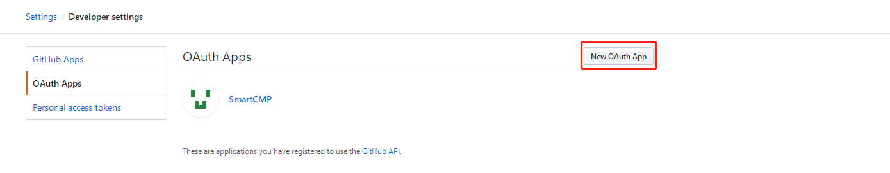
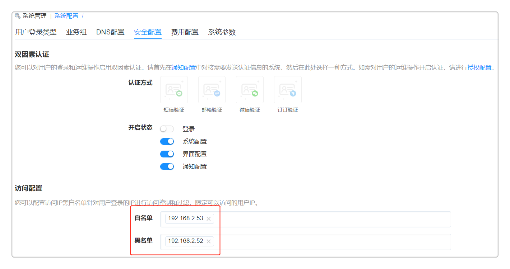
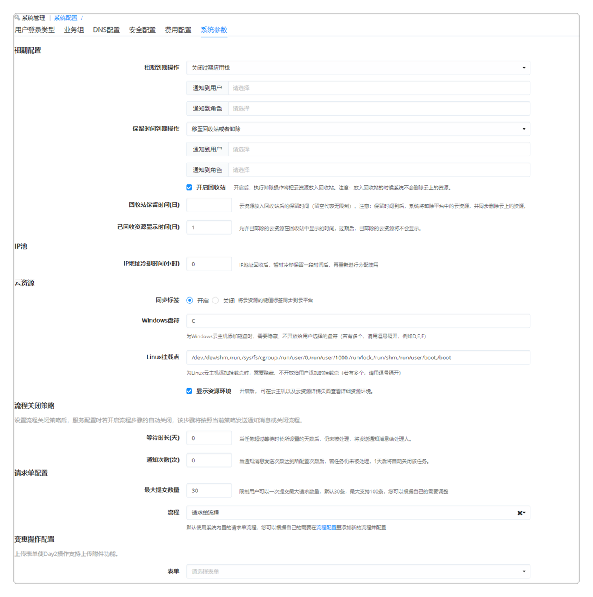
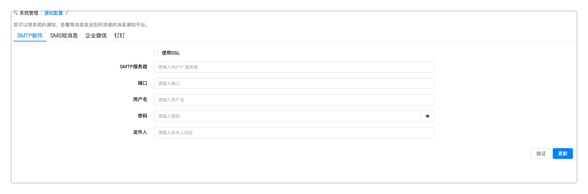

**系统管理**

# 系统配置
在左侧菜单栏选择 系统管理 - 系统配置 ，进入概况标签页：

## 用户登录类型

可配置多种登录方式，包括： 本地登录， 直接使用SmartCMP配置的用户名和密码登录。

### LDAP/Microsoft Active Directory

不论大小企业，无论企业性质，都需要一个集中式的帐号管理系统，员工只需要设置一次帐号密码，就可以方便地使用各个不同的系统。(例如：行政层面的OA系统、邮件系统、会议室预订系统等等。研发团队内部又可能有代码管理、项目进度管理、Bug追踪、依赖管理、Wiki等等。）

当选用经典的LDAP (Lightweight Directory Access Protocol)作为帐号管理服务器，LDAP是一个开放的，中立的，工业标准的应用协议，通过IP协议提供访问控制和维护分布式信息的目录信息。将OA系统、代码服务器、Jenkins等系统接入LDAP，实现“一套帐号，各系统共享”。

LDAP配置中填入：LDAP Connection Name、LDAP URL即LDAP服务器地址、 Base DN、ROOT DN、Password

配置完成之后，在LDAP的登录UI中，输入 LDAP的 uid／password， 进行登录，验证成功之后，可以进入到SmartCMP，但用户在第一次登录后没有任何的权限，管理员给这个User 配置ROLE和BG之后，用户需要重新登录，然后正常进行其它的操作。

### OAuth2

OAuth2 是一个开放授权标准，它允许用户让第三方应用访问该用户在某服务的特定私有资源，但是不提供账号密码信息给第三方应用。例如：用户小明希望通过github账号来登录SmartCMP

下面为您介绍SmartCMP如何使用 OAuth2 登录的具体步骤。

+ 选择登录类型为 OAuth2  进行具体的参数配置，以github为例，获取授权信息：
+ 登陆giuhub，点击个人头像，一次点击 Settings --> Developer Settings --> OAuth，点击 New OAuth App

创建成功后如下：

+ 配置完成后，在浏览器中输入：http：//<服务器域名或地址>端口号/login/oauth2/用户id，将会自动跳转到用户授权页面，输入gitHub用户名和密码，验证通过后直接跳转到SmartCMP平台，以此实现通过github账号来登录SmartCMP的功能需求。

### CAS_SSO

当选择登录方式为 CAS_SSO时，UI界面没有任何配置信息，后台会提前配置，具体配置方法请咨询交付工程师。
用户的访问方式：SmartCMP的每个用户在对接Cas的时候需要使用每个用户定制的登录方式， 例如： 用户 "default"， 那么Cas的登录地址就是 custlogin/cas/default， 在浏览器下输入，http：//192.168.12.34/custlogin/cas/default ， 就是cas的登录方式，后缀“default”，是当前用户的id。在实际常见中，default替换为实际id，ip(192.168.12.34)以实际ip为准

## 业务组

管理员可在当前页面为所有业务组配置默认命名规范模板及授权配置模板，并可勾选是否在将用户加入到子业务组时同时加入到父业务组中。

该默认配置可以为空。若配置默认模板，则每个业务组不再需要单独配置。

 -  授权配置模板：可选“允许所有操作”和“允许常规操作”

 -  命名规范：您可以选择云主机和云资源的命名规则，得先在 组织架构管理 - 命名规范 中设置命名规则

## DNS配置
如果需要配置和发布DNS服务，可在这里设置DNS根域名，并在资源池中根据不同环境的需要设置子域名，从而在服务配置中进行选择。

 + 管理员可以新增一个或多个DNS域（选填）。

>「Note」DNS域名需在DNS服务器上配置，如无，在申请服务时将报错。
  域名由根域名、顶级域、二级、三级等多级域名构成，每级域名由字母、数字和连字符(-)构成(第一个字符不能是连字符)，不区分大小写，长度不超过63个字符。一个完整域名总长度不超过255个字符，必须以点结尾。配置成功后，可在OpenStack资源池中配置二级、三级域名。

## 安全配置{#安全配置}

### 双因素认证概述

平台支持对用户的登录和运维操作启用双因素认证，启用双因素认证后，将在原有静态密码验证的基础上新增验证动态信息的认证步骤。平台支持通过短信、邮箱、企业微信及钉钉发送动态认证信息进行双因素认证。

>「Note」双因素验证(Two Factor Authentication)是在用户名和密码之外，额外增加的一层安全认证，用于确保登录和使用云资源的用户身份的安全性。

### 启用双因素认证

如需开启双因素认证，请按以下步骤设置：

1. 在 系统管理 - 通知配置 中对接需要发送认证信息的系统，具体配置方法请参考：[通知配置](#通知配置)

2. 在 系统管理 - 系统配置 的安全配置标签页选择双因素认证方式，支持短信验证、邮箱验证、微信验证及钉钉验证。

3. 如需对用户登录开启双因素认证，请进行界面配置，具体配置方法请参考：[界面配置](#界面配置)

4. 如需对用户的运维操作开启双因素认证，请在 组织架构 - 授权配置 中设置对部署操作授权或云资源操作授权启用双因素认证，具体配置方法请参考：[授权配置](https://cloudchef.github.io/doc/AdminDoc/04组织架构管理/授权配置.html)

### 双因素认证使用场景

SmartCMP双因素认证包含以下两种使用场景：用户登录及运维操作。

+ 当用户登录开启双因素认证时，在登录界面，用户输入静态密码点击登录后会跳出弹框提示“已启用双因素认证，需要输入验证码进行验证”。用户可通过配置的认证方式获取动态验证码完成双因素认证，如下图所示。

+ 当运维操作开启双因素认证时，以安装软件为例，用户需根据提示点击获取验证码，通过已配置的认证方式完成双因素认证。

### 访问配置

您可以配置访问的IP黑白名单，针对用户登录的IP进行访问控制和过滤，限定可以访问系统的用户IP。
 >「Note」 黑名单的应用优先于白名单。

## 费用配置

管理员可在 系统管理 - 系统配置 - 费用配置 页面设置服务计费的货币单位，支持选择人民币、欧元、美元、日元、英镑等。可勾选是否在服务申请和部署时显示预估费用。

## 系统参数{#系统参数}

管理员可在当前页面配置云资源到期的操作、启用或关闭回收站功能、设置IP地址冷却时间、启用或关闭同步键值标签功能以及设置隐藏不开放给用户选择的盘符。

### 租期配置
管理员可在当前页面配置云资源（包年包月和按需到期之后的机器)到期之后的操作。
  + 租期到期操作：云资源到期之后可配置以下操作
    + 关闭过期应用栈：云主机租期到期之后，进行关机操作
    + 不进行任何操作：如选择不进行任何操作，在保留时间到期操作选项只能选择不进行任何操作。
  + 通知到用户：指定该操作通知的用户
  + 通知到角色：指定该操作通知的角色
  + 保留时间到期操作：云资源在保留时间到期之后可配置以下操作
    + 移至回收站或者卸除：当管理员开启回收站时，云资源自动移动到回收站；当回收站未开启时，该云资源直接被卸除
    + 不进行任何操作：不对云资源做任何操作
  + 开启回收站：管理员可在当前页面启用或关闭回收站功能，开启后执行卸除操作将把云资源放入回收站，放入回收站的时候系统不会删除云上的资源
    + 回收站保留时间：指云资源放入回收站后的保留时间（留空表示无限制），保留时间到期后，系统将卸除平台中的云资源，并同步删除云上的资源。
    + 已回收资源显示时间： 指已卸除的云资源在回收站中显示的时间，过期后，已卸除的云资源将不会显示。

### IP池

管理员可在当前页面设置IP地址冷却时间。IP地址回收后，暂时冷却保留一段时间再重新进行分配使用。

### 云资源

管理员可在当前页面启用或关闭同步键值标签功能。启用后，用户为云资源设置标签时，键值标签将被同步到云平台。

同时，管理员可选择设置隐藏某些盘符，在用户为云主机添加磁盘或挂载点时不开放给用户添加。

支持设置是否显示资源环境，开启后可在云主机云资源详情页面查看详细资源环境信息，有相应权限时支持跳转。

### 流程关闭策略

管理员可在当前页面设置流程关闭策略，当服务配置的流程部署开启自动关闭，对应步骤将按照当前策略向处理人发送通知消息或关闭流程。
  + 等待时长（天）：当任务超过等待时长所设置的天数后，仍未被处理，将发送通知消息给处理人。
  + 通知次数（次）：当通知消息发送次数达到所配置次数后，若任务仍未被处理，1天后将自动关闭该任务。

### 密码配置

管理员可在当前页面设置用户密码的过期时间，实现用户密码的自动过期提醒。用户密码到期后，系统会提示账号已锁定，并要求用户修改密码，方可正常使用。密码过期时间默认为90天，留空则无限制。

### 变更操作配置

支持上传表单使Day2操作支持上传附件功能。

在[表单配置](https://cloudchef.github.io/doc/AdminDoc/05服务建模/表单配置.html)创建上传附件表单后，在变更操作配置中下拉选择已创建的上传附件表单，使应用栈、云主机及云资源的Day2运维操作支持上传附件功能。

>「Note」目前仅支持Day2卸除操作上传附件功能。

# 界面配置{#界面配置}

通过 系统管理 - 界面配置 来确定品牌和服务申请信息包括，配色、页眉页脚、菜单配色和是否显示帮助文档，以及调整服务目录与服务展示的显示方式，服务申请页面字段。

## 配置品牌

在配置品牌的品牌标签页中可完成对界面的设置：

+ 选择亮色系或暗色系风格，控制左边导航栏区域的配色风格。
   主题色可选择纯色或渐变色，使用调色面板选择设置颜色。当选择渐变色时，高亮显示的菜单和按钮将用渐变颜色显示，而链接和标签将用第二个颜色显示。
   文本框和按钮风格可设置为方角或者圆角。

+ 可选择是否隐藏页眉。当选择不隐藏时，使用调色面板选择页眉配色、文字及图标颜色（分别生效），上传图标、自定义文字内容。

+ 为菜单配置颜色。可使用调色面板分别为菜单、文字和图标配置颜色，配色设置将分别生效。

+ 可选择是否隐藏页脚。当选择不隐藏时，使用调色面板选择页脚配色、文字颜色（分别生效），上传图标、自定义文字内容。
  >「Note」新建用户菜单和页眉页脚颜色将不受其他用户影响。

+ 上传图标设置浏览器标签及标题。

+ 自定义登录页面：
  - 上传登录页面背景图，自定义文字及颜色
  - 设置开启登录验证码、用户登录双因素认证及忘记密码功能。
  - 如您开启忘记密码功能，请选择邮箱或者手机号码的验证方式重置密码。

+ 关于页面自定义：设置是否开启关于页面展示，开启后用户点击右上角！可弹出关于页面。关于页面将展示Logo、产品名称及版权声明等。

+ 定义是否显示帮助文档，选择隐藏时，导航栏右上角的问号按钮将被隐藏。

##  配置服务申请

配置服务申请的具体步骤：目前服务目录支持2种视图。在服务申请标签页，

+ 您可以配置在服务目录中分组与服务的展现方式：标签页展示或层级展示
  
  - 标签页展示：即分组按照标签页展示。
  
  - 层级展示：按照卡片的模式，先展示服务分组，服务分组的具体操作步骤，请参考：[服务分组](https://cloudchef.github.io/doc/AdminDoc/05服务建模/服务分组.html)。在服务目录视图界面，可查看服务分组的图标、名称、描述和文件夹的显示方式，点击一个分组，展现此服务分组的所有卡片。

+ 您可以配置服务申请页面字段显示，其中可配置的字段有：业务组、项目、所有者、描述、执行时间、键值标签及云资源标签。可根据需求设置是否要求必填。

# 通知配置{#通知配置}

管理员可设置对接平台，将系统的通知、告警等消息发送到所连接的消息通知平台。支持SMTP邮件、SMS短消息、企业微信与钉钉。

以下为您详细介绍各平台配置流程：

## SMTP邮件配置

进入菜单 系统管理 - 通知配置 ，在SMTP配置标签页，可以配置当前能够访问的SMTP配置。

在SMTP配置中可以填入下列信息：

 基本信息     |说明
 :-----------:|:------------:
 使用SSL     | 是一种保证私密性的安全协议，如勾选，则保证客户/服务器应用之间的通信不被攻击者窃听，并始终对服务器进行认证
 SMTP服务器  | 请输入SMTP服务器地址
 端口        | SMTP端口号
 用户名      | 请输入邮箱的用户名
 密码        | 请输入邮箱的密码
 发件人      | 请输入邮件发件人地址

配置完成后，可点击验证设置，系统将会根据配置自动发送一封测试邮件到当前账户的邮箱地址，以验证SMTP服务器是否工作。

## SMS短消息

进入菜单 系统管理 - 通知配置 ，在SMS配置标签页中，可以填入当前能够访问的SMS（短消息）配置。短消息类型分为阿里云短信服务和短信服务

在阿里云短信服务中，可以填入下列信息：

  基本信息    |说明
  :---:|:---:
  访问密钥ID   | 请输入阿里云访问密钥ID
  密码      |  请输入阿里云访问密钥密码
  短信签名 |  请输入短信签名
  模板代码     |  根据业务需求选择合适的通知模板

在短信服务中，可以填入下列信息：

  基本信息    |说明
  :---:|:---:
  用户名   |   请输入SMS用户名
  密码      |  请输入SMS密码
  SMS服务器 |  SMS服务器地址
  端口     |   SMS端口

## 企业微信配置

进入菜单 系统管理 - 通知配置 ，在企业微信配置标签页中，可以配置企业微信的相关信息,为企业微信的消息通知和审批指定应用。通知应用用于将系统的通知发送到用户的企业微信账号，审批应用用于企业微信接收系统发起的审批（可在流程配置中进行审批流程的配置）。

 基本信息 | 说明
  :---:|:--:
 CorpId | 在企业微信管理后台“我的企业”->“企业信息”下查看
 AgentId | 每一个应用的唯一AgentID，请在企业微信管理后台“应用与小程序”->“应用”下查看
 Secret | 每一个应用都有一个独立的访问密钥，请在企业微信管理后台“应用与小程序”->“应用”下查看
 Token  | 调用接口凭证，必须使用审批应用或企业内自建应用的secret获取
 EncodingAESKey | 请在企业微信管理后台“应用与小程序”->“应用”下查看

## 钉钉配置
进入菜单 系统管理 - 通知配置 ，在钉钉配置标签页中，可以配置钉钉的相关信息,为钉钉的消息通知和审批指定应用（在钉钉开放平台创建的第三方企业应用）。通知应用用于将系统的通知发送到用户的钉钉账号，审批应用用于钉钉接收系统发起的审批（您可在流程配置中进行审批流程的配置）。

 基本信息 | 说明
  :---:|:---:
 CorpId | 企业在钉钉中的标识，每个企业拥有唯一的CorpId，可登录钉钉开发者后台-“首页”下查看
 AgentId |创建应用时，系统自动生成的AgentId，可用于发送企业会话消息等场景
 AppKey |创建应用时，与应用Key一起同时由系统自动生成
 AppSecret |创建应用时，系统自动分配，是应用开发过程中的唯一性标识
 Token  | 企业后台获取信息时的重要凭据，由Appkey和AppSecret产生。需通过API Exporer进行获取
 AES_Key | 需通过API Exporer进行获取
 URL | 需通过API Exporer进行获取

# 菜单配置

当您接入第三方系统或扩展系统（如接入百度、京东、Azure账单）时，菜单配置使接入的菜单能够更加灵活。

在菜单配置中，您也可以接入外部系统，并自由灵活的选择扩展菜单，下文为您介绍具体的操作方法。

## 添加菜单配置

菜单配置可定义内置菜单访问权限、接入多种不同第三方系统，内置菜单和扩展系统将根据定义的权限分配给不同的角色查看，并可根据定义的位置灵活地展现扩展系统。

点击 系统管理 - 菜单配置 ，点击添加，在添加菜单配置标签页中，选择菜单配置类型：

+   内置菜单访问权限：可以设置拥有查看该菜单的角色。在下拉框中选择需要配置的菜单（例如：服务请求、我的资源、报表与分析等）及能够访问此菜单的角色（如项目成员等）。设置该菜单配置的状态：启用或禁用此配置。

+   选择外部链接：选择可接入第三方系统。
    输入名称、描述、位置、URL参数、角色（选择能够访问此菜单的角色）、状态（选择启用还是禁用此配置）并上传图标。

您可以灵活选择扩展菜单的位置，当添加第三方系统页面时，可选择如下位置：

   -   前于系统管理（系统管理是一级菜单），则第三方系统也是一级菜单在系统管理菜单前面

   -   位于系统管理（系统管理是一级菜单），则第三方系统是二级菜单内置在系统管理菜单中

   -   后于系统管理（系统管理是一级菜单），则第三方系统也是一级菜单在系统管理菜单后面

点击保存，菜单配置列表中显示目前添加的所有内置菜单或外部链接名称、描述、URL参数、角色、状态、创建者、创建时间等。

>「Note」 添加二级菜单时支持将菜单位置存放到有链接的自定义一级菜单下，适应项目需求。

## 编辑、删除菜单配置

点击 系统管理 - 菜单配置 ，选中扩展菜单名称，点击编辑，在编辑菜单配置标签页中，二次编辑扩展菜单信息。

点击 系统管理 - 菜单配置 ，选中扩展菜单名称，点击删除，即可删除扩展菜单。

# 数据字典

平台支持数据字典功能，数据字典的名称与值集可作为服务与流程配置的字段来源。系统内置以下数据字典：服务类型、紧急程度、影响程度、优先级、工单关联关系以及合规性策略分组，内置的数据字典不支持修改名称、主键与序号，您可以选择启用或禁用部分值集、或新增自定义值集以修改上述配置中的字段。

您可根据以下步骤修改内置数据字典的值集（以“优先级”为例）：
+ 点击 系统管理 - 数据字典，选择内置的数据字典名称，如：优先级。
+ 在概况标签页，内置数据字典的名称、主键、描述与序号不支持修改。
+ 点击值集标签页，该页面展示了当前数据字典内已预设的值集，如：低、中、高、特高。内置的值集无法编辑。
+ 对任意一个值集选择启用/禁用（或者勾选多个值集批量操作）。
+ 点击添加按钮，输入自定义值集的名称、主键、描述后，也支持选择值集的父级并自定义字体颜色和排列序号，数值小的序号靠前显示。请选择是否启用该值集，并点击保存。自定义值集添加成功。
   >「Note」 父级仅支持选择同一数据字典内的值集，不支持跨字典选择。

若在数据字典中禁用部分值集，则在服务配置、流程定义等处相应字段将被禁用无法选择。例如：禁用“优先级”中的值集“特高”，则在服务等级协议中优先级设置仅可选择“低、中、高”或其他已启用的自定义值集。

# 操作审计

SmartCMP支持对用户访问、操作信息的记录，平台管理员默认有该权限，若需要为其他角色增加该权限，请新增角色并添加该权限，详见[角色](https://cloudchef.github.io/doc/AdminDoc/04组织架构管理/角色.html)

点击左侧导航栏的 系统管理 - 操作审计 ，可查看每个用户在系统内的登录和操作信息。该页面显示操作者、操作对象、操作名称、操作参数、状态以及操作时间。

平台记录的操作信息包括以下几类：
 - 用户通过堡垒机远程登录访问虚拟机后的所有操作记录。
 - 用户登录失败的相关信息，记录登录失败的原因，包括密码错误、密码过期、账户锁定等。
 - 堡垒机命令过滤的相关操作记录，包括新建、修改、删除过滤命令等。
 - 角色的相关操作，包括增加、删除、修改角色属性等。

您可以通过高级搜索功能进行快速筛选定位，支持操作者、状态、操作对象、起止时间的筛选，也可以使用普通搜索功能。