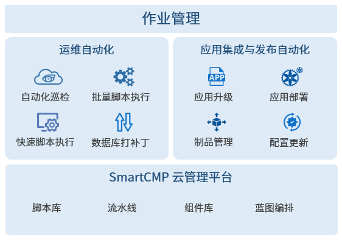

**作业管理**

# 功能描述

平台运用流程化、自动化的理念将零碎的单个任务组装成一个自动化的流水线作业，并且每个任务都可灵活地定制，每个阶段/任务可以做为一个原子节点，提供给不同的项目和系统调度，结合权限管控和详细的结构展示，满足用户复杂多样的业务使用场景。

同时，作业管理功能是平台整合自动化流水线和脚本库的功能而成。除了快速脚本执行、批量执行运维脚本、构建软件包、定时任务等一系列可实现的基础运维场景以外。通过定制阶段和任务，将一个操作流程制作成完整的流水线，提供丰富的任务类型来支持复杂的运维操作场景，例如：服务部署+运维一体化流程式管理；制品库解析+应用自助更新；数据库SQL自动化运维等。

# 使用场景

 + 自动化运维的场景：运维人员可针对任意云资源进行快速脚本执行或批量脚本执行。例如：对海量的云主机或数据库批量做巡检。特色：
   + 脚本库统一管理适应于多种场景的脚本；
   + 脚本能针对多云资源与应用软件统一使用；
   + 脚本是否共享给其他人使用，以及脚本具体的参数内容，都可以按需选择；
   + 在流水线作业中，脚本能与任务关联，以灵活组装和配置自动化运维的流水线作业。

 + DevOps的场景：开发测试人员持续集成已发布，通过定制的流水线中的阶段和任务，实现从代码的提交，到构建、打包、制品库解析、部署或者更新最新的环境，升级应用的全程自动化。特色：
   + 不仅仅支持在容器环境下，还支持传统应用、虚拟化、公有云等环境下实现持续集成与发布；
   + 流水线作业与组件、蓝图协调工作，更好地管理复杂应用；
   + 强调对异构资源的统一管理，体现云管理平台流水线作业功能强大、高效、易用的特色。

