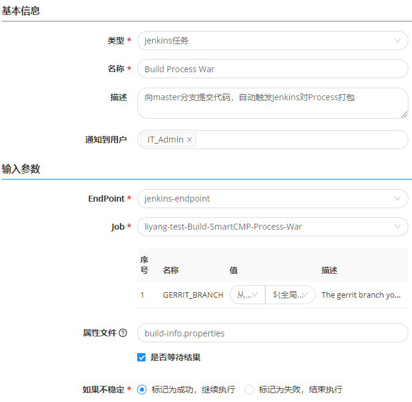

**入口**
# 功能描述

　　入口可以添加需要连接的持续集成系统，例如Jenkins。Jenkins是一个开源的、提供友好操作界面的持续集成(CI)工具，主要用于持续、自动的构建/测试软件项目。Jenkins通常与版本管理工具、构建工具结合使用，常用的版本控制工具有SVN、Git，构建工具有Maven、Ant、Gradle。

　　平台广泛集成包括Jenkins、Git、Maven等DevOps工具链，帮助用户高效地构建代码，运行测试（CI），部署和更新应用程序的新版本（CD），致力于打造虚拟化、容器、多云等环境下，适应复杂业务场景的应用持续集成与交付。

# 添加Jenkins入口的步骤{#添加Jenkins入口的步骤}

　　具体步骤：

　1.在左侧导航栏点击 作业管理 - 入口 ；

　2.点击添加Jekins入口；

　3.输入所需参数(请根据自己的真实环境输入相关参数，示例只给出参考)；

|参数名称 |描述 |示例|
|:------:|:------:|:-----:|
|名称|指定Jenkins服务在平台上的名称|Jenkins|
|描述|描述Jenkins的信息|用于代码构建XXX|
|地址| Jenkins地址 |192.168.xx.xx|                        
|类型|访问Jenkins的认证方式，密码或令牌 |选择密码|
|用户名|访问Jenkins的用户名|xxx@xxx.com|
|密码|访问Jenkins的密码|xxxxxxxx|

　4.点击验证，验证连接Jenkins服务。若输入参数错误，则提示配置错误；若配置正确，则提示验证连接成；

　5.验证成功后点击保存，Jenkins连接成功。
 >「Note」  先决条件： 确认Jekins服务器可用并已配置。

# 入口与jenkins任务关联
　　以软件包构建和升级的使用场景为例。用户向master分支提交代码后，自动同步最新的代码并自动触发jenkins对Process进行打包，打包完成后，将软件包传送到制品仓库进行存放，再通过制品库解析任务取得新包的地址，对现有的服务进行升级。
具体步骤：
1. 在左侧导航栏点击 作业管理 -流水线作业 ；
2. 添加任务阶段；
3. 添加串行任务；
4. 选择任务类型为Jenkins，输入串行任务名称，在输入参数中关联已配置成功的Jenkins入口名称和所要执行的Job；
 
5. 保存任务；
6. 在向master分支提交代码后，自动同步最新的代码并自动执行该流水线任务。您可以在执行历史中查看执行记录，具体步骤，请参考[执行历史](https://cloudchef.github.io/doc/AdminDoc/11作业管理/执行历史.html)。
