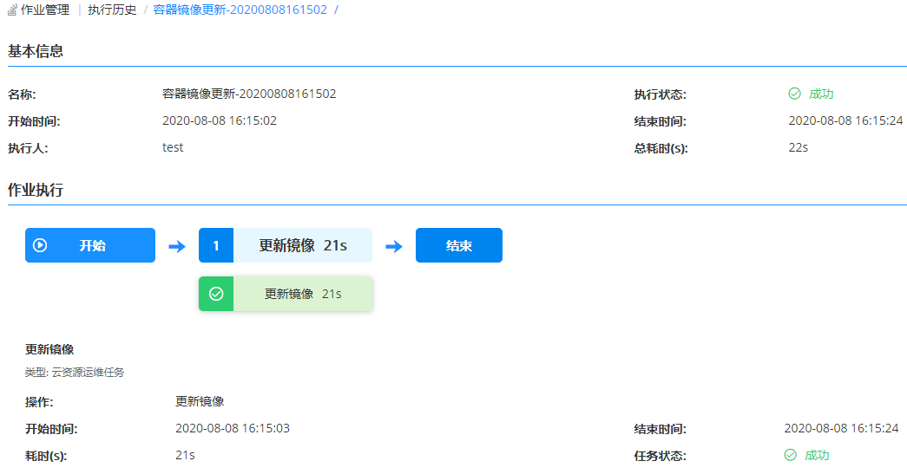

**执行历史**

# 功能描述
所有类型的运维操作脚本执行、快速脚本执行、流水线作业执行，并且不论是立即执行还是定时执行均有历史记录，记录着详细的信息，方便事后核查和审计。

通过执行历史的详情可以了解该作业的基本信息、全局变量、执行结果的状态，目标机器和执行的结果日志。

对所有在平台执行过的脚本、流水线作业等操作进行记录，点击每个历史，能够看到该任务的具体基本信息，可以看到该任务完整的执行结果和执行日志。

在执行历史中将显示任务执行状态，如果任务执行成功显示为绿色，失败则为红色。

# 查看执行历史

您可根据以下步骤查看执行历史：

1. 在左侧导航栏点击 作业管理 - 执行历史 ，可根据筛选条件（项目、状态、起止时间）快速定位流水线。
2. 以查看更新容器镜像流水线的执行历史为例，了解该流水线执行的基本信息，通过作业执行历史可以查看任务的编排情况，通过颜色快速了解当前任务的执行状态。

 

3. 在执行详情中，查看执行了该脚本的目标容器资源，执行的结果日志详细信息，如果执行失败，通过日志可以快速定位执行失败的原因，以解决问题。
 
 [执行历史](../../picture/Admin/执行历史02.png)
