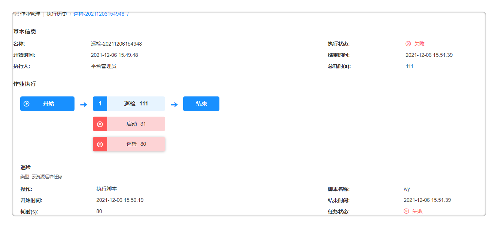
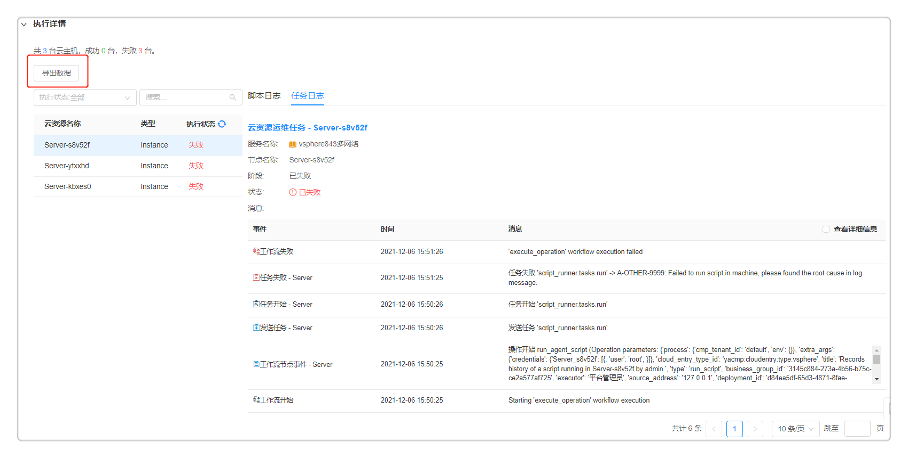

**执行历史**

# 功能描述
所有类型的运维操作脚本执行、快速脚本执行、流水线作业执行，并且不论是立即执行还是定时执行均有历史记录，记录着详细的信息，方便事后核查和审计。

通过执行历史的详情可以了解该作业的基本信息、全局变量、执行结果的状态，目标机器和执行的结果日志。

对所有在平台执行过的脚本、流水线作业等操作进行记录，点击每个历史，能够看到该任务的具体基本信息，可以看到该任务完整的执行结果和执行日志。

在执行历史中将显示任务执行状态，如果任务执行成功显示为绿色，失败则为红色。

# 查看执行历史

您可根据以下步骤查看执行历史：

1. 在左侧导航栏点击 作业管理 - 执行历史 ，可根据筛选条件（项目、状态、起止时间）快速定位流水线。

2. 以查看巡检流水线的执行历史为例，了解该流水线执行的基本信息，通过作业执行历史可以查看任务的编排情况，通过颜色快速了解当前任务的执行状态。

 

3. 在执行详情中，可查看执行脚本的操作信息（包括输入参数和输出信息），执行任务的日志详细信息。如果执行失败，通过日志可以快速定位执行失败的原因，以解决问题。

4. 点击导出数据的按钮，可把脚本日志和任务日志导出至本地，方便搜索查看任务执行的详细信息。
   
 

3. 在执行详情中，查看执行了该脚本的目标容器资源，执行的结果日志详细信息，如果执行失败，通过日志可以快速定位执行失败的原因，以解决问题。
 
 [执行历史](../../picture/Admin/执行历史02.png)

# 取消、重新执行流水线

在 作业管理 - 执行历史 ，用户可以对状态为“执行中”的流水线进行取消执行的操作：在流水线执行历史列表勾选需要取消的流水线作业并点击取消，或者点击流水线名称进入流水线执行历史页面进行取消操作。

在 在 作业管理 - 执行历史 ，用户可以对状态为“成功”或“失败”的流水线进行重新执行的操作：在流水线执行历史列表勾选需要重新执行的流水线作业并点击重新执行，或者点击流水线名称进入流水线执行历史页面进行重新执行操作。用户在提交重新执行流水线操作前可以查看该流水线的输入参数并根据需要修改参数重新执行。

在 作业管理 - 执行历史 ，用户可以对状态为“挂起”流水线进行继续执行的操作：在流水线执行历史列表勾选需要继续执行的流水线作业并点击继续执行，或者点击流水线名称进入流水线执行历史页面进行继续执行操作，您可以选择是否跳过当前挂起的失败节点继续执行后续的流水线任务。
