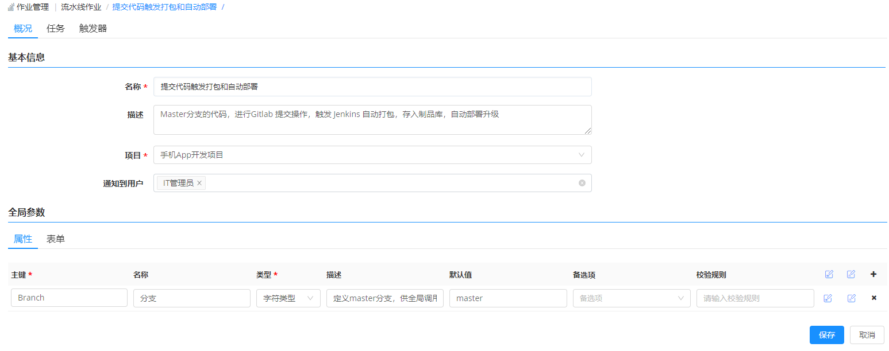
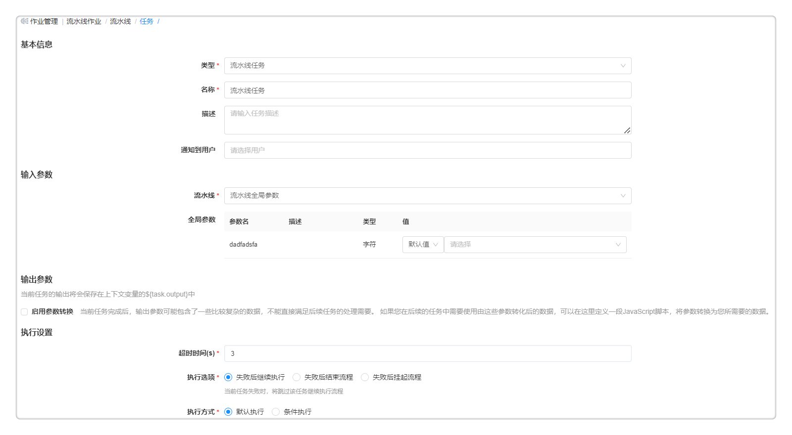

**流水线作业**

# 功能描述

为了能够提高企业高速交付应用程序和服务的能力，平台在流水线作业中集成了DevOps工具链，使用时通过脚本、组件、蓝图和可视化的流程编排来实现包括虚机在内的多种资源和服务的持续集成/持续交付。

帮助企业在以下场景中提高自动化的能力：
- 构建应用；
- 运行测试；
- 巡检机器；
- 迭代产品。

流水线由一系列阶段构成，每个阶段由软件在发布到生产之前必须完成的多个任务和环境组成。目前支持多种阶段和任务的自定义和组装，能够在阶段中添加任意数量的执行任务，通过它们已经可以设计出各种场景适用的开发、部署、运维流水线。帮助用户建设自动化的、可重复利用、安全合规的应用持续交付和部署。实现应用的测试、部署、更新、运维、回收的的全生命周期管理。

# 流水线的组成部分

流水线由以下几部分组成：

+ 阶段：指根据业务的需要，定义不同的阶段，在每个阶段中定义需要完成的任务。例如，可定义软件打包、部署测试环境等不同的阶段。

+ 任务：具体执行的活动。支持自定义任务类型、输入输出参数，其中输入输出参数指云平台支持流水线各个任务之间传递的参数，例如将上一个任务新部署的虚拟机ID传给下一个任务进行调用。流水线的发布者可以定义每个任务的资源和参数，在后续的任务中进行调用。其中， 每个阶段的任务类型包括：
    + 等待任务，定义间隔时间，在执行时等待。在输入参数处填写等待时间（s）。
    + 蓝图部署任务，在作业执行时部署新的云资源，在输入参数处填写服务（服务目录中发布的服务）和模板。
    + Jenkins任务，执行Jenkins上已有的Job，配置Jenkins的端点和Job，自定义构建软件包。
    + 选择云资源运维任务，对指定的云资源执行运维操作，例如启停、快速执行脚本、添加白名单等。
    + 制品库解析任务，解析二进制制品库中的软件制品包版本。
    + 更新资源池网络资源任务，自动将创建的专有网络、交换机和安全组添加到您请求这些资源时选择的自愿中。

+ 触发器: 自定义流水线的触发条件，触发器定义何时自动运行流水线，可以手动触发流水线任务，也可以设定策略由触发器自动触发流水线任务。触发器类型包括：Webhook集成(支持Git，Gitlab等代码仓库改变触发)、Jenkins触发、定时触发、手工触发等等。

+ 执行历史: 展示当前流水线作业执行记录，点击每个历史，能够看到该任务的具体基本信息，可以看到该任务完整的执行结果和执行日志。

# 流水线详细的配置步骤

以“自动构建+制品库解析+应用升级”场景为例：开发人员提交代码，触发Jenkins自动化构建，上传最新的War包到制品仓库存储最新的镜像包，再通过制品库解析任务获取最新应用包的仓库地址，最终自动化更新环境下的镜像包。

## 创建流水线

您可根据以下步骤创建流水线：

1. 在左侧导航栏点击 作业管理 - 流水线作业 ，点击创建流水线;
2. 在概况标签页输入名称、描述、绑定一个项目（该项目的成员可以申请执行流水线）、通知到用户(流水线开始执行，结束执行时会发送通知给指定用户，前提是管理员在系统管理-通知配置界面，已对接完成消息通知平台，配置细节请参考，[通知配置](https://cloudchef.github.io/doc/AdminDoc/09系统管理/#通知配置));
3. 可添加全局参数，在后期任务中进行调用。在概况标签页，属性列表中，点击加号按钮，主键填写“Branch”，默认值填写“maste”。
    

## 配置阶段
创建完成流水线作业，添加完成基本信息之后，进行流水线作业的阶段配置：
1. 在左侧导航栏点击 作业管理 - 流水线作业 - 流程 ，点击添加按钮；
2. 输入阶段名称，例如，Jenkins构建，解析软件包，更新应用环境等阶段。
    

## 配置任务{#配置任务}

### 添加Jenkins任务
首先你需要创建Jenkins构建阶段，点击添加串行任务按钮，配置Jenkins任务详情：
1. 类型选择Jenkins任务，填写基本信息；
2. 在输入参数处选择仓库入口（选择在入口处添加提前配置的Jekins仓库，具体配置步骤，请参考 [添加Jenkins入口的步骤](https://cloudchef.github.io/doc/AdminDoc/11作业管理/#添加Jenkins入口的步骤) ），选择在Jenkins上已有的Job（这些Job任务，由这个Jenkins账号所有者，在Jenkins后台按需创建完成。）

        
3. 输入在Jenkins配置的属性文件名称，文件内容会写入任务完成后输出的结果中；
4. 勾选选择等待结果，指当前Jenkins任务输出结果完成之后，再进行下一阶段，不勾选，则即使输出结果不成功，也不会影响任务执行；
5. 执行设置内填写超时时间（例如：设置超时时间为360s，该任务执行时间超过360s代表任务执行失败）。执行选项（选择失败后继续执行表示当前任务失败继续执行下一个任务，或选择失败后结束流程表示当前任务失败结束该流水线流程，流水线执行失败）。 执行方式（选择默认执行，或选择条件执行时需要设置条件执行表达式），例如：您可以输入EL表达式，可参考下图：

    

### 添加制品库解析任务
在Jenkins任务执行完成之后，将构建的新镜像保存到Harbor中，并通过制品库解析任务，获取最新版本镜像，用新镜像更新应用环境。其中，需要创建制品库解析任务，解析Harbor制品库中的软件制品包的地址，以获取最新的镜像包升级应用环境。在制品库解析任务添加详情界面：
1. 任务类型选择制品库解析任务；
2. 输入参数：选择制品库入口，注意，入口需要提前配置，具体配置步骤，请参考 [添加制品库](https://cloudchef.github.io/doc/AdminDoc/06云服务管理/制品库.html) ，仓库支持在任务执行时选择：不指定仓库，任务执行过程中灵活选择；从上下文中获取：依赖于上下文的仓库参数，需要填写获取的表达式 ；默认值：如果是对接Harbor制品仓库，选择一个制品库入口，会默认填入其余的相关参数；
3. 制品库解析输出参数，包括制品库入口、制品所在主机地址、制品所在仓库、制品所在组、制品的名称、制品的版本和制品下载地址。

### 添加蓝图部署任务
选择蓝图部署任务，在作业执行时部署新的云服务：
1. 任务类型选择蓝图部署任务。
2. 选择所要部署的服务
3. 点击编辑按钮，进入服务编辑页面，对服务的参数进行调整
4. 点击保存并返回创建任务
5. 蓝图部署输出参数包括：所有部署ID、部署成功后所有云资源ID、部署成功后所有云主机ID和部署下的所有云资源。
   

### 添加等待任务
等待任务，定义间隔时间，在执行时等待。

在输入参数处填写等待时间（s），例如：在等待10s之后，流水线再自动执行运维脚本。

### 添加人工确认任务

人工确认任务，对流水线等待任务进行人工干预，确认继续执行或者关闭任务。

输入人工确认任务的名称（如继续执行、关闭任务），填写任务描述，选择通知到的用户并保存。

### 添加云资源运维任务
选择云资源运维任务，对云资源执行运维操作，例如对云主机批量启停、执行运维脚本并查看结果，具体步骤：
1. 任务类型选择云资源运维任务；
2. 在树形结构中，选择云资源类型 Resource-IaaS-Machine,则指定运维操作脚本将应用于IaaS分组下多个类型的云主机；
3. 选择方式，选择已有云资源，则 可选择的云资源来源于平台已纳管的云资源（云资源具体查看步骤：点击左侧导航栏 我的资源 - 云资源 ，选择云资源类型，可查看已纳管的IaaS分组下的Machine）；
4. 还可以从上下文中选择，云资源运维任务依赖于此任务之前的蓝图部署任务， 支持在云资源的下拉框中选择全局参数或上下文的传参，例如，下图中，之前任务的输出参数，选择vSphere Server下的machineids，选中部署成功的所有vSphere云主机的ID；
  
5. 您可以选择不同的Day2 操作，包括启动，停止，重启，卸除等，目前变更操作只支持合规性策略和费用优化配置，您也可以在操作详情中关联配置的脚本，脚本的配置步骤，请参考[添加脚本](https://cloudchef.github.io/doc/AdminDoc/11作业关联/脚本库.html)；
6. 输出参数中可以了解当前云资源运维任务下执行的云资源ID，所有成功执行完成本任务的云资源ID，所有执行本任务失败的云资源ID。

### 添加流水线任务
您可以定义一个可以启动流水线的任务，任务执行后将立即启动指定的流水线。具体步骤如下：
1.  任务类型选择流水线任务
2.  选择启动该流水线任务时通知的用户
3.  选择一条可配置的流水线任务，具体配置步骤可参考[配置流水线](https://cloudchef.github.io/doc/AdminDoc/11作业关联/流水线作业.html/#流水线详细的配置步骤)；
4.  输入参数配置：
   - 全局参数: 当您在 作业管理 - 流水线作业 中为可配置的流水线任务设置了全局参数，可在此处通过设置全局参数完成个性化配置，您可以选择以下两种配置方式：
     -  选择默认值设置参数值
     -  从上下文获取参数值
5.  设置流水线执行的配置：
   - 超时时间：设置流水线任务失败后超时的时间，在超过设置的时间后，会触发设置的执行任务
   - 执行选项: 可选择任务失败后继续执行该条流水线任务或者在任务失败后直接结束流程
   - 执行方式：可选择默认执行或者条件执行，如选择条件执行，请输入触发任务执行的条件

## 配置触发器

自定义流水线的触发条件，触发器定义何时自动运行流水线，可以手动触发流水线任务，也可以设定策略由触发器自动触发流水线任务。SmartCMP触发器类型包括：Webhook集成(支持Git，Gitlab等代码仓库改变触发)、Jenkins触发、定时触发、手工触发(即手动执行流水线作业时触发)等等。

### 添加定时触发器
添加定时触发器的具体步骤：
1. 输入触发器名称填写定时触发器、类型选择CRON、描述(选填) 。
2. 配置CRON的详细参数，选择重复的类型（自定义cron表达式 例如：0 0 0 * * ？、每周某天的某个时段、每月某天的某个时段、每天的某个时段）。
3. 点击保存即可配置完成触发器。例如：每天/每周/每月的10点10分执行生成快照的操作。

### 添加Jenkins触发器
添加Jenkins触发器的具体步骤：
1. 输入触发器名称填写定时触发器、类型选择JENKINS、描述(选填) 。
2. 在输入参数处选择仓库入口（选择在入口处添加提前配置的Jekins仓库，具体配置步骤，请参考 [添加Jenkins入口的步骤](https://cloudchef.github.io/doc/AdminDoc/11作业管理/#添加Jenkins入口的步骤)；
3. 选择在Jenkins上已有的Job（这些Job任务，由这个Jenkins账号所有者，在Jenkins后台按需创建完成）。

4. 点击保存即可配置完成触发器。

### 添加Webhook触发器
添加配置一个Webhook类型的触发器，具体步骤：
1. 输入触发器名称、类型选择WEBHOOK、描述(选填)，WEBHOOK详细参数配置如下图；

2. 以Gitlab为例，在流水线详情中添加一个webhook类型的触发器。在来源中自定义字段，例如：下图填写的gitlab-test，gitlab-test会自动拼接到URL后面，形成完整的网址链接。注意：http：//SmartCMP地址/ops-listener/webhook/gitlab-test，在Gitlab中配置时要用到；
4. 添加过滤条件，过滤条件的作用相当于密码验证。当管理员不配置过滤条件时，只要调用这个URL：http：//SmartCMP地址/ops-listener/webhook/Gitlab-test，就会触发流水线操作。添加过滤条件后，相当于给"webhook trigger"添加了密码；
5. 当回调URL时，只有密码匹配成功才能触发流水线操作。如果只支持Gitlab，Gitlee和Git，过滤条件只需要设置密码就可以生效，采用键值对的方式是为了兼容更多的场景。所以添加过滤条件时，如果回调方是Gitlab，Gitlee和Git，“名称”要固定写token，“值”支持自定义（输入password）。配置完毕后依次保存；
 

6. 如果Gitlab是新申请的环境配置，要调整下network配置，允许请求从本地回调。
具体步骤：配置webhook时，首先创建一个project，进入project详情，依次点开Setting–Integrations，在URL中输入WEBHOOK参数配置中提前设置的URL地址:http：//SmartCMP地址/ops-listener/webhook/gitlab-test ，在Secret Token中输入"条件过滤" 中配置的token对应的值(自定义的值password)，注意，不要勾选Enable SSL verification去掉，选择Add Webhook。
 