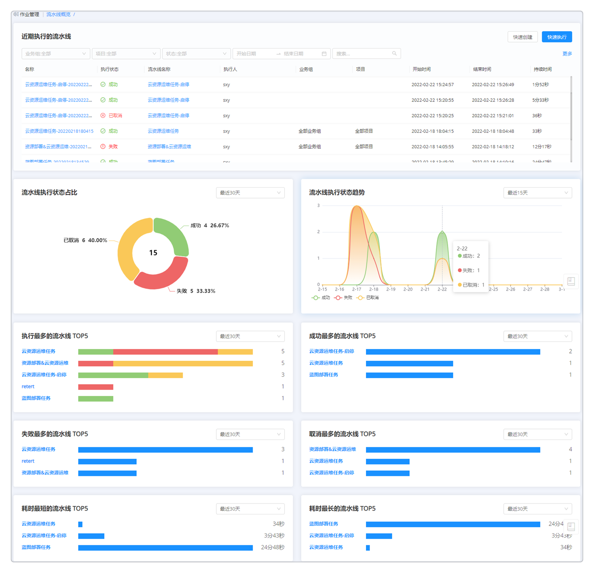

**流水线概览**

流水线概览菜单展示当前用户有权限查看的所有流水线执行历史数据，平台能够从不同维度统计流水线执行信息，帮助用户了解过去一段时间内流水线执行状态及趋势。

流水线概览菜单分为以下几个模块：

+ 近期执行的流水线：展示近期执行的流水线历史记录，包括流水线名称、执行状态、执行人、业务组、项目、开始时间、结束时间和持续时间。支持根据业务组、项目、状态和起始时间对流水线列表进行筛选。
    + 支持快速创建流水线和快速执行已创建流水线。
    + 点击 更多 可跳转至 执行历史 菜单页面。

+ 流水线执行状态占比：展示已执行流水线状态（成功、失败、已取消）占比饼图，可根据时间粒度（最近30天、最近15天、最近7天）对饼图进行筛选展示。点击某一状态类型，可跳转至该类型的执行历史页面（按时间粒度设置展示）。

+ 流水线执行状态趋势：展示已执行流水线状态（成功、失败、已取消）趋势图，可根据时间粒度（最近30天、最近15天、最近7天）对趋势图进行筛选展示。点击流水线名称可跳转至该流水线概况页。点击某一状态类型在某个日期的趋势图，可跳转至该类型的执行历史页面（按时间粒度设置展示）。

+ 执行最多的流水线Top5：展示执行最多的流水线Top5的名称、执行次数和状态分布，可根据时间粒度（最近30天、最近15天、最近7天）筛选展示。点击流水线名称可跳转至该流水线概况页。点击某流水线的某一状态类型，可跳转至该流水线的执行历史tab页（按状态及时间粒度设置展示）。

+ 成功最多的流水线Top5、失败最多的流水线Top5、取消最多的流水线Top5、耗时最短的流水线Top5和耗时最长的流水线Top5：展示该排行下流水线Top5的名称和执行次数，可根据时间粒度（最近30天、最近15天、最近7天）筛选展示。点击流水线名称可跳转至该流水线概况页。点击流水线的图表可跳转至该流水线的执行历史tab页（按状态及时间粒度设置展示）。

