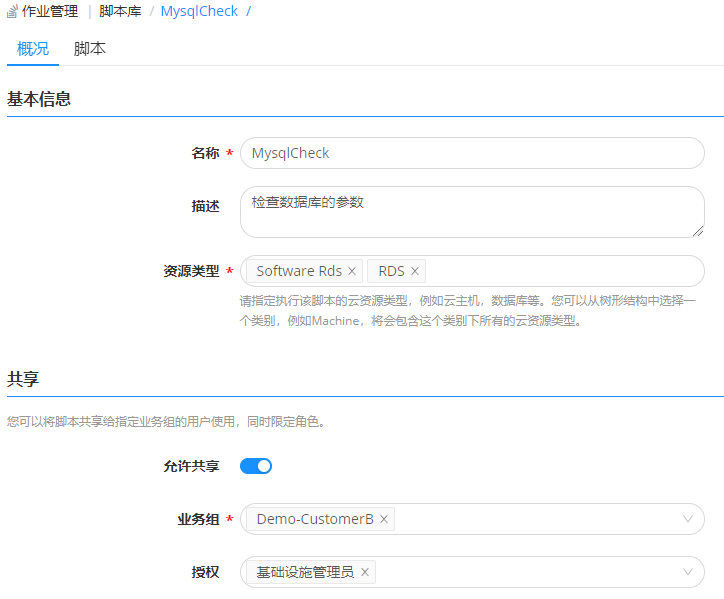
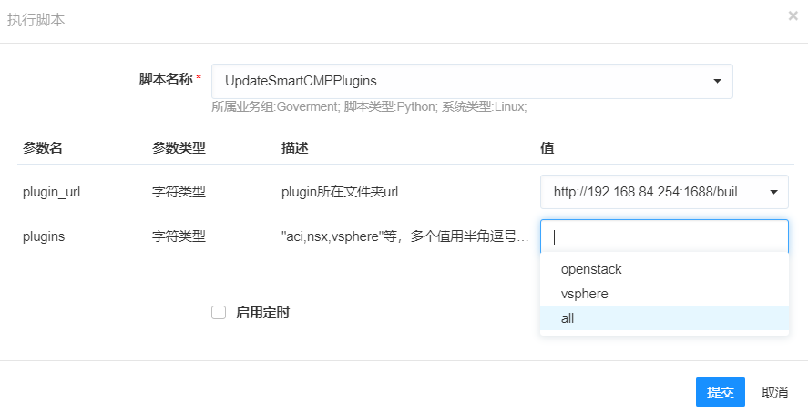

**脚本库**

# 功能描述

脚本：指可以运行在终端的工具或命令，平台支持包括 Shell、Perl、Bat、PowerShell、Python、SQL 等类型脚本。

脚本库：管理员将海量的脚本进行统一的创建和管理，支持根据业务需要创建一些共享脚本，供被授权的业务组某类角色成员，在任意场景下直接引用。

功能特色：在统一的平台上规范管理适用于多种环境的脚本，直接新建、编辑和删除脚本，还支持快速查找新建好的脚本。

灵活地选择执行该脚本的云资源类型（云主机、数据库等），以创建MySQLCheck脚本来检查数据库参数为例，可以指定该脚本执行的云资源类型为 Software下的 RDS和 PaaS类型下的RDS。还可以在执行历史中可查看脚本执行的的详细日志信息，具体步骤，请参考[执行历史](http://CMP-PUBLIC-IP/help/AdminDoc/11作业管理/执行历史.html)。

# 创建和使用脚本的具体步骤
## 创建脚本
平台支持创建多种类型的脚本，在此以创建SQL脚本类型 — MySQLCheck脚本为例，该脚本适用于检查数据库参数。

　1.在左边导航选择 作业管理 - 脚本库 ，点击添加按钮，出现创建脚本页面；

　2.输入所需参数(请根据自己的真实环境输入相关参数，示例只给出参考)；

|参数名称 |描述 |示例|
|:------:|:------:|:-----:|
|名称|脚本名称|MySQLCheck|
|描述|描述脚本信息|用于检查数据库参数|
|资源类型| 执行该脚本的云资源类型 |Software RDS |                        
|是否允许共享|是否将脚本共享给指定业务组的用户使用，同时限定角色 |允许共享|
|业务组|选择脚本共享的业务组|全部业务组|
|授权|选择脚本共享的角色|业务组管理员|
 >「Note」若不共享脚本，则不需要输入业务组和授权的角色。该脚本将作为您私人脚本，不允许其他查看或使用。

 

　3.在脚本内容输入框中填写相关参数。例如，下图中MysqlCheck脚本定义详细参数，如错误日志存放路径、数据库存放路径、数据库大小等；

 
　4.保存并发布脚本，发布成功后就能在资源列表或流水线作业中执行。

## 脚本执行

### 运维操作中快速执行脚本

以针对数据库资源，快速执行各参数检查的脚本为例，具体步骤：
1. 在左边导航选择 我的部署 - 云资源 ，选择部署成功的数据库，点击执行脚本。
2. 在执行脚本配置页面，选择创建成功的MysqlCheck脚本，自动且快速地完成数据库的参数检查。

   

### 脚本和任务关联

以阿里云Linux虚拟机巡检的场景为例
1. 在左侧导航栏点击 作业管理 -流水线作业 ；
2. 在概况标签页，选择基本信息标签页，填写基本信息和共享信息；
3. 在任务标签页，添加串行任务；
4. 输入串行任务名称，在输入参数中选择执行所要执行脚本的资源类型和资源实例；
  
5. 在操作详情中选择执行脚本操作，并选择所要执行的脚本；
6. 设置执行时参数
7. 保存任务
8. 执行任务后，便可在执行历史中查看执行结果，具体步骤，请参考[执行历史](http://CMP-PUBLIC-IP/help/AdminDoc/11作业管理/执行历史.html)。
