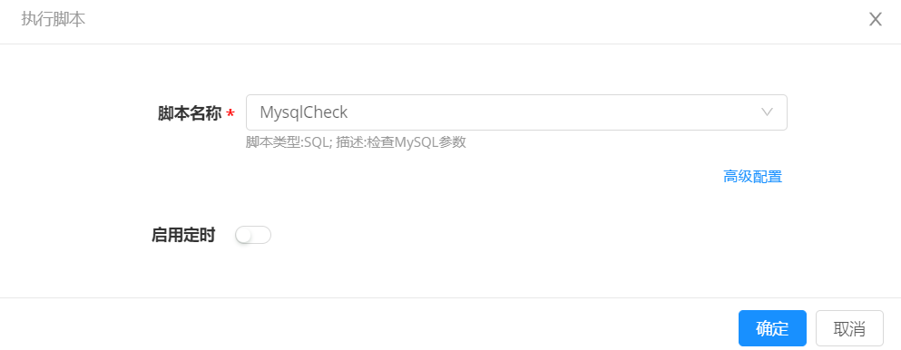

**脚本库**

# 功能描述

脚本：指可以运行在终端的工具或命令，平台支持包括 Shell、Perl、Bat、PowerShell、Python、SQL 等类型脚本。

脚本库：管理员将海量的脚本进行统一的创建和管理，支持根据业务需要创建一些共享脚本，供授权的业务组某类角色成员，在任意场景下直接引用。

功能特色：在统一的平台上规范管理适用于多种环境的脚本，直接新建、编辑和删除脚本，还支持快速查找新建好的脚本。
灵活地选择执行该脚本的云资源类型（云主机、数据库等），以创建MySQLCheck脚本来检查数据库参数为例，可以指定该脚本执行的云资源类型为 Software下的 RDS和 PaaS类型下的RDS。还可以在执行历史中可查看脚本执行的的详细日志信息，具体步骤，请参考[执行历史](https://cloudchef.github.io/doc/AdminDoc/11作业管理/执行历史.html)。

# 创建和使用脚本的具体步骤
## 创建脚本
平台支持创建多种类型的脚本，在此以创建SQL脚本类型 — MySQLCheck脚本为例，该脚本适用于检查数据库参数。
1. 在左边导航选择「作业管理」-「脚本库」，点击「添加」按钮，出现创建脚本页面。
2. 输入脚本名称MysqlCheck，选择云资源类型为 Software下的 RDS和 PaaS类型下的RDS，选择允许共享时，可以指定能使用MysqlCheck脚本的业务组以及角色，不允许共享则只要创建者能使用到该脚本。

    

3. 在脚本内容输入框中填写相关参数。例如，下图中MysqlCheck脚本定义详细参数，如错误日志存放路径、数据库存放路径、数据库大小等。

## 脚本执行

### 运维操作中快速执行脚本

以针对数据库资源，快速执行更参数检查地脚本为例，具体步骤：
1. 在左边导航选择「我的部署」-「云资源」，选择部署成功的数据库，点击执行脚本。
2. 在执行脚本配置页面，选择创建成功地MysqlCheck脚本，自动且快速地完成数据库地参数检查。

   

### 脚本和任务关联

以数据库巡检的场景为例，首先需要在脚本库创建界面，添加完成MysqlCheck脚本，再在任务的创建界面，完成操作与脚本的绑定。当流水线自动化地执行时，实际上底层时脚本在自动化地执行。更多详情请参考，[任务配置](https://cloudchef.github.io/doc/AdminDoc/11作业管理/#任务配置)

