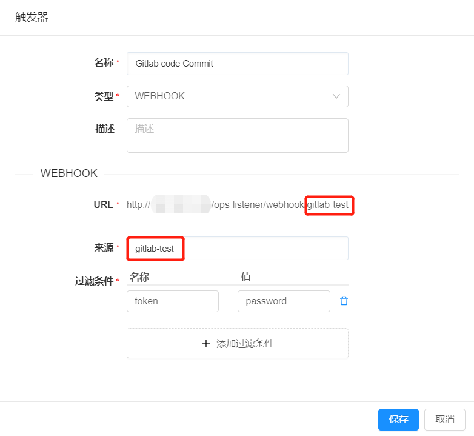

**持续发布与部署**

SmartCMP应用持续发布和部署功能是通过软件组件、蓝图和全新引进的流水线来构建，具体包括：
+	定义应用软件：接入主流的制品仓库对软件组件进行存放管理和版本控制，软件组件关联制品仓库并自定义应用的部署方式和相关参数。
+	定义应用服务：通过蓝图建模，编排应用架构；通过服务配置，指定资源参数和相关应用的版本。
+	定义流水线：配置流水线的阶段和多种类型的任务，实现应用的测试、部署、更新、运维、回收的的全生命周期管理。

# 制品管理
SmartCMP配置应用软件，通过接入主流的制品仓库对软件组件进行存放管理和版本控制，软件组件关联制品仓库并自定义应用的部署方式和相关参数。
制品仓库管理是对软件研发过程中生成的产物的管理， 制品一般作为最终交付物完成发布和交付。所有的制品包，依赖组件均能够纳入制品库中统一管理。

+ 制品仓库在SmartCMP平台中是通过入口来接入的，具体的操作步骤，请参考，
[入口](#入口)  

+ SmartCMP支持通过软件组件功能实现定义应用软件，将制品仓库与软件组件关联，制品仓库对软件组件进行存放关联和版本控制管理。软件组件与主流制品库关联，具体的操作步骤如下：1.  在软件组件列表点击软件名称，进入组件视图。2. 在「制品」视图，您可以选择 端点、仓库（Nexus）、组、名称、版本。3. 点击保存按钮，即可将组件与包管理平台进行关联。

+ 定义应用服务，基于蓝图建模，设计应用架构，实现每一个应用拓扑蓝图的自动化部署。基于服务配置，配置软件组件的节点详细参数，让平台根据策略执行应用管理和自动化部署。 （蓝图设计是平台原有功能，此处不再写具体配置步骤，请您参考，[创建蓝图](https://cloudchef.github.io/doc/AdminDoc/05服务建模/蓝图设计.html)）配置软件组件的节点详细参数，具体的操作步骤如下：1. 在左边导航选择「服务建模」-「服务配置」，出现服务列表,列表中显示服务名称，点击服务名称，进入详细配置视图，点击「组件配置」，选择软件组件。2. 「节点详细设置」视图，配置软件组件节点的组、名称、版本

## 入口{#入口}
入口可以添加需要连接的软件制品仓库，为将要使用的软件组件提供部署时的制品来源，定义了软件包或任务调度的对接。流水线中执行归档或镜像推送操作的程序包，会统一存放一份在制品仓库中，支持在入口处接入Nexus等等制品仓库管理平台。

具体步骤：在左侧导航栏点击「集成与发布」-「入口」，
+ 点击添加Nexus入口，输入Nexus服务器端点名称、服务器详细的对接地址、用户名、密码
+ 点击添加Jekins入口，输入Jekins服务器名称、地址，类型选择密码使输入用户名、密码；选择令牌时输入用户名和令牌。
+ 点击验证、验证通过，点击提交即可接入软件制品仓库。
>「Note」  先决条件： 确认Nexus或Jekins服务器可用并已配置。

# 流水线{#流水线}

SmartCMP的流水线，能够帮助用户建设自动化的、可重复利用、安全合规的应用持续交付和部署。流水线由一系列阶段构成，每个阶段由软件在发布到生产之前必须完成的多个任务和环境组成。目前支持多种阶段和任务的自定义和组装，能够在阶段中添加任意数量的执行任务，通过它们已经可以设计出各种场景适用的开发、部署、运维流水线。

具体步骤：

+  在左侧导航栏点击「集成与发布」-「流水线」，点击创建流水线，在基本信息页面输入名称、描述、绑定一个项目、通知到用户,并可添加全局参数，在后期任务中进行调用。例如：添加全局参数，定义master分支的全局信息，供配置调用，具体步骤：在基本信息页面，参数列表处，点击加号按钮，填写名称“Branch”,值“master”,选填描述，更多详情参考下图。

+ 当您创建流水线完成之后， 在左侧导航栏点击「集成与发布」-「流水线」，可二次编辑、删除、执行、禁用、锁定流水线。

## 配置触发器

自定义流水线的触发条件，触发器定义何时自动运行流水线，可以手动触发流水线任务，也可以设定策略由触发器自动触发流水线任务。SmartCMP触发器类型包括：Webhook集成(支持Git，Gitlab等代码仓库改变触发)、Jenkins触发、定时触发、手工触发等等。
+ 例如：添加定时触发器的具体步骤：输入触发器名称填写定时触发器、类型选择CRON、描述(选填)，配置CRON的详细参数，选择重复的类型（自定义cron表达式 例如：0 0 0 * * ？、每周某天的某个时段、每月某天的某个时段、每天的某个时段）点击创建即可配置完成触发器。例如：每天/每周/每月的10点10分执行生成快照的操作。
+ 例如：添加配置一个Webhook类型的触发器（当代码提交到Gitlab代码仓库时触发），当提交代码到Gitlab代码仓库时，仓库状态发生改变，触发流水线。具体步骤：在左侧导航栏点击「集成与发布」-「流水线」，点击创建，在触发器页面点击创建， 输入触发器名称、类型选择WEBHOOK、描述(选填)，WEBHOOK详细参数配置如下： 

+ 以Gitlab为例，在流水线详情中添加一个webhook类型的触发器。在 "来源" 中自定义字段，例如：下图的"gitlab-test"，"gitlab-test"会自动拼接到"URL"，形成完整的网址链接。注意：这个完整的URL（ http://SmartCMP地址/ops-listener/webhook/gitlab-test ），  在Gitlab中配置时要用到。添加过滤条件，过滤条件的作用相当于密码验证。当管理员不配置过滤条件时，只要调用这个URL（http://SmartCMP地址/ops-listener/webhook/Gitlab-test ），就会触发流水线操作。添加过滤条件后，相当于给"webhook trigger"添加了密码。当回调URL时，只有密码匹配成功才能触发流水线操作。如果只支持Gitlab，Gitlee和Git，过滤条件只需要设置密码就可以生效，采用键值对的方式是为了兼容更多的场景。所以添加过滤条件时，如果回调方是Gitlab，Gitlee和Git，“名称”要固定写token，“值”支持自定义（输入password）。配置完毕后依次保存。

 Gitlab具体配置步骤：打开Gitlab，如果Gitlab是新申请的环境，要调整下network配置，允许请求从本地回调。

 >「Note」  配置webhook，创建一个project，进入project详情，依次点开Setting–Integrations，在URL中输入WEBHOOK参数配置中提前设置的URL地址(http://SmartCMP地址/ops-listener/webhook/gitlab-test) ，在Secret Token中输入"条件过滤" 中配置的token对应的值(自定义的值password)，注意，不要勾选Enable SSL verification 去掉，选择 Add Webhook，将实现当有代码提交时会触发流水线的功能。
   

## 配置阶段和任务{#配置阶段和任务} 

阶段指根据业务的需要，定义不同的阶段，在每个阶段中定义需要完成的任务。任务指具体执行的活动。支持自定义任务类型、输入输出参数，其中输入输出参数指SmartCMP支持流水线各个任务之间的参数传递，例如将上一个任务新部署虚拟机的SmartCMP地址传给下一个任务进行调用。
+ 例如，可定义软件打包、部署测试环境等不同的阶段。每个阶段的任务类型包括：Jenkins Job 任务、部署新应用任务、云资源变更任务、脚本执行任务等等。流水线的发布者可以定义每个任务的参数，在后续的任务中进行调用。 
+ 例如，通过一个蓝图部署任务，即可以自动化触发一个已发布的云资源服务，进行云资源的部署；而云资源任务则可以自动化进行云资源变更、运维操作，进行应用软件的升级、更新。

设计流水的阶段和任务的具体步骤： 在左侧导航栏点击「集成与发布」-「流水线」，点击创建，在流程页面点击添加按钮，输入阶段名称，点击添加。 点击添加串行任务，在任务的详情页填写：任务类型、名称、描述、通知到用户，填写输入参数，自定义输出参数（任务类型不同，输入输出参数相应变化）

+ 选择等待任务，在输入参数处填写等待时间（s），例如：在等待15s之后，流水线自动执行脚本

+ 选择蓝图部署任务，在输入参数处填写服务（服务目录中发布的服务）和模板
>「Note」  其中可选择的服务类型来源于服务目录中已发布的服务卡片，可选择的模板来源于，服务申请时保存申请信息的模板，具体步骤：点击左侧导航栏「服务目录」-「选择服务卡片」，进入「请求服务详情页面」，填写申请参数，点击下方「保存」按钮，填写模板名称，保存成功即可形成模板。

+ Jenkins任务，配置Jenkins的端点和Job，自定义构建软件包，例如，构建开发环境下master分支的软件包。在输入参数处填写仓库入口（选择在入口处添加的Nexus或Jekins仓库），任务类型，选择是否等待结果，如果不稳定时，标记为成功继续继续还是标记为失败，结束执行。

+  选择云资源任务，在输入参数处选择已有云资源，云资源类型、操作
>「Note」  勾选已有云资源，则 可选择的云资源来源于平台已纳管的云资源（，云资源具体查看步骤：点击左侧导航栏「我的部署」-「云资源」，选择云资源类型，可查看已纳管的云资源。）例如：可选择资源类型为云主机，选择已经部署成功的云主机资源，在的操作处选择启动操作类型来源于云主机、服务部署的day2操作包括云主机的启动、停止，刷新服务部署状态、调整磁盘配置、自定义操作等等。不勾选已有云资源，例如：选择云资源类型为云主机，选择具体的云主机，云主机资源来源于此任务之前的部署虚拟机任务

+ 选择脚本任务
>「Note」勾选已有脚本库，选择已经创建完成的脚本库，脚本配置的具体步骤，请参考：(https://cloudchef.github.io/doc/AdminDoc/05服务建模/脚本库.html) ；不勾选已有脚本，自定义脚本，填写相关配置参数：脚本名称、选择脚本支持的语法类型（Python、Ansible、Shell），填入脚本类型和脚本参数。

+ 堡垒机任务

通过标准的任务配置简化“SmartCMP与堡垒机对接的操作”，更多堡垒机信息请参考[堡垒机](https://cloudchef.github.io/doc/AdminDoc/12安全审计/#堡垒机)，选择操作类型（注册/注销/更新）
注册堡垒机任务：虚拟机创建好后，将虚拟机注册到堡垒机；
注销堡垒机任务：虚拟机删除后，将虚拟机从堡垒机中注销；
更新堡垒机任务：虚拟机变更后，更新堡垒机，例如虚拟机变更了所有者，同步修改堡垒机中虚拟机的注册信息。

+ Veeam备份任务
通过标准的任务配置简化“SmartCMP与备份管理平台对接的备份操作”更多备份管理平台信息请参考[备份系统](https://cloudchef.github.io/doc/AdminDoc/12安全审计/#备份系统)。
关联脚本，脚本定义备份操作具体的参数配置，通过选择云主机ID和名称，选择备份操作的目标云主机节点。

+ Veeam恢复任务
通过标准的任务配置简化“SmartCMP与备份管理平台对接的备份操作”更多备份管理平台信息请参考[备份系统](https://cloudchef.github.io/doc/AdminDoc/12安全审计/#备份系统)。
关联脚本，脚本定义恢复操作具体的参数配置，选择备份点即选择备份数据，以及恢复到当前目标云主机。

执行设置内填写超时时间（例如：设置超时时间为360s,该任务执行时间超过360s代表任务执行失败）执行选项（选择失败后继续执行表示当前任务失败继续执行下一个任务，或选择失败后结束流程表示当前任务失败结束该流水线流程，流水线执行失败）。 执行方式（选择默认执行，或选择条件执行时需要设置条件执行表达式，例如：您可以输入EL表达式，可参考下图

## 执行流水线 

流水线的执行历史

查看流水线的执行历史，通过执行历史可以查看执行状态、执行人、执行时间、每个阶段任务执行的详细信息。
1. 在左侧导航栏点击「集成与发布」-「执行历史」，可根据筛选条件（项目、状态、起止时间）快速定位流水线。
2. 点击流水线，可查看流水执行状态（进行中、成功、失败）、执行人信息、开始时间、结束时间、耗时、流水线完整的可视化的流程图。

